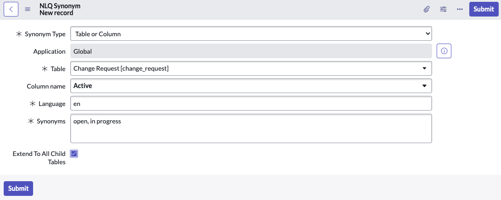
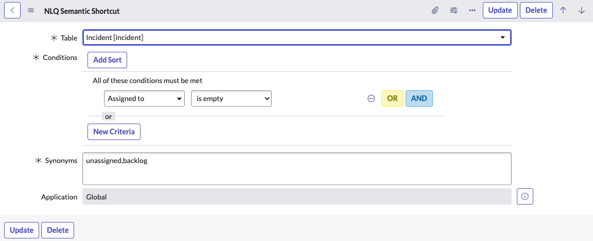
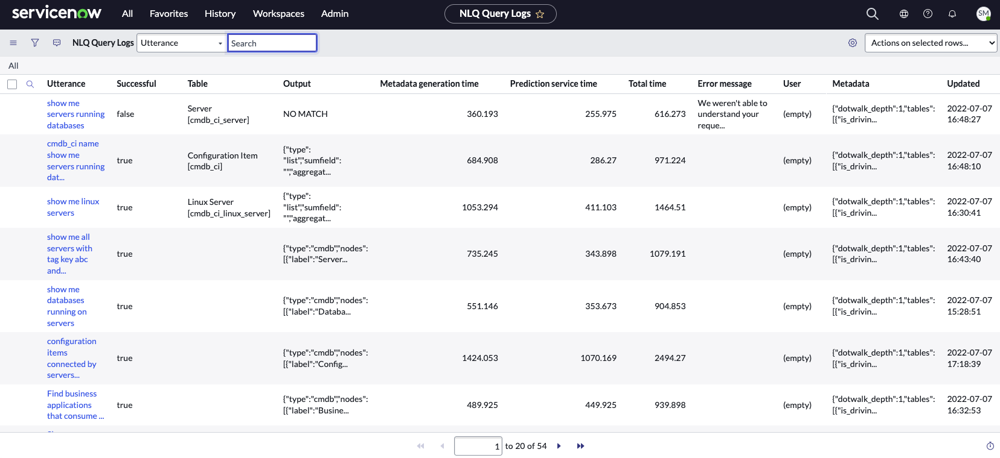
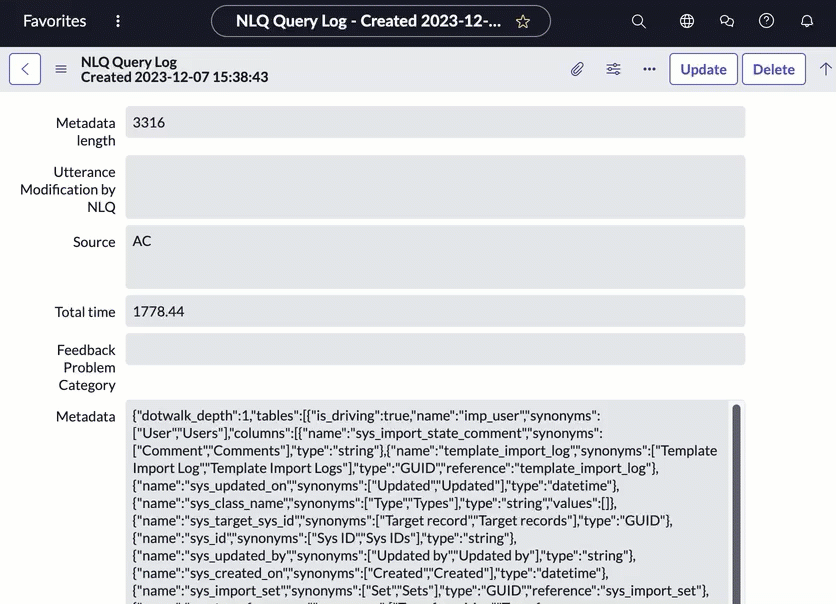
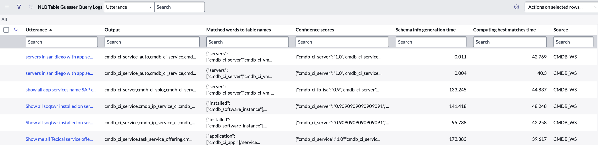

# Configuring NLQ

## SOURCE INFORMATION

* SECTION NAME: Natural Language Query
* SUBSECTION NAME: Configuring NLQ
* SOURCE FILE NAME: Natural Language Query.pdf
* PAGE RANGE: 1237-1243
* EXTRACTION DATE: 2026-06-17

---

# CONTENT

## Configuring NLQ

Enhance your users' query experience by supplementing NLQ with words and terms used in your environment. Review your users' actual requests in the NLQ logs to find possible synonyms and shortcuts to add.

Natural Language Query functionality is included in the base system. Admins can optionally expand NLQ's range of understanding by adding terms that commonly occur in users' requests. Review the following topics to learn more.

For information about system properties related to NLQ, see Natural Language Query References.

### Create an NLQ synonym

Add synonyms to improve the ability of NLQ to recognize the various ways your users request data. With synonyms, you can map commonly used words or terms to table columns.

#### Before you begin

Role required: admin, nlq_admin, or pa_analyst

#### About this task

NLQ synonyms enable you to map common words in your users' requests to the columns in your instance tables. When these words are detected in natural-language queries, NLQ replaces them with actual column and table names, then submits the formal query.

Several synonyms are provided in the base system, and you can add more for your use cases and business requirements. Review NLQ logs of actual user utterances to find possible synonyms to add. For more information, see View NLQ logs.

You can create a new synonym, or modify an existing synonym, as follows.

* If any synonym already exists for your target table and column, you must add your new synonym to the current record. Separate multiple synonyms with a comma.
* Synonyms can point to reference fields, using dot-walking. For more information, see Dot-walking examples.
* Synonyms are case-insensitive in queries.
* Synonyms can contain apostrophes and periods, but not commas.
* Synonym records are associated to one table. You can use the same synonym term for more than one table, but you must create a record for each table.

#### Procedure

1. Ensure that you are in the application scope you want for your synonym, then navigate to **All > NLQ > Synonyms**.
2. Select **New**.
   If you are updating an existing record, select its **Column name** in the list.
3. On the form, fill in the fields.

| Field | Description |
|---|---|
| Synonym Type | Type of synonym.  * **Table or Column:** Synonym for a value on a table or a specific column in that table. * **Record:** Synonym for a value on the CMDB tables [cmdb_rel_type_table]. For more information, see Querying the CMDB.  **Note:** Supports cmdb_rel_type, cmdb_group, cmdb_ci_service_technical, cmdb_ci_service_discovered, cmdb_ci_query_based_service tables. |
| Application | [Read only] Application scope that can use the synonym in a query. The default is **Global**.  When creating a synonym, ensure that you are in the scope you want for the synonym. |
| Table | Source table.  You can use the same term for more than one table, but you must create a synonym record for each table. The synonym's mapping is unique to the table. |
| Column name | Specific column on the source table. |
| Language | Language of the synonym. Should match the language of the source value. |
| Synonyms | Words or short phrases that the system should map to column names or tables, when converting the utterance to a formal query.  Separate multiple synonyms with a comma. |
| Extend to All Child Tables | **Table or Column** type only.  Select this option to make any child tables of the source table inherit the synonyms. |

4. Select **Submit** if new, or **Update** if you are modifying an existing record.

#### Result

The new synonym is available to your users as soon as they refresh the browser window of the list.

#### Example: NLQ Synonym for the Active field

The following image shows an example of an NLQ synonym record for the **Active** field on a change request. The synonyms open and in progress are replaced by the term active when the system submits a query.

With this synonym record, a user can type `show open change requests` or `change requests in progress` and the system displays active change requests.

### Create an NLQ shortcut

Create a semantic shortcut to help improve the ability of NLQ to recognize the various ways your users request data. Semantic shortcuts operate similarly to NLQ synonyms by mapping common words to columns, but for a selected table when certain conditions are met.

#### Before you begin

Role required: admin, nlq_admin, or pa_analyst

#### About this task

Like NLQ synonyms, semantic shortcuts enable you to map common words in your users' requests to the columns in your instance tables. When these words are detected in natural-language queries, NLQ replaces them with actual column and table names, then submits the formal query.

Semantic shortcuts provide a condition builder so that you can filter which records are covered by the terms you provide.

Some semantic shortcuts are provided in the base system, and you can add more for your use cases and business requirements. Review NLQ logs of actual user utterances to find possible terms to add. For more information, see View NLQ logs.

You can create a new shortcut, or modify an existing shortcut, as follows.

* If any shortcut already exists for your target table and filter conditions, you must add your new shortcut to the current record. Separate multiple shortcuts with a comma.
* Shortcuts can point to reference fields, using dot-walking. For more information, see Dot-walking examples.
* Synonyms are case-insensitive in queries.
* Synonyms can contain apostrophes and periods, but not commas.
* Synonym and shortcut records are associated to one table. You can associate the same synonym term to more than one table, but you must create a record for each table.

#### Procedure

1. Ensure that you are in the application scope that you want for your shortcut, then navigate to **All > NLQ > Semantic Shortcuts**.
2. Select **New**.
   If you are updating an existing record, select its row in the list.
3. On the form, fill in the fields.

| Field | Description |
|---|---|
| Table | Source table.  You can use the same term for more than one table, but you must create a record for each table. The synonym's mapping is unique to the table. |
| Conditions | Conditions on the source table that must be met for the synonym to work. |
| Synonyms | Words or phrases that the system should map to column names or tables, when converting the utterance to a formal query.  Separate multiple synonyms with a comma. |
| Application | [Read only] Application scope that can use the synonym in a query. Default is **Global**. Ensure that you are in the target application scope for your shortcut before creating it. |

4. Select **Submit** if new, or **Update** if you are modifying an existing record.

#### Result

The new shortcut is available to your users as soon as they refresh the browser window of the list.

#### Example: Semantic shortcut for Incident backlog

The following image shows an example of a semantic shortcut used on incident records. Incidents contain the Assigned to field. Using the condition builder, you can provide synonyms for when the field is empty. When NLQ detects unassigned and backlog in your users' input, it replaces them with the SQL clause `assigned_toISEMPTY`.

A user can enter `show me incident backlog` or `unassigned incidents` and the system displays incidents with an empty Assigned to field.

### View NLQ logs

Review NLQ logs to see how the system has handled your users' plain-language requests. Use log records from attempted requests to expand NLQ synonyms or shortcuts.

#### Before you begin

Role required: nlq_admin, pa_analyst, or admin

#### About this task

Every natural language query is logged in the NLQ Query Logs table [nlq_query_log]. Each log entry provides details such as the table that was queried, whether the query succeeded, and how the results were generated. Other available fields include the following.

* Output Source: how the results were generated. The value **BNF** indicates a rules-based method. The value **GAI** indicates the Now LLM Service (fallback) method.
* Source: the location from which the query was initiated. The value **AC** indicates Analytics Center. The value **CMDB_WS** indicates CMDB Workspace.
* Utterance: the original natural-language request which triggered NLQ.

#### Procedure

1. Navigate to **All > NLQ > Logs**.

2. Select the value in the **Utterance** column to open the full log entry.

#### What to do next

Based on your users' attempted queries, consider adding more synonyms or shortcuts.

### View NLQ Table Guesser logs

Use the Table Guesser logs to review the CMDB tables that were picked by NLQ in response to plain-language queries.

#### Before you begin

This module is read-only.

Role required: nlq_admin.

#### About this task

When a plain-language request for CMDB data is parsed by NLQ, the system tries to determine the specific tables the user intended. The system's guesses, including confidence levels, are recorded in the NLQ Table Guesser logs module [nlq_table_guesser_log].

Review these logs to troubleshoot which CMDB tables were inferred by NLQ.

> **Note:** This list is read-only for NLQ admins. There are no buttons or actionable functions in the UI.

#### Procedure

1. Navigate to **All > NLQ > Table Guesser Logs**.
2. Select the personalize list icon (shown as a blue gear icon in the source) to display the columns **Matched words to table names** and **Confidence scores**.

The **Utterance** column shows the user's natural language query.

3. Use the information in the **Matched words to table names** column for troubleshooting if needed.
   In this column's value field, the first word was found in the utterance. Next is a list of the CMDB tables that were matched to that word.

#### What to do next

For more information on CMDB queries, see Exploring CMDB Query Builder.

---

## IMAGE DESCRIPTIONS

### Repeated page header logo - source pages 1237-1243

* **What is shown:** The ServiceNow logo appears in the upper-left page header on each reviewed page.
* **Objects present:** Black lowercase brand text, green `now` accent, registered trademark symbol.
* **Visible text:** `servicenow®`.
* **Business purpose:** Identifies publisher and product documentation source.
* **Technical purpose:** Repeated documentation header; not part of a configuration form or workflow.

### Personalize list icon - source page 1237

* **What is shown:** Blue gear/cog icon appearing inline with the `Useful information` bullet about showing and hiding columns.
* **Objects present:** Circular gear shape with blue outline.
* **Visible text near the icon:** `Use the personalize list icon (...) to hide or display columns.`
* **Technical purpose:** Indicates the UI control for list personalization.

### NLQ synonym record for the Active field - source page 1239

* **What is shown:** A ServiceNow form titled `NLQ Synonym` in `New record` mode.
* **Objects present:** Back arrow, menu icon, form title, top action icons, `Submit` button, required-field asterisks, dropdown fields, text fields, text area, checkbox, and bottom `Submit` button.
* **All visible text and field values:**
  * Header: `NLQ Synonym`; `New record`; `Submit`.
  * Field labels: `Synonym Type`; `Application`; `Table`; `Column name`; `Language`; `Synonyms`; `Extend To All Child Tables`.
  * Field values: `Table or Column`; `Global`; `Change Request [change_request]`; `Active`; `en`; `open, in progress`.
  * Buttons: `Submit` at top right and bottom left.
* **Diagram/form components:**
  * Required fields are marked with asterisks for `Synonym Type`, `Table`, `Language`, and `Synonyms`.
  * `Application` is gray/read-only and set to `Global`.
  * `Extend To All Child Tables` checkbox is checked.
* **Relationships:** Synonym terms `open` and `in progress` are mapped to the `Active` column on the `Change Request [change_request]` table.
* **Business purpose:** Helps users use everyday terms for change requests.
* **Technical purpose:** Demonstrates the record configuration that lets NLQ substitute synonyms into formal queries.
* **Security boundaries:** None shown; access requirements are provided in surrounding text.
* **Color meaning:** Blue/purple outlines and buttons indicate active ServiceNow UI controls; gray indicates read-only or inactive fields.

### Semantic shortcut for Incident backlog - source page 1241

* **What is shown:** A ServiceNow form titled `NLQ Semantic Shortcut` with an example condition and synonyms.
* **Objects present:** Header controls, update/delete actions, required-field markers, table selector, condition builder, OR/AND controls, text area, application field, and bottom action buttons.
* **All visible text and field values:**
  * Header/title: `NLQ Semantic Shortcut`.
  * Buttons/actions: `Update`; `Delete`; `Add Sort`; `OR`; `AND`; `New Criteria`; bottom `Update`; bottom `Delete`.
  * Field labels: `Table`; `Conditions`; `Synonyms`; `Application`.
  * Field values: `Incident [incident]`; `Assigned to`; `is empty`; `unassigned,backlog`; `Global`.
  * Condition builder text: `All of these conditions must be met`; `or`.
* **Diagram/form components:** The condition builder specifies `Assigned to` `is empty` and provides synonym text `unassigned,backlog`.
* **Relationships:** User terms `unassigned` and `backlog` map to incidents where the `Assigned to` field is empty.
* **Business purpose:** Enables common service desk wording for unassigned incident queues.
* **Technical purpose:** Demonstrates a conditional semantic shortcut using a table-specific condition builder.
* **Security boundaries:** None shown; access requirements are provided in surrounding text.
* **Color meaning:** Blue indicates selected or actionable UI controls; yellow and blue distinguish `OR` and `AND` condition-logic buttons.

### NLQ Query Logs list - source page 1242

* **What is shown:** A ServiceNow `NLQ Query Logs` list containing logged natural-language query attempts.
* **Objects present:** Top navigation, list toolbar, search field, action menu, tabular log list, pagination controls.
* **All visible top/navigation text:** `servicenow`; `All`; `Favorites`; `History`; `Workspaces`; `Admin`; `NLQ Query Logs`; `Utterance`; `Search`; `Actions on selected rows...`; `All`.
* **Visible column headers:** `Utterance`; `Successful`; `Table`; `Output`; `Metadata generation time`; `Prediction service time`; `Total time`; `Error message`; `User`; `Metadata`; `Updated`.
* **Visible row text and values:**

| Utterance | Successful | Table | Output | Metadata generation time | Prediction service time | Total time | Error message | User | Metadata | Updated |
|---|---:|---|---|---:|---:|---:|---|---|---|---|
| show me servers running databases | false | Server [cmdb_ci_server] | NO MATCH | 360.193 | 255.975 | 616.273 | We weren't able to understand your reque... | (empty) | {"dotwalk_depth":1,"tables": [["is_drivin... | 2022-07-07 16:48:27 |
| cmdb_ci name show me servers running dat... | true | Configuration Item [cmdb_ci] | {"type":"list","sumfield":"","aggregat... | 684.908 | 286.27 | 971.224 |  | (empty) | {"dotwalk_depth":1,"tables": [["is_drivin... | 2022-07-07 16:48:10 |
| show me linux servers | true | Linux Server [cmdb_ci_linux_server] | {"type":"list","sumfield":"","aggregat... | 1053.294 | 411.103 | 1464.51 |  | (empty) | {"dotwalk_depth":1,"tables": [["is_drivin... | 2022-07-07 16:30:41 |
| show me all servers with tag key abc and... | true |  | {"type":"cmdb","nodes": [{"label":"Server... | 735.245 | 343.898 | 1079.191 |  | (empty) | {"dotwalk_depth":1,"tables": [["is_drivin... | 2022-07-07 16:43:40 |
| show me databases running on servers | true |  | {"type":"cmdb","nodes": [{"label":"Databa... | 551.146 | 353.673 | 904.853 |  | (empty) | {"dotwalk_depth":1,"tables": [["is_drivin... | 2022-07-07 15:28:51 |
| configuration items connected by servers... | true |  | {"type":"cmdb","nodes": [{"label":"Config... | 1424.053 | 1070.169 | 2494.27 |  | (empty) | {"dotwalk_depth":1,"tables": [["is_drivin... | 2022-07-07 17:18:39 |
| Find business applications that consume ... | true |  | {"type":"cmdb","nodes": [{"label":"Busine... | 489.925 | 449.925 | 939.898 |  | (empty) | {"dotwalk_depth":1,"tables": [["is_drivin... | 2022-07-07 16:32:53 |

* **Pagination text:** `1 to 20 of 54`.
* **Business purpose:** Lets administrators review user query attempts and identify missing synonyms or shortcuts.
* **Technical purpose:** Shows the log table where utterances, generated output, timings, and errors are recorded.
* **Security boundaries:** None shown in the screenshot; role requirements are described in surrounding text.

### NLQ Query Log full entry - source page 1242

* **What is shown:** A detailed ServiceNow form for a single NLQ Query Log record.
* **Objects present:** Header bar, record title, form fields, update/delete buttons, a large metadata text area with a scrollbar.
* **All visible text:**
  * Top/title area: `Favorites`; `NLQ Query Log - Created 2023-12-...`; `NLQ Query Log`; `Created 2023-12-07 15:38:43`; `Update`; `Delete`.
  * Field labels: `Metadata length`; `Utterance Modification by NLQ`; `Source`; `Total time`; `Feedback Problem Category`; `Metadata`.
  * Field values: `3316`; `AC`; `1778.44`.
  * Visible metadata text includes JSON-like content beginning with `{"dotwalk_depth":1,"tables":[{"is_driving":true,"name":"imp_user","synonyms":["User","Users"],"columns":[{"name":"sys_import_state_comment","synonyms":["Comment","Comments"],"type":"string"},{"name":"template_import_log","synonyms":["Template Import Log","Template Import Logs"],"type":"GUID","reference":"template_import_log"},{"name":"sys_updated_on","synonyms":["Updated","Updated"],"type":"datetime"}, ...`.
* **Diagram/form components:** Metadata content is shown in a scrollable text area; only the upper portion of the metadata is visible.
* **Business purpose:** Supports deeper investigation into an individual NLQ execution.
* **Technical purpose:** Exposes the metadata used/generated by NLQ, including tables, columns, synonyms, data types, references, and timing details.
* **Security boundaries:** None shown in the screenshot; role requirements are described in surrounding text.

### Personalize list icon - source page 1243

* **What is shown:** Small blue gear icon displayed inline with Table Guesser log instructions.
* **Objects present:** Gear/cog shape.
* **Visible text near the icon:** `Select the personalize list icon (...) to display the columns Matched words to table names and Confidence scores.`
* **Technical purpose:** Indicates the UI control used to add columns to the Table Guesser Logs list.

### NLQ Table Guesser Query Logs list - source page 1243

* **What is shown:** A ServiceNow list titled `NLQ Table Guesser Query Logs` showing utterances, matched CMDB tables, confidence scores, timings, and source.
* **Objects present:** Toolbar, field selector, search fields, action menu, table/grid, row values.
* **All visible toolbar text:** `NLQ Table Guesser Query Logs`; `Utterance`; `Search`; `Actions on selected rows...`; `All`.
* **Visible column headers:** `Utterance`; `Output`; `Matched words to table names`; `Confidence scores`; `Schema info generation time`; `Computing best matches time`; `Source`.
* **Filter row visible text:** Search boxes appear under each column with placeholder `Search`.
* **Visible row text and values:**

| Utterance | Output | Matched words to table names | Confidence scores | Schema info generation time | Computing best matches time | Source |
|---|---|---|---|---:|---:|---|
| servers in san diego with app se... | cmdb_ci_service_auto,cmdb_ci_service,cmd... | {"servers": ["cmdb_ci_server","cmdb_ci_vm... | {"cmdb_ci_server":"1.0","cmdb_ci_service... | 0.011 | 42.769 | CMDB_WS |
| servers in san diego with app se... | cmdb_ci_service_auto,cmdb_ci_service,cmd... | {"servers": ["cmdb_ci_server","cmdb_ci_vm... | {"cmdb_ci_server":"1.0","cmdb_ci_service... | 0.004 | 40.3 | CMDB_WS |
| show all app services name SAP c... | cmdb_ci_server,cmdb_ci_spkg,cmdb_ci_serv... | {"server": ["cmdb_ci_server","cmdb_ci_vm_... | {"cmdb_ci_lb_isa":"0.9","cmdb_ci_server"... | 133.245 | 44.837 | CMDB_WS |
| Show all soqtwr installed on ser... | cmdb_ci_service,cmdb_ip_service_ci,cmdb_... | {"installed": ["cmdb_software_instance"],... | {"cmdb_ci_server":"0.9090909090909091",... | 141.418 | 48.248 | CMDB_WS |
| Show all soqtwr installed on ser... | cmdb_ci_service,cmdb_ip_service_ci,cmdb_... | {"installed": ["cmdb_software_instance"],... | {"cmdb_ci_server":"0.9090909090909091",... | 95.738 | 42.258 | CMDB_WS |
| Show me all Tecical service offe... | cmdb_ci_service,task_service_offering,cm... | {"application": ["cmdb_ci_appl"],"service... | {"cmdb_ci_service":"1.0","cmdb_ci_servic... | 172.383 | 39.617 | CMDB_WS |

* **Business purpose:** Helps admins troubleshoot whether NLQ selected the expected CMDB tables.
* **Technical purpose:** Displays the table guesses and confidence values produced when parsing CMDB-related natural-language requests.
* **Security boundaries:** None shown; the module is described as read-only for NLQ admins.

### Informational note icon - source page 1243

* **What is shown:** A black circular information icon before the note about the Table Guesser list being read-only.
* **Objects present:** Filled black circle with white lowercase `i`.
* **Visible text near the icon:** `Note: This list is read-only for NLQ admins. There are no buttons or actionable functions in the UI.`
* **Technical purpose:** Flags an operational limitation of the Table Guesser logs module.

---

## TABLES

### Create an NLQ synonym - fields - source pages 1238-1239

| Field | Description |
|---|---|
| Synonym Type | Type of synonym.  * **Table or Column:** Synonym for a value on a table or a specific column in that table. * **Record:** Synonym for a value on the CMDB tables [cmdb_rel_type_table]. For more information, see Querying the CMDB.  **Note:** Supports cmdb_rel_type, cmdb_group, cmdb_ci_service_technical, cmdb_ci_service_discovered, cmdb_ci_query_based_service tables. |
| Application | [Read only] Application scope that can use the synonym in a query. The default is **Global**.  When creating a synonym, ensure that you are in the scope you want for the synonym. |
| Table | Source table.  You can use the same term for more than one table, but you must create a synonym record for each table. The synonym's mapping is unique to the table. |
| Column name | Specific column on the source table. |
| Language | Language of the synonym. Should match the language of the source value. |
| Synonyms | Words or short phrases that the system should map to column names or tables, when converting the utterance to a formal query.  Separate multiple synonyms with a comma. |
| Extend to All Child Tables | **Table or Column** type only.  Select this option to make any child tables of the source table inherit the synonyms. |

### Create an NLQ shortcut - fields - source pages 1240-1241

| Field | Description |
|---|---|
| Table | Source table.  You can use the same term for more than one table, but you must create a record for each table. The synonym's mapping is unique to the table. |
| Conditions | Conditions on the source table that must be met for the synonym to work. |
| Synonyms | Words or phrases that the system should map to column names or tables, when converting the utterance to a formal query.  Separate multiple synonyms with a comma. |
| Application | [Read only] Application scope that can use the synonym in a query. Default is **Global**. Ensure that you are in the target application scope for your shortcut before creating it. |

### NLQ Query Logs visible list rows - source page 1242

See the `NLQ Query Logs list` image description for the extracted screenshot table.

### NLQ Table Guesser Query Logs visible list rows - source page 1243

See the `NLQ Table Guesser Query Logs list` image description for the extracted screenshot table.

---

## FIGURES

### Figure: NLQ synonym record for Active field - source page 1239

* **Figure type:** ServiceNow form screenshot.
* **Components:** Field labels, input values, required markers, checkbox, and submit controls.
* **Connections/arrows/flows:** No arrows; the relationship is field mapping from synonym terms to table/column metadata.
* **Labels:** `Synonym Type`, `Application`, `Table`, `Column name`, `Language`, `Synonyms`, `Extend To All Child Tables`.
* **Technical purpose:** Shows how to configure a synonym record.
* **Security zones/boundaries:** None shown.

### Figure: Semantic shortcut for Incident backlog - source page 1241

* **Figure type:** ServiceNow form screenshot with condition builder.
* **Components:** Table field, conditions area, boolean logic buttons, synonyms field, application field, update/delete controls.
* **Connections/arrows/flows:** No arrows; the logical flow is `Incident [incident]` + `Assigned to is empty` + synonyms `unassigned,backlog`.
* **Labels:** `Table`, `Conditions`, `Assigned to`, `is empty`, `OR`, `AND`, `Synonyms`, `Application`.
* **Technical purpose:** Shows how a shortcut maps terms to a conditional table query.
* **Security zones/boundaries:** None shown.

### Figure: NLQ Query Logs list - source page 1242

* **Figure type:** ServiceNow list/grid screenshot.
* **Components:** Navigation, toolbar, data grid, column headers, rows, pagination.
* **Connections/arrows/flows:** No arrows; the list relates utterances to generated outputs, timing metrics, errors, and metadata.
* **Technical purpose:** Supports reviewing query attempts and diagnosing unsuccessful queries.
* **Security zones/boundaries:** None shown.

### Figure: NLQ Query Log full entry - source page 1242

* **Figure type:** ServiceNow record form screenshot.
* **Components:** Header, fields, metadata textarea, scrollbar, update/delete actions.
* **Connections/arrows/flows:** No arrows; the form drills down from a selected `Utterance` list row to full log details.
* **Technical purpose:** Supports detailed inspection of one NLQ query log.
* **Security zones/boundaries:** None shown.

### Figure: NLQ Table Guesser Query Logs list - source page 1243

* **Figure type:** ServiceNow list/grid screenshot.
* **Components:** Toolbar, search filters, data grid, columns, rows.
* **Connections/arrows/flows:** No arrows; each utterance row connects user language to inferred CMDB tables and confidence scores.
* **Technical purpose:** Supports troubleshooting table inference for CMDB NLQ requests.
* **Security zones/boundaries:** None shown.

---

## QUALITY ASSURANCE NOTES

* PAGES REVIEWED: Source pages 1237-1243, corresponding to PDF pages 4-10.
* IMAGES REVIEWED: ServiceNow header logo; personalize-list icons; NLQ synonym form screenshot; semantic shortcut form screenshot; NLQ Query Logs list screenshot; NLQ Query Log full-entry screenshot; NLQ Table Guesser Query Logs screenshot; informational note icon; external-link icons.
* TABLES REVIEWED: NLQ synonym field table; semantic shortcut field table; visible NLQ Query Logs screenshot grid; visible NLQ Table Guesser screenshot grid.
* FIGURES REVIEWED: NLQ synonym form; semantic shortcut form; NLQ Query Logs list; NLQ Query Log detail form; NLQ Table Guesser Query Logs list.
* OCR ISSUES FOUND: Parsed output omitted most screenshot text and produced some line-break/spacing artifacts such as `natural-language`, `Dot-walking`, and table continuation breaks. No unresolved OCR errors remain in this subsection.
* OCR ISSUES CORRECTED: Restored cross-page table rows, corrected spacing around `open and in progress`, `requests in progress and`, `CMDB tables`, `Dot-walking examples`, and `Querying the CMDB`, and preserved visible screenshot truncation with ellipses where the UI itself truncates values.
* RECHECK PASSES COMPLETED: 12.
* SECTION MAPPING: TOC maps this subsection under `Natural Language Query`, starting on source page 1237.
* SUBSECTION MAPPING: Content begins at `Configuring NLQ` on source page 1237 and continues through `View NLQ Table Guesser logs` before `Natural Language Query References` on source page 1243.
* FOLDER NAME VERIFIED: `Natural Language Query`.
* FILE NAME VERIFIED: `Configuring NLQ.md`.
* PAGE HEADER/FOOTER ACCOUNTING: Repeated page footer text reviewed: `© 2026 ServiceNow, Inc. All rights reserved. ServiceNow, the ServiceNow logo, Now, and other ServiceNow marks are trademarks and/or registered trademarks of ServiceNow, Inc., in the United States and/or other countries. Other company names, product names, and logos may be trademarks of the respective companies with which they are associated.` Page numbers reviewed: 1237, 1238, 1239, 1240, 1241, 1242, and 1243.
