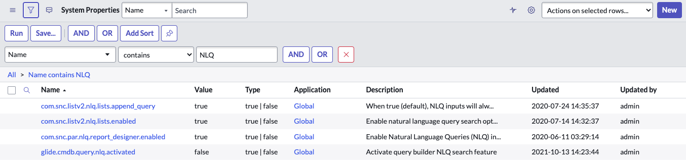

# Natural Language Query References

## SOURCE INFORMATION

* SECTION NAME: Natural Language Query
* SUBSECTION NAME: Natural Language Query References
* SOURCE FILE NAME: Natural Language Query.pdf
* PAGE RANGE: 1243-1245
* EXTRACTION DATE: 2026-06-17

---

# CONTENT

## Natural Language Query References

The following components are installed with Natural Language Query.

### NLQ properties

The Natural Language Query (NLQ) properties control how and where NLQ operates.

Admins can edit properties of NLQ by navigating to **All > System Properties > All Properties**. Filter for the NLQ properties.

> **Note:** Editing these system properties requires the admin role. The nlq_admin role does not have permission to edit records in this table.

| Property | Description |
|---|---|
| com.snc.listv2.nlq.lists.append_query | * **True:** NLQ inputs add onto existing queries via an "and" operator * **False:** New NLQ input replaces any existing queries  Example: You run two queries.  * Query 1: Incidents with critical priority * Query 2: assigned to John Smith  If the property is set to true, the results show incidents with critical priority that are assigned to John Smith. If the property is set to false, the results show only items assigned to John Smith. |
| com.snc.listv2.nlq.lists.enabled | * **True:** Enables NLQ search option for List v2 * **False:** Removes NLQ search option for List v2 |
| com.snc.nlq.gai_enabled | * **True:** The Now LLM Service fallback is available * **False:** The Now LLM Service fallback is not available  Initially, queries are interpreted using a rules-based method. If that method fails, queries are passed to the Now LLM Service as a fallback. Queries that fail both of these methods are marked as unsuccessful in the NLQ log. |
| com.snc.par.nlq.report_designer.enabled | * **True:** Enables NLQ in Report Designer * **False:** Removes NLQ in Report Designer |
| glide.cmdb.query.nlq.activated | * **True:** NLQ search feature is active in CMDB Query Builder * **False:** NLQ search feature is inactive in CMDB Query Builder |
| glide.service_portal.ais_nlq_enabled | * **True:** Enables NLQ in global search * **False:** NLQ is not available in global search |

### Natural Language Query roles

Natural Language Query (NLQ) is installed with these roles.

To learn more about managing per-user subscriptions, see Managing per-user subscriptions in Subscription Management and contact your account representative.

#### NLQ Admin [nlq_admin]

The administrator for Natural Language Query.

#### Module Access

Has full access to the following modules:

* NLQ Cmdb Implicit Relationships. For more information see Intelligent Search for CMDB.
* NLQ Query Logs
* NLQ Semantic Shortcuts.
* NLQ Synonyms.

Has read-only access to the following module:

NLQ Table Guesser Query Logs.

#### Contains Roles

List of roles contained within the role.

None.

#### Groups

List of groups this role is assigned to by default.

None.

#### Special considerations

To avoid granting an admin role, use the pa_analyst role for NLQ Cmdb Implicit Relationships, NLQ Semantic Shortcuts, and NLQ Synonyms.

---

## IMAGE DESCRIPTIONS

### Repeated page header logo - source pages 1243-1245

* **What is shown:** The ServiceNow logo appears in the upper-left page header on each reviewed page.
* **Objects present:** Black lowercase brand text, green `now` accent, registered trademark symbol.
* **Visible text:** `servicenow®`.
* **Business purpose:** Identifies publisher and product documentation source.
* **Technical purpose:** Repeated documentation header; not part of the NLQ properties or roles tables.

### Informational note icon - source page 1244

* **What is shown:** A black circular information icon before the note about editing system properties.
* **Objects present:** Filled black circle with white lowercase `i`.
* **Visible text near the icon:** `Note: Editing these system properties requires the admin role. The nlq_admin role does not have permission to edit records in this table.`
* **Business purpose:** Highlights an access-control constraint for administrators.
* **Technical purpose:** Clarifies that `nlq_admin` cannot edit the System Properties records described in the table.

### System Properties list filtered for NLQ - source page 1244

* **What is shown:** A ServiceNow `System Properties` list filtered to property names containing `NLQ`.
* **Objects present:** Toolbar, filter builder, action buttons, list breadcrumbs, table headers, and property rows.
* **All visible toolbar/filter text:** `System Properties`; `Name`; `Search`; `Actions on selected rows...`; `New`; `Run`; `Save...`; `AND`; `OR`; `Add Sort`; `Name`; `contains`; `NLQ`; `AND`; `OR`; `All > Name contains NLQ`.
* **Visible table headers:** `Name`; `Value`; `Type`; `Application`; `Description`; `Updated`; `Updated by`.
* **Visible rows:**

| Name | Value | Type | Application | Description | Updated | Updated by |
|---|---|---|---|---|---|---|
| com.snc.listv2.nlq.lists.append_query | true | <code>true | false</code> | Global | When true (default), NLQ inputs will alw... | 2020-07-24 14:35:37 | admin |
| com.snc.listv2.nlq.lists.enabled | true | <code>true | false</code> | Global | Enable natural language query search opt... | 2020-07-14 14:32:37 | admin |
| com.snc.par.nlq.report_designer.enabled | true | <code>true | false</code> | Global | Enable Natural Language Queries (NLQ) in... | 2020-06-11 03:29:14 | admin |
| glide.cmdb.query.nlq.activated | false | <code>true | false</code> | Global | Activate query builder NLQ search feature | 2021-10-13 14:23:44 | admin |

* **Process flow:** The UI filters the System Properties list by `Name contains NLQ`, then displays matching property records.
* **Business purpose:** Helps admins locate NLQ configuration properties.
* **Technical purpose:** Shows where the documented NLQ property records appear in the ServiceNow system property list.
* **Security boundaries:** The screenshot itself does not draw a boundary, but surrounding note text states editing requires the `admin` role and is not allowed for `nlq_admin` alone.
* **Color meaning:** Blue outlines/buttons indicate active filters and actions; gray backgrounds indicate list headers or inactive/readonly table zones.

### External-link indicators - source page 1245

* **What is shown:** External-link indicators appear near references such as `Managing per-user subscriptions` and `Intelligent Search for CMDB`.
* **Objects present:** Link text and small icon markers.
* **Business purpose:** Points readers to related subscription-management and CMDB documentation.
* **Technical purpose:** Identifies supporting material outside this subsection.

---

## TABLES

### NLQ properties - source pages 1244-1245

| Property | Description |
|---|---|
| com.snc.listv2.nlq.lists.append_query | * **True:** NLQ inputs add onto existing queries via an "and" operator * **False:** New NLQ input replaces any existing queries  Example: You run two queries.  * Query 1: Incidents with critical priority * Query 2: assigned to John Smith  If the property is set to true, the results show incidents with critical priority that are assigned to John Smith. If the property is set to false, the results show only items assigned to John Smith. |
| com.snc.listv2.nlq.lists.enabled | * **True:** Enables NLQ search option for List v2 * **False:** Removes NLQ search option for List v2 |
| com.snc.nlq.gai_enabled | * **True:** The Now LLM Service fallback is available * **False:** The Now LLM Service fallback is not available  Initially, queries are interpreted using a rules-based method. If that method fails, queries are passed to the Now LLM Service as a fallback. Queries that fail both of these methods are marked as unsuccessful in the NLQ log. |
| com.snc.par.nlq.report_designer.enabled | * **True:** Enables NLQ in Report Designer * **False:** Removes NLQ in Report Designer |
| glide.cmdb.query.nlq.activated | * **True:** NLQ search feature is active in CMDB Query Builder * **False:** NLQ search feature is inactive in CMDB Query Builder |
| glide.service_portal.ais_nlq_enabled | * **True:** Enables NLQ in global search * **False:** NLQ is not available in global search |

### System Properties filtered list visible rows - source page 1244

See the `System Properties list filtered for NLQ` image description for the extracted screenshot table.

---

## FIGURES

### Figure: System Properties list filtered for NLQ - source page 1244

* **Figure type:** ServiceNow list/grid screenshot.
* **Components:** Toolbar, filter builder, breadcrumb, property result grid, row values.
* **Connections/arrows/flows:** No arrows; the filter relationship is `Name contains NLQ`, which produces the visible property rows.
* **Labels:** `System Properties`, `Name`, `contains`, `NLQ`, `Run`, `Save...`, `AND`, `OR`, `Add Sort`, `New`.
* **Technical purpose:** Demonstrates where NLQ system properties can be located.
* **Security zones/boundaries:** No diagrammatic boundary shown; access restriction is described in the adjacent note.

---

## QUALITY ASSURANCE NOTES

* PAGES REVIEWED: Source pages 1243-1245, corresponding to PDF pages 10-12.
* IMAGES REVIEWED: ServiceNow header logo; informational note icon; System Properties screenshot; external-link indicators.
* TABLES REVIEWED: NLQ properties table; visible System Properties screenshot grid.
* FIGURES REVIEWED: System Properties filtered list screenshot.
* OCR ISSUES FOUND: Parsed output omitted screenshot row details and split the property table across pages. No unresolved OCR errors remain in this subsection.
* OCR ISSUES CORRECTED: Restored final row `glide.service_portal.ais_nlq_enabled`, preserved property names exactly, corrected spacing around role and module names, and reconstructed the cross-page property table.
* RECHECK PASSES COMPLETED: 12.
* SECTION MAPPING: TOC maps this subsection under `Natural Language Query`, starting on source page 1243.
* SUBSECTION MAPPING: Content begins at `Natural Language Query References` on source page 1243 and continues through `Special considerations` on source page 1245, before the next TOC section begins.
* FOLDER NAME VERIFIED: `Natural Language Query`.
* FILE NAME VERIFIED: `Natural Language Query References.md`.
* OUT-OF-SUBSECTION PAGE CONTENT ACCOUNTED FOR: Source page 1245 also contains the next major TOC section heading `AI Desktop Actions` and the introductory paragraph: `ServiceNow® AI Desktop Actions enables you to design, configure, and manage desktop actions that automate repetitive tasks in your desktop and web environment. AI agents can autonomously and semi-autonomously process instructions, generate execution plans, and run desktop actions across legacy systems, thick client applications, and web applications without APIs.` This content was reviewed and deliberately excluded from the NLQ subsection content because the TOC maps it to the next major section.
* PAGE HEADER/FOOTER ACCOUNTING: Repeated page footer text reviewed: `© 2026 ServiceNow, Inc. All rights reserved. ServiceNow, the ServiceNow logo, Now, and other ServiceNow marks are trademarks and/or registered trademarks of ServiceNow, Inc., in the United States and/or other countries. Other company names, product names, and logos may be trademarks of the respective companies with which they are associated.` Page numbers reviewed: 1243, 1244, and 1245.
