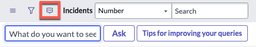
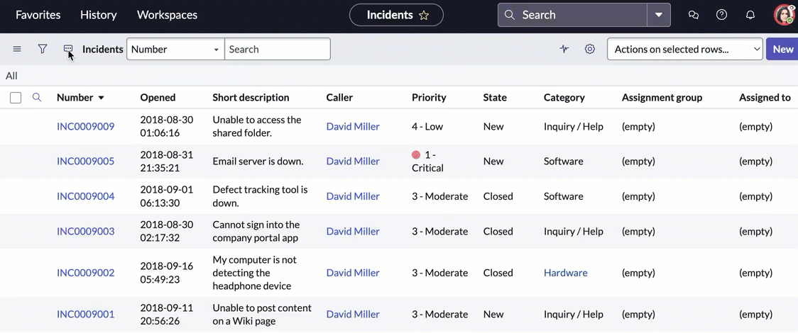

# Using Natural Language Query

## SOURCE INFORMATION

* SECTION NAME: Natural Language Query
* SUBSECTION NAME: Using Natural Language Query
* SOURCE FILE NAME: Natural Language Query.pdf
* PAGE RANGE: 1235-1237
* EXTRACTION DATE: 2026-06-17

---

# CONTENT

## Using Natural Language Query

With Natural Language Query (NLQ), you can query data in your tables by entering requests in natural, everyday language.

### NLQ overview

NLQ turns your plain-language requests into structured queries of your data. You don't need to know how to use the condition builder, because NLQ constructs and displays the conditions for you.

If you have a role such as itil that can view and interact with tables, you can use NLQ by selecting the natural language filter icon.

NLQ works on any list on the platform. It returns results only from the table or list you query on.

### Find and use the natural language filter

Selecting the natural language filter icon brings up the NLQ interface.

Enter your request in the What do you want to see field, then select **Ask**. NLQ parses your request, then displays the query in the condition builder. The results of the query are displayed in the list.

With the default configuration of NLQ, you can continue to refine your query by entering another request into the What do you want to see field.

### Using NLQ to build on a previous query

This example image and procedure illustrates how to build a query using NLQ:

1. On the Incident table in the natural language filter, enter `show me active hardware tickets` and select the **Ask** button.
2. The condition builder displays **All > Active = true > Category = Hardware** as the query. The filtered results are displayed in the list.
3. To narrow down the list of results further, enter `without assignment group`. Notice that as you type, NLQ displays possible matches for columns and fields. Select assignment group from the list of suggestions, and then **Ask**.
4. In the condition builder, NLQ adds **>Assignment group is empty** to the query. The list refreshes to display only the matching rows.
5. To reset and start a new query, delete everything in the condition builder so that only **All** remains.

### Useful information

Keep the following information in mind when using NLQ.

* Your requests can contain periods and apostrophes, but not wildcard characters such as asterisks or regex.
* To group by a field or column, that column must be visible in the list view. Use the personalize list icon (shown as a blue gear icon in the source) to hide or display columns.
* For information about querying CMDB tables, see Querying the CMDB.

### Tips for improving your queries

When you select the **Tips for improving your queries** button, a modal window appears in the user interface. This window offers the following information about terms you can use in your NLQ questions and requests:

* Sorting or grouping: grouped by; sorted by; A-Z; z-a
* Dates: today; yesterday; last; this; next day(s); week(s); quarter(s); year(s)
* Filtering: starts with; ends with; more than; less than; empty; not empty; and; or
* Other information: my; my team; created by; unassigned

| Query | Example |
|---|---|
| Sorting or grouping | incidents grouped by category |
| Dates | created last month |
| Filtering | short description starts with computer |
| Other information | unassigned tickets |
| Single number | INC0777 |

---

## IMAGE DESCRIPTIONS

### Repeated page header logo - source pages 1235-1237

* **What is shown:** The ServiceNow logo appears in the upper-left page header on each reviewed page.
* **Objects present:** Black lowercase brand text, green `now` accent, registered trademark symbol.
* **Visible text:** `servicenow®`.
* **Business purpose:** Identifies publisher and product documentation source.
* **Technical purpose:** Repeated documentation header; not part of the NLQ workflow.

### Natural language filter UI - source page 1236

* **What is shown:** A cropped ServiceNow list toolbar with the natural-language filter icon selected/highlighted.
* **Objects present:** Toolbar icons, list name, dropdown, search box, NLQ prompt field, Ask button, and tips button.
* **All visible text:** `Incidents`; `Number`; `Search`; `What do you want to see`; `Ask`; `Tips for improving your queries`.
* **Icon and control details:**
  * Left-side hamburger/menu icon.
  * Funnel/filter icon.
  * Natural-language filter icon shown as a speech-bubble/chat style control, emphasized by a red rectangle.
  * `Incidents` list label.
  * `Number` dropdown selector.
  * Standard list search field labeled `Search`.
  * NLQ input field labeled `What do you want to see`.
  * `Ask` button.
  * `Tips for improving your queries` button.
* **Process flow:** Select the highlighted natural-language filter icon, enter a request in the NLQ field, then select `Ask`.
* **Technical purpose:** Shows where NLQ input is entered on a ServiceNow list.
* **Business purpose:** Enables users to build table filters without using the condition builder manually.
* **Security boundaries:** None shown.
* **Color meaning:** Red rectangle highlights the NLQ icon; blue outlines indicate active/interactive UI controls.

### Using NLQ to build on a previous query - Incidents list screenshot - source page 1236

* **What is shown:** A ServiceNow `Incidents` list used as the example target table for a natural-language query.
* **Objects present:** Top navigation bar, global search, list toolbar, action menu, `New` button, and a tabular incident list.
* **All visible top navigation text:** `Favorites`; `History`; `Workspaces`; `Incidents`; `Search`.
* **All visible toolbar/list text:** `Incidents`; `Number`; `Search`; `Actions on selected rows...`; `New`; `All`.
* **Visible table headers:** `Number`; `Opened`; `Short description`; `Caller`; `Priority`; `State`; `Category`; `Assignment group`; `Assigned to`.
* **Visible table rows:**

| Number | Opened | Short description | Caller | Priority | State | Category | Assignment group | Assigned to |
|---|---|---|---|---|---|---|---|---|
| INC0009009 | 2018-08-30 01:06:16 | Unable to access the shared folder. | David Miller | 4 - Low | New | Inquiry / Help | (empty) | (empty) |
| INC0009005 | 2018-08-31 21:35:21 | Email server is down. | David Miller | 1 - Critical | New | Software | (empty) | (empty) |
| INC0009004 | 2018-09-01 06:13:30 | Defect tracking tool is down. | David Miller | 3 - Moderate | Closed | Software | (empty) | (empty) |
| INC0009003 | 2018-08-30 02:17:32 | Cannot sign into the company portal app | David Miller | 3 - Moderate | Closed | Inquiry / Help | (empty) | (empty) |
| INC0009002 | 2018-09-16 05:49:23 | My computer is not detecting the headphone device | David Miller | 3 - Moderate | Closed | Hardware | (empty) | (empty) |
| INC0009001 | 2018-09-11 20:56:26 | Unable to post content on a Wiki page | David Miller | 3 - Moderate | New | Inquiry / Help | (empty) | (empty) |

* **Process flow:** The screenshot supports the subsequent numbered procedure: query active hardware tickets, then narrow the result set by excluding records with an assignment group.
* **Technical purpose:** Shows how NLQ queries are reflected in list filtering and record results.
* **Business purpose:** Demonstrates practical ticket filtering for incident management.
* **Security boundaries:** None shown.
* **Color meaning:** Blue text indicates clickable record links and user/category links; a red priority indicator appears next to `1 - Critical`.

### Personalize list icon - source page 1237

* **What is shown:** A small blue gear icon displayed inline with the instruction about hiding or displaying list columns.
* **Objects present:** Gear/cog outline.
* **Visible text near the icon:** `Use the personalize list icon (...) to hide or display columns.`
* **Technical purpose:** Indicates the ServiceNow control used to configure visible list columns.
* **Business purpose:** Supports grouping by a field or column by ensuring that column is visible in the list view.

### External-link indicators - source page 1237

* **What is shown:** External-link icon next to the linked reference `Querying the CMDB`.
* **Objects present:** Teal link text and small external-link mark.
* **Technical purpose:** Identifies supporting documentation for CMDB querying.

---

## TABLES

### Tips for improving your queries - source page 1237

| Query | Example |
|---|---|
| Sorting or grouping | incidents grouped by category |
| Dates | created last month |
| Filtering | short description starts with computer |
| Other information | unassigned tickets |
| Single number | INC0777 |

### Incidents list shown inside example screenshot - source page 1236

| Number | Opened | Short description | Caller | Priority | State | Category | Assignment group | Assigned to |
|---|---|---|---|---|---|---|---|---|
| INC0009009 | 2018-08-30 01:06:16 | Unable to access the shared folder. | David Miller | 4 - Low | New | Inquiry / Help | (empty) | (empty) |
| INC0009005 | 2018-08-31 21:35:21 | Email server is down. | David Miller | 1 - Critical | New | Software | (empty) | (empty) |
| INC0009004 | 2018-09-01 06:13:30 | Defect tracking tool is down. | David Miller | 3 - Moderate | Closed | Software | (empty) | (empty) |
| INC0009003 | 2018-08-30 02:17:32 | Cannot sign into the company portal app | David Miller | 3 - Moderate | Closed | Inquiry / Help | (empty) | (empty) |
| INC0009002 | 2018-09-16 05:49:23 | My computer is not detecting the headphone device | David Miller | 3 - Moderate | Closed | Hardware | (empty) | (empty) |
| INC0009001 | 2018-09-11 20:56:26 | Unable to post content on a Wiki page | David Miller | 3 - Moderate | New | Inquiry / Help | (empty) | (empty) |

---

## FIGURES

### Figure: Natural language filter UI - source page 1236

* **Figure type:** ServiceNow UI screenshot.
* **Components:** Toolbar icons, `Incidents` list name, `Number` field selector, standard `Search` input, NLQ request field, `Ask` button, and `Tips for improving your queries` button.
* **Connections/arrows/flows:** No arrows are drawn; the UI sequence is implied: open the NLQ interface, enter text, select `Ask`.
* **Labels:** `Incidents`, `Number`, `Search`, `What do you want to see`, `Ask`, `Tips for improving your queries`.
* **Technical purpose:** Locates the NLQ controls in a list view.
* **Security zones/boundaries:** None.

### Figure: Using NLQ to build on a previous query - source page 1236

* **Figure type:** ServiceNow list screenshot with incident data grid.
* **Components:** Navigation bar, list toolbar, action controls, and incident record table.
* **Connections/arrows/flows:** No arrows are drawn; relationship is procedural: the NLQ query creates list conditions, which filter the incident rows.
* **Labels:** See complete table headers and visible rows in the image description and table extraction above.
* **Technical purpose:** Demonstrates the target table after NLQ filtering.
* **Security zones/boundaries:** None.

---

## QUALITY ASSURANCE NOTES

* PAGES REVIEWED: Source pages 1235-1237, corresponding to PDF pages 2-4.
* IMAGES REVIEWED: ServiceNow header logo; natural-language filter UI screenshot; Incidents list screenshot; personalize list icon; external-link icon.
* TABLES REVIEWED: `Tips for improving your queries` table; visible Incidents list table inside the screenshot.
* FIGURES REVIEWED: Natural-language filter UI screenshot; Incidents list screenshot.
* OCR ISSUES FOUND: Parsed output did not include screenshot text; visible screenshot text was manually interpreted from rendered/extracted images. No unresolved OCR errors remain in this subsection.
* OCR ISSUES CORRECTED: Restored spacing around `CMDB tables`, normalized code-style utterances, corrected line wrapping of `show me active hardware tickets`, `without assignment group`, and `>Assignment group is empty`.
* RECHECK PASSES COMPLETED: 12.
* SECTION MAPPING: TOC maps this subsection under `Natural Language Query`, starting on source page 1235.
* SUBSECTION MAPPING: Content begins at `Using Natural Language Query` on source page 1235 and continues through the text before `Configuring NLQ` on source page 1237.
* FOLDER NAME VERIFIED: `Natural Language Query`.
* FILE NAME VERIFIED: `Using Natural Language Query.md`.
* PAGE HEADER/FOOTER ACCOUNTING: Repeated page footer text reviewed: `© 2026 ServiceNow, Inc. All rights reserved. ServiceNow, the ServiceNow logo, Now, and other ServiceNow marks are trademarks and/or registered trademarks of ServiceNow, Inc., in the United States and/or other countries. Other company names, product names, and logos may be trademarks of the respective companies with which they are associated.` Page numbers reviewed: 1235, 1236, and 1237.
