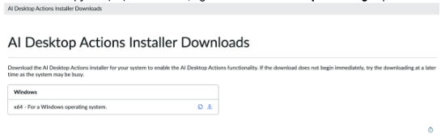
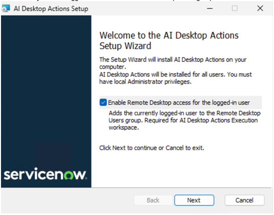
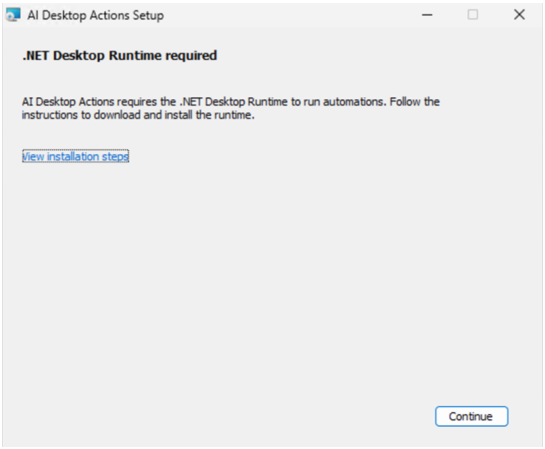
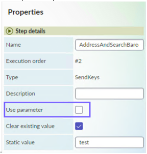
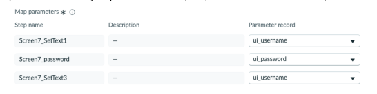
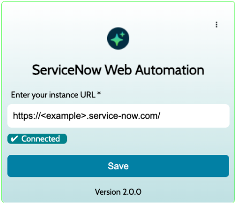
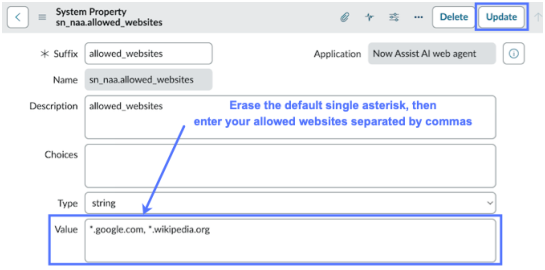

# Configure

## SOURCE INFORMATION

* SECTION NAME: AI Desktop Actions
* SUBSECTION NAME: Configure
* SOURCE FILE NAME: AI Desktop Actions.pdf
* PAGE RANGE: 1267-1281 (shared boundary pages split at source headings)
* EXTRACTION DATE: 2026-06-17

---

# CONTENT

> Source page: 1267

### Configure AI Desktop Actions

You can enable the AI Desktop Actions application if you have the admin role.
Before you begin
To get started with AI Desktop Actions, you must have:
• A ServiceNow Pro Plus or Enterprise Plus license.
• An instance on Zurich Patch 4+.
• A .NET 9.0 runtime v9.0.10 and .NET 9 Desktop Runtime v9.0.10 is installed.
Role required: administrator
About this task
AI Desktop Actions isn’t a standalone application that you can install directly. To enable AI
Desktop Actions on your instance, you must install other Now Assist applications, such as Now
Assist for IT Service Management (ITSM) or Now Assist for Customer Service Management
(CSM).
• Review the AI Desktop Actions
application listing in ServiceNow Store for information on
dependencies, licensing or subscription requirements, and release compatibility.
• Perform these steps in your ServiceNow instance.
For more information about the components installed, see Components installed with AI Desktop
Actions.
Procedure
1. Navigate to All > System Definition > Plugins.
2. Search for and select a Now Assist application, such as Now Assist for IT Service Management
(ITSM) or Now Assist for Platform.
3. Select Install.
What to do next
Defined desktop action
Download and install the AI Desktop Actions installer on your system to automate
repetitive tasks that involve fixed steps in your desktop and web environment. For
more information, see Download AI Desktop Actions installer.
Adaptive desktop action

> Source page: 1268

Install the Chrome browser extension and configure allowed websites to automate
repetitive tasks that involve adaptive steps for web applications. For more
information, see Install the Google Chrome extension for adaptive desktop actions
and Configure allowed websites for adaptive desktop actions.

#### Configuring AI Desktop Actions for defined path desktop actions

Configure AI Desktop Actions to execute predefined automation sequences on your desktop.
Defined path actions provide consistent, repeatable workflows for common desktop tasks.
Download AI Desktop Actions installer
Download the AI Desktop Actions installer so that you can install AI Desktop Actions on your
Windows machine for designing and running desktop actions.
Before you begin
• A .NET 9.0 runtime v9.0.10 and .NET 9 Desktop Runtime v9.0.10 is installed.
• Ensure that you install the AI Desktop Actions installer using Windows administrator privileges.
• Ensure that the Desktop-in-Desktop settings are configured correctly.
• Add the end users who interact with the Execution workspace of AI Desktop Actions to the
Remote Desktop Users group on the target machine and provide Remote Desktop access
permissions for seamless automation execution.
If your organization uses Group Policy, add the end users to a Microsoft Active Directory group
that is permitted to use Remote Desktop through Group Policy on each target machine where
desktop actions run.
  ◦Local changes to the Remote Desktop Users group are temporary unless they align with
Microsoft Active Directory entitlements.
  ◦If the user is not entitled, Group Policy refresh automatically removes them from the group.
Role required: Windows administrator
Procedure
1. Navigate to All > AI Desktop Actions > Downloads.
2. In the AI Desktop Actions Downloads page, do any of the following actions to download the
required application for Windows:
  ◦Select the download icon (
).
  ◦Select the copy link (
). In a browser, right-click and select the paste and go option.
The system might prompt you to save or open the file.

> Source page: 1269

#### Note: Depending on your browser setting, the browser might automatically save the file

to your Downloads folder.
3. Execute the application installation file (.msi file).
4. Follow the on-screen instructions to install the application.
AI Desktop Actions is installed in a per-machine folder by default, making it available to all
users. You can change the folder location during setup.
5. Keep the option Enable Remote Desktop access for the logged-in user selected to
automatically add the logged-in user to the Remote Desktop Users group.
6. If not already installed, download and install the .Net Desktop Runtime framework.
The installer validates if required .NET Desktop Runtime is installed or not on the user machine.
If not installed, the installer provides a link to instructions for downloading and installing the

> Source page: 1270

same. For more information, see Download and install .Net Desktop Runtime for AI Desktop
Actions.
Trouble?
If AI Desktop Actions is not installed using Windows administrator privileges, you may encounter
issues with the desktop session in the Execution workspace. To fix the issue, perform the
following steps.
1. Navigate to the SessionRegistry folder of the AI Desktop Actions installation directory.
2. Right-click SN.AGENTICDESKTOP.SESSION.REGISTER.exe and select Run as
administrator.
3. Restart your system.
What to do next
Use AI Desktop Actions to design desktop actions. For more information, see Defined path
desktop actions in AI Desktop Actions.
Download and install .Net Desktop Runtime for AI Desktop Actions
Reduce setup time and prevent installation errors by downloading and installing .Net Desktop
Runtime following the instructions.
Before you begin
Ensure that you have installed the AI Desktop Actions MSI. For more information, see Download
AI Desktop Actions installer.

> Source page: 1271

Role required: admin
About this task
The AI Desktop Actions installer guides you through installation of .NET Desktop Runtime during
the setup.
Procedure
1. Copy the following script to your clipboard.
Write-Host "--- Initializing Agentic Environment Setup ---"
-ForegroundColor Cyan
$ErrorActionPreference = "Stop"
$downloadUrl = "https://dot.net/v1/dotnet-install.ps1"
$workingDir = $PSScriptRoot
$scriptPath = Join-Path $workingDir "dotnet-install.ps1"
try {
Write-Host "[1/3] Downloading official Microsoft
installer..." -ForegroundColor Yellow
Invoke-WebRequest -Uri $downloadUrl -OutFile $scriptPath
Write-Host "[2/3] Installing .NET 9.0.10..."
-ForegroundColor Yellow
Set-Location $workingDir
& .\dotnet-install.ps1 `
-Architecture x64 `
-InstallDir "C:\Program Files\dotnet\" `
-Runtime windowsdesktop `
-Version 9.0.10
& .\dotnet-install.ps1 `
-Architecture x64 `
-InstallDir "C:\Program Files\dotnet\" `
-Runtime dotnet `
-Version 9.0.10
Write-Host ""
Write-Host "--- SUCCESS: System is ready for Agentic
Desktop ---" -ForegroundColor Green
}
catch {
Write-Host ""
Write-Host "--- ERROR: Installation failed ---"
-ForegroundColor Red
Write-Host $_.Exception.Message -ForegroundColor Red
}
Write-Host ""
Write-Host "Press any key to exit..."
$null = $Host.UI.RawUI.ReadKey("NoEcho,IncludeKeyDown")
2. Paste the script in any text editor.
3. Save the file with a .ps1 extension.

> Source page: 1272

a. Select File > Save As.
b. In the File name field, enter a name and save the file with a .ps1 extension.
Example: myscript.ps1
c. Set Save as type to All Files (.).
d. Choose a location such as Documents or Desktop.
e. Select Save.
4. Run the script in Windows PowerShell.
a. Select Start.
b. Search for Windows PowerShell.
c. Select Run as administrator.
d. Use the cd command to move to the folder where you saved the script.
Example:
cd C:\Users\YourName\Documents
e. Run the script by entering the following command.
Example:
.\myscript.ps1
Result
.NET Desktop Runtime is downloaded and installed on your system.
What to do next
Use AI Desktop Actions to design desktop actions. For more information, see Defined path
desktop actions in AI Desktop Actions.
Enable AI agents to securely access parameters in AI Desktop Actions
Enable AI agents to securely access stored values, such as credentials and other input data,
through Desktop Action Parameter records. Parameters protect sensitive values and provide
dynamic inputs to desktop actions during agent execution.
Only users with the sn_aia.admin role can create Parameter records. Parameter records store
the names of values that an AI agent accesses during desktop action execution. A separate
Parameter record is required for each distinct value.

#### Parameter record settings

Each Parameter record includes two fields that control how parameter values are stored and
retrieved at execution time.

> Source page: 1273

Setting
Description
Shared -
Makes the parameter available to all users. When selected, only one Parameter
selected
Value record can be created under the parameter, and only a user with the
sn_aia.admin role can create it. During execution, the agent always uses the single
Parameter Value record regardless of which user triggered the agent.
For example, use this setting for a service account or shared API key that all agents
use to connect to the same system.
Shared
Enables multiple users with the sn_aia.admin or now_assist_panel_user role to
- not
create Parameter Value records under the Parameter record to store values. Only
selected
one Parameter Value record can be created per user for each Parameter record. If
multiple users must trigger the same AI agent, each user must create a Parameter
Value record for their own credentials or inputs.
During execution, the agent retrieves the Parameter Value record that belongs to the
user who triggered the agent.
For example, use this setting when each user connects with their own credentials,
such as individual usernames and passwords for an internal application.
Mark As
Encrypts values of all associated Parameter Value records. The agent decrypts the
Sensitive
value at execution time. When not selected, values are passed to the agent as plain
text.
For example, enable this setting for passwords, API keys, or any value that should
not be visible in plain text in the instance.

#### Important:

The Shared and Mark As Sensitive fields can only be edited when there are no associated
Parameter Value records.

> Source page: 1274

#### Map parameters to inputs of on-screen task desktop action

In the Design workspace of the AI Desktop Actions application, you can select the Use
parameter check box for desktop action inputs that must retrieve values from the parameter
records during execution.
In AI Agent Studio, when you add a desktop action tool that contains inputs configured for
parameters, the Map parameters section appears in the modal. Each input configured for
a parameter is listed by step name and description, with a Parameter record drop-down.
The following rules apply to parameter mapping:
• All inputs configured for parameters must be mapped to a Parameter record before the
desktop action can be saved.
• The same Parameter record can be mapped to multiple inputs.
• Each input can only be mapped to one Parameter record.

#### Note: If you specify values for inputs configured for parameters in the agent instructions

or in the Now Assist panel, the mapped parameter values override them.

#### Important:

If you update a desktop action in AI Desktop Actions client application after mapping
its inputs in AI Agent Studio, the agent continues to use the previous mapping until you
reopen the tool configuration and save it again.
If you rename an input in the desktop action, the agent treats it as a new input and the
existing mapping for that input is removed. You must remap the renamed input before the
desktop action can be saved.

> Source page: 1275

#### SSH parameter example

#### Note:

The following example applies to SSH connector, background task desktop actions. For on-
screen task desktop actions, parameter values are supplied through the Map parameters
section in AI Agent Studio and aren't referenced in agent instructions.
Only users with the sn_aia.admin role can create Parameter records for SSH desktop actions.
To store both a username and a password, the AIA admin must create two separate Parameter
records, one for the username (for example, un_username_group) and one for the password
(for example, un_password_group).
Users with the sn_aia.admin or now_assist_panel_user role can then create Parameter Value
records under each Parameter record to store the values. Only one Parameter Value record can
be created per user for each Parameter record.

#### Example: AI Agent instructions during execution

The following example shows how an AI agent instruction can reference stored parameter
names:
Connect to SSH server and retrieve my session info. Here are my
details:
• IP address: 172.27.50.123
• Port: 22
• Retrieve the user name stored in "un_username_group" and the
password stored in "un_password_group" parameter records.

#### Note: When triggering an AI agent, explicitly specify in your instructions whether the

credentials are provided directly or stored in Parameter records. If Parameter records are
used, clarify that the record names are for reference only and that the agent must retrieve
the username and password from those records.
Verify that you use the exact names of the Parameter records. Parameter record names are
case sensitive. For example, "UserName" and "username" are treated as different values.
Related topics
Create a Desktop action parameter record
Create a parameter value record
Create a Desktop action parameter record
Create a Desktop action parameter record to store a name that an AI agent references when
accessing credentials or other values during desktop action execution.
Before you begin
Perform this task in the ServiceNow instance.
For SSH connector desktop actions, verify that you have an active SSH server.
Role required: sn_aia.admin

> Source page: 1276

About this task
Parameter records are supported for on-screen tasks and SSH background tasks. Use them to
replace fixed values with configured ones for on-screen tasks and username and password for
SSH.
Procedure
1. Navigate to All > AI Desktop Actions > Desktop Action Parameters.
2. Select New.
3. Fill in the following fields.
Desktop action parameter fields
Field
Description
Name
Enter a unique name for the parameter. The AI agent references this name
when retrieving the stored value. For example, un_username_group or
un_password_group.
Description Enter a description of what value this parameter stores.
Shared
Option to make this parameter available to all users. When selected, only one
Desktop action parameter value record can be created under this parameter,
and only a user with the sn_aia.admin role can create it. During execution, the AI
agent uses this single value regardless of which user triggered the agent.
Mark As
Option to encrypt all associated Desktop action parameter value records. The
Sensitive
agent decrypts the value at execution time.

#### Important:

Shared and Mark As Sensitive can only be edited when there are no associated
parameter value records.
4. Select Submit.
Result
The Desktop action parameter record is created and appears in the Desktop Action Parameters
list. You can now create Desktop action parameter value records under this parameter. For more
information, see Create a parameter value record.
Create a parameter value record
Create a Desktop action parameter value record to store the value that an AI agent retrieves
during desktop action execution.
Before you begin
Perform this task in the ServiceNow instance.
At least one Desktop action parameter record must exist.
Role required: sn_aia.admin or now_assist_panel_user

#### Note:

For shared parameters, only users with the sn_aia.admin role can create Desktop action
parameter value records.

> Source page: 1277

Procedure
1. Navigate to All > AI Desktop Actions > Desktop Action Parameters.
2. Select the Parameter record for which you want to store a value.
3. In the Desktop action parameter values related list, select New.
4. Fill in the following fields.
Desktop action parameter value fields
Field
Description
Name Read-only. Inherited from the parent Desktop action parameter record.
User
The user this value record belongs to. Defaults to the user creating the record. Users
with the sn_aia.admin role can change this field to assign the value record to a
different user.

#### Note:

This field is not shown for shared parameters.
Value
Enter the value the agent retrieves at execution time, such as a username, password,
or other credential.

#### Note:

The Value field displays as plain text or encrypted text depending on the Mark
As Sensitive setting on the parent parameter record.
5. Select Submit.
Result
The Desktop action parameter value record is created and appears in the Desktop action
parameter values related list on the Parameter record.

#### Configuration for adaptive path desktop actions

Adaptive path desktop actions automatically adjust their behavior based on user context and
system conditions. Configure these settings to optimize desktop action performance and user
experience across different scenarios.
Install the Google Chrome extension for adaptive desktop actions
Install the ServiceNow Web Automation Chrome extension to the Google Chrome browser. The
browser extension enables AI agents to interact with web applications during task execution.
Before you begin
• At least one AI agent that uses one or more adaptive desktop actions must exist in the
ServiceNow® instance you plan to connect to.
• You must be logged in to your ServiceNow® instance.
• You must have permissions to install browser extensions in Chrome.
Role required: none

> Source page: 1278

About this task
Follow the procedure to download and install the extension from the Google Chrome webstore.
Install the Google Chrome browser extension on each device where you want to invoke an AI
agent to automate tasks.
Using the ServiceNow Web Automation browser extension, an AI agent opens a browser tab to
navigate to web applications.
When you log out of the ServiceNow instance, the message Disconnected appears in the
browser extension. This message also appears when any browser window to your instance is
inactive. The extension must be connected for AI agents to interact with the web applications.

#### Note: Verify that you open only one tab with active ServiceNow® instance.

Procedure
1. Download the Google Chrome browser extension from the Google Chrome webstore by
navigating to:
https://chromewebstore.google.com/detail/servicenow-rpa-chrome-ext/
bnaofpgjajbimmicdiipemhmheafhgkb
2. Select Add to Chrome.
3. In the Add ServiceNow Web Automation dialog, select Add extension.
4. In your Google Chrome browser address bar, enter chrome://extensions/.
5. Select Details on the ServiceNow Web Automation card, and then select the Pin to toolbar
option.
The extension icon appears in the Chrome toolbar.
6. Select the ServiceNow Web Automation extension icon
in the browser toolbar.
7. In the Enter your instance URL field, enter the ServiceNow instance you want to connect to, in
the format https://<instance-name>.service-now.com/.
The confirmation message appears in the browser extension: Connected.

> Source page: 1279

Connected browser extension
Trouble?
Verify that you're connected to the ServiceNow® instance that has at least one AI agent that
uses one or more adaptive desktop actions.

#### Note: If any browser windows were already open with the instance, you must reload the

windows to connect successfully to the browser extension.
8. In the browser extension panel, select Save.
What to do next
After installing the browser extension, configure websites that AI agents can access for
automating web tasks. For detailed instructions, see Configure allowed websites for adaptive
desktop actions.
Configure allowed websites for adaptive desktop actions
Specify a list of websites that AI agents configured with adaptive desktop actions are permitted
to open and perform tasks.
Before you begin
Set your application scope to Now Assist AI web agent.
Role required: admin
About this task
AI agents configured with adaptive desktop actions perform tasks on web applications or
websites. You can control the websites that AI agents access by updating a system property,

> Source page: 1280

sn_naa.allowed_websites. This system property allows access to all websites, with a
single asterisk (*) as the default value. When you enter a list of allowed sites, the AI agents are
restricted to only the sites in the list.

#### Note: AI agents operate through the browser extension, which means they can only

access content within the browser and are unable to interact with desktop applications or
other local files, except for downloading files. The AI agents can't access the downloaded
files as well from the desktop. Use defined desktop actions for uploading data from the local
system.
When configuring an allow list, include your organization's websites. Work with your stakeholders
to determine which websites to include. If an AI agent tries to access a website not on the allow
list, the system stops the request and displays an error message. An AI agent can open websites
defined in tool actions that aren't on the allow list. However, the AI agent can't perform any
actions on those websites.

#### Note: The AI agent checks its access to the internet by first opening the Google website. If

the AI agent isn't allowed to open the Google website, it can't proceed with its task. Be sure
to include google.com or *.google.com in the allowed list.
Procedure
1. Navigate to All.
2. In the filter navigator, enter sys_properties.list.
3. In the System Properties table, search and select the sn_naa.allowed_websites
property.
The System Property form opens.
4. In the Value field, delete the single asterisk (*) and enter the websites that you want to allow for
AI agents to access.
The following guidance apply:
  ◦Separate the websites using commas (comma-separated list).
  ◦Enter websites as hostnames without protocols, such as example.com.
  ◦Allow all subdomains on a website by using an asterisk. The format *.example.com
allows abc.example.com, xyz.example.com, and so forth.
  ◦Be sure to include access to Google website by entering google.com or *.google.com.

> Source page: 1281

5. Select Update to save your changes.
What to do next
• Create an AI agent
• Add an adaptive desktop action tool to an AI agent for web-based tasks
• Create an agentic workflow for automating web tasks


---

## IMAGE DESCRIPTIONS

### Repeated ServiceNow page header/logo

The ServiceNow-branded wordmark appears in the upper-left corner of reviewed source pages for this subsection. It is a recurring branding image, not a technical diagram. It contains the visible brand text `servicenow`, with green accenting in the `now` portion. Reviewed pages: 1267, 1268, 1269, 1270, 1271, 1272, 1273, 1274, 1275, 1276, 1277, 1278, 1279, 1280, 1281.

### Small UI icons and inline pictograms

3 small non-logo icon/pictogram image blocks were reviewed on source pages 1268, 1278. These include information icons, external-link indicators, refresh/retry glyphs, action/menu icons, or small UI control images. They support the surrounding text but do not contain standalone table data. Coordinates and classification are retained in `_assets/image_inventory.csv`.

### Source page 1268 — Image 1



* **Bounding box:** x=82.0, y=573.5, width=432.0 pt, height=131.8 pt.
* **What is shown:** This embedded source image appears near `2. In the AI Desktop Actions Downloads page, do any of the following actions to download the / ). In a browser, right-click and select the paste and go option.`. It is a product screenshot, form, UI panel, dialog, wizard, table-like screen, or instructional figure supporting the same-page task. Visible objects may include windows, tabs, form fields, buttons, record lists, panes, menus, highlighted controls, and explanatory labels. Its business purpose is to reduce ambiguity for a reader following the ServiceNow AI Desktop Actions procedure. Its technical purpose is to identify the exact interface element, screen state, or control referenced by the surrounding instructions.
* **Relationships / arrows / flow / labels:** The relationships are UI relationships visible inside the screenshot: fields belong to forms, buttons trigger actions, rows belong to lists/tables, and highlighted regions identify the target. No separate network topology, architecture boundary, or security zone is labeled unless it appears explicitly in the crop.
* **Visible text captured from image:**

```text
Al Desktop Actions Installer Downloads
```

### Source page 1269 — Image 2



* **Bounding box:** x=82.0, y=183.5, width=432.0 pt, height=337.9 pt.
* **What is shown:** This embedded source image appears near `4. Follow the on-screen instructions to install the application. / 5. Keep the option Enable Remote Desktop access for the logged-in user selected to`. It is a product screenshot, form, UI panel, dialog, wizard, table-like screen, or instructional figure supporting the same-page task. Visible objects may include windows, tabs, form fields, buttons, record lists, panes, menus, highlighted controls, and explanatory labels. Its business purpose is to reduce ambiguity for a reader following the ServiceNow AI Desktop Actions procedure. Its technical purpose is to identify the exact interface element, screen state, or control referenced by the surrounding instructions.
* **Relationships / arrows / flow / labels:** The relationships are UI relationships visible inside the screenshot: fields belong to forms, buttons trigger actions, rows belong to lists/tables, and highlighted regions identify the target. No separate network topology, architecture boundary, or security zone is labeled unless it appears explicitly in the crop.
* **Visible text captured from image:**

```text
Bl Al Desktop Actions Setup = x
Welcome to the AI Desktop Actions
Setup Wizard
The Setup Wizard wil install AI Desktop Actions on your
computer.
Al Desktop Actions willbe installed for all users. You must
have local Adminstrator privileges.
(GEnable Remote Desktop access for the logged-in user
Adds the currently logged-in user to the Remote Desktop
Users group. Required for Al Desktop Actions Execution
workspace.
Click Next to continue or Cancel to exit.
servicenow.
```

### Source page 1270 — Image 3



* **Bounding box:** x=82.0, y=69.0, width=432.0 pt, height=354.2 pt.
* **What is shown:** This embedded source image appears near `same. For more information, see Download and install .Net Desktop Runtime for AI Desktop / Actions.`. It is a product screenshot, form, UI panel, dialog, wizard, table-like screen, or instructional figure supporting the same-page task. Visible objects may include windows, tabs, form fields, buttons, record lists, panes, menus, highlighted controls, and explanatory labels. Its business purpose is to reduce ambiguity for a reader following the ServiceNow AI Desktop Actions procedure. Its technical purpose is to identify the exact interface element, screen state, or control referenced by the surrounding instructions.
* **Relationships / arrows / flow / labels:** The relationships are UI relationships visible inside the screenshot: fields belong to forms, buttons trigger actions, rows belong to lists/tables, and highlighted regions identify the target. No separate network topology, architecture boundary, or security zone is labeled unless it appears explicitly in the crop.
* **Visible text captured from image:**

```text
1D AI Desktop Actions Setup - x
-NET Desktop Runtime required
‘Al Desktop Actions requires the .NET Desktop Runtime to run automations. Follow the
instructons to download and instal the runtime.
Gewinstaliston stepd
```

### Source page 1274 — Image 4



* **Bounding box:** x=190.7, y=89.2, width=225.0 pt, height=237.4 pt.
* **What is shown:** This embedded source image appears near `In the Design workspace of the AI Desktop Actions application, you can select the Use / parameter check box for desktop action inputs that must retrieve values from the parameter`. It is a product screenshot, form, UI panel, dialog, wizard, table-like screen, or instructional figure supporting the same-page task. Visible objects may include windows, tabs, form fields, buttons, record lists, panes, menus, highlighted controls, and explanatory labels. Its business purpose is to reduce ambiguity for a reader following the ServiceNow AI Desktop Actions procedure. Its technical purpose is to identify the exact interface element, screen state, or control referenced by the surrounding instructions.
* **Relationships / arrows / flow / labels:** The relationships are UI relationships visible inside the screenshot: fields belong to forms, buttons trigger actions, rows belong to lists/tables, and highlighted regions identify the target. No separate network topology, architecture boundary, or security zone is labeled unless it appears explicitly in the crop.
* **Visible text captured from image:**

```text
@Osepdetls
ve
Execution order 2 |
‘Type SendKeys, |
Eon Cc
Cencistreve |
```

### Source page 1274 — Image 5



* **Bounding box:** x=72.0, y=377.3, width=432.0 pt, height=105.4 pt.
* **What is shown:** This embedded source image appears near `parameters, the Map parameters section appears in the modal. Each input configured for / a parameter is listed by step name and description, with a Parameter record drop-down.`. It is a product screenshot, form, UI panel, dialog, wizard, table-like screen, or instructional figure supporting the same-page task. Visible objects may include windows, tabs, form fields, buttons, record lists, panes, menus, highlighted controls, and explanatory labels. Its business purpose is to reduce ambiguity for a reader following the ServiceNow AI Desktop Actions procedure. Its technical purpose is to identify the exact interface element, screen state, or control referenced by the surrounding instructions.
* **Relationships / arrows / flow / labels:** The relationships are UI relationships visible inside the screenshot: fields belong to forms, buttons trigger actions, rows belong to lists/tables, and highlighted regions identify the target. No separate network topology, architecture boundary, or security zone is labeled unless it appears explicitly in the crop.
* **Visible text captured from image:**

```text
Map parameters ¢ ©
step name Description Parameter record
Screen? SetTett = Luserame .
Screen? password = password .
Screen Sete = Luserame .
```

### Source page 1279 — Image 6



* **Bounding box:** x=112.0, y=52.0, width=379.5 pt, height=327.0 pt.
* **What is shown:** This embedded source image appears near `Connected browser extension`. It is a product screenshot, form, UI panel, dialog, wizard, table-like screen, or instructional figure supporting the same-page task. Visible objects may include windows, tabs, form fields, buttons, record lists, panes, menus, highlighted controls, and explanatory labels. Its business purpose is to reduce ambiguity for a reader following the ServiceNow AI Desktop Actions procedure. Its technical purpose is to identify the exact interface element, screen state, or control referenced by the surrounding instructions.
* **Relationships / arrows / flow / labels:** The relationships are UI relationships visible inside the screenshot: fields belong to forms, buttons trigger actions, rows belong to lists/tables, and highlighted regions identify the target. No separate network topology, architecture boundary, or security zone is labeled unless it appears explicitly in the crop.
* **Visible text captured from image:**

```text
°o
ServiceNow Web Automation
Enter your instance URL *
https://<example>.service-now.com/
Version 2.0.0
```

### Source page 1281 — Image 7



* **Bounding box:** x=82.0, y=39.0, width=432.0 pt, height=211.5 pt.
* **What is shown:** This embedded source image appears near `No nearby heading text was detected.`. It is a product screenshot, form, UI panel, dialog, wizard, table-like screen, or instructional figure supporting the same-page task. Visible objects may include windows, tabs, form fields, buttons, record lists, panes, menus, highlighted controls, and explanatory labels. Its business purpose is to reduce ambiguity for a reader following the ServiceNow AI Desktop Actions procedure. Its technical purpose is to identify the exact interface element, screen state, or control referenced by the surrounding instructions.
* **Relationships / arrows / flow / labels:** The relationships are UI relationships visible inside the screenshot: fields belong to forms, buttons trigger actions, rows belong to lists/tables, and highlighted regions identify the target. No separate network topology, architecture boundary, or security zone is labeled unless it appears explicitly in the crop.
* **Visible text captured from image:**

```text
= TEs ec co
sem (Socinoas ‘niin (TASES (5)
eee
ne a ae
_ fo
ac
```


---

## TABLES

### Source page 1271 — Table 1

**Nearby source context:** Procedure / 1. Copy the following script to your clipboard.

| Write-Host "--- Initializing Agentic Environment Setup ---"<br>-ForegroundColor Cyan |
| --- |
| $ErrorActionPreference = "Stop" |
|  |
| $downloadUrl = "https://dot.net/v1/dotnet-install.ps1" |
| $workingDir = $PSScriptRoot |
| $scriptPath = Join-Path $workingDir "dotnet-install.ps1" |
|  |
| try { |
| Write-Host "[1/3] Downloading official Microsoft<br>installer..." -ForegroundColor Yellow |
| Invoke-WebRequest -Uri $downloadUrl -OutFile $scriptPath |
|  |
| Write-Host "[2/3] Installing .NET 9.0.10..."<br>-ForegroundColor Yellow |
| Set-Location $workingDir |
|  |
| & .\dotnet-install.ps1 ` |
| -Architecture x64 ` |
| -InstallDir "C:\Program Files\dotnet\" ` |
| -Runtime windowsdesktop ` |
| -Version 9.0.10 |
|  |
| & .\dotnet-install.ps1 ` |
| -Architecture x64 ` |
| -InstallDir "C:\Program Files\dotnet\" ` |
| -Runtime dotnet ` |
| -Version 9.0.10 |
|  |
| Write-Host "" |
| Write-Host "--- SUCCESS: System is ready for Agentic<br>Desktop ---" -ForegroundColor Green |
| } |
| catch { |
| Write-Host "" |
| Write-Host "--- ERROR: Installation failed ---"<br>-ForegroundColor Red |
| Write-Host $_.Exception.Message -ForegroundColor Red |
| } |
|  |
| Write-Host "" |
| Write-Host "Press any key to exit..." |
| $null = $Host.UI.RawUI.ReadKey("NoEcho,IncludeKeyDown") |
|  |

### Source page 1273 — Table 2

| Setting | Description |
| --- | --- |
| Shared -<br>selected |  |
| Shared<br>- not<br>selected |  |

### Source page 1275 — Table 3

**Nearby source context:** screen task desktop actions, parameter values are supplied through the Map parameters / Example: AI Agent instructions during execution

| Connect to SSH server and retrieve my session info. Here are my |
| --- |
| details: |

### Source page 1275 — Table 4

**Nearby source context:** • Port: 22 / • Retrieve the user name stored in "un_username_group" and the

| Retrieve the user name stored in "un_username_group" and the |
| --- |
| password stored in "un_password_group" parameter records. |

### Source page 1276 — Table 5

**Nearby source context:** 3. Fill in the following fields. / Desktop action parameter fields

| Field | Description |
| --- | --- |
| Name |  |
| Description |  |
| Shared |  |

### Source page 1277 — Table 6

**Nearby source context:** 4. Fill in the following fields. / Desktop action parameter value fields

| Field | Description |
| --- | --- |
| Name |  |
| User |  |


---

## FIGURES

| Figure / visual | Source page | Asset or location | Analysis |
|---|---:|---|---|
| Embedded screenshot or instructional image 1 | 1268 | `_assets/p1268_image01.png` | Detailed image analysis and OCR text are provided in IMAGE DESCRIPTIONS. |
| Embedded screenshot or instructional image 2 | 1269 | `_assets/p1269_image01.png` | Detailed image analysis and OCR text are provided in IMAGE DESCRIPTIONS. |
| Embedded screenshot or instructional image 3 | 1270 | `_assets/p1270_image01.png` | Detailed image analysis and OCR text are provided in IMAGE DESCRIPTIONS. |
| Embedded screenshot or instructional image 4 | 1274 | `_assets/p1274_image01.png` | Detailed image analysis and OCR text are provided in IMAGE DESCRIPTIONS. |
| Embedded screenshot or instructional image 5 | 1274 | `_assets/p1274_image02.png` | Detailed image analysis and OCR text are provided in IMAGE DESCRIPTIONS. |
| Embedded screenshot or instructional image 6 | 1279 | `_assets/p1279_image01.png` | Detailed image analysis and OCR text are provided in IMAGE DESCRIPTIONS. |
| Embedded screenshot or instructional image 7 | 1281 | `_assets/p1281_image01.png` | Detailed image analysis and OCR text are provided in IMAGE DESCRIPTIONS. |
| Markdown-converted table/grid 1 | 1271 | TABLES section | Source table/grid region converted into Markdown; nearby context: Procedure / 1. Copy the following script to your clipboard. |
| Markdown-converted table/grid 2 | 1273 | TABLES section | Source table/grid region converted into Markdown; nearby context:  |
| Markdown-converted table/grid 3 | 1275 | TABLES section | Source table/grid region converted into Markdown; nearby context: screen task desktop actions, parameter values are supplied through the Map parameters / Example: AI Agent instructions during execution |
| Markdown-converted table/grid 4 | 1275 | TABLES section | Source table/grid region converted into Markdown; nearby context: • Port: 22 / • Retrieve the user name stored in "un_username_group" and the |
| Markdown-converted table/grid 5 | 1276 | TABLES section | Source table/grid region converted into Markdown; nearby context: 3. Fill in the following fields. / Desktop action parameter fields |
| Markdown-converted table/grid 6 | 1277 | TABLES section | Source table/grid region converted into Markdown; nearby context: 4. Fill in the following fields. / Desktop action parameter value fields |


---

## QUALITY ASSURANCE NOTES

* PAGES REVIEWED: 1267, 1268, 1269, 1270, 1271, 1272, 1273, 1274, 1275, 1276, 1277, 1278, 1279, 1280, 1281. Source page range: 1267-1281 (shared boundary pages split at source headings).
* IMAGES REVIEWED: 24 image blocks assigned/reviewed: 14 recurring header logo block(s), 3 small icon/pictogram block(s), and 7 large screenshot/diagram crop(s).
* TABLES REVIEWED: 6 table/grid region(s) converted to Markdown. Table pages: 1271, 1273, 1275, 1276, 1277.
* FIGURES REVIEWED: 7 large screenshot/diagram figure(s) plus 6 table/grid visual(s).
* OCR ISSUES FOUND: No unresolved OCR issues were identified in the main text layer after cleanup.
* OCR ISSUES CORRECTED: Removed recurring footer/page-number noise from the main content stream, normalized nonbreaking spaces and soft-hyphen/control artifacts, preserved bullets/numbering/property names, converted detected tables to Markdown, and OCR-processed large non-logo embedded images.
* SECTION MAPPING NOTES: Folder name is exactly `AI Desktop Actions`. File name and subsection name are exactly `Configure` from the TOC. Shared source pages were split at heading coordinates from the PDF text layer.
* PAGE FOOTERS REVIEWED: Reviewed recurring ServiceNow copyright/trademark footer and logical page numbers. Footer text reviewed: `© 2026 ServiceNow, Inc. All rights reserved. ServiceNow, the ServiceNow logo, Now, and other ServiceNow marks are trademarks and/or registered trademarks of ServiceNow, Inc., in the United States and/or other countries. Other company names, product names, and logos may be trademarks of the respective companies with which they are associated.`
* RECHECK PASSES COMPLETED: 12/12: page completeness, text extraction, table extraction, image extraction, diagram interpretation, section mapping, subsection mapping, file names, folder names, Markdown formatting, missed-content review, and OCR/text-layer cleanup.
* VERIFICATION ARTIFACTS: Large image crops and `image_inventory.csv` are stored in the `_assets` folder inside this section folder.
