# Create AI agents

## SOURCE INFORMATION

* SECTION NAME: AI Desktop Actions
* SUBSECTION NAME: Create AI agents
* SOURCE FILE NAME: AI Desktop Actions.pdf
* PAGE RANGE: 1322-1340 (shared boundary pages split at source headings)
* EXTRACTION DATE: 2026-06-17

---

# CONTENT

> Source page: 1322

### Creating AI agents for AI Desktop Actions

Create an AI agent in AI Agent Studio to mimic human-like intelligence while executing desktop
actions for repetitive tasks in web and desktop environment.

#### Overview of AI agents for AI Desktop Actions

In the ServiceNow agentic ecosystem, an AI agent is a set of large language model (LLM)
instructions and tools that can perform specific tasks. The Now Assist AI agents can perform
specific tasks and functions, often using natural language instead of traditional code. For more
information, see Create an AI agent.

> Source page: 1323

AI agents process instructions, generate execution plans, and run desktop actions
autonomously and semi-autonomously across legacy systems, thick client applications, and web
applications lacking APIs or backend integrations. AI agents can interpret your goal and map
them to one or more desktop actions via metadata (capabilities, inputs, and outputs).
Use AI agents to do the following tasks for your organization:
• Generate a dynamic execution plan for desktop or web-based tasks
• Coordinate with other AI agents to complete subtasks
• Process human input during task execution when required
• Collaborate with users to resolve issues that require human judgment
For adaptive desktop actions, an AI agent named Web Automation Agent and agentic workflow
named Web Automation are provided by default when you install AI Desktop Actions.
1. Define the specialty of an AI agent
Write a clear name and description of the AI agent, define role, and list of steps this AI agent
must complete, define supported LLMs, enable third-party access, and manage long-term
memory. The LLM analyzes the specific wording that you use to understand the specialty of
this AI agent.
2. Add a desktop action to an AI agent.
Add a desktop action as a tool to the AI agent to enable desktop and web automations. Tools
provide your AI agents with the capabilities necessary to complete their tasks. Providing your
AI agents with the appropriate tools help with the robustness and quality of their performance.
An AI agent selects a tool based on the tool’s name and description, which must be clearly
written.
  ◦Add a defined desktop action tool to an AI agent for desktop and web-based task
  ◦Add an adaptive desktop action tool to an AI agent for web-based tasks
3. Define security controls for an AI agent
Define security controls for who can access the AI agent and what data the AI agent has
access to. The Define security controls step is divided into two parts:
  ◦Define user access: Creates an ACL that determines which users can discover or invoke the
AI agent.
  ◦Define data access: Defines the data that the AI agent has access to once it’s invoked.
Trigger conditions are not supported for AI agents that execute desktop actions. You must
manually trigger these agents from the system where the AI Desktop Actions application is
installed.
4. Select channels and status for an AI agent
Activate the AI agent to use in an assistant in Now Assist for Virtual Agent and set the
processing message. This AI agent can engage with users who initiate an interaction when it’s
available for use in channels. Select channels where you want this AI agent to be available to
engage with users.
Related topics
Defined desktop actions for desktop and web-based tasks
Adaptive desktop actions for web-based tasks

> Source page: 1324

#### Add a defined desktop action tool to an AI agent for desktop and web-based

#### task

Add a desktop action as a tool to an AI agent in AI Agent Studio so that AI agents can execute
defined path desktop actions for repetitive tasks in desktop and web environment.
Before you begin
Familiarize yourself with defined path desktop actions. For more information, see Defined
desktop actions for desktop and web-based tasks and Defined path desktop actions in AI
Desktop Actions.
Role required: sn_aia.admin
About this task
Desktop actions are tools that AI agents use to interact with web and desktop applications.
When you configure an AI agent and select desktop action as a tool, you define whether the
AI agent follows a defined path (fixed steps designed in AI Desktop Actions) or an adaptive
path (high-level goal described in the tool configuration). Unlike adaptive path desktop actions
that dynamically plan execution, defined path desktop actions enable AI agents to execute
preconfigured workflows through a fixed sequence of steps.
Defined desktop actions are further categorized into on-screen tasks and background tasks.
• On-screen tasks: These actions help you simulate humans interacting with UI elements
on your thick client applications, legacy systems, or SaaS applications without APIs. These
actions include clicking buttons, typing into text boxes, selecting from drop-down menus, and
more. They encapsulate repeatable UI interactions, such as screens, anchors, and steps. You
can create, manage, and test your desktop actions in AI Desktop Actions.
• Background tasks: These actions include prebuilt connectors that enable your AI agents
to interact with various applications and system components in the background. These
connectors streamline automation by offering actions for common tasks, reducing the need for
complex scripting. Each connector focuses on a specific application or system area, providing
a collection of related methods. You can't create background tasks actions.
Procedure
1. Navigate to All > AI Agent Studio > Create and manage > AI agents.
2. Open the AI agent that you want to add a desktop action to.
For creating an AI agent, see Create an AI agent.
3. Navigate to the Add tools and information step.
4. In the Add tool drop-down list, select Desktop action.

> Source page: 1325

5. Select or create a desktop action.
Existing desktop action
New desktop action
a. Select an existing desktop action of type
a. On the Add a desktop action modal, select
the Click here to create a desktop action
on-screen task or background task from the
Select a desktop action drop-down list.
link.
The background task desktop actions are
supported for the following applications:
▪Microsoft Excel
▪Microsoft Outlook
▪Microsoft Word
▪PDF
▪PowerShell Connector
▪SQL
b. Select the option Record a fixed sequence
▪SSH
of steps for desktop and web-based tasks.
▪SystemAction
c. Select Open AI Desktop Actions app.
b. Select Continue.
Record or manually capture the desktop
action in AI Desktop Actions Windows
application, activate it, and then come
back here to add it as a tool. For more
information, see Defined path desktop
actions in AI Desktop Actions.
The creation process of defined desktop
actions ends here.
6. On the form, fill in the fields.

> Source page: 1326

Add a desktop action form
Fields
Description
Desktop action description
Read-only. Description of the desktop action
or application that you selected.
Applications
Read-only. Applications that this desktop
action interacts with.

#### Note: This field appears only when

On-screen task desktop action is
selected.
Created by
Read-only. User who created the desktop
action.

#### Note: This field appears only when

On-screen task desktop action is
selected.
Last updated
Read-only. Date when this desktop action
was last updated.

#### Note: This field appears only when

On-screen task desktop action is
selected.
Inputs
Read-only. Input parameters associated with
this desktop action.

#### Note: This field appears when

a desktop action or application is
selected from the list.
Outputs
Read-only. Output parameters associated
with this desktop action.

#### Note: This field appears when

a desktop action or application is
selected from the list.
Name
Name that you want to specify for your
selected desktop action.
Tool description
Description of the desktop action tool and
what it’s going to do to assist your AI agent.

#### Note: This description is sent to the

large language model (LLM).
Map parameters

> Source page: 1327

Fields
Description

#### Important:

If you update a desktop action after mapping its inputs in AI Agent Studio, the agent
continues to use the previous mapping until you reopen the tool configuration and save
it again.
If you rename an input in the desktop action, the agent treats it as a new input and the
existing mapping for that input is removed. You must remap the renamed input before
the desktop action can be saved.
Step name
Read-only. The name of the step that is
configured to use a parameter.

#### Note: This field appears only when

an On-screen task desktop action with
inputs configured for parameters is
selected.
Description
Read-only. The description entered for the
step that is configured to use a parameter.

#### Note: This field appears only when

an On-screen task desktop action with
inputs configured for parameters is
selected.
Parameter record
Select the Desktop action parameter record
that the AI agent must use to retrieve the
value for this step at execution time. Mapping
a parameter record is required for all steps
before the desktop action can be saved.

#### Note: This field appears only when

an On-screen task desktop action with
inputs configured for parameters is
selected.
The same parameter record can be
mapped to multiple steps. Each step
can only be mapped to one parameter
record.
Execution mode
Mode of execution for your selected desktop
action:
  ◦Supervised: Inputs from your live agent
are required during the execution of this
desktop action while the AI agent runs.
  ◦Autonomous: Doesn't require any input
from your live agent during the execution of
this desktop action while the AI agent runs.

> Source page: 1328

Fields
Description
Display output
Permission to display the output of the
execution in the Now Assist panel or in Virtual
Agent:
  ◦Yes
  ◦No
If you want the AI agent to work in Off Glide
architecture with Premium Chat experience,
you must turn-on the Display output toggle.
When the toggle is turned-on, you can add
widgets that can be used in assistants built
with Premium Chat experiences. The widget
configuration includes:
  ◦Widget: Defines the display output
to render the content in a better user
experience. You can select the widget from
the drop-down.
  ◦Require widget transformation: An
additional LLM call is required to transform
the raw tool. If you choose to skip this
transformation step, the tool output will be
directly mapped to the widget.
▪Yes
▪No
  ◦Display refined widget message: Refines
the widget message when configured.
▪Yes
▪No

#### Note: The display output as a

toggle is exclusively available for the
Premium Chat experience when the
Off Glide Conversation Server plugin
(com.glide.cs.offglide) is installed. If the
plugin is not installed, you will continue
to access the standard display output
options.
Advanced settings
Select an output transformation format
Style for the LLM to present the results as
it passes information between tools and to
other agents. Out transformation formats:
  ◦None
  ◦Concise
  ◦Paragraph
  ◦Summary
  ◦Custom

> Source page: 1329

Fields
Description
Write processing messages for users
Message to display to users during tool
execution.
  ◦In-progress message: Write an in-progress
message to be displayed to end-users
while the tool is running.
  ◦Completion message: Write a completion
message to be displayed to end-users
once the tool finishes running.
7. Select Add desktop action.
The desktop action is added in the Desktop actions list on the Add tools and information page.
What to do next
For more information about executing desktop actions, see Examples of executing desktop
actions using AI agents.

#### Add an adaptive desktop action tool to an AI agent for web-based tasks

Configure and add a desktop action as a tool to an AI agent in AI Agent Studio so that AI agents
can perform dynamic steps in the web environment.
Before you begin
Familiarize yourself with adaptive desktop actions. For more information, see Adaptive desktop
actions for web-based tasks.
Role required: sn_aia.admin
About this task
Desktop actions are tools that AI agents use to interact with web applications through a browser
extension. When you configure an AI agent and select desktop action as a tool, you define
whether the AI agent follows a defined path (fixed steps designed in AI Desktop Actions) or an
adaptive path (high-level goal described in the tool configuration). Unlike defined path desktop
actions that follow preconfigured workflows, adaptive path desktop actions enable AI agents to
dynamically plan and execute tasks based on high-level instructions.
An AI agent named Web Automation Agent and agentic workflow named Web Automation are
provided by default when you install AI Desktop Actions. You can create a different AI agent
following this procedure.
Procedure
1. Navigate to All > AI Agent Studio > Create and manage.
2. Select AI agents tab on the page.
3. Open the AI agent that you want to add a desktop action to.
You can select the AI agent that is provided by default (Web Automation Agent) or create an
AI agent.
For creating an AI agent, see Create an AI agent.
4. Navigate to the Add tools and information step.
5. In the Add tool drop-down list, select Desktop action.

> Source page: 1330

6. On the Add a desktop action modal, select the Click here to create a desktop action link.
7. Select the Let AI determine the steps dynamically for web-based tasks option.

> Source page: 1331

8. Select Continue
9. On the form, fill in the fields.
Field
Description
Name
Provide a unique intuitive name.
Description of the tool's purpose, functional
ity, inputs, and expected outputs, written in
complete sentences. The AI agent uses this
description to select the appropriate tool. Ex
plain how an AI agent uses the tool and its in
Tool Description
puts — including specific fields or data types
— to carry out its role. Include exact input re
quirements such as format rules, character
limits, and valid values. Specify what the tool
returns and how the AI agent should use the
output.
Add a list of precise steps that the AI agent
Navigation actions
must execute on the web page or application
effectively.
Enter the maximum number of minutes an
AI agent should use the web page or applica
tion.
Time out
Default value: 30 mins.
Mode of execution for your selected desktop
Execution mode
action:

> Source page: 1332

Field
Description
  ◦Supervised: Inputs from your live agent are
required during the execution of this desk
top action while the AI agent runs.
  ◦Autonomous: Doesn't require any input
from your live agent during the execution of
this desktop action while the AI agent runs.
Permission to display the output of the exe
cution in the Now Assist panel or in Virtual
Agent:
  ◦Yes
  ◦No
If you want the AI agent to work in Off Glide
architecture with AI-native experience, you
must turn-on the Display output toggle.
When the toggle is turned-on, you can add
widgets that can be used in assistants built
with AI-native experiences. The widget config
uration includes:
  ◦Widgets: Defines the display output to ren
der the content in a better user experience.
You can select the widget from the drop-
down.
  ◦Require widget transformation: An addi
Display output
tional LLM call is required to transform the
raw tool. If you choose to skip this transfor
mation step, the tool output will be directly
mapped to the widget.
▪Yes
▪No
  ◦Display refined widget message: Refines
the widget message when configured.
▪Yes
▪No

#### Note: The display output as a toggle is

exclusively available for the AI-native ex
perience when the Off Glide Conversa
tion Server plugin (com.glide.cs.offglide)
is installed. If the plugin is not installed,
you will continue to access the standard
display output options.
Style for the LLM to present the results as it
passes information between tools and to oth
er agents. Out transformation formats:
  ◦None
Select an output transformation format
  ◦Concise
  ◦Paragraph

> Source page: 1333

Field
Description
  ◦Summary
  ◦Custom
Message to display to users during tool execu
tion.
  ◦In-progress message: Write an in-progress
message to be displayed to end-users
Write processing messages for users
while the tool is running.
  ◦Completion message: Write a completion
message to be displayed to end-users
once the tool finishes running.
10. Select Add desktop action.
The desktop action is added in the Desktop actions list on the Add tools and information page.
What to do next
For more information about executing desktop actions, see Examples of executing desktop
actions using AI agents.
Create an agentic workflow for automating web tasks
Create an agentic workflow in AI Agent Studio so that AI agents can coordinate to automate web
tasks that are dynamic in nature.
Before you begin
Set your application scope to Now Assist AI web agent.
Role required: sn_aia.admin
About this task
Agentic workflows automate processes with agentic AI. In AI Agent Studio, you must define an
agentic workflow and connect it with an AI agent to execute web tasks. These goals can involve
variable data or other factors that traditional automation can struggle with.
An AI agent named Web Automation Agent and agentic workflow named Web Automation
are provided by default when you install AI Desktop Actions. You can create a different agentic
workflow referencing this AI agent or AI agent that you created so that your users can find and
use the agentic workflow in the Now Assist panel.
Verify that the enhanced chat is available in the Now Assist panel. The Web view pane is
available only when enhanced chat is enabled. For more information, see Enhanced chat.
For more information, see Create an AI agent and Create an agentic workflow.
Procedure
1. Navigate to All > AI Agent Studio > Create and manage.
2. Select the Agentic workflows tab.

> Source page: 1334

3. Select New to open a guided setup.
4. On the Define key requirements page, fill in the fields.
Field
Description
Enter a descriptive name for the workflow.
Workflow Name
You can specify the name in the Now Assist
panel.
Enter a clear and precise description of the
Workflow description
goal of the workflow (for use by the LLM).
Enter a numbered list of steps to achieve your
List of steps
goal (for use by the LLM).
Open the modal by selecting Add AI agent.
From the AI Agent drop-down list, search and
Add AI agents that can perform these steps
select Web Automation Agent or the AI agent
that you created.
Ask Now Assist to suggest AI agents
Leave this field blank.

> Source page: 1335

Field
Description
Unsupported model providers
Leave this field blank.
5. Optional: Select Generate details in the same page, to open a modal where Now Assist can
help compose instructions for the LLM, based on the text that you enter.
6. Select Save and continue to move to the next step.
7. On the Define user access page, in the User access field, select which users can access the
agentic workflow.
  ◦Users with specified roles
  ◦Authenticated users
  ◦Public
If you select the Users with specific roles option, the form opens a Role field containing a list
of available roles.
8. Select Save and continue to move to the next step.
Saving and moving onto the next step triggers the creation of an ACL for your agentic workflow.
9. On the Define data access page, in the User identity type field, select Dynamic user to
determine what data agentic workflow has access to.
10. In the Approved roles field, select the required roles to restrict the data that this agentic
workflow can access when it runs.
11. Select Save and continue to move to the next step.
12. On the Add triggers page, specify a trigger.
13. Select Save and continue to move to the next step.
14. On the Select channels and status page, enable the Display toggle on the Engage via the
Now Assist panel card.

> Source page: 1336

15. Select Save and test.
You're directed to the Testing tab of AI Agent Studio. For more information, see Test an AI
agent or agentic workflow for adaptive desktop actions.
Result
The agentic workflow you have created is available in the Now Assist panel to the users you have
designated. For more information, see Trigger an AI agent to execute adaptive path desktop
actions.
Test an AI agent or agentic workflow for adaptive desktop actions
Test an AI agent or agentic workflow that uses adaptive desktop actions in AI Agent Studio to
evaluate its performance.
Before you begin
• Confirm that the ServiceNow Web Automation Google Chrome extension is installed
and connected to your ServiceNow® instance. For more information, see Install the Google
Chrome extension for adaptive desktop actions.
• Confirm that you're logged in to your ServiceNow instance and it is in the active state in the
browser window.
• Verify that enhanced chat is available in Now Assist panel. The Web view pane is available only
when enhanced chat is enabled. For more information see Enhanced chat.
• The AI agent checks its access to the internet by first opening the main Google website. If you
have implemented an allow list, verify that google.com is allowed. For more information, see
Configure allowed websites for adaptive desktop actions.
• Role required: sn_aia.admin
About this task
As an AI agent admin, you can run manual tests of AI agents and agentic workflows in the
AI Agent Studio by providing a task or request in the testing module. Testing includes the
user experience as seen in Now Assist panel, plus extra information for administrators. This
information is provided in a split view in the Node map view:
• AI process map displays a diagram of agent orchestration.
• AI agent decision logs provide reports on the AI agent's reasoning as it processes your
request.

> Source page: 1337

When testing an AI agent or agentic workflow, you can see the AI agent Orchestrator and
Communicator working together to organize and manage the AI agents like a team. The AI agent
Orchestrator assigns the individual, specialized agents to complete the subtasks. The AI agent
Communicator lets the AI agent Orchestrator know the status of each agent.

#### Note: If you don't have the roles necessary to pass the ACLs of the AI agent and all of

its tools, you’ll be notified that you don't have the necessary access and the test won't
execute.
Your AI agent or agentic workflow starts to execute the test autonomously to resolve the task.
Testing an AI agent or agentic workflow
Because generative AI is non-deterministic, try several test runs of a task. The AI agent's
responses and results may vary from one test run to another. Your test runs are listed in the
Activity tab of AI Agent Studio.
Procedure
1. Navigate to All > AI Agent Studio > Testing.
2. Select Start manual test.
If you want to start an automated test, see Evaluate an AI agent for more details on that
process.
3. In the Choose a test type drop-down menu, select AI agent or workflow.
If you want to test user access security controls, see Test AI agent user access.
4. Select an agentic workflow or AI agent that you want to test by searching the name of a
workflow or choosing from the drop-down menu.
5. Under Choose a testing mode, select the Standard testing mode.

#### Note: The AI-native testing mode is exclusively accessible when the Off Glide

Conversation Server plugin (com.glide.cs.offglide) is installed. If the plugin is not installed,
you will continue to access the standard testing playground.

> Source page: 1338

6. In the Version drop-down list, select the version of the AI agent or agentic workflow you want to
test.
This field automatically fills in the most recent active version of the AI agent or agentic
workflow, but you can switch to a different active version from the drop-down list.
See Version control for AI agents and agentic workflows for more information about creating
and changing versions.
7. In the Task field, provide a concise summary of the task to be achieved.
Example
Enter a request that is typical of your users and their needs. Example tasks:
  ◦Can you find the best coffeemaker on amazon.com?
  ◦Can you find the latest invoice from invoiceninja.com?
  ◦Navigate to https://www.accuweather.com/. In the Search field, enter "zip code 95054" and
search. In the search results, open the first page. Find the current temperature in degrees
Fahrenheit and tell me the temperature.
  ◦Navigate to en.wikipedia.org. On the main page of wikipedia.org, in the Search field, search
for "Santa Clara, California". In the search results, open the first page listed, and read its
contents. Summarize the contents of the page in 2 or 3 sentences.
8. Select Continue to test chat response.
  ◦A simulated chat experience begins on the Now Assist panel between your invoking user
and AI agent.
  ◦A diagram shows the tasks and communication of the AI agents that are working together to
solve the case.
  ◦A decision log records the thought process of each AI agent that is involved in solving the
agentic workflow.

#### Note: You can view the entire decision log by selecting Download logs.

9. Review the proposed plan in the simulated chat experience.
  ◦If you're satisfied that the AI agent understood your request, then enter Yes.
  ◦If you're not satisfied with the AI agent's plan, try to rephrase your request.
Entering Yes displays a legal notice that requires your consent before you can proceed.

#### Note: The system may display an error about a setup configuration if the ServiceNow

Web Automation Google Chrome extension is disconnected. Verify that the browser
extension displays Connected by refreshing the browser windows that has the
ServiceNow instance open.
10. Enter Proceed.
11. Monitor the AI agent's updates in AI Agent Studio.
AI agent opens a concurrent browser tab to your target website, labeled "Opened for you".
You can switch to the Web view tab that displays periodic screenshots of how AI agent
navigates to the website and performs the requested steps.

> Source page: 1339

12. Optional: If a website requires a login, the AI agent prompts you in the simulated chat
experience to enter your credentials.
You can enter the credentials in the chat or open the separate browser tab labeled Opened for
you. Enter the log in credentials as required, and then return to the testing module.
Result
When the test is finished:
• The AI agent displays a summary of the outcome in the simulated chat experience. This is the
outcome that is provided to your users when they are in the Now Assist panel.
• The AI agent closes the separate browser tab to the external website.
• Web view automatically switches back to Node map view, where an End node is displayed in
AI process map.
• AI agent decision logs all display Completed. You can review reports of the reasoning process
by expanding the decision log sections.
What to do next
View information about your test runs in the Activity tab of AI Agent Studio. The most recent test
run is located at the top of the list.
Your users can access your AI agent by using Now Assist panel. For information see Trigger an AI
agent to execute adaptive path desktop actions.

> Source page: 1340

Related topics
Manually test the execution of an agentic workflow
Manually test the execution of an AI agent


---

## IMAGE DESCRIPTIONS

### Repeated ServiceNow page header/logo

The ServiceNow-branded wordmark appears in the upper-left corner of reviewed source pages for this subsection. It is a recurring branding image, not a technical diagram. It contains the visible brand text `servicenow`, with green accenting in the `now` portion. Reviewed pages: 1322, 1323, 1324, 1325, 1326, 1327, 1328, 1329, 1330, 1331, 1332, 1333, 1334, 1335, 1336, 1337, 1338, 1339, 1340.

### Small UI icons and inline pictograms

No small non-logo icon/pictogram image blocks were detected within this subsection boundary.

### Source page 1325 — Image 1

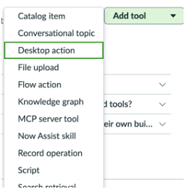

* **Bounding box:** x=82.0, y=39.0, width=204.0 pt, height=208.5 pt.
* **What is shown:** This embedded source image appears near `No nearby heading text was detected.`. It is a product screenshot, form, UI panel, dialog, wizard, table-like screen, or instructional figure supporting the same-page task. Visible objects may include windows, tabs, form fields, buttons, record lists, panes, menus, highlighted controls, and explanatory labels. Its business purpose is to reduce ambiguity for a reader following the ServiceNow AI Desktop Actions procedure. Its technical purpose is to identify the exact interface element, screen state, or control referenced by the surrounding instructions.
* **Relationships / arrows / flow / labels:** The relationships are UI relationships visible inside the screenshot: fields belong to forms, buttons trigger actions, rows belong to lists/tables, and highlighted regions identify the target. No separate network topology, architecture boundary, or security zone is labeled unless it appears explicitly in the crop.
* **Visible text captured from image:**

```text
Catalog item Addtool +
Conversational topic
Flow action v
Knowledge graph tools?
MCP servertool gir own bul.
Record operation
```

### Source page 1325 — Image 2

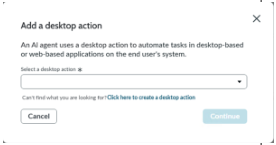

* **Bounding box:** x=316.1, y=366.1, width=216.0 pt, height=111.6 pt.
* **What is shown:** This embedded source image appears near `the Click here to create a desktop action / Select a desktop action drop-down list.`. It is a product screenshot, form, UI panel, dialog, wizard, table-like screen, or instructional figure supporting the same-page task. Visible objects may include windows, tabs, form fields, buttons, record lists, panes, menus, highlighted controls, and explanatory labels. Its business purpose is to reduce ambiguity for a reader following the ServiceNow AI Desktop Actions procedure. Its technical purpose is to identify the exact interface element, screen state, or control referenced by the surrounding instructions.
* **Relationships / arrows / flow / labels:** The relationships are UI relationships visible inside the screenshot: fields belong to forms, buttons trigger actions, rows belong to lists/tables, and highlighted regions identify the target. No separate network topology, architecture boundary, or security zone is labeled unless it appears explicitly in the crop.
* **Visible text captured from image:**

```text
satedetapete x |
sos nto ns
estos
oa -
ic
```

### Source page 1330 — Image 3


* **Bounding box:** x=82.0, y=39.0, width=204.0 pt, height=208.5 pt.
* **What is shown:** This embedded source image appears near `No nearby heading text was detected.`. It is a product screenshot, form, UI panel, dialog, wizard, table-like screen, or instructional figure supporting the same-page task. Visible objects may include windows, tabs, form fields, buttons, record lists, panes, menus, highlighted controls, and explanatory labels. Its business purpose is to reduce ambiguity for a reader following the ServiceNow AI Desktop Actions procedure. Its technical purpose is to identify the exact interface element, screen state, or control referenced by the surrounding instructions.
* **Relationships / arrows / flow / labels:** The relationships are UI relationships visible inside the screenshot: fields belong to forms, buttons trigger actions, rows belong to lists/tables, and highlighted regions identify the target. No separate network topology, architecture boundary, or security zone is labeled unless it appears explicitly in the crop.
* **Visible text captured from image:**

```text
Catalog item Addtool +
Conversational topic
Flow action v
Knowledge graph tools?
MCP servertool gir own bul.
Record operation
```

### Source page 1330 — Image 4

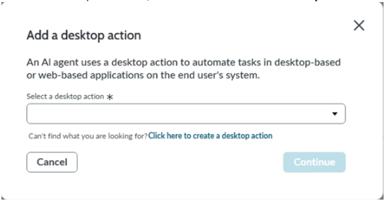

* **Bounding box:** x=82.0, y=269.0, width=432.0 pt, height=223.2 pt.
* **What is shown:** This embedded source image appears near `6. On the Add a desktop action modal, select the Click here to create a desktop action link.`. It is a product screenshot, form, UI panel, dialog, wizard, table-like screen, or instructional figure supporting the same-page task. Visible objects may include windows, tabs, form fields, buttons, record lists, panes, menus, highlighted controls, and explanatory labels. Its business purpose is to reduce ambiguity for a reader following the ServiceNow AI Desktop Actions procedure. Its technical purpose is to identify the exact interface element, screen state, or control referenced by the surrounding instructions.
* **Relationships / arrows / flow / labels:** The relationships are UI relationships visible inside the screenshot: fields belong to forms, buttons trigger actions, rows belong to lists/tables, and highlighted regions identify the target. No separate network topology, architecture boundary, or security zone is labeled unless it appears explicitly in the crop.
* **Visible text captured from image:**

```text
x
Add a desktop action
‘An Al agent uses a desktop action to automate tasks in desktop-based
or web-based applications on the end user's system.
Select a desktop action
Cant find what you are looking for? Click here to create a desktop action
```

### Source page 1331 — Image 5

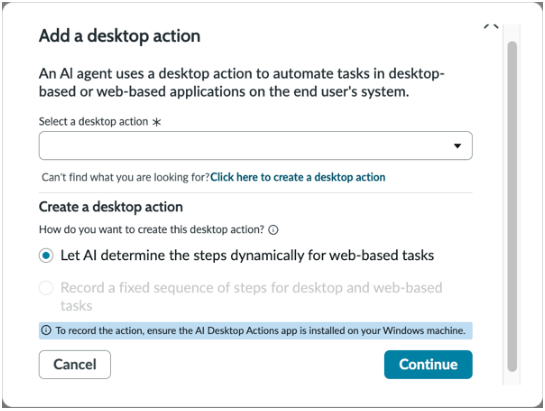

* **Bounding box:** x=82.0, y=39.0, width=432.0 pt, height=324.0 pt.
* **What is shown:** This embedded source image appears near `No nearby heading text was detected.`. It is a product screenshot, form, UI panel, dialog, wizard, table-like screen, or instructional figure supporting the same-page task. Visible objects may include windows, tabs, form fields, buttons, record lists, panes, menus, highlighted controls, and explanatory labels. Its business purpose is to reduce ambiguity for a reader following the ServiceNow AI Desktop Actions procedure. Its technical purpose is to identify the exact interface element, screen state, or control referenced by the surrounding instructions.
* **Relationships / arrows / flow / labels:** The relationships are UI relationships visible inside the screenshot: fields belong to forms, buttons trigger actions, rows belong to lists/tables, and highlighted regions identify the target. No separate network topology, architecture boundary, or security zone is labeled unless it appears explicitly in the crop.
* **Visible text captured from image:**

```text
r >
Add a desktop action “
‘An Al agent uses a desktop action to automate tasks in desktop-
based or web-based applications on the end user's system.
Selecta desktop action
Cant find what you are looking for Clichere to create a desktop ation
Create a desktop action
How do you want to create tis desktop action?
© Let Al determine the steps dynamically for web-based tasks
© ‘Torecor the ation ensure the Al Desktop Actions apps installed on your Windows machine.
n'y
```

### Source page 1334 — Image 6

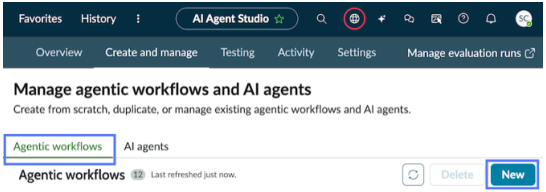

* **Bounding box:** x=112.0, y=39.0, width=432.0 pt, height=149.1 pt.
* **What is shown:** This embedded source image appears near `No nearby heading text was detected.`. It is a product screenshot, form, UI panel, dialog, wizard, table-like screen, or instructional figure supporting the same-page task. Visible objects may include windows, tabs, form fields, buttons, record lists, panes, menus, highlighted controls, and explanatory labels. Its business purpose is to reduce ambiguity for a reader following the ServiceNow AI Desktop Actions procedure. Its technical purpose is to identify the exact interface element, screen state, or control referenced by the surrounding instructions.
* **Relationships / arrows / flow / labels:** The relationships are UI relationships visible inside the screenshot: fields belong to forms, buttons trigger actions, rows belong to lists/tables, and highlighted regions identify the target. No separate network topology, architecture boundary, or security zone is labeled unless it appears explicitly in the crop.
* **Visible text captured from image:**

```text
Gam Gena Tin fan SEs Coote
Manage agentic workflows and Al agents
‘Agentic workflows 2 sn . 5
```

### Source page 1334 — Image 7

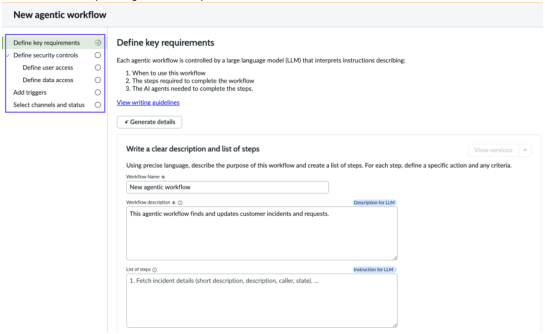

* **Bounding box:** x=82.0, y=219.6, width=432.0 pt, height=263.0 pt.
* **What is shown:** This embedded source image appears near `3. Select New to open a guided setup.`. It is a product screenshot, form, UI panel, dialog, wizard, table-like screen, or instructional figure supporting the same-page task. Visible objects may include windows, tabs, form fields, buttons, record lists, panes, menus, highlighted controls, and explanatory labels. Its business purpose is to reduce ambiguity for a reader following the ServiceNow AI Desktop Actions procedure. Its technical purpose is to identify the exact interface element, screen state, or control referenced by the surrounding instructions.
* **Relationships / arrows / flow / labels:** The relationships are UI relationships visible inside the screenshot: fields belong to forms, buttons trigger actions, rows belong to lists/tables, and highlighted regions identify the target. No separate network topology, architecture boundary, or security zone is labeled unless it appears explicitly in the crop.
* **Visible text captured from image:**

```text
New agentic workflow
=) =
poepiienll’ [le nentsarerorenn ieee
ee O| imran
Wit dscpon nd tt ot tps
```

### Source page 1335 — Image 8

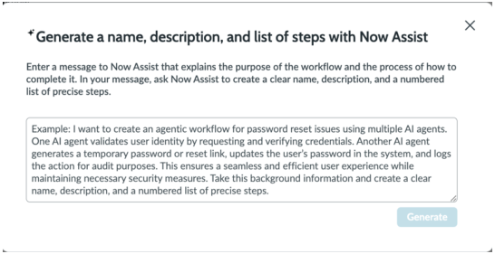

* **Bounding box:** x=112.0, y=132.7, width=432.0 pt, height=220.3 pt.
* **What is shown:** This embedded source image appears near `Unsupported model providers / 5. Optional: Select Generate details in the same page, to open a modal where Now Assist can`. It is a product screenshot, form, UI panel, dialog, wizard, table-like screen, or instructional figure supporting the same-page task. Visible objects may include windows, tabs, form fields, buttons, record lists, panes, menus, highlighted controls, and explanatory labels. Its business purpose is to reduce ambiguity for a reader following the ServiceNow AI Desktop Actions procedure. Its technical purpose is to identify the exact interface element, screen state, or control referenced by the surrounding instructions.
* **Relationships / arrows / flow / labels:** The relationships are UI relationships visible inside the screenshot: fields belong to forms, buttons trigger actions, rows belong to lists/tables, and highlighted regions identify the target. No separate network topology, architecture boundary, or security zone is labeled unless it appears explicitly in the crop.
* **Visible text captured from image:**

```text
x
*Generate a name, description, and list of steps with Now Assist
Enter a message to Now Assist that explains the purpose of the workflow and the process of how to
complete itn your message, ask Now Assist to create a clear name, description, and a numbered
lst of precise steps.
‘Example: | want to create an agentic worktiow for password reset issues using multiple Al agents.
(One Al agent validates user identity by requesting and verifying credentials. Another Al agent
generates a temporary password or reset lnk, updates the user's password in the system, and logs
the action for audit purposes. This ensure a seamless and efficient usr experience while
‘maintaining necessary securty measures. Take this background information and create a clear
name, description, and a numbered list of precise steps. J
```

### Source page 1336 — Image 9

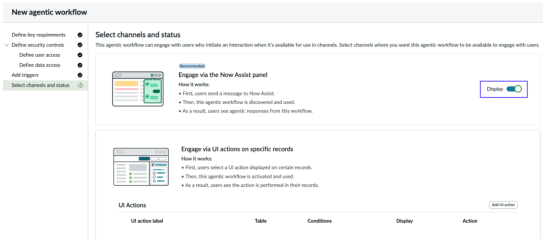

* **Bounding box:** x=112.0, y=39.0, width=432.0 pt, height=188.8 pt.
* **What is shown:** This embedded source image appears near `No nearby heading text was detected.`. It is a product screenshot, form, UI panel, dialog, wizard, table-like screen, or instructional figure supporting the same-page task. Visible objects may include windows, tabs, form fields, buttons, record lists, panes, menus, highlighted controls, and explanatory labels. Its business purpose is to reduce ambiguity for a reader following the ServiceNow AI Desktop Actions procedure. Its technical purpose is to identify the exact interface element, screen state, or control referenced by the surrounding instructions.
* **Relationships / arrows / flow / labels:** The relationships are UI relationships visible inside the screenshot: fields belong to forms, buttons trigger actions, rows belong to lists/tables, and highlighted regions identify the target. No separate network topology, architecture boundary, or security zone is labeled unless it appears explicitly in the crop.
* **Visible text captured from image:**

```text
Newsom wton
St EB Ss
seeseeneunne
```

### Source page 1337 — Image 10

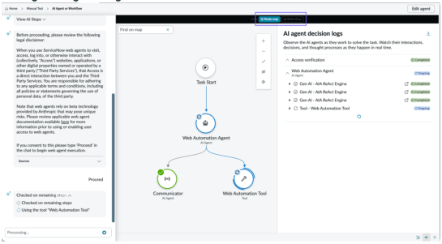

* **Bounding box:** x=102.0, y=184.3, width=432.0 pt, height=235.4 pt.
* **What is shown:** This embedded source image appears near `Note: If you don't have the roles necessary to pass the ACLs of the AI agent and all of / Testing an AI agent or agentic workflow`. It is a product screenshot, form, UI panel, dialog, wizard, table-like screen, or instructional figure supporting the same-page task. Visible objects may include windows, tabs, form fields, buttons, record lists, panes, menus, highlighted controls, and explanatory labels. Its business purpose is to reduce ambiguity for a reader following the ServiceNow AI Desktop Actions procedure. Its technical purpose is to identify the exact interface element, screen state, or control referenced by the surrounding instructions.
* **Relationships / arrows / flow / labels:** The relationships are UI relationships visible inside the screenshot: fields belong to forms, buttons trigger actions, rows belong to lists/tables, and highlighted regions identify the target. No separate network topology, architecture boundary, or security zone is labeled unless it appears explicitly in the crop.
* **Visible text captured from image:**

```text
No reliable OCR text was detected in this crop. The image asset is retained for visual verification.
```

### Source page 1338 — Image 11

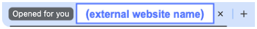

* **Bounding box:** x=112.0, y=664.9, width=291.8 pt, height=28.5 pt.
* **What is shown:** This embedded source image appears near `10. Enter Proceed. / 11. Monitor the AI agent's updates in AI Agent Studio.`. It is a product screenshot, form, UI panel, dialog, wizard, table-like screen, or instructional figure supporting the same-page task. Visible objects may include windows, tabs, form fields, buttons, record lists, panes, menus, highlighted controls, and explanatory labels. Its business purpose is to reduce ambiguity for a reader following the ServiceNow AI Desktop Actions procedure. Its technical purpose is to identify the exact interface element, screen state, or control referenced by the surrounding instructions.
* **Relationships / arrows / flow / labels:** The relationships are UI relationships visible inside the screenshot: fields belong to forms, buttons trigger actions, rows belong to lists/tables, and highlighted regions identify the target. No separate network topology, architecture boundary, or security zone is labeled unless it appears explicitly in the crop.
* **Visible text captured from image:**

```text
‘Opened for you x i+
```

### Source page 1339 — Image 12

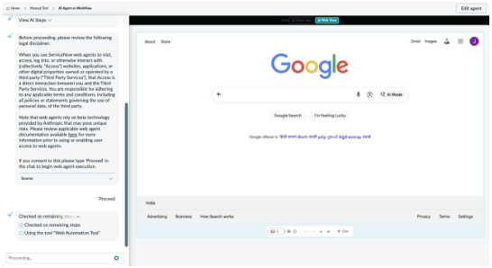

* **Bounding box:** x=112.0, y=39.0, width=432.0 pt, height=234.0 pt.
* **What is shown:** This embedded source image appears near `No nearby heading text was detected.`. It is a product screenshot, form, UI panel, dialog, wizard, table-like screen, or instructional figure supporting the same-page task. Visible objects may include windows, tabs, form fields, buttons, record lists, panes, menus, highlighted controls, and explanatory labels. Its business purpose is to reduce ambiguity for a reader following the ServiceNow AI Desktop Actions procedure. Its technical purpose is to identify the exact interface element, screen state, or control referenced by the surrounding instructions.
* **Relationships / arrows / flow / labels:** The relationships are UI relationships visible inside the screenshot: fields belong to forms, buttons trigger actions, rows belong to lists/tables, and highlighted regions identify the target. No separate network topology, architecture boundary, or security zone is labeled unless it appears explicitly in the crop.
* **Visible text captured from image:**

```text
No reliable OCR text was detected in this crop. The image asset is retained for visual verification.
```

### Source page 1339 — Image 13

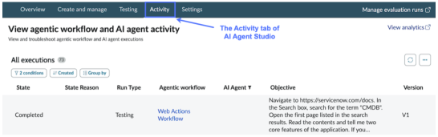

* **Bounding box:** x=72.0, y=551.6, width=432.0 pt, height=132.4 pt.
* **What is shown:** This embedded source image appears near `What to do next / View information about your test runs in the Activity tab of AI Agent Studio. The most recent test`. It is a product screenshot, form, UI panel, dialog, wizard, table-like screen, or instructional figure supporting the same-page task. Visible objects may include windows, tabs, form fields, buttons, record lists, panes, menus, highlighted controls, and explanatory labels. Its business purpose is to reduce ambiguity for a reader following the ServiceNow AI Desktop Actions procedure. Its technical purpose is to identify the exact interface element, screen state, or control referenced by the surrounding instructions.
* **Relationships / arrows / flow / labels:** The relationships are UI relationships visible inside the screenshot: fields belong to forms, buttons trigger actions, rows belong to lists/tables, and highlighted regions identify the target. No separate network topology, architecture boundary, or security zone is labeled unless it appears explicitly in the crop.
* **Visible text captured from image:**

```text
‘View agentc workflow and Al agent activ a wa
Vee agen morionyang Alagent activity nage Stade
Ateseitons 2
‘setts tne Aww AlAeY —bte von
```


---

## TABLES

### Source page 1325 — Table 1

**Nearby source context:** 5. Select or create a desktop action.

| Existing desktop action | New desktop action |
| --- | --- |
| a.Select an existing desktop action of type<br>on-screen task or background task from the<br>Select a desktop action drop-down list.<br>The background task desktop actions are<br>supported for the following applications:<br>▪Microsoft Excel<br>▪Microsoft Outlook<br>▪Microsoft Word<br>▪PDF<br>▪PowerShell Connector<br>▪SQL<br>▪SSH<br>▪SystemAction<br>b.Select Continue. | a.On the Add a desktop action modal, select<br>the Click here to create a desktop action<br>link.<br>b.Select the option Record a fixed sequence<br>of steps for desktop and web-based tasks.<br>c.Select Open AI Desktop Actions app.<br>Record or manually capture the desktop<br>action in AI Desktop Actions Windows<br>application, activate it, and then come<br>back here to add it as a tool. For more<br>information, see Defined path desktop<br>actions in AI Desktop Actions.<br>The creation process of defined desktop<br>actions ends here. |

### Source page 1326 — Table 2

**Nearby source context:** Add a desktop action form

| Fields | Description |
| --- | --- |
| Desktop action description | Read-only. Description of the desktop action<br>or application that you selected. |
| Applications | Read-only. Applications that this desktop<br>action interacts with.<br>Note: This field appears only when<br>On-screen task desktop action is<br>selected. |
| Created by | Read-only. User who created the desktop<br>action.<br>Note: This field appears only when<br>On-screen task desktop action is<br>selected. |
| Last updated | Read-only. Date when this desktop action<br>was last updated.<br>Note: This field appears only when<br>On-screen task desktop action is<br>selected. |
| Inputs | Read-only. Input parameters associated with<br>this desktop action.<br>Note: This field appears when<br>a desktop action or application is<br>selected from the list. |
| Outputs | Read-only. Output parameters associated<br>with this desktop action.<br>Note: This field appears when<br>a desktop action or application is<br>selected from the list. |
| Name | Name that you want to specify for your<br>selected desktop action. |
| Tool description | Description of the desktop action tool and<br>what it’s going to do to assist your AI agent.<br>Note: This description is sent to the<br>large language model (LLM). |

### Source page 1327 — Table 3

| Fields | Description |
| --- | --- |
| Important:<br>If you update a desktop action after mapping its inputs in AI Agent Studio, the agent<br>continues to use the previous mapping until you reopen the tool configuration and save<br>it again.<br>If you rename an input in the desktop action, the agent treats it as a new input and the<br>existing mapping for that input is removed. You must remap the renamed input before<br>the desktop action can be saved. |  |
| Step name | Read-only. The name of the step that is<br>configured to use a parameter.<br>Note: This field appears only when<br>an On-screen task desktop action with<br>inputs configured for parameters is<br>selected. |
| Description | Read-only. The description entered for the<br>step that is configured to use a parameter.<br>Note: This field appears only when<br>an On-screen task desktop action with<br>inputs configured for parameters is<br>selected. |
| Parameter record | Select the Desktop action parameter record<br>that the AI agent must use to retrieve the<br>value for this step at execution time. Mapping<br>a parameter record is required for all steps<br>before the desktop action can be saved.<br>Note: This field appears only when<br>an On-screen task desktop action with<br>inputs configured for parameters is<br>selected.<br>The same parameter record can be<br>mapped to multiple steps. Each step<br>can only be mapped to one parameter<br>record. |
| Execution mode | Mode of execution for your selected desktop<br>action:<br>◦Supervised: Inputs from your live agent<br>are required during the execution of this<br>desktop action while the AI agent runs.<br>◦Autonomous: Doesn't require any input<br>from your live agent during the execution of<br>this desktop action while the AI agent runs. |

### Source page 1328 — Table 4

| Fields | Description |
| --- | --- |
| Display output | Permission to display the output of the<br>execution in the Now Assist panel or in Virtual<br>Agent:<br>◦Yes<br>◦No<br>If you want the AI agent to work in Off Glide<br>architecture with Premium Chat experience,<br>you must turn-on the Display output toggle.<br>When the toggle is turned-on, you can add<br>widgets that can be used in assistants built<br>with Premium Chat experiences. The widget<br>configuration includes:<br>◦Widget: Defines the display output<br>to render the content in a better user<br>experience. You can select the widget from<br>the drop-down.<br>◦Require widget transformation: An<br>additional LLM call is required to transform<br>the raw tool. If you choose to skip this<br>transformation step, the tool output will be<br>directly mapped to the widget.<br>▪Yes<br>▪No<br>◦Display refined widget message: Refines<br>the widget message when configured.<br>▪Yes<br>▪No<br>Note: The display output as a<br>toggle is exclusively available for the<br>Premium Chat experience when the<br>Off Glide Conversation Server plugin<br>(com.glide.cs.offglide) is installed. If the<br>plugin is not installed, you will continue<br>to access the standard display output<br>options. |
| Advanced settings |  |
| Select an output transformation format | Style for the LLM to present the results as<br>it passes information between tools and to<br>other agents. Out transformation formats:<br>◦None<br>◦Concise<br>◦Paragraph<br>◦Summary<br>◦Custom |

### Source page 1329 — Table 5

| Fields | Description |
| --- | --- |
| Write processing messages for users | Message to display to users during tool<br>execution.<br>◦In-progress message: Write an in-progress<br>message to be displayed to end-users<br>while the tool is running.<br>◦Completion message: Write a completion<br>message to be displayed to end-users<br>once the tool finishes running. |

### Source page 1331 — Table 6

**Nearby source context:** 8. Select Continue / 9. On the form, fill in the fields.

| Field | Description |
| --- | --- |

### Source page 1332 — Table 7

| Field | Description |
| --- | --- |

### Source page 1333 — Table 8

| Field | Description |
| --- | --- |

### Source page 1334 — Table 9

**Nearby source context:** 3. Select New to open a guided setup. / 4. On the Define key requirements page, fill in the fields.

| Field | Description |
| --- | --- |

### Source page 1335 — Table 10

| Field | Description |
| --- | --- |


---

## FIGURES

| Figure / visual | Source page | Asset or location | Analysis |
|---|---:|---|---|
| Embedded screenshot or instructional image 1 | 1325 | `_assets/p1325_image01.png` | Detailed image analysis and OCR text are provided in IMAGE DESCRIPTIONS. |
| Embedded screenshot or instructional image 2 | 1325 | `_assets/p1325_image02.png` | Detailed image analysis and OCR text are provided in IMAGE DESCRIPTIONS. |
| Embedded screenshot or instructional image 3 | 1330 | `_assets/p1330_image01.png` | Detailed image analysis and OCR text are provided in IMAGE DESCRIPTIONS. |
| Embedded screenshot or instructional image 4 | 1330 | `_assets/p1330_image02.png` | Detailed image analysis and OCR text are provided in IMAGE DESCRIPTIONS. |
| Embedded screenshot or instructional image 5 | 1331 | `_assets/p1331_image01.png` | Detailed image analysis and OCR text are provided in IMAGE DESCRIPTIONS. |
| Embedded screenshot or instructional image 6 | 1334 | `_assets/p1334_image01.png` | Detailed image analysis and OCR text are provided in IMAGE DESCRIPTIONS. |
| Embedded screenshot or instructional image 7 | 1334 | `_assets/p1334_image02.png` | Detailed image analysis and OCR text are provided in IMAGE DESCRIPTIONS. |
| Embedded screenshot or instructional image 8 | 1335 | `_assets/p1335_image01.png` | Detailed image analysis and OCR text are provided in IMAGE DESCRIPTIONS. |
| Embedded screenshot or instructional image 9 | 1336 | `_assets/p1336_image01.png` | Detailed image analysis and OCR text are provided in IMAGE DESCRIPTIONS. |
| Embedded screenshot or instructional image 10 | 1337 | `_assets/p1337_image01.png` | Detailed image analysis and OCR text are provided in IMAGE DESCRIPTIONS. |
| Embedded screenshot or instructional image 11 | 1338 | `_assets/p1338_image01.png` | Detailed image analysis and OCR text are provided in IMAGE DESCRIPTIONS. |
| Embedded screenshot or instructional image 12 | 1339 | `_assets/p1339_image01.png` | Detailed image analysis and OCR text are provided in IMAGE DESCRIPTIONS. |
| Embedded screenshot or instructional image 13 | 1339 | `_assets/p1339_image02.png` | Detailed image analysis and OCR text are provided in IMAGE DESCRIPTIONS. |
| Markdown-converted table/grid 1 | 1325 | TABLES section | Source table/grid region converted into Markdown; nearby context: 5. Select or create a desktop action. |
| Markdown-converted table/grid 2 | 1326 | TABLES section | Source table/grid region converted into Markdown; nearby context: Add a desktop action form |
| Markdown-converted table/grid 3 | 1327 | TABLES section | Source table/grid region converted into Markdown; nearby context:  |
| Markdown-converted table/grid 4 | 1328 | TABLES section | Source table/grid region converted into Markdown; nearby context:  |
| Markdown-converted table/grid 5 | 1329 | TABLES section | Source table/grid region converted into Markdown; nearby context:  |
| Markdown-converted table/grid 6 | 1331 | TABLES section | Source table/grid region converted into Markdown; nearby context: 8. Select Continue / 9. On the form, fill in the fields. |
| Markdown-converted table/grid 7 | 1332 | TABLES section | Source table/grid region converted into Markdown; nearby context:  |
| Markdown-converted table/grid 8 | 1333 | TABLES section | Source table/grid region converted into Markdown; nearby context:  |
| Markdown-converted table/grid 9 | 1334 | TABLES section | Source table/grid region converted into Markdown; nearby context: 3. Select New to open a guided setup. / 4. On the Define key requirements page, fill in the fields. |
| Markdown-converted table/grid 10 | 1335 | TABLES section | Source table/grid region converted into Markdown; nearby context:  |


---

## QUALITY ASSURANCE NOTES

* PAGES REVIEWED: 1322, 1323, 1324, 1325, 1326, 1327, 1328, 1329, 1330, 1331, 1332, 1333, 1334, 1335, 1336, 1337, 1338, 1339, 1340. Source page range: 1322-1340 (shared boundary pages split at source headings).
* IMAGES REVIEWED: 31 image blocks assigned/reviewed: 18 recurring header logo block(s), 0 small icon/pictogram block(s), and 13 large screenshot/diagram crop(s).
* TABLES REVIEWED: 10 table/grid region(s) converted to Markdown. Table pages: 1325, 1326, 1327, 1328, 1329, 1331, 1332, 1333, 1334, 1335.
* FIGURES REVIEWED: 13 large screenshot/diagram figure(s) plus 10 table/grid visual(s).
* OCR ISSUES FOUND: No unresolved OCR issues were identified in the main text layer after cleanup. 2 large image crop(s) produced no reliable image OCR text; original crop assets are retained for direct visual verification.
* OCR ISSUES CORRECTED: Removed recurring footer/page-number noise from the main content stream, normalized nonbreaking spaces and soft-hyphen/control artifacts, preserved bullets/numbering/property names, converted detected tables to Markdown, and OCR-processed large non-logo embedded images.
* SECTION MAPPING NOTES: Folder name is exactly `AI Desktop Actions`. File name and subsection name are exactly `Create AI agents` from the TOC. Shared source pages were split at heading coordinates from the PDF text layer.
* PAGE FOOTERS REVIEWED: Reviewed recurring ServiceNow copyright/trademark footer and logical page numbers. Footer text reviewed: `© 2026 ServiceNow, Inc. All rights reserved. ServiceNow, the ServiceNow logo, Now, and other ServiceNow marks are trademarks and/or registered trademarks of ServiceNow, Inc., in the United States and/or other countries. Other company names, product names, and logos may be trademarks of the respective companies with which they are associated.`
* RECHECK PASSES COMPLETED: 12/12: page completeness, text extraction, table extraction, image extraction, diagram interpretation, section mapping, subsection mapping, file names, folder names, Markdown formatting, missed-content review, and OCR/text-layer cleanup.
* VERIFICATION ARTIFACTS: Large image crops and `image_inventory.csv` are stored in the `_assets` folder inside this section folder.
