# Design defined-path desktop actions

## SOURCE INFORMATION

* SECTION NAME: AI Desktop Actions
* SUBSECTION NAME: Design defined-path desktop actions
* SOURCE FILE NAME: AI Desktop Actions.pdf
* PAGE RANGE: 1281-1322 (shared boundary pages split at source headings)
* EXTRACTION DATE: 2026-06-17

---

# CONTENT

> Source page: 1281

### Defined path desktop actions in AI Desktop Actions

Desktop actions enable you to automate repetitive tasks on your desktop and web applications.
This capability helps you streamline repetitive tasks, improve efficiency, and integrate desktop
application workflows into your ServiceNow processes.
Desktop actions are tools that AI agents use to interact with web and desktop applications.
When you configure an AI agent and select desktop action as a tool, you define whether the
AI agent follows a defined path (fixed steps designed in AI Desktop Actions) or an adaptive
path (high-level goal described in the tool configuration). Unlike adaptive path desktop actions
that dynamically plan execution, defined path desktop actions enable AI agents to execute
preconfigured workflows through a fixed sequence of steps.

#### Types of defined desktop actions

AI agents use these desktop actions to interact with desktop applications, perform UI-based
tasks, and automate end-to-end workflows. There are two types of desktop actions that can be
added as tools to AI agents:
On-screen task
These desktop actions help you simulate humans interacting with UI elements
on your thick client applications, legacy systems, or SaaS applications without
APIs. These actions include clicking buttons, typing into text boxes, selecting from
dropdown menus, and more. These desktop actions make it easier to automate
repetitive tasks. They encapsulate repeatable UI interactions, such as screens,
anchors, and steps. You can create, manage, and test your desktop actions using
the no-code Design workspace.
Example: Filling in fields on a payroll application, updating inventory in a point-of-
sale system, or submitting a request through a desktop insurance claims app.

> Source page: 1282

You can access and view the existing desktop actions in the ServiceNow instance
by navigating to All > AI Desktop Actions > Desktop Actions. You can see the
details of related desktop action applications, AI agents, and desktop action
execution records for on-screen task, and AI agents and desktop action execution
records for background desktop actions.
Background task
These desktop actions include prebuilt connectors that enable your AI agents
to interact with various applications and system components in the background.
These connectors streamline automation by offering actions for common tasks,
reducing the need for complex scripting. Each connector focuses on a specific
application or system area, providing a collection of related methods. You can't
create background task desktop actions.
Example: Reading data from Microsoft Excel, extracting emails from Microsoft
Outlook, generating a PDF, compressing files into a ZIP, fetching records from a
database, or sending a system notification.
Background task desktop actions are supported for the following applications:

#### Note: For the AI agents to perform Background task automations, the

following applications must already be installed on the end-user's system.
Application
Description
Microsoft Excel
Enables AI agents to perform standard actions on
the Microsoft Excel documents. For example, data
manipulation, content modification, and information
retrieval from spreadsheets.
The following methods are supported:
• ReadData
• WriteData
• FindAndReplace

#### Note: CSV and password-protected files aren't

supported.
Microsoft Outlook
Enables AI agents to perform standard actions on the
Microsoft Outlook application. For example, you can
automate sending or replying to emails.
The following methods are supported:
• DeleteMail
• ForwardMail
• GetMailsFromFolder
• MoveMail
• Reply
• SaveAllAttachments
• SendMail
• GetMail

> Source page: 1283

Application
Description
• MarkAsRead
• MarkAsUnread

#### Note: Only the classic view is supported. Shared

inboxes aren’t supported.
Microsoft Word
Enables AI agents to perform standard actions on
the Microsoft Word documents. For example, you can
replace text in a document.
The following methods are supported:
• GetText
• InsertText
• ReplaceText

#### Note: Password-protected files aren't supported.

PDF
Enables AI agents to perform standard actions on the
PDF documents. For example, extracting text, converting
to Excel or Images, and merging and spiting files.
The following methods are supported:
• GetText
• ConvertToExcel
• ConvertToImages
• Merge
• Split

#### Note: Password-protected files aren't supported.

You can't manipulate e-signed PDFs such as
performing merge and split. This action corrupts
the PDF files.
PowerShell
Enables AI agents to execute PowerShell commands
and scripts and returns the results.
The following methods are supported:
• InvokeCommand
• InvokeScript

#### Note: Each PowerShell step runs in a new

session. Output from one step isn’t carried over to
the next step.
SQL
Enables AI agents to execute custom SQL queries
against supported databases (MSSQL, ORACLE,
MYSQL, OLEDB, ODBC) and returns results as JSON.

> Source page: 1284

Application
Description
The following method is supported:
ExecuteQuery
Secure Shell (SSH)
Enables AI agents to securely connect to remote
servers to run SSH commands and scripts; and returns
the execution results. This connector supports non-
interactive commands.
The following method is supported:
RunCommand

#### Note: Each SSH step runs in a new session.

Output from one step isn’t carried over to the next
step.
System Actions
Enables AI agents to perform standard Windows system
operations. For example, starting an app, creating a ZIP
file, or deleting any file or folder.
The following methods are supported:
• StartApp
• Terminate
• DateTimeNow
• SetEnvironmentVariable
• GetEnvironmentVariable
• CopyFileOrFolder
• DeleteFileOrFolder
• WriteToFile
• ReadFromFile
• GetFilesFromFolder
• ExtractFile
• CreateZip

#### Ways to create desktop actions

#### Note: If your automation requires manual inputs, such as entering an OTP or CAPTCHA,

you must provide instructions to the AI Agent to wait for user input during execution.
Otherwise, the automation can't proceed.
You can create on-screen desktop actions in the following ways:
Auto-capture screens and steps
With Action recorder, you can record your interactions with desktop applications
to create automated workflows. It records every step you take, including clicks,
keystrokes, and data entry, along with visual and contextual information. By
recording steps, you can automate tasks that replicate your interactions. You can

> Source page: 1285

save the recorded screens and steps as a reusable desktop action. For more
information, see Action recorder in AI Desktop Actions.
Manually capture screens and steps
You can manually take a screen capture, add anchors and steps to automate a
series of steps you perform on your computer, such as clicking buttons, typing text,
or interacting with different applications, and then save this sequence as a reusable
desktop action.

#### Benefits of desktop actions

• Eliminate manual effort by automating repetitive tasks for frequent desktop activities.
• Execute complex sequences of steps quickly and consistently.
• Connect desktop application processes with your broader ServiceNow automations.
• Standardize task execution to minimize human error.
• You can record steps directly on your desktop applications.
• Automate tasks that span across multiple desktop applications.
• Save recorded sequences as desktop actions to use them in various automations.
• Review, rearrange, edit, or delete individual steps within a recorded action.

#### How the Design workspace works

Record steps
Capture your interactions with desktop applications, including clicks, text input, and
screen navigation.
Define steps
Specify individual steps like Click, Set Text, or Get Text to interact with elements on
your screen.
Application details
Select and store the desktop applications involved in your automations in the
Details tab.
Organize screens
Structure your recorded steps by application screens, making it easy to review and
edit.
Save and publish
Store your desktop actions in your ServiceNow instance for reuse and deployment.

#### What you can automate

Desktop actions support a wide range of desktop application interactions, including:
• Entering data into forms.
• Extracting information from applications.
• Navigating through application menus and screens.
• Performing steps like saving files or generating reports.
• Transferring data between different desktop applications.

> Source page: 1286

Related topics
AI Desktop Actions Design workspace
Action recorder in AI Desktop Actions
Automate repetitive tasks by auto-capturing steps in AI Desktop Actions
Extend a desktop action by manually capturing steps in AI Desktop Actions
Add details to desktop actions in AI Desktop Actions
Test and activate a desktop action in AI Desktop Actions
Add a defined desktop action tool to an AI agent for desktop and web-based task

#### Automate repetitive tasks by recording steps with AI in AI Desktop Actions

Create desktop actions by recording steps with AI to automate repetitive tasks in AI Desktop
Actions. AI validates anchor positions and generates screen contexts automatically after
recording, reducing the risk of automation failures at runtime.
Before you begin
Familiarize yourself with the Design workspace and Action recorder. For more information, see AI
Desktop Actions Design workspace and Action recorder in AI Desktop Actions.
To access the AI Desktop Actions functionality, perform the following steps:
• Enable AI Desktop Actions on your ServiceNow instance. For more information, see Configure
AI Desktop Actions.
• Download the AI Desktop Actions installer to automate repetitive tasks across applications and
systems. For more information, see Download AI Desktop Actions installer.
Confirm that the following system requirements are met:
• Windows 11 operating system is used.
• A .NET 9.0 runtime v9.0.10 and .NET 9 Desktop Runtime v9.0.10 is installed.
• No extended monitors are connected.
• Theme must match between the systems used for recording and execution.
• The ServiceNow AI Lens skill must be active on your instance. Contact your ServiceNow
administrator if you're unsure whether this condition is met.
Role required: sn_desktop_core.desktop_action_user
About this task
Record with AI generates more accurate anchor positions automatically, reducing the time you
spend on manual anchor adjustments.
When you record with AI, after you finish recording, AI analyzes the recording, validates anchor
positions, and corrects inaccuracies before you save or activate the desktop action. AI also
generates a screen context for each captured screen and description for the desktop action.
Screen context is a description of what the screen does and what it contains, which helps
reviewers and AI agents understand the screen's intent.

#### Note: If your automation requires manual inputs, such as entering an OTP or CAPTCHA,

you must provide instructions to the AI Agent to wait for the user input during execution.
Otherwise, the automation can't proceed.

> Source page: 1287

The sn_desktop_core.record_with_ai property is enabled by default, making Record
with AI the default recording option. Turn off this property to set the manual recorder as the
default recording option.
Procedure
1. From your Windows system, launch the AI Desktop Actions application.
2. On the login page, in the Add ServiceNow URL field, enter the ServiceNow instance URL.
Example
For example, https://<instance name>.service-now.com.
3. Select Proceed.
4. Log in to your ServiceNow account by entering your user name and password.
Your must have the sn_aia.admin role.

> Source page: 1288

5. Optional: On the onboarding journey modal, complete the onboarding and select Get started.
If you launch the AI Desktop Actions for the first time, the onboarding journey widget appears.
You can select Don't show me again to hide the widget the next time you launch AI Desktop
Actions or Skip intro to skip the onboarding.
6. On the AI Desktop Actions home page, select Create desktop action.

> Source page: 1289

7. In the Create Desktop Action dialog, keep the Record with AI (recommended) check box
selected.

#### Important: If the Record with AI (recommended) check box is unavailable, the

ServiceNow AI Lens is inactive on your instance. Contact your ServiceNow administrator
to enable it. You can still create desktop actions using auto-capture mode.

> Source page: 1290

8. Enter a name for the desktop action.
9. Select Continue.
10. In the modal, review the tips and select Open recorder to begin.
The AI Desktop Actions window is minimized and the Action recorder panel is launched. You
can freely drag and reposition the Action recorder panel anywhere on your desktop screen.

> Source page: 1291

11. Open the applications that you want to record steps for.
12. From the Action recorder panel, select Start recording.

#### Important: Before you start recording, review the tips for accurate capturing of anchors

and steps. For more information, see Tips for accurate recording.
You will see a "Recording started" message on the Action recorder panel. You can select any of
the following options when needed from the More options menu:
  ◦Pause: Skip recording steps
  ◦Restart: Restart recording the steps
You will lose the recorded screens and steps.
  ◦Discard: Discard the recording if it doesn't meet your needs
13. Perform the steps that you want to automate.
Each step that you perform is captured sequentially and the type of UI action is displayed for
each step. For example, Capturing Mouse Left Click event.
You can capture maximum of 50 steps using the recorder in a recording session. While auto-
capturing steps, a counter displays the remaining number of steps you can capture using the
recorder (for example, "35 of 50 max"). Recording stops automatically after you capture 50
steps. If you must capture additional steps, start a new recording session. The new recording
adds screens and steps to those captured in the previous recording.
14. After you're done with all the steps, select End recording on the Action recorder panel.
You will see the "Draft workflow saved" message on the Action recorder panel.
AI processes the recording in three stages:
a. Analyzing your recording with AI
b. Inserting anchors
c. Generating screen contexts
You must not close the application during processing.
The recorded steps are displayed as screenshots in the Design workspace with anchors and
steps automatically added.
15. When the AI analysis complete banner appears, review the AI-generated anchors and
screen contexts.

#### Note: If two applications in the frame have similar logos or visual elements, verify

that the anchor position is unique to the target application to avoid incorrect element
identification during automation.
Anchors and screen context generated by AI are marked with an AI badge in the properties
panel. For each screen, review the screen context and edit it if needed.

> Source page: 1292

AI badge for screens in the properties panel
AI badge for anchors in the properties panel

#### Note: The accuracy of AI-generated anchors depends on the application's accessibility,

performance, and UI complexity. Always review before activating.
16. Optional: To regenerate the screen context and anchor position for a specific screen, select
Retry
in the screen properties panel.
17. Review the sequence of captured screens and adjust if necessary.
You can adjust the sequence by dragging the screens in the Screens and steps panel.
18. Review and adjust steps.
You can modify the sequence by adding, removing, or dragging steps.

> Source page: 1293

a. From the Anchor control menu, select the Add step icon
.
b. Select the type of step to perform for this step from the contextual menu.
Description of the actions
Goal
Step
Type
Example
Enter text in a field
Set Text
Input
Enter any text data
such as a user name,
an address, a survey
response, or in any
situation where text
entry is accepted.

#### Note: If you

set a static
value for this
field, the
automation
uses it during
execution and
doesn’t prompt
you for input
from the Now
Assist panel.
Simulate a mouse
Click
Input
Click a button, open
click
a menu, or perform
any step typically

> Source page: 1294

Goal
Step
Type
Example
performed by a
mouse click.
Simulate an
Mouse Click
Input
Perform various
alternative mouse
mouse device
action (for example,
actions, such as
right-click, drag,
right-click and select
scroll, or paste)
an object or scroll on
a web page.
Simulate a key press
Send Keys
Input
Perform keyboard
or a key function
shortcuts, such
as copying text
by entering Ctrl
+ C on fields and
elements.

#### Note: If you

set a static
value for this
field, the
automation
uses it during
execution and
doesn’t prompt
you for input
from the Now
Assist panel.
Capture text from a
Get Text
Output
Receive text from the
window or web page
source area.
Capture a table
Get Table
Output
Receive table from
the source area
when the text is in
the table format.

#### Note: For the

step to capture
table data
successfully,
the data must
already be
in the table
form. The step
can’t convert
ordinary text to
table data.
Read text from an
OCR Read Text
Output
Recognize text from
image
images and return it
in the standard text
format.
You can add multiple steps representing your automation steps.

> Source page: 1295

19. Configure the properties for added screens, anchors, and steps in the Properties panel.
For more information, see Screen, anchor, and step properties in AI Desktop Actions.
20. Optional: Modify the auto-generated names for all added screens, anchors, and steps.
(Optional) You can modify the auto-generated names following these naming guidelines.
  ◦Name fields must not be empty.
  ◦Name fields must contain only alphanumeric characters. Spaces and special characters are
not permitted.
  ◦Each name must be unique at its respective parent level.
▪Each screen must have a unique name at the desktop-action level.
▪Each anchor must have a unique name at the screen level.
▪Each step must have a unique name at the anchor level.
What to do next
1. Configure the details of your desktop action. For more information, see Add details to desktop
actions in AI Desktop Actions.
2. Test and activate the desktop action so that it can be added as a tool to AI agents. For more
information, see Test and activate a desktop action in AI Desktop Actions.
3. Add the desktop action as a tool to AI agents in AI Agent Studio. For more information, see Add
a defined desktop action tool to an AI agent for desktop and web-based task.
Related topics
AI Desktop Actions Design workspace
Action recorder in AI Desktop Actions
Screen, anchor, and step properties in AI Desktop Actions
Automate repetitive tasks by auto-capturing steps in AI Desktop Actions
Extend a desktop action by manually capturing steps in AI Desktop Actions
Add a defined desktop action tool to an AI agent for desktop and web-based task
Examples of creating desktop actions
Examples of executing desktop actions using AI agents

#### Automate repetitive tasks by auto-capturing steps in AI Desktop Actions

Create desktop actions by auto-capturing steps to automate repetitive tasks in AI Desktop
Actions. You can save the steps that you perform on the application elements as a reusable
desktop action of type on-screen task.
Before you begin
To access the AI Desktop Actions functionality, perform the following steps:
• Enable AI Desktop Actions on your ServiceNow instance. For more information, see Configure
AI Desktop Actions.
• Download the AI Desktop Actions installer to automate repetitive tasks across applications and
systems. For more information, see Download AI Desktop Actions installer.
Confirm that the following system requirements are met:

> Source page: 1296

• Windows 11 operating system is used.
• A .NET 9.0 runtime v9.0.10 and .NET 9 Desktop Runtime v9.0.10 is installed.
• No extended monitors are connected.
• Theme must match between the systems used for recording and execution.
Familiarize yourself with the Design workspace and Action recorder. For more information, see AI
Desktop Actions Design workspace and Action recorder in AI Desktop Actions.
Role required: sn_aia.admin
About this task

#### Note: To create desktop actions with AI-assisted anchor validation and automatic screen

context generation, use Record with AI instead.
You can record steps that you want to automate for desktop and web applications and save
them as desktop actions of type on-screen task that AI agents can simulate while executing
automations.
With Action recorder, you can record every step you perform on desktop applications, including
clicks, keystrokes, and data entry, along with visual and contextual information. This detailed
recording of steps allows automated tasks to reliably replicate your interactions.

#### Note: If your automation requires manual inputs, such as entering an OTP or CAPTCHA,

you must provide instructions to the AI Agent to wait for the user input during execution.
Otherwise, the automation can't proceed.
Procedure
1. From your Windows system, launch the AI Desktop Actions application.
2. On the login page, in the Add ServiceNow URL field, enter the ServiceNow instance URL.
Example
For example, https://<instance name>.service-now.com.

> Source page: 1297

3. Select Proceed.
4. Log in to your ServiceNow account by entering your user name and password.
Your must have the sn_aia.admin role.
5. Optional: On the onboarding journey modal, complete the onboarding and select Get started.

> Source page: 1298

If you launch the AI Desktop Actions for the first time, the onboarding journey widget appears.
You can select Don't show me again to hide the widget the next time you launch AI Desktop
Actions or Skip intro to skip the onboarding.
6. On the AI Desktop Actions home page, select Create desktop action.
7. In the Create Desktop Action dialog, clear the Record with AI (recommended) check box.

> Source page: 1299

8. Enter a name and description for the desktop action.
9. Select Continue.
10. In the modal, review the tips and select Open recorder to begin.
The AI Desktop Actions window is minimized and the Action recorder panel is launched. You
can freely drag and reposition the Action recorder panel anywhere on your desktop screen.

> Source page: 1300

11. Open the applications that you want to record steps for.
12. From the Action recorder panel, select Start recording.

#### Important: Before you start recording, review the tips for accurate capturing of anchors

and steps. For more information, see Tips for accurate recording.
You will see a "Recording started" message on the Action recorder panel. You can select any of
the following options when needed from the More options menu:
  ◦Pause: Skip recording steps
  ◦Restart: Restart recording the steps
You will lose the recorded screens and steps.
  ◦Discard: Discard the recording if it doesn't meet your needs
13. Perform the steps that you want to automate.
Each step that you perform is captured sequentially and the type of UI action is displayed for
each step. For example, Capturing Mouse Left Click event.
You can capture maximum of 50 steps using the recorder in a recording session. While auto-
capturing steps, a counter displays the remaining number of steps you can capture using the
recorder (for example, "35 of 50 max"). Recording stops automatically after you capture 50
steps. If you must capture additional steps, start a new recording session. The new recording
adds screens and steps to those captured in the previous recording.
14. After you're done with all the steps, select End recording on the Action recorder panel.
You will see the "Draft workflow saved" message on the Action recorder panel.
The recorded steps are displayed as screenshots in the Design workspace with anchors and
steps automatically added.
15. Review the sequence of captured screens and adjust if necessary.
You can adjust the sequence by dragging the screens in the Screens and steps panel.
16. Review the location of anchors and adjust as necessary.

#### Note: If two applications in the frame have similar logos or visual elements, verify

that the anchor position is unique to the target application to avoid incorrect element
identification during automation.
The auto-anchoring accuracy depends on the application's accessibility, performance, and UI
complexity.
17. Review and adjust steps.
You can modify the sequence by adding, removing, or dragging steps.

> Source page: 1301

a. From the Anchor control menu, select the Add step icon
.
b. Select the type of step to perform for this step from the contextual menu.
Description of the actions
Goal
Step
Type
Example
Enter text in a field
Set Text
Input
Enter any text data
such as a user name,
an address, a survey
response, or in any
situation where text
entry is accepted.

#### Note: If you

set a static
value for this
field, the
automation
uses it during
execution and
doesn’t prompt
you for input
from the Now
Assist panel.
Simulate a mouse
Click
Input
Click a button, open
click
a menu, or perform
any step typically

> Source page: 1302

Goal
Step
Type
Example
performed by a
mouse click.
Simulate an
Mouse Click
Input
Perform various
alternative mouse
mouse device
action (for example,
actions, such as
right-click, drag,
right-click and select
scroll, or paste)
an object or scroll on
a web page.
Simulate a key press
Send Keys
Input
Perform keyboard
or a key function
shortcuts, such
as copying text
by entering Ctrl
+ C on fields and
elements.

#### Note: If you

set a static
value for this
field, the
automation
uses it during
execution and
doesn’t prompt
you for input
from the Now
Assist panel.
Capture text from a
Get Text
Output
Receive text from the
window or web page
source area.
Capture a table
Get Table
Output
Receive table from
the source area
when the text is in
the table format.

#### Note: For the

step to capture
table data
successfully,
the data must
already be
in the table
form. The step
can’t convert
ordinary text to
table data.
Read text from an
OCR Read Text
Output
Recognize text from
image
images and return it
in the standard text
format.
You can add multiple steps representing your automation steps.

> Source page: 1303

18. Configure the properties for added screens, anchors, and steps in the Properties panel.
For more information, see Screen, anchor, and step properties in AI Desktop Actions.
19. Optional: Modify the auto-generated names for all added screens, anchors, and steps.
(Optional) You can modify the auto-generated names following these naming guidelines.
  ◦Name fields must not be empty.
  ◦Name fields must contain only alphanumeric characters. Spaces and special characters are
not permitted.
  ◦Each name must be unique at its respective parent level.
▪Each screen must have a unique name at the desktop-action level.
▪Each anchor must have a unique name at the screen level.
▪Each step must have a unique name at the anchor level.
What to do next
1. Configure the details of your desktop action. For more information, see Add details to desktop
actions in AI Desktop Actions.
2. Test and activate the desktop action so that it can be added as a tool to AI agents. For more
information, see Test and activate a desktop action in AI Desktop Actions.
3. Add the desktop action as a tool to AI agents in AI Agent Studio. For more information, see Add
a defined desktop action tool to an AI agent for desktop and web-based task.
Related topics
AI Desktop Actions Design workspace
Action recorder in AI Desktop Actions
Automate repetitive tasks by recording steps with AI in AI Desktop Actions
Screen, anchor, and step properties in AI Desktop Actions
Extend a desktop action by manually capturing steps in AI Desktop Actions
Add a defined desktop action tool to an AI agent for desktop and web-based task
Examples of creating desktop actions
Examples of executing desktop actions using AI agents

#### Extend a desktop action by manually capturing steps in AI Desktop Actions

Extend the automation logic in a desktop action by manually capturing steps in AI Desktop
Actions.
Before you begin
To access the AI Desktop Actions functionality, perform the following steps:
• Enable AI Desktop Actions on your ServiceNow instance. For more information, see Configure
AI Desktop Actions.
• Download the AI Desktop Actions installer to automate repetitive tasks across applications and
systems. For more information, see Download AI Desktop Actions installer.
Confirm that the following system requirements are met:
• Windows 11 operating system is used.
• A .NET 9.0 runtime v9.0.10 and .NET 9 Desktop Runtime v9.0.10 is installed.

> Source page: 1304

• No extended monitors are connected.
• Theme must match between the systems used for recording and execution.
• Remote Desktop must be enabled on your machine and your account must be granted
Remote Desktop access permissions before you start using the AI Desktop Actions Execution
workspace.
Familiarize yourself with the Design workspace and Action recorder. For more information, see AI
Desktop Actions Design workspace and Action recorder in AI Desktop Actions.
Role required: sn_aia.admin
About this task

#### Note: To create desktop actions with AI-assisted anchor validation and automatic screen

context generation, use Record with AI instead.
You can simulate a user interaction in an automation by manually capturing screens and defining
steps.
Using the controls in the window, you can capture an area of an application window. You can
then set one or more anchors, and define steps that represent the user interactions in that
window.
• Anchor: Anchors help specify the target area for the interaction by defining a static area from
which steps can be defined at a relative distance.
• Step: Steps are your sequential interactions of type click, select, type, scroll, and more.

#### Note: If your automation requires manual inputs, such as entering an OTP or CAPTCHA,

you must provide instructions to the AI Agent to wait for the user input during execution.
Otherwise, the automation can't proceed.
Procedure
1. From your Windows system, launch the AI Desktop Actions application.
2. On the login page, in the Add ServiceNow URL field, enter the ServiceNow instance URL.
Example
For example, https://<instance name>.service-now.com.

> Source page: 1305

3. Select Proceed.
4. Log in to your ServiceNow account by entering your user name and password.
Your must have the sn_aia.admin role.
5. Optional: On the onboarding journey modal, complete the onboarding and select Get started.

> Source page: 1306

If you launch the AI Desktop Actions for the first time, the onboarding journey widget appears.
You can select Don't show me again to hide the widget the next time you launch AI Desktop
Actions or Skip intro to skip the onboarding.
6. On the AI Desktop Actions home page, select an existing desktop action.
The Design workspace is displayed.

> Source page: 1307

7. Capture screens.
a. In the Design tab, select the Capture Options icon
.
b. Select Manual capture.
You can also extend the desktop action logic using the Record with AI (Recommended) or
Auto capture with recorder options. For more information, see Automate repetitive tasks
by recording steps with AI in AI Desktop Actions and Automate repetitive tasks by auto-
capturing steps in AI Desktop Actions.
The AI Desktop Actions window is minimized and the Capture panel is launched.

> Source page: 1308

c. Open the applications that you want to automate steps for.
d. Capture the area of the external application’s window by selecting the Select icon
on the
Capture panel or pressing the Ctrl + Shift + C on the keyboard.

#### Note: If the Ctrl + Shift + C shortcut conflicts with another application on the

your machine, such as Zoom, then you must use the Select button to initiate manual
screen capture.
For example, you can capture the area surrounding a button or a text field in a web browser.
The cursor icon changes to the
icon.
e. Drag the
icon and select the required screen area.
When you leave the
icon, the selected area is captured as a screenshot in the Design
workspace.
If you aren't satisfied with the captured screen, you can recapture the screen area by
selecting the Capture image icon
.
8. Insert anchors.

> Source page: 1309

a. Insert an anchor on the captured screen by selecting the Add anchor icon
.

#### Note: If two applications in the frame have similar logos or visual elements, verify

that the anchor position is unique to the target application to avoid incorrect element
identification during automation.
An anchor is a reference point on the screen that helps the automation identify and interact
with a nearby UI elements. During execution, the system uses computer vision to locate the
anchor and then identifies the UI elements at a related distance from the anchor. Anchors
improve the stability and accuracy of steps when the target element’s location may shift or
when the UI layout varies across sessions.

#### Note: Don't use dynamically changing UI elements as anchors. If an element changes

its color, text, or state after an action (for example, after a click), select a different
anchor that remains static on the screen.
b. Move the anchor to a part of the captured image that won’t change.
For example, move the anchor to a title or field label.
If the area under the anchor doesn’t exactly match the corresponding area of the captured
image, the anchor isn't recognized, and the steps aren't performed as intended. Choose a
static area of the image for setting your anchor.
You can add multiple anchors on each screen. Multiple anchors let you define the
geographical relationship between anchor and target with greater accuracy when targeting
different locations in the image.
9. Configure the steps.
a. From the Anchor control menu, select the Add step icon
.
b. Select the type of step to perform for this step from the contextual menu.

> Source page: 1310

Description of the actions
Goal
Step
Type
Example
Enter text in a field
Set Text
Input
Enter any text data
such as a user name,
an address, a survey
response, or in any
situation where text
entry is accepted.

#### Note: If you

set a static
value for this
field, the
automation
uses it during
execution and
doesn’t prompt
you for input
from the Now
Assist panel.
Simulate a mouse
Click
Input
Click a button, open
click
a menu, or perform
any step typically
performed by a
mouse click.
Simulate an
Mouse Click
Input
Perform various
alternative mouse
mouse device

> Source page: 1311

Goal
Step
Type
Example
action (for example,
actions, such as
right-click, drag,
right-click and select
scroll, or paste)
an object or scroll on
a web page.
Simulate a key press
Send Keys
Input
Perform keyboard
or a key function
shortcuts, such
as copying text
by entering Ctrl
+ C on fields and
elements.

#### Note: If you

set a static
value for this
field, the
automation
uses it during
execution and
doesn’t prompt
you for input
from the Now
Assist panel.
Capture text from a
Get Text
Output
Receive text from the
window or web page
source area.
Capture a table
Get Table
Output
Receive table from
the source area
when the text is in
the table format.

#### Note: For the

step to capture
table data
successfully,
the data must
already be
in the table
form. The step
can’t convert
ordinary text to
table data.
Read text from an
OCR Read Text
Output
Recognize text from
image
images and return it
in the standard text
format.
You can add multiple steps representing your automation steps.
10. Configure the properties for added screens, anchors, and steps in the Properties panel.
For more information, see Screen, anchor, and step properties in AI Desktop Actions.
11. Optional: Modify the auto-generated names for all added screens, anchors, and steps.

> Source page: 1312

(Optional) You can modify the auto-generated names following these naming guidelines.
  ◦Name fields must not be empty.
  ◦Name fields must contain only alphanumeric characters. Spaces and special characters are
not permitted.
  ◦Each name must be unique at its respective parent level.
▪Each screen must have a unique name at the desktop-action level.
▪Each anchor must have a unique name at the screen level.
▪Each step must have a unique name at the anchor level.
What to do next
1. Configure the details of your desktop action. For more information, see Add details to desktop
actions in AI Desktop Actions.
2. Test and activate the desktop action so that it can be added as a tool to AI agents. For more
information, see Test and activate a desktop action in AI Desktop Actions.
3. Add the desktop action as a tool to AI agents in AI Agent Studio. For more information, see Add
a defined desktop action tool to an AI agent for desktop and web-based task.
Related topics
AI Desktop Actions Design workspace
Screen, anchor, and step properties in AI Desktop Actions
Automate repetitive tasks by auto-capturing steps in AI Desktop Actions
Add a defined desktop action tool to an AI agent for desktop and web-based task
Examples of creating desktop actions
Examples of executing desktop actions using AI agents

#### Add details to desktop actions in AI Desktop Actions

Add desktop action details, such as name, description, and associated applications, and review
inputs and outputs.
Before you begin
• Capture your automation steps. For more information, see Automate repetitive tasks by auto-
capturing steps in AI Desktop Actions or Extend a desktop action by manually capturing steps
in AI Desktop Actions.
• Configure the properties for screens, anchors, and steps. For more information, see Screen,
anchor, and step properties in AI Desktop Actions.
Role required: sn_aia.admin

> Source page: 1313

Procedure
1. In the Design workspace, select the Details tab.
2. Optional: In the Desktop action details section, edit the name of the desktop action.
The description in the Action description field is auto-filled when you select the Record with
AI option and an AI badge appears.
3. Optional: In the Application list, select the applications you want to automate.
The list displays the applications available on the ServiceNow instance. If an application isn't
listed, you can add it by selecting the Add icon
.
4. In the Input and output parameters section, review the parameters related to steps for each
screen.
5. Select Save.
You can save the desktop action after all the required fields are configured.
What to do next
Test and activate the desktop action so that it’s available as a tool in the AI Agent Studio. You
can add this tool to the AI agents that execute desktop actions in your desktop environment. For
more information, see Test and activate a desktop action in AI Desktop Actions.

#### Test and activate a desktop action in AI Desktop Actions

Test the desktop action and then activate it so that it’s available as a tool in the AI Agent Studio.
You can add this tool to the AI agents that execute desktop actions in your desktop environment.
Before you begin
• Capture your automation steps. For more information, see Automate repetitive tasks by
recording steps with AI in AI Desktop Actions, Automate repetitive tasks by auto-capturing
steps in AI Desktop Actions, or Extend a desktop action by manually capturing steps in AI
Desktop Actions.

> Source page: 1314

• Configure the properties for screens, anchors, and steps. For more information, see Screen,
anchor, and step properties in AI Desktop Actions.
• Add desktop action details, such as name, description, and associated applications, and
review inputs and outputs. For more information, see Add details to desktop actions in AI
Desktop Actions.
Role required: sn_aia.admin
About this task
You can test the desktop action before you activate it. You can also test individual screens to
quickly identify and troubleshoot issues.
Execution workspace is launched to run and test the selected screen or the desktop action.
After you run the test by entering the required inputs manually, test results are shown either for a
screen or for entire desktop action in the Execution workspace. While running tests, if you do not
see the Execution workspace coming forth, switch to the Execution workspace manually.
While working on a desktop action, the test values you enter are retained across test runs until
you close the desktop action or reset the test values.
Procedure
1. From the desktop action header, select Test.
2. Option 1: Run the screen-level test.
a. In the Test modal, enter required inputs for the screen that you want to test.
b. Select Test screen.
The Execution workspace is launched.
c. Enter the Windows Security credentials.
Observe the test run in the Execution workspace.

> Source page: 1315

#### Note: If any pop up is blocking the automation from running, step in to clear the pop

up so that you can see the test run in the Execution workspace.
d. After the test run is complete, check the status in the Test modal.
▪If test is successful, proceed with testing the next screen.
▪If test isn’t successful, fix the issue highlighted in the error message and run the screen-
level test again.

> Source page: 1316

e. Optional: Reset test data by selecting Reset.
f. Optional: Cancel running test by selecting Cancel.
3. Option 2: Run the Desktop action-level test.
a. In the Test modal, enter the required input values in the desktop action.
▪Show inputs - Shows all the required input fields.
▪Show all - Shows all fields.
b. Select Run test.
The Execution workspace is launched.
c. Enter the Windows Security credentials.
Observe the test run in the Execution workspace.

#### Note: If any pop up is blocking the automation from running, step in to clear the pop

up so that you can see the test run in the Execution workspace.
d. After the test run is complete, check the status in the Test modal.
▪If test is successful, proceed with activating the desktop action.

> Source page: 1317

▪If test isn’t successful, select Back to Test to check the configuration and run the test
again.
4. Optional: Cancel running test by selecting Cancel.
5. After a successful completion of the desktop action test and when you're satisfied with the
result, select Activate to publish the desktop action in AI Agent Studio.

#### Important: If you recorded the desktop action using Record with AI, an alert appears

if any screens have failed anchors. Resolve the issues before activating to verify reliable
automation at runtime.
The Activate button sets the desktop action as active or inactive. Only the activated on-screen
desktop actions can be selected from the drop-down in AI Agent Studio.

#### Note: After activation, save the desktop action to make it available as a tool in AI Agent

Studio.
Trouble?
If you get en error that the file size is beyond 10 MB, you can increase the file size in a payload
by creating system properties in the ServiceNow instance. For more information, see Increase
payload limit through system properties.
What to do next
Create an AI agent. For more information, see Creating AI agents for AI Desktop Actions.
Enable AI agents to perform desktop actions by adding desktop actions as tools. For more
information, see Add a defined desktop action tool to an AI agent for desktop and web-based
task.

> Source page: 1318

#### Screen, anchor, and step properties in AI Desktop Actions

Learn about the properties of screens, anchors, and steps. There are multiple types of steps and
each step type has distinct properties. You can update the properties to modify the behavior of
the steps.

#### Screen

Screen properties
Property
Description
Name
Unique name for the captured screen. The
updated name reflects in the Screens and
steps panel.
Execution order
Order in which the screen is executed when
multiple screens are captured. You can drag
the screen at the desired order in the Screens
and steps panel.

#### Anchor

Anchor properties
Property
Description
Name
Unique name of the added anchor. The
updated name reflects in the Screens and
steps panel.
Execution order
Order in which the anchor is executed when
multiple anchors are added.
X
Location of the top-left corner of the anchor on
the screen along the X-axis.
Y
Location of the top-left corner of the anchor on
the screen along the Y-axis.
Width
Width of the area highlighted as anchor.
Height
Height of the area highlighted as anchor.
Convert to grayscale
Option to convert the captured screen as a
grayscale image. The default value is False.
Search in Scale
Option to specify whether the component
scales the target image before trying to match
the source image. The scaling is done in an
increment of 10% each between 100% and
150%. The default value is False.
Confidence threshold
Specifies the accuracy in matching the image
captured before the component performs
a step. The value of 1 defines a 100% match
while 0.5 defines 50% match. The default
value is 0.95 or 95% match.
Retry with scroll
Option to scroll the target image before trying
to match the source image.

> Source page: 1319

Anchor properties (continued)
Property
Description
Wait for image
Option to specify if the automation must wait
for the image to appear on the screen. The
default value is True.
Max wait time
Number of seconds to wait for the image or
application to appear on the screen.
Delay before
Delay in number of seconds before the anchor
is executed. The automation waits until the
specified time elapses before executing the
anchor.
Delay after
Delay in number of seconds after the anchor
is executed. The automation will wait until the
specified time elapses before executing the
next anchor.

#### Step

Common properties for steps
The following properties apply to all steps - Set Text, Click, Mouse Click, Send Keys,
Get Text, Get Table, and OCR Read Text.
Common properties
Property
Description
Name
Unique name of the step. The updated
name reflects in the Screens and steps
panel.
Execution order
Order in which this step is executed
when multiple steps are set up. This
order is assigned when you add a step
from the anchor. You can drag the step
under its anchor at the desired order in
the Screens and Steps panel.
Type
Type of the step, such as Set Text, Get
Text, Mouse Click.
Description
Helpful description of this step.
X
Location of the green plus icon
along the X-axis relative to the anchor.
Y
Location of the green plus icon
along the Y-axis relative to the anchor.
Delay before
Delay in seconds before the action is
executed.
Delay after
Delay in seconds after the action is
executed.

> Source page: 1320

Set Text
Set Text properties
Property
Description
Use parameter
Option to supply the value from a
Desktop action parameter record
mapped in AI Agent Studio. When
selected, the Static value field is not
used.
Static value
The text to enter in the field when Use
parameter is not selected.
Mouse Click
Mouse Click properties
Property
Description
Mouse click type
Type of mouse click action to set for this
step:
• Left click
• Left double click
• Middle click
• Right click
• Right double click
• Move
• Drag
• Drop
• Scroll down
• Scroll up
• Paste
Send Keys
Send Keys properties
Property
Description
Clear existing value
Option to specify if the step clears the
existing value on a field before setting
the text.
Use parameter
Option to supply the value from a
Desktop action parameter record
mapped in AI Agent Studio. When
selected, the Static value field is not
used.

> Source page: 1321

Send Keys properties (continued)
Property
Description
Static value
The text to enter in the field when Use
parameter is not selected.
Focus with mouse click
Option to use the mouse click to focus
on the area in the application where the
mouse inputs are passed.
OCR Read Text
OCR Read Text properties
Property
Description
Width
Width of the area in image to recognize
and get the text.
Height
Height of the area in image to recognize
and get the text.

#### Increase payload limit through system properties in AI Desktop Actions

By default, maximum 10 MB of file size is allowed in a scripted REST API request payload.
Increase the payload limit to 15 MB by creating system properties in the global scope.
Before you begin
You must do this procedure in the ServiceNow instance.
Role required: system admin
About this task
If you already have these properties configured for your instance, you can update the value to 15
MB to increase the limit.
Procedure
1. Navigate to All.
2. In the filter navigator, enter sys_properties.list.
3. In the System Properties table, select New to add the
glide.rest.max_content_length property.
a. On the form, fill in the fields.
Field
Description
Value
Name
Name of this system
glide.rest.max_content_length
property
Description
Explanation for this property
For example: Revised
payload for a
scripted REST
request body.

> Source page: 1322

Field
Description
Value
Type
Data type of this system
integer
property
Value
The maximum size, in
15
megabytes, for a scripted
REST request body. The
default value is 10 MB.
b. Select Submit.
4. In the System Properties table, select New to add the
glide.rest.scripted.max_inbound_content_length_mb property.
a. On the form, fill in the fields.
Field
Description
Value
Name
Name of this system
glide.rest.scripted.max_inbound_content_leng
property
Description
Explanation for this property
For example: Revised
payload for a
scripted REST
request body.
Type
Data type of this system
integer
property
Value
The maximum size, in
15
megabytes, for a scripted
REST request body. The
default value is 10 MB.

#### Note: Even if

glide.rest.scripted.max_inbound_content_length_mb
is set, the request body
is limited to the value of
glide.rest.max_content_length.
b. Select Submit.


---

## IMAGE DESCRIPTIONS

### Repeated ServiceNow page header/logo

The ServiceNow-branded wordmark appears in the upper-left corner of reviewed source pages for this subsection. It is a recurring branding image, not a technical diagram. It contains the visible brand text `servicenow`, with green accenting in the `now` portion. Reviewed pages: 1281, 1282, 1283, 1284, 1285, 1286, 1287, 1288, 1289, 1290, 1291, 1292, 1293, 1294, 1295, 1296, 1297, 1298, 1299, 1300, 1301, 1302, 1303, 1304, 1305, 1306, 1307, 1308, 1309, 1310, 1311, 1312, 1313, 1314, 1315, 1316, 1317, 1318, 1319, 1320, 1321, 1322.

### Small UI icons and inline pictograms

8 small non-logo icon/pictogram image blocks were reviewed on source pages 1292, 1307, 1308, 1309, 1313, 1319. These include information icons, external-link indicators, refresh/retry glyphs, action/menu icons, or small UI control images. They support the surrounding text but do not contain standalone table data. Coordinates and classification are retained in `_assets/image_inventory.csv`.

### Source page 1287 — Image 1

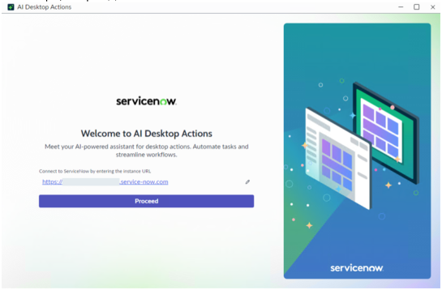

* **Bounding box:** x=82.0, y=177.3, width=432.0 pt, height=282.2 pt.
* **What is shown:** This embedded source image appears near `2. On the login page, in the Add ServiceNow URL field, enter the ServiceNow instance URL. / Example`. It is a product screenshot, form, UI panel, dialog, wizard, table-like screen, or instructional figure supporting the same-page task. Visible objects may include windows, tabs, form fields, buttons, record lists, panes, menus, highlighted controls, and explanatory labels. Its business purpose is to reduce ambiguity for a reader following the ServiceNow AI Desktop Actions procedure. Its technical purpose is to identify the exact interface element, screen state, or control referenced by the surrounding instructions.
* **Relationships / arrows / flow / labels:** The relationships are UI relationships visible inside the screenshot: fields belong to forms, buttons trigger actions, rows belong to lists/tables, and highlighted regions identify the target. No separate network topology, architecture boundary, or security zone is labeled unless it appears explicitly in the crop.
* **Visible text captured from image:**

```text
s 0 -
servicenow .
Welcome to Al Desktop Actions 5 h
Re
servicenow
```

### Source page 1288 — Image 2

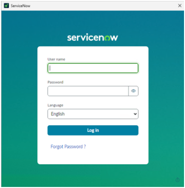

* **Bounding box:** x=82.0, y=39.0, width=300.0 pt, height=304.5 pt.
* **What is shown:** This embedded source image appears near `No nearby heading text was detected.`. It is a product screenshot, form, UI panel, dialog, wizard, table-like screen, or instructional figure supporting the same-page task. Visible objects may include windows, tabs, form fields, buttons, record lists, panes, menus, highlighted controls, and explanatory labels. Its business purpose is to reduce ambiguity for a reader following the ServiceNow AI Desktop Actions procedure. Its technical purpose is to identify the exact interface element, screen state, or control referenced by the surrounding instructions.
* **Relationships / arrows / flow / labels:** The relationships are UI relationships visible inside the screenshot: fields belong to forms, buttons trigger actions, rows belong to lists/tables, and highlighted regions identify the target. No separate network topology, architecture boundary, or security zone is labeled unless it appears explicitly in the crop.
* **Visible text captured from image:**

```text
| servceow x
servicenow
0
```

### Source page 1288 — Image 3

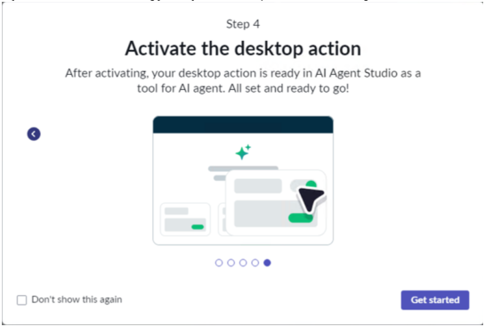

* **Bounding box:** x=82.0, y=370.0, width=432.0 pt, height=289.4 pt.
* **What is shown:** This embedded source image appears near `5. Optional: On the onboarding journey modal, complete the onboarding and select Get started.`. It is a product screenshot, form, UI panel, dialog, wizard, table-like screen, or instructional figure supporting the same-page task. Visible objects may include windows, tabs, form fields, buttons, record lists, panes, menus, highlighted controls, and explanatory labels. Its business purpose is to reduce ambiguity for a reader following the ServiceNow AI Desktop Actions procedure. Its technical purpose is to identify the exact interface element, screen state, or control referenced by the surrounding instructions.
* **Relationships / arrows / flow / labels:** The relationships are UI relationships visible inside the screenshot: fields belong to forms, buttons trigger actions, rows belong to lists/tables, and highlighted regions identify the target. No separate network topology, architecture boundary, or security zone is labeled unless it appears explicitly in the crop.
* **Visible text captured from image:**

```text
Step 4
Activate the desktop action
After activating, your desktop action is ready in Al Agent Studio as a
tool for Al agent. All set and ready to go!
° Es
v
a =
```

### Source page 1289 — Image 4


* **Bounding box:** x=82.0, y=39.0, width=432.0 pt, height=281.7 pt.
* **What is shown:** This embedded source image appears near `No nearby heading text was detected.`. It is a product screenshot, form, UI panel, dialog, wizard, table-like screen, or instructional figure supporting the same-page task. Visible objects may include windows, tabs, form fields, buttons, record lists, panes, menus, highlighted controls, and explanatory labels. Its business purpose is to reduce ambiguity for a reader following the ServiceNow AI Desktop Actions procedure. Its technical purpose is to identify the exact interface element, screen state, or control referenced by the surrounding instructions.
* **Relationships / arrows / flow / labels:** The relationships are UI relationships visible inside the screenshot: fields belong to forms, buttons trigger actions, rows belong to lists/tables, and highlighted regions identify the target. No separate network topology, architecture boundary, or security zone is labeled unless it appears explicitly in the crop.
* **Visible text captured from image:**

```text
Let's build something powerful together
Scanian liga,
° —
cece
o —
```

### Source page 1289 — Image 5

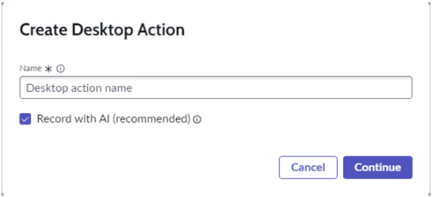

* **Bounding box:** x=82.0, y=354.7, width=432.0 pt, height=194.4 pt.
* **What is shown:** This embedded source image appears near `7. In the Create Desktop Action dialog, keep the Record with AI (recommended) check box`. It is a product screenshot, form, UI panel, dialog, wizard, table-like screen, or instructional figure supporting the same-page task. Visible objects may include windows, tabs, form fields, buttons, record lists, panes, menus, highlighted controls, and explanatory labels. Its business purpose is to reduce ambiguity for a reader following the ServiceNow AI Desktop Actions procedure. Its technical purpose is to identify the exact interface element, screen state, or control referenced by the surrounding instructions.
* **Relationships / arrows / flow / labels:** The relationships are UI relationships visible inside the screenshot: fields belong to forms, buttons trigger actions, rows belong to lists/tables, and highlighted regions identify the target. No separate network topology, architecture boundary, or security zone is labeled unless it appears explicitly in the crop.
* **Visible text captured from image:**

```text
Create Desktop Action
Name * ©
@ Record with Al (recommended) ©
L ]
```

### Source page 1290 — Image 6

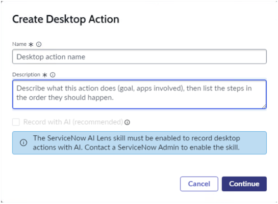

* **Bounding box:** x=82.0, y=39.0, width=432.0 pt, height=316.0 pt.
* **What is shown:** This embedded source image appears near `No nearby heading text was detected.`. It is a product screenshot, form, UI panel, dialog, wizard, table-like screen, or instructional figure supporting the same-page task. Visible objects may include windows, tabs, form fields, buttons, record lists, panes, menus, highlighted controls, and explanatory labels. Its business purpose is to reduce ambiguity for a reader following the ServiceNow AI Desktop Actions procedure. Its technical purpose is to identify the exact interface element, screen state, or control referenced by the surrounding instructions.
* **Relationships / arrows / flow / labels:** The relationships are UI relationships visible inside the screenshot: fields belong to forms, buttons trigger actions, rows belong to lists/tables, and highlighted regions identify the target. No separate network topology, architecture boundary, or security zone is labeled unless it appears explicitly in the crop.
* **Visible text captured from image:**

```text
Create Desktop Action
Name * ©
Desktop action name
Description « ©
Describe what this action does (goal, apps involved), then list the steps in
the order they should happen
```

### Source page 1290 — Image 7


* **Bounding box:** x=82.0, y=413.1, width=432.0 pt, height=288.7 pt.
* **What is shown:** This embedded source image appears near `9. Select Continue. / 10. In the modal, review the tips and select Open recorder to begin.`. It is a product screenshot, form, UI panel, dialog, wizard, table-like screen, or instructional figure supporting the same-page task. Visible objects may include windows, tabs, form fields, buttons, record lists, panes, menus, highlighted controls, and explanatory labels. Its business purpose is to reduce ambiguity for a reader following the ServiceNow AI Desktop Actions procedure. Its technical purpose is to identify the exact interface element, screen state, or control referenced by the surrounding instructions.
* **Relationships / arrows / flow / labels:** The relationships are UI relationships visible inside the screenshot: fields belong to forms, buttons trigger actions, rows belong to lists/tables, and highlighted regions identify the target. No separate network topology, architecture boundary, or security zone is labeled unless it appears explicitly in the crop.
* **Visible text captured from image:**

```text
Before we start recording, here are a few tips
```

### Source page 1291 — Image 8


* **Bounding box:** x=82.0, y=39.0, width=210.0 pt, height=94.5 pt.
* **What is shown:** This embedded source image appears near `No nearby heading text was detected.`. It is a product screenshot, form, UI panel, dialog, wizard, table-like screen, or instructional figure supporting the same-page task. Visible objects may include windows, tabs, form fields, buttons, record lists, panes, menus, highlighted controls, and explanatory labels. Its business purpose is to reduce ambiguity for a reader following the ServiceNow AI Desktop Actions procedure. Its technical purpose is to identify the exact interface element, screen state, or control referenced by the surrounding instructions.
* **Relationships / arrows / flow / labels:** The relationships are UI relationships visible inside the screenshot: fields belong to forms, buttons trigger actions, rows belong to lists/tables, and highlighted regions identify the target. No separate network topology, architecture boundary, or security zone is labeled unless it appears explicitly in the crop.
* **Visible text captured from image:**

```text
r = 7
Action recorder
Ready to start reco, Discard
Restart
Cancel O seart recording
```

### Source page 1292 — Image 9

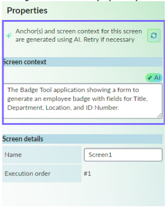

* **Bounding box:** x=112.0, y=52.0, width=222.0 pt, height=277.5 pt.
* **What is shown:** This embedded source image appears near `AI badge for screens in the properties panel`. It is a product screenshot, form, UI panel, dialog, wizard, table-like screen, or instructional figure supporting the same-page task. Visible objects may include windows, tabs, form fields, buttons, record lists, panes, menus, highlighted controls, and explanatory labels. Its business purpose is to reduce ambiguity for a reader following the ServiceNow AI Desktop Actions procedure. Its technical purpose is to identify the exact interface element, screen state, or control referenced by the surrounding instructions.
* **Relationships / arrows / flow / labels:** The relationships are UI relationships visible inside the screenshot: fields belong to forms, buttons trigger actions, rows belong to lists/tables, and highlighted regions identify the target. No separate network topology, architecture boundary, or security zone is labeled unless it appears explicitly in the crop.
* **Visible text captured from image:**

```text
Properties |
a
eee
Shatter
plenary
Soo
J
vane
=F
```

### Source page 1292 — Image 10

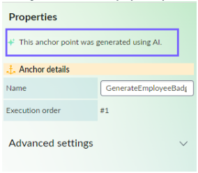

* **Bounding box:** x=112.0, y=355.7, width=222.8 pt, height=194.2 pt.
* **What is shown:** This embedded source image appears near `AI badge for screens in the properties panel / AI badge for anchors in the properties panel`. It is a product screenshot, form, UI panel, dialog, wizard, table-like screen, or instructional figure supporting the same-page task. Visible objects may include windows, tabs, form fields, buttons, record lists, panes, menus, highlighted controls, and explanatory labels. Its business purpose is to reduce ambiguity for a reader following the ServiceNow AI Desktop Actions procedure. Its technical purpose is to identify the exact interface element, screen state, or control referenced by the surrounding instructions.
* **Relationships / arrows / flow / labels:** The relationships are UI relationships visible inside the screenshot: fields belong to forms, buttons trigger actions, rows belong to lists/tables, and highlighted regions identify the target. No separate network topology, architecture boundary, or security zone is labeled unless it appears explicitly in the crop.
* **Visible text captured from image:**

```text
Properties
-f, Anchor details
ve
=e
Advanced settings v
```

### Source page 1293 — Image 11

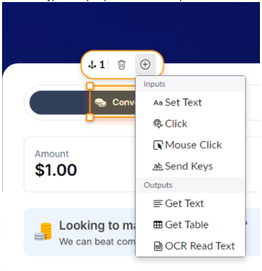

* **Bounding box:** x=92.0, y=91.3, width=300.0 pt, height=310.5 pt.
* **What is shown:** This embedded source image appears near `a. From the Anchor control menu, select the Add step icon / b. Select the type of step to perform for this step from the contextual menu.`. It is a product screenshot, form, UI panel, dialog, wizard, table-like screen, or instructional figure supporting the same-page task. Visible objects may include windows, tabs, form fields, buttons, record lists, panes, menus, highlighted controls, and explanatory labels. Its business purpose is to reduce ambiguity for a reader following the ServiceNow AI Desktop Actions procedure. Its technical purpose is to identify the exact interface element, screen state, or control referenced by the surrounding instructions.
* **Relationships / arrows / flow / labels:** The relationships are UI relationships visible inside the screenshot: fields belong to forms, buttons trigger actions, rows belong to lists/tables, and highlighted regions identify the target. No separate network topology, architecture boundary, or security zone is labeled unless it appears explicitly in the crop.
* **Visible text captured from image:**

```text
@ Click
(Mouse Click
$1.00 eb Send Keys
= Get Text
Looking tom; &Get Table ,
We can beat com OCR Read Text
```

### Source page 1297 — Image 12


* **Bounding box:** x=82.0, y=39.0, width=432.0 pt, height=282.2 pt.
* **What is shown:** This embedded source image appears near `No nearby heading text was detected.`. It is a product screenshot, form, UI panel, dialog, wizard, table-like screen, or instructional figure supporting the same-page task. Visible objects may include windows, tabs, form fields, buttons, record lists, panes, menus, highlighted controls, and explanatory labels. Its business purpose is to reduce ambiguity for a reader following the ServiceNow AI Desktop Actions procedure. Its technical purpose is to identify the exact interface element, screen state, or control referenced by the surrounding instructions.
* **Relationships / arrows / flow / labels:** The relationships are UI relationships visible inside the screenshot: fields belong to forms, buttons trigger actions, rows belong to lists/tables, and highlighted regions identify the target. No separate network topology, architecture boundary, or security zone is labeled unless it appears explicitly in the crop.
* **Visible text captured from image:**

```text
1B Adena Ae
servicenow .
Welcome to Al Desktop Actions 5 h
Re
servicenow
```

### Source page 1297 — Image 13

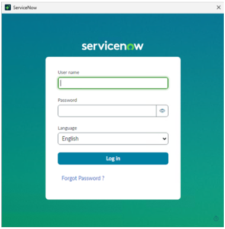

* **Bounding box:** x=82.0, y=383.5, width=300.0 pt, height=304.5 pt.
* **What is shown:** This embedded source image appears near `3. Select Proceed. / 4. Log in to your ServiceNow account by entering your user name and password.`. It is a product screenshot, form, UI panel, dialog, wizard, table-like screen, or instructional figure supporting the same-page task. Visible objects may include windows, tabs, form fields, buttons, record lists, panes, menus, highlighted controls, and explanatory labels. Its business purpose is to reduce ambiguity for a reader following the ServiceNow AI Desktop Actions procedure. Its technical purpose is to identify the exact interface element, screen state, or control referenced by the surrounding instructions.
* **Relationships / arrows / flow / labels:** The relationships are UI relationships visible inside the screenshot: fields belong to forms, buttons trigger actions, rows belong to lists/tables, and highlighted regions identify the target. No separate network topology, architecture boundary, or security zone is labeled unless it appears explicitly in the crop.
* **Visible text captured from image:**

```text
i sevietiow x
servicenow
0 J
Engh 5
```

### Source page 1298 — Image 14


* **Bounding box:** x=82.0, y=39.0, width=432.0 pt, height=289.4 pt.
* **What is shown:** This embedded source image appears near `No nearby heading text was detected.`. It is a product screenshot, form, UI panel, dialog, wizard, table-like screen, or instructional figure supporting the same-page task. Visible objects may include windows, tabs, form fields, buttons, record lists, panes, menus, highlighted controls, and explanatory labels. Its business purpose is to reduce ambiguity for a reader following the ServiceNow AI Desktop Actions procedure. Its technical purpose is to identify the exact interface element, screen state, or control referenced by the surrounding instructions.
* **Relationships / arrows / flow / labels:** The relationships are UI relationships visible inside the screenshot: fields belong to forms, buttons trigger actions, rows belong to lists/tables, and highlighted regions identify the target. No separate network topology, architecture boundary, or security zone is labeled unless it appears explicitly in the crop.
* **Visible text captured from image:**

```text
Step 4
Activate the desktop action
After activating, your desktop action is ready in Al Agent Studio as a
tool for Al agent. All set and ready to go!
° Es
v
a =
```

### Source page 1298 — Image 15


* **Bounding box:** x=82.0, y=402.4, width=432.0 pt, height=281.7 pt.
* **What is shown:** This embedded source image appears near `Actions or Skip intro to skip the onboarding. / 6. On the AI Desktop Actions home page, select Create desktop action.`. It is a product screenshot, form, UI panel, dialog, wizard, table-like screen, or instructional figure supporting the same-page task. Visible objects may include windows, tabs, form fields, buttons, record lists, panes, menus, highlighted controls, and explanatory labels. Its business purpose is to reduce ambiguity for a reader following the ServiceNow AI Desktop Actions procedure. Its technical purpose is to identify the exact interface element, screen state, or control referenced by the surrounding instructions.
* **Relationships / arrows / flow / labels:** The relationships are UI relationships visible inside the screenshot: fields belong to forms, buttons trigger actions, rows belong to lists/tables, and highlighted regions identify the target. No separate network topology, architecture boundary, or security zone is labeled unless it appears explicitly in the crop.
* **Visible text captured from image:**

```text
WB AIDesktop Actions 7 - ox
Let's build something powerful together
Cipro te
suet pon ap oc Nog
5
° —
. (ZSecroyroneopicon —) EEE (aon
~ oer |[ ee
```

### Source page 1299 — Image 16

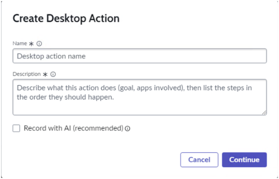

* **Bounding box:** x=82.0, y=39.0, width=432.0 pt, height=274.8 pt.
* **What is shown:** This embedded source image appears near `No nearby heading text was detected.`. It is a product screenshot, form, UI panel, dialog, wizard, table-like screen, or instructional figure supporting the same-page task. Visible objects may include windows, tabs, form fields, buttons, record lists, panes, menus, highlighted controls, and explanatory labels. Its business purpose is to reduce ambiguity for a reader following the ServiceNow AI Desktop Actions procedure. Its technical purpose is to identify the exact interface element, screen state, or control referenced by the surrounding instructions.
* **Relationships / arrows / flow / labels:** The relationships are UI relationships visible inside the screenshot: fields belong to forms, buttons trigger actions, rows belong to lists/tables, and highlighted regions identify the target. No separate network topology, architecture boundary, or security zone is labeled unless it appears explicitly in the crop.
* **Visible text captured from image:**

```text
Create Desktop Action
‘Name & QO
Desktop action name
Description * ©
Describe what this action does (goal, apps involved), then list the steps in
the order they should happen.
C Record with Al (recommended) ©
```

### Source page 1299 — Image 17

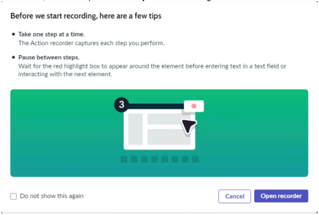

* **Bounding box:** x=82.0, y=371.8, width=432.0 pt, height=288.7 pt.
* **What is shown:** This embedded source image appears near `9. Select Continue. / 10. In the modal, review the tips and select Open recorder to begin.`. It is a product screenshot, form, UI panel, dialog, wizard, table-like screen, or instructional figure supporting the same-page task. Visible objects may include windows, tabs, form fields, buttons, record lists, panes, menus, highlighted controls, and explanatory labels. Its business purpose is to reduce ambiguity for a reader following the ServiceNow AI Desktop Actions procedure. Its technical purpose is to identify the exact interface element, screen state, or control referenced by the surrounding instructions.
* **Relationships / arrows / flow / labels:** The relationships are UI relationships visible inside the screenshot: fields belong to forms, buttons trigger actions, rows belong to lists/tables, and highlighted regions identify the target. No separate network topology, architecture boundary, or security zone is labeled unless it appears explicitly in the crop.
* **Visible text captured from image:**

```text
Before we start recording, here are a few tips
```

### Source page 1300 — Image 18

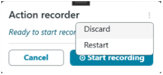

* **Bounding box:** x=82.0, y=39.0, width=210.0 pt, height=94.5 pt.
* **What is shown:** This embedded source image appears near `No nearby heading text was detected.`. It is a product screenshot, form, UI panel, dialog, wizard, table-like screen, or instructional figure supporting the same-page task. Visible objects may include windows, tabs, form fields, buttons, record lists, panes, menus, highlighted controls, and explanatory labels. Its business purpose is to reduce ambiguity for a reader following the ServiceNow AI Desktop Actions procedure. Its technical purpose is to identify the exact interface element, screen state, or control referenced by the surrounding instructions.
* **Relationships / arrows / flow / labels:** The relationships are UI relationships visible inside the screenshot: fields belong to forms, buttons trigger actions, rows belong to lists/tables, and highlighted regions identify the target. No separate network topology, architecture boundary, or security zone is labeled unless it appears explicitly in the crop.
* **Visible text captured from image:**

```text
r = 7
Action recorder
Ready to start reco, Discard
Restart
Cancel O seart recording
```

### Source page 1301 — Image 19


* **Bounding box:** x=92.0, y=91.3, width=300.0 pt, height=310.5 pt.
* **What is shown:** This embedded source image appears near `a. From the Anchor control menu, select the Add step icon / b. Select the type of step to perform for this step from the contextual menu.`. It is a product screenshot, form, UI panel, dialog, wizard, table-like screen, or instructional figure supporting the same-page task. Visible objects may include windows, tabs, form fields, buttons, record lists, panes, menus, highlighted controls, and explanatory labels. Its business purpose is to reduce ambiguity for a reader following the ServiceNow AI Desktop Actions procedure. Its technical purpose is to identify the exact interface element, screen state, or control referenced by the surrounding instructions.
* **Relationships / arrows / flow / labels:** The relationships are UI relationships visible inside the screenshot: fields belong to forms, buttons trigger actions, rows belong to lists/tables, and highlighted regions identify the target. No separate network topology, architecture boundary, or security zone is labeled unless it appears explicitly in the crop.
* **Visible text captured from image:**

```text
@ Click
(Mouse Click
$1.00 eb Send Keys
= Get Text
Looking tom; &Get Table ,
We can beat com OCR Read Text
```

### Source page 1305 — Image 20


* **Bounding box:** x=82.0, y=39.0, width=432.0 pt, height=282.2 pt.
* **What is shown:** This embedded source image appears near `No nearby heading text was detected.`. It is a product screenshot, form, UI panel, dialog, wizard, table-like screen, or instructional figure supporting the same-page task. Visible objects may include windows, tabs, form fields, buttons, record lists, panes, menus, highlighted controls, and explanatory labels. Its business purpose is to reduce ambiguity for a reader following the ServiceNow AI Desktop Actions procedure. Its technical purpose is to identify the exact interface element, screen state, or control referenced by the surrounding instructions.
* **Relationships / arrows / flow / labels:** The relationships are UI relationships visible inside the screenshot: fields belong to forms, buttons trigger actions, rows belong to lists/tables, and highlighted regions identify the target. No separate network topology, architecture boundary, or security zone is labeled unless it appears explicitly in the crop.
* **Visible text captured from image:**

```text
1B Adena Ae
servicenow .
Welcome to Al Desktop Actions 5 h
Re
servicenow
```

### Source page 1305 — Image 21


* **Bounding box:** x=82.0, y=383.5, width=300.0 pt, height=304.5 pt.
* **What is shown:** This embedded source image appears near `3. Select Proceed. / 4. Log in to your ServiceNow account by entering your user name and password.`. It is a product screenshot, form, UI panel, dialog, wizard, table-like screen, or instructional figure supporting the same-page task. Visible objects may include windows, tabs, form fields, buttons, record lists, panes, menus, highlighted controls, and explanatory labels. Its business purpose is to reduce ambiguity for a reader following the ServiceNow AI Desktop Actions procedure. Its technical purpose is to identify the exact interface element, screen state, or control referenced by the surrounding instructions.
* **Relationships / arrows / flow / labels:** The relationships are UI relationships visible inside the screenshot: fields belong to forms, buttons trigger actions, rows belong to lists/tables, and highlighted regions identify the target. No separate network topology, architecture boundary, or security zone is labeled unless it appears explicitly in the crop.
* **Visible text captured from image:**

```text
i sevietiow x
servicenow
0 J
Engh 5
```

### Source page 1306 — Image 22


* **Bounding box:** x=82.0, y=39.0, width=432.0 pt, height=289.4 pt.
* **What is shown:** This embedded source image appears near `No nearby heading text was detected.`. It is a product screenshot, form, UI panel, dialog, wizard, table-like screen, or instructional figure supporting the same-page task. Visible objects may include windows, tabs, form fields, buttons, record lists, panes, menus, highlighted controls, and explanatory labels. Its business purpose is to reduce ambiguity for a reader following the ServiceNow AI Desktop Actions procedure. Its technical purpose is to identify the exact interface element, screen state, or control referenced by the surrounding instructions.
* **Relationships / arrows / flow / labels:** The relationships are UI relationships visible inside the screenshot: fields belong to forms, buttons trigger actions, rows belong to lists/tables, and highlighted regions identify the target. No separate network topology, architecture boundary, or security zone is labeled unless it appears explicitly in the crop.
* **Visible text captured from image:**

```text
Step 4
Activate the desktop action
After activating, your desktop action is ready in Al Agent Studio as a
tool for Al agent. All set and ready to go!
° Es
v
a =
```

### Source page 1306 — Image 23

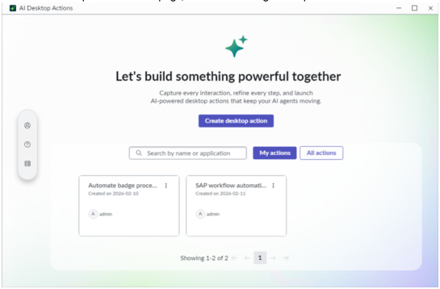

* **Bounding box:** x=82.0, y=402.4, width=432.0 pt, height=281.7 pt.
* **What is shown:** This embedded source image appears near `Actions or Skip intro to skip the onboarding. / 6. On the AI Desktop Actions home page, select an existing desktop action.`. It is a product screenshot, form, UI panel, dialog, wizard, table-like screen, or instructional figure supporting the same-page task. Visible objects may include windows, tabs, form fields, buttons, record lists, panes, menus, highlighted controls, and explanatory labels. Its business purpose is to reduce ambiguity for a reader following the ServiceNow AI Desktop Actions procedure. Its technical purpose is to identify the exact interface element, screen state, or control referenced by the surrounding instructions.
* **Relationships / arrows / flow / labels:** The relationships are UI relationships visible inside the screenshot: fields belong to forms, buttons trigger actions, rows belong to lists/tables, and highlighted regions identify the target. No separate network topology, architecture boundary, or security zone is labeled unless it appears explicitly in the crop.
* **Visible text captured from image:**

```text
WB AIDesktop Actions _ 7 - ox
Let's build something powerful together
Cipro te
suet pon ap oc Nog
5
° —
. (ZSecroyroneopicon —) EEE (aon
~ oer |[ ee
```

### Source page 1307 — Image 24

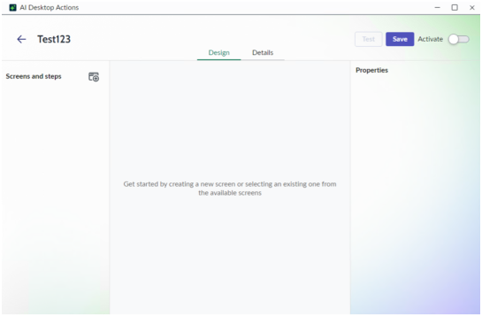

* **Bounding box:** x=82.0, y=39.0, width=432.0 pt, height=281.7 pt.
* **What is shown:** This embedded source image appears near `No nearby heading text was detected.`. It is a product screenshot, form, UI panel, dialog, wizard, table-like screen, or instructional figure supporting the same-page task. Visible objects may include windows, tabs, form fields, buttons, record lists, panes, menus, highlighted controls, and explanatory labels. Its business purpose is to reduce ambiguity for a reader following the ServiceNow AI Desktop Actions procedure. Its technical purpose is to identify the exact interface element, screen state, or control referenced by the surrounding instructions.
* **Relationships / arrows / flow / labels:** The relationships are UI relationships visible inside the screenshot: fields belong to forms, buttons trigger actions, rows belong to lists/tables, and highlighted regions identify the target. No separate network topology, architecture boundary, or security zone is labeled unless it appears explicitly in the crop.
* **Visible text captured from image:**

```text
1 M1 Desitep Actions, =o x
© Testi23 am =~ |
oxen ovate
Senemundsens 6B coor
Cette byomtng sn sen ot cng eng os tom
```

### Source page 1307 — Image 25

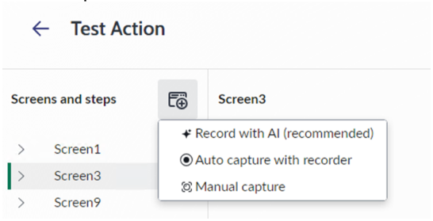

* **Bounding box:** x=92.0, y=401.4, width=432.0 pt, height=218.5 pt.
* **What is shown:** This embedded source image appears near `a. In the Design tab, select the Capture Options icon / b. Select Manual capture.`. It is a product screenshot, form, UI panel, dialog, wizard, table-like screen, or instructional figure supporting the same-page task. Visible objects may include windows, tabs, form fields, buttons, record lists, panes, menus, highlighted controls, and explanatory labels. Its business purpose is to reduce ambiguity for a reader following the ServiceNow AI Desktop Actions procedure. Its technical purpose is to identify the exact interface element, screen state, or control referenced by the surrounding instructions.
* **Relationships / arrows / flow / labels:** The relationships are UI relationships visible inside the screenshot: fields belong to forms, buttons trigger actions, rows belong to lists/tables, and highlighted regions identify the target. No separate network topology, architecture boundary, or security zone is labeled unless it appears explicitly in the crop.
* **Visible text captured from image:**

```text
<€_ Test Action
Screens and steps FB Screen3
+ Record with Al (recommended)
> Sereent
@ Auto capture with recorder
| > Screen3
@ Manual capture
> Screen? ooo
```

### Source page 1308 — Image 26

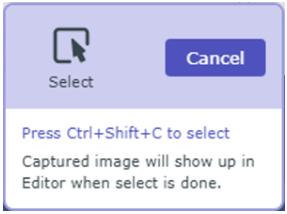

* **Bounding box:** x=92.0, y=39.0, width=225.0 pt, height=166.5 pt.
* **What is shown:** This embedded source image appears near `No nearby heading text was detected.`. It is a product screenshot, form, UI panel, dialog, wizard, table-like screen, or instructional figure supporting the same-page task. Visible objects may include windows, tabs, form fields, buttons, record lists, panes, menus, highlighted controls, and explanatory labels. Its business purpose is to reduce ambiguity for a reader following the ServiceNow AI Desktop Actions procedure. Its technical purpose is to identify the exact interface element, screen state, or control referenced by the surrounding instructions.
* **Relationships / arrows / flow / labels:** The relationships are UI relationships visible inside the screenshot: fields belong to forms, buttons trigger actions, rows belong to lists/tables, and highlighted regions identify the target. No separate network topology, architecture boundary, or security zone is labeled unless it appears explicitly in the crop.
* **Visible text captured from image:**

```text
5
Select
Press Ctri+Shift+C to select
Captured image will show up in
Editor when select is done.
```

### Source page 1309 — Image 27

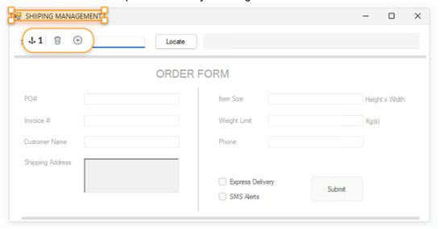

* **Bounding box:** x=92.0, y=60.8, width=432.0 pt, height=223.2 pt.
* **What is shown:** This embedded source image appears near `a. Insert an anchor on the captured screen by selecting the Add anchor icon`. It is a product screenshot, form, UI panel, dialog, wizard, table-like screen, or instructional figure supporting the same-page task. Visible objects may include windows, tabs, form fields, buttons, record lists, panes, menus, highlighted controls, and explanatory labels. Its business purpose is to reduce ambiguity for a reader following the ServiceNow AI Desktop Actions procedure. Its technical purpose is to identify the exact interface element, screen state, or control referenced by the surrounding instructions.
* **Relationships / arrows / flow / labels:** The relationships are UI relationships visible inside the screenshot: fields belong to forms, buttons trigger actions, rows belong to lists/tables, and highlighted regions identify the target. No separate network topology, architecture boundary, or security zone is labeled unless it appears explicitly in the crop.
* **Visible text captured from image:**

```text
ORDER FORM
Pos | tum se Height Win
= ae on
a =
soni
Otten ES
Omme
```

### Source page 1310 — Image 28

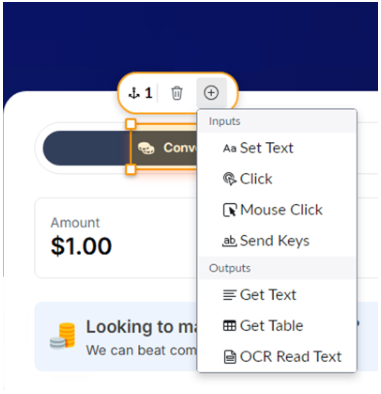

* **Bounding box:** x=92.0, y=39.0, width=300.0 pt, height=310.5 pt.
* **What is shown:** This embedded source image appears near `No nearby heading text was detected.`. It is a product screenshot, form, UI panel, dialog, wizard, table-like screen, or instructional figure supporting the same-page task. Visible objects may include windows, tabs, form fields, buttons, record lists, panes, menus, highlighted controls, and explanatory labels. Its business purpose is to reduce ambiguity for a reader following the ServiceNow AI Desktop Actions procedure. Its technical purpose is to identify the exact interface element, screen state, or control referenced by the surrounding instructions.
* **Relationships / arrows / flow / labels:** The relationships are UI relationships visible inside the screenshot: fields belong to forms, buttons trigger actions, rows belong to lists/tables, and highlighted regions identify the target. No separate network topology, architecture boundary, or security zone is labeled unless it appears explicitly in the crop.
* **Visible text captured from image:**

```text
= 419 © =
@ Click
(Mouse Click
$1.00 eb Send Keys
= Get Text
Looking tom; &Get Table ,
We can beat com OCR Read Text
```

### Source page 1313 — Image 29

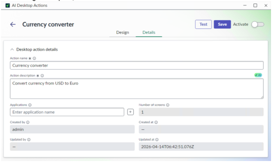

* **Bounding box:** x=82.0, y=75.5, width=432.0 pt, height=256.0 pt.
* **What is shown:** This embedded source image appears near `Procedure / 1. In the Design workspace, select the Details tab.`. It is a product screenshot, form, UI panel, dialog, wizard, table-like screen, or instructional figure supporting the same-page task. Visible objects may include windows, tabs, form fields, buttons, record lists, panes, menus, highlighted controls, and explanatory labels. Its business purpose is to reduce ambiguity for a reader following the ServiceNow AI Desktop Actions procedure. Its technical purpose is to identify the exact interface element, screen state, or control referenced by the surrounding instructions.
* **Relationships / arrows / flow / labels:** The relationships are UI relationships visible inside the screenshot: fields belong to forms, buttons trigger actions, rows belong to lists/tables, and highlighted regions identify the target. No separate network topology, architecture boundary, or security zone is labeled unless it appears explicitly in the crop.
* **Visible text captured from image:**

```text
WB AIDesktop Actions - ox
© Currency converter (Geet) EEE ace
Desi Det
> Desktop action tats
scores ©
senses ry
peeery maemo
(Eerseiainene 8
sarin -
- zane 08 1T0642510762
```

### Source page 1314 — Image 30

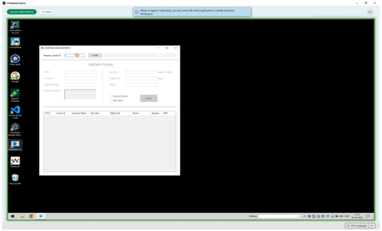

* **Bounding box:** x=72.0, y=214.8, width=432.0 pt, height=260.6 pt.
* **What is shown:** This embedded source image appears near `• Add desktop action details, such as name, description, and associated applications, and / About this task`. It is a product screenshot, form, UI panel, dialog, wizard, table-like screen, or instructional figure supporting the same-page task. Visible objects may include windows, tabs, form fields, buttons, record lists, panes, menus, highlighted controls, and explanatory labels. Its business purpose is to reduce ambiguity for a reader following the ServiceNow AI Desktop Actions procedure. Its technical purpose is to identify the exact interface element, screen state, or control referenced by the surrounding instructions.
* **Relationships / arrows / flow / labels:** The relationships are UI relationships visible inside the screenshot: fields belong to forms, buttons trigger actions, rows belong to lists/tables, and highlighted regions identify the target. No separate network topology, architecture boundary, or security zone is labeled unless it appears explicitly in the crop.
* **Visible text captured from image:**

```text
— =
2
a
2
a
s
2
SCRE ATEN A |
```

### Source page 1315 — Image 31

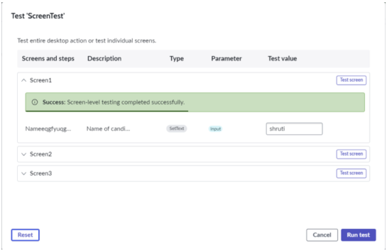

* **Bounding box:** x=102.0, y=122.8, width=432.0 pt, height=277.6 pt.
* **What is shown:** This embedded source image appears near `Note: If any pop up is blocking the automation from running, step in to clear the pop / d. After the test run is complete, check the status in the Test modal.`. It is a product screenshot, form, UI panel, dialog, wizard, table-like screen, or instructional figure supporting the same-page task. Visible objects may include windows, tabs, form fields, buttons, record lists, panes, menus, highlighted controls, and explanatory labels. Its business purpose is to reduce ambiguity for a reader following the ServiceNow AI Desktop Actions procedure. Its technical purpose is to identify the exact interface element, screen state, or control referenced by the surrounding instructions.
* **Relationships / arrows / flow / labels:** The relationships are UI relationships visible inside the screenshot: fields belong to forms, buttons trigger actions, rows belong to lists/tables, and highlighted regions identify the target. No separate network topology, architecture boundary, or security zone is labeled unless it appears explicitly in the crop.
* **Visible text captured from image:**

```text
Test 'ScreenTest’
Test en deo ten re ni one
Serena snd steps Oncon Tee Pam Tete
Sonent =)
hme tame tena. — «= =a)
sowed =
sovet =
=a) —
```

### Source page 1315 — Image 32

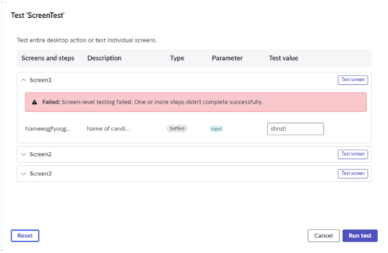

* **Bounding box:** x=102.0, y=449.4, width=432.0 pt, height=279.2 pt.
* **What is shown:** This embedded source image appears near `Note: If any pop up is blocking the automation from running, step in to clear the pop / d. After the test run is complete, check the status in the Test modal.`. It is a product screenshot, form, UI panel, dialog, wizard, table-like screen, or instructional figure supporting the same-page task. Visible objects may include windows, tabs, form fields, buttons, record lists, panes, menus, highlighted controls, and explanatory labels. Its business purpose is to reduce ambiguity for a reader following the ServiceNow AI Desktop Actions procedure. Its technical purpose is to identify the exact interface element, screen state, or control referenced by the surrounding instructions.
* **Relationships / arrows / flow / labels:** The relationships are UI relationships visible inside the screenshot: fields belong to forms, buttons trigger actions, rows belong to lists/tables, and highlighted regions identify the target. No separate network topology, architecture boundary, or security zone is labeled unless it appears explicitly in the crop.
* **Visible text captured from image:**

```text
Test Screntest
Test ection stan or tet nd ne
sreenandstens— Desroton Tee Parmeter Tete
> Sereent f=)
Nameearine. Nomen some co)
Y Sereenz Ge)
Y Screens 3)
G& cr) ~~ |
```

### Source page 1316 — Image 33

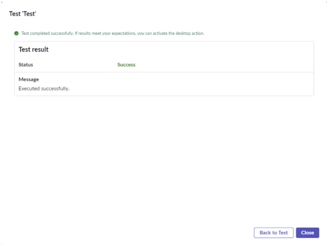

* **Bounding box:** x=102.0, y=353.9, width=432.0 pt, height=323.5 pt.
* **What is shown:** This embedded source image appears near `Note: If any pop up is blocking the automation from running, step in to clear the pop / d. After the test run is complete, check the status in the Test modal.`. It is a product screenshot, form, UI panel, dialog, wizard, table-like screen, or instructional figure supporting the same-page task. Visible objects may include windows, tabs, form fields, buttons, record lists, panes, menus, highlighted controls, and explanatory labels. Its business purpose is to reduce ambiguity for a reader following the ServiceNow AI Desktop Actions procedure. Its technical purpose is to identify the exact interface element, screen state, or control referenced by the surrounding instructions.
* **Relationships / arrows / flow / labels:** The relationships are UI relationships visible inside the screenshot: fields belong to forms, buttons trigger actions, rows belong to lists/tables, and highlighted regions identify the target. No separate network topology, architecture boundary, or security zone is labeled unless it appears explicitly in the crop.
* **Visible text captured from image:**

```text
Test Test
(etna i in cn
Test result
sun sec
Menage
cues cents
ati
```

### Source page 1317 — Image 34

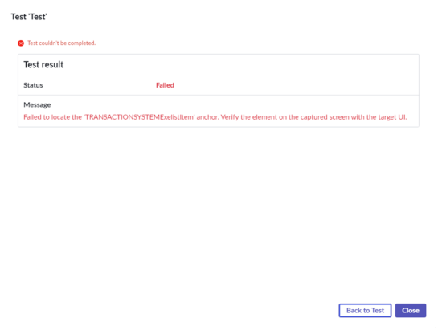

* **Bounding box:** x=102.0, y=79.7, width=432.0 pt, height=324.0 pt.
* **What is shown:** This embedded source image appears near `▪If test isn’t successful, select Back to Test to check the configuration and run the test`. It is a product screenshot, form, UI panel, dialog, wizard, table-like screen, or instructional figure supporting the same-page task. Visible objects may include windows, tabs, form fields, buttons, record lists, panes, menus, highlighted controls, and explanatory labels. Its business purpose is to reduce ambiguity for a reader following the ServiceNow AI Desktop Actions procedure. Its technical purpose is to identify the exact interface element, screen state, or control referenced by the surrounding instructions.
* **Relationships / arrows / flow / labels:** The relationships are UI relationships visible inside the screenshot: fields belong to forms, buttons trigger actions, rows belong to lists/tables, and highlighted regions identify the target. No separate network topology, architecture boundary, or security zone is labeled unless it appears explicitly in the crop.
* **Visible text captured from image:**

```text
Test Test
oe
Test result
aoe puntos non opensuse
```


---

## TABLES

### Source page 1282 — Table 1

**Nearby source context:** Background task / Note: For the AI agents to perform Background task automations, the

| Application | Description |
| --- | --- |
| Microsoft Excel | Enables AI agents to perform standard actions on<br>the Microsoft Excel documents. For example, data<br>manipulation, content modification, and information<br>retrieval from spreadsheets.<br>The following methods are supported:<br>•ReadData<br>•WriteData<br>•FindAndReplace<br>Note: CSV and password-protected files aren't<br>supported. |

### Source page 1283 — Table 2

| Application | Description |
| --- | --- |
|  | •MarkAsRead<br>•MarkAsUnread<br>Note: Only the classic view is supported. Shared<br>inboxes aren’t supported. |
| Microsoft Word | Enables AI agents to perform standard actions on<br>the Microsoft Word documents. For example, you can<br>replace text in a document.<br>The following methods are supported:<br>•GetText<br>•InsertText<br>•ReplaceText<br>Note: Password-protected files aren't supported. |
| PDF | Enables AI agents to perform standard actions on the<br>PDF documents. For example, extracting text, converting<br>to Excel or Images, and merging and spiting files.<br>The following methods are supported:<br>•GetText<br>•ConvertToExcel<br>•ConvertToImages<br>•Merge<br>•Split<br>Note: Password-protected files aren't supported.<br>You can't manipulate e-signed PDFs such as<br>performing merge and split. This action corrupts<br>the PDF files. |
| PowerShell | Enables AI agents to execute PowerShell commands<br>and scripts and returns the results.<br>The following methods are supported:<br>•InvokeCommand<br>•InvokeScript<br>Note: Each PowerShell step runs in a new<br>session. Output from one step isn’t carried over to<br>the next step. |

### Source page 1284 — Table 3

| Application | Description |
| --- | --- |
|  | The following method is supported:<br>ExecuteQuery |
| Secure Shell (SSH) | Enables AI agents to securely connect to remote<br>servers to run SSH commands and scripts; and returns<br>the execution results. This connector supports non-<br>interactive commands.<br>The following method is supported:<br>RunCommand<br>Note: Each SSH step runs in a new session.<br>Output from one step isn’t carried over to the next<br>step. |
| System Actions | Enables AI agents to perform standard Windows system<br>operations. For example, starting an app, creating a ZIP<br>file, or deleting any file or folder.<br>The following methods are supported:<br>•StartApp<br>•Terminate<br>•DateTimeNow<br>•SetEnvironmentVariable<br>•GetEnvironmentVariable<br>•CopyFileOrFolder<br>•DeleteFileOrFolder<br>•WriteToFile<br>•ReadFromFile<br>•GetFilesFromFolder<br>•ExtractFile<br>•CreateZip |

### Source page 1293 — Table 4

**Nearby source context:** b. Select the type of step to perform for this step from the contextual menu. / Description of the actions

| Goal | Step | Type | Example |
| --- | --- | --- | --- |
| Enter text in a field | Set Text | Input | Enter any text data<br>such as a user name,<br>an address, a survey<br>response, or in any<br>situation where text<br>entry is accepted.<br>Note: If you<br>set a static<br>value for this<br>field, the<br>automation<br>uses it during<br>execution and<br>doesn’t prompt<br>you for input<br>from the Now<br>Assist panel. |

### Source page 1294 — Table 5

| Goal | Step | Type | Example |
| --- | --- | --- | --- |
|  |  |  | performed by a<br>mouse click. |
| Simulate an<br>alternative mouse<br>action (for example,<br>right-click, drag,<br>scroll, or paste) | Mouse Click | Input | Perform various<br>mouse device<br>actions, such as<br>right-click and select<br>an object or scroll on<br>a web page. |
| Simulate a key press<br>or a key function | Send Keys | Input | Perform keyboard<br>shortcuts, such<br>as copying text<br>by entering Ctrl<br>+ C on fields and<br>elements.<br>Note: If you<br>set a static<br>value for this<br>field, the<br>automation<br>uses it during<br>execution and<br>doesn’t prompt<br>you for input<br>from the Now<br>Assist panel. |
| Capture text from a<br>window or web page | Get Text | Output | Receive text from the<br>source area. |
| Capture a table | Get Table | Output | Receive table from<br>the source area<br>when the text is in<br>the table format.<br>Note: For the<br>step to capture<br>table data<br>successfully,<br>the data must<br>already be<br>in the table<br>form. The step<br>can’t convert<br>ordinary text to<br>table data. |
| Read text from an<br>image | OCR Read Text | Output | Recognize text from<br>images and return it<br>in the standard text<br>format. |

### Source page 1301 — Table 6

**Nearby source context:** b. Select the type of step to perform for this step from the contextual menu. / Description of the actions

| Goal | Step | Type | Example |
| --- | --- | --- | --- |
| Enter text in a field | Set Text | Input | Enter any text data<br>such as a user name,<br>an address, a survey<br>response, or in any<br>situation where text<br>entry is accepted.<br>Note: If you<br>set a static<br>value for this<br>field, the<br>automation<br>uses it during<br>execution and<br>doesn’t prompt<br>you for input<br>from the Now<br>Assist panel. |

### Source page 1302 — Table 7

| Goal | Step | Type | Example |
| --- | --- | --- | --- |
|  |  |  | performed by a<br>mouse click. |
| Simulate an<br>alternative mouse<br>action (for example,<br>right-click, drag,<br>scroll, or paste) | Mouse Click | Input | Perform various<br>mouse device<br>actions, such as<br>right-click and select<br>an object or scroll on<br>a web page. |
| Simulate a key press<br>or a key function | Send Keys | Input | Perform keyboard<br>shortcuts, such<br>as copying text<br>by entering Ctrl<br>+ C on fields and<br>elements.<br>Note: If you<br>set a static<br>value for this<br>field, the<br>automation<br>uses it during<br>execution and<br>doesn’t prompt<br>you for input<br>from the Now<br>Assist panel. |
| Capture text from a<br>window or web page | Get Text | Output | Receive text from the<br>source area. |
| Capture a table | Get Table | Output | Receive table from<br>the source area<br>when the text is in<br>the table format.<br>Note: For the<br>step to capture<br>table data<br>successfully,<br>the data must<br>already be<br>in the table<br>form. The step<br>can’t convert<br>ordinary text to<br>table data. |
| Read text from an<br>image | OCR Read Text | Output | Recognize text from<br>images and return it<br>in the standard text<br>format. |

### Source page 1310 — Table 8

**Nearby source context:** Description of the actions

| Goal | Step | Type | Example |
| --- | --- | --- | --- |
| Enter text in a field | Set Text | Input | Enter any text data<br>such as a user name,<br>an address, a survey<br>response, or in any<br>situation where text<br>entry is accepted.<br>Note: If you<br>set a static<br>value for this<br>field, the<br>automation<br>uses it during<br>execution and<br>doesn’t prompt<br>you for input<br>from the Now<br>Assist panel. |
| Simulate a mouse<br>click | Click | Input | Click a button, open<br>a menu, or perform<br>any step typically<br>performed by a<br>mouse click. |

### Source page 1311 — Table 9

| Goal | Step | Type | Example |
| --- | --- | --- | --- |
| action (for example,<br>right-click, drag,<br>scroll, or paste) |  |  | actions, such as<br>right-click and select<br>an object or scroll on<br>a web page. |
| Simulate a key press<br>or a key function | Send Keys | Input | Perform keyboard<br>shortcuts, such<br>as copying text<br>by entering Ctrl<br>+ C on fields and<br>elements.<br>Note: If you<br>set a static<br>value for this<br>field, the<br>automation<br>uses it during<br>execution and<br>doesn’t prompt<br>you for input<br>from the Now<br>Assist panel. |
| Capture text from a<br>window or web page | Get Text | Output | Receive text from the<br>source area. |
| Capture a table | Get Table | Output | Receive table from<br>the source area<br>when the text is in<br>the table format.<br>Note: For the<br>step to capture<br>table data<br>successfully,<br>the data must<br>already be<br>in the table<br>form. The step<br>can’t convert<br>ordinary text to<br>table data. |
| Read text from an<br>image | OCR Read Text | Output | Recognize text from<br>images and return it<br>in the standard text<br>format. |

### Source page 1318 — Table 10

**Nearby source context:** Screen / Screen properties

| Property | Description |
| --- | --- |
| Name | Unique name for the captured screen. The<br>updated name reflects in the Screens and<br>steps panel. |
| Execution order | Order in which the screen is executed when<br>multiple screens are captured. You can drag<br>the screen at the desired order in the Screens<br>and steps panel. |

### Source page 1318 — Table 11

**Nearby source context:** Anchor / Anchor properties

| Property | Description |
| --- | --- |
| Name | Unique name of the added anchor. The<br>updated name reflects in the Screens and<br>steps panel. |
| Execution order | Order in which the anchor is executed when<br>multiple anchors are added. |
| X | Location of the top-left corner of the anchor on<br>the screen along the X-axis. |
| Y | Location of the top-left corner of the anchor on<br>the screen along the Y-axis. |
| Width | Width of the area highlighted as anchor. |
| Height | Height of the area highlighted as anchor. |
| Convert to grayscale | Option to convert the captured screen as a<br>grayscale image. The default value is False. |
| Search in Scale | Option to specify whether the component<br>scales the target image before trying to match<br>the source image. The scaling is done in an<br>increment of 10% each between 100% and<br>150%. The default value is False. |
| Confidence threshold | Specifies the accuracy in matching the image<br>captured before the component performs<br>a step. The value of 1 defines a 100% match<br>while 0.5 defines 50% match. The default<br>value is 0.95 or 95% match. |
| Retry with scroll | Option to scroll the target image before trying<br>to match the source image. |

### Source page 1319 — Table 12

**Nearby source context:** Anchor properties (continued)

| Property | Description |
| --- | --- |
| Wait for image | Option to specify if the automation must wait<br>for the image to appear on the screen. The<br>default value is True. |
| Max wait time | Number of seconds to wait for the image or<br>application to appear on the screen. |
| Delay before | Delay in number of seconds before the anchor<br>is executed. The automation waits until the<br>specified time elapses before executing the<br>anchor. |
| Delay after | Delay in number of seconds after the anchor<br>is executed. The automation will wait until the<br>specified time elapses before executing the<br>next anchor. |

### Source page 1319 — Table 13

**Nearby source context:** Common properties for steps / Common properties

| Property | Description |
| --- | --- |
| Name | Unique name of the step. The updated<br>name reflects in the Screens and steps<br>panel. |
| Execution order | Order in which this step is executed<br>when multiple steps are set up. This<br>order is assigned when you add a step<br>from the anchor. You can drag the step<br>under its anchor at the desired order in<br>the Screens and Steps panel. |
| Type | Type of the step, such as Set Text, Get<br>Text, Mouse Click. |
| Description | Helpful description of this step. |
| X | Location of the green plus icon<br>along the X-axis relative to the anchor. |
| Y | Location of the green plus icon<br>along the Y-axis relative to the anchor. |
| Delay before | Delay in seconds before the action is<br>executed. |
| Delay after | Delay in seconds after the action is<br>executed. |

### Source page 1320 — Table 14

**Nearby source context:** Set Text / Set Text properties

| Property | Description |
| --- | --- |
| Use parameter | Option to supply the value from a<br>Desktop action parameter record<br>mapped in AI Agent Studio. When<br>selected, the Static value field is not<br>used. |
| Static value | The text to enter in the field when Use<br>parameter is not selected. |

### Source page 1320 — Table 15

**Nearby source context:** Mouse Click / Mouse Click properties

| Property | Description |
| --- | --- |
| Mouse click type | Type of mouse click action to set for this<br>step:<br>•Left click<br>•Left double click<br>•Middle click<br>•Right click<br>•Right double click<br>•Move<br>•Drag<br>•Drop<br>•Scroll down<br>•Scroll up<br>•Paste |

### Source page 1320 — Table 16

**Nearby source context:** Send Keys / Send Keys properties

| Property | Description |
| --- | --- |
| Clear existing value | Option to specify if the step clears the<br>existing value on a field before setting<br>the text. |
| Use parameter | Option to supply the value from a<br>Desktop action parameter record<br>mapped in AI Agent Studio. When<br>selected, the Static value field is not<br>used. |

### Source page 1321 — Table 17

**Nearby source context:** Send Keys properties (continued)

| Property | Description |
| --- | --- |
| Static value | The text to enter in the field when Use<br>parameter is not selected. |
| Focus with mouse click | Option to use the mouse click to focus<br>on the area in the application where the<br>mouse inputs are passed. |

### Source page 1321 — Table 18

**Nearby source context:** OCR Read Text / OCR Read Text properties

| Property | Description |
| --- | --- |
| Width | Width of the area in image to recognize<br>and get the text. |
| Height | Height of the area in image to recognize<br>and get the text. |

### Source page 1321 — Table 19

**Nearby source context:** 3. In the System Properties table, select New to add the / a. On the form, fill in the fields.

| Field | Description | Value |
| --- | --- | --- |
| Name | Name of this system<br>property | glide.rest.max_content_length |
| Description | Explanation for this property | For example: Revised<br>payload for a<br>scripted REST<br>request body. |

### Source page 1321 — Table 20

**Nearby source context:** Description / Value

| payload for a |
| --- |
| scripted REST |
| request body. |

### Source page 1322 — Table 21

| Field | Description | Value |
| --- | --- | --- |
| Type | Data type of this system<br>property | integer |
| Value | The maximum size, in<br>megabytes, for a scripted<br>REST request body. The<br>default value is 10 MB. | 15 |

### Source page 1322 — Table 22

**Nearby source context:** 4. In the System Properties table, select New to add the / a. On the form, fill in the fields.

| Field | Description | Value |
| --- | --- | --- |
| Name | Name of this system<br>property | glide.rest.scripted.max_inbou |
| Description | Explanation for this property | For example: Revised<br>payload for a<br>scripted REST<br>request body. |
| Type | Data type of this system<br>property | integer |
| Value | The maximum size, in<br>megabytes, for a scripted<br>REST request body. The<br>default value is 10 MB.<br>Note: Even if<br>glide.rest.scripted.max_in<br>is set, the request body<br>is limited to the value of<br>glide.rest.max_content_le | 15<br>bound_content_length_mb<br>ngth. |

### Source page 1322 — Table 23

**Nearby source context:** Description / Value

| payload for a |
| --- |
| scripted REST |
| request body. |


---

## FIGURES

| Figure / visual | Source page | Asset or location | Analysis |
|---|---:|---|---|
| Embedded screenshot or instructional image 1 | 1287 | `_assets/p1287_image01.png` | Detailed image analysis and OCR text are provided in IMAGE DESCRIPTIONS. |
| Embedded screenshot or instructional image 2 | 1288 | `_assets/p1288_image01.png` | Detailed image analysis and OCR text are provided in IMAGE DESCRIPTIONS. |
| Embedded screenshot or instructional image 3 | 1288 | `_assets/p1288_image02.png` | Detailed image analysis and OCR text are provided in IMAGE DESCRIPTIONS. |
| Embedded screenshot or instructional image 4 | 1289 | `_assets/p1289_image01.png` | Detailed image analysis and OCR text are provided in IMAGE DESCRIPTIONS. |
| Embedded screenshot or instructional image 5 | 1289 | `_assets/p1289_image02.png` | Detailed image analysis and OCR text are provided in IMAGE DESCRIPTIONS. |
| Embedded screenshot or instructional image 6 | 1290 | `_assets/p1290_image01.png` | Detailed image analysis and OCR text are provided in IMAGE DESCRIPTIONS. |
| Embedded screenshot or instructional image 7 | 1290 | `_assets/p1290_image02.png` | Detailed image analysis and OCR text are provided in IMAGE DESCRIPTIONS. |
| Embedded screenshot or instructional image 8 | 1291 | `_assets/p1291_image01.png` | Detailed image analysis and OCR text are provided in IMAGE DESCRIPTIONS. |
| Embedded screenshot or instructional image 9 | 1292 | `_assets/p1292_image01.png` | Detailed image analysis and OCR text are provided in IMAGE DESCRIPTIONS. |
| Embedded screenshot or instructional image 10 | 1292 | `_assets/p1292_image02.png` | Detailed image analysis and OCR text are provided in IMAGE DESCRIPTIONS. |
| Embedded screenshot or instructional image 11 | 1293 | `_assets/p1293_image01.png` | Detailed image analysis and OCR text are provided in IMAGE DESCRIPTIONS. |
| Embedded screenshot or instructional image 12 | 1297 | `_assets/p1297_image01.png` | Detailed image analysis and OCR text are provided in IMAGE DESCRIPTIONS. |
| Embedded screenshot or instructional image 13 | 1297 | `_assets/p1297_image02.png` | Detailed image analysis and OCR text are provided in IMAGE DESCRIPTIONS. |
| Embedded screenshot or instructional image 14 | 1298 | `_assets/p1298_image01.png` | Detailed image analysis and OCR text are provided in IMAGE DESCRIPTIONS. |
| Embedded screenshot or instructional image 15 | 1298 | `_assets/p1298_image02.png` | Detailed image analysis and OCR text are provided in IMAGE DESCRIPTIONS. |
| Embedded screenshot or instructional image 16 | 1299 | `_assets/p1299_image01.png` | Detailed image analysis and OCR text are provided in IMAGE DESCRIPTIONS. |
| Embedded screenshot or instructional image 17 | 1299 | `_assets/p1299_image02.png` | Detailed image analysis and OCR text are provided in IMAGE DESCRIPTIONS. |
| Embedded screenshot or instructional image 18 | 1300 | `_assets/p1300_image01.png` | Detailed image analysis and OCR text are provided in IMAGE DESCRIPTIONS. |
| Embedded screenshot or instructional image 19 | 1301 | `_assets/p1301_image01.png` | Detailed image analysis and OCR text are provided in IMAGE DESCRIPTIONS. |
| Embedded screenshot or instructional image 20 | 1305 | `_assets/p1305_image01.png` | Detailed image analysis and OCR text are provided in IMAGE DESCRIPTIONS. |
| Embedded screenshot or instructional image 21 | 1305 | `_assets/p1305_image02.png` | Detailed image analysis and OCR text are provided in IMAGE DESCRIPTIONS. |
| Embedded screenshot or instructional image 22 | 1306 | `_assets/p1306_image01.png` | Detailed image analysis and OCR text are provided in IMAGE DESCRIPTIONS. |
| Embedded screenshot or instructional image 23 | 1306 | `_assets/p1306_image02.png` | Detailed image analysis and OCR text are provided in IMAGE DESCRIPTIONS. |
| Embedded screenshot or instructional image 24 | 1307 | `_assets/p1307_image01.png` | Detailed image analysis and OCR text are provided in IMAGE DESCRIPTIONS. |
| Embedded screenshot or instructional image 25 | 1307 | `_assets/p1307_image02.png` | Detailed image analysis and OCR text are provided in IMAGE DESCRIPTIONS. |
| Embedded screenshot or instructional image 26 | 1308 | `_assets/p1308_image01.png` | Detailed image analysis and OCR text are provided in IMAGE DESCRIPTIONS. |
| Embedded screenshot or instructional image 27 | 1309 | `_assets/p1309_image01.png` | Detailed image analysis and OCR text are provided in IMAGE DESCRIPTIONS. |
| Embedded screenshot or instructional image 28 | 1310 | `_assets/p1310_image01.png` | Detailed image analysis and OCR text are provided in IMAGE DESCRIPTIONS. |
| Embedded screenshot or instructional image 29 | 1313 | `_assets/p1313_image01.png` | Detailed image analysis and OCR text are provided in IMAGE DESCRIPTIONS. |
| Embedded screenshot or instructional image 30 | 1314 | `_assets/p1314_image01.png` | Detailed image analysis and OCR text are provided in IMAGE DESCRIPTIONS. |
| Embedded screenshot or instructional image 31 | 1315 | `_assets/p1315_image01.png` | Detailed image analysis and OCR text are provided in IMAGE DESCRIPTIONS. |
| Embedded screenshot or instructional image 32 | 1315 | `_assets/p1315_image02.png` | Detailed image analysis and OCR text are provided in IMAGE DESCRIPTIONS. |
| Embedded screenshot or instructional image 33 | 1316 | `_assets/p1316_image01.png` | Detailed image analysis and OCR text are provided in IMAGE DESCRIPTIONS. |
| Embedded screenshot or instructional image 34 | 1317 | `_assets/p1317_image01.png` | Detailed image analysis and OCR text are provided in IMAGE DESCRIPTIONS. |
| Markdown-converted table/grid 1 | 1282 | TABLES section | Source table/grid region converted into Markdown; nearby context: Background task / Note: For the AI agents to perform Background task automations, the |
| Markdown-converted table/grid 2 | 1283 | TABLES section | Source table/grid region converted into Markdown; nearby context:  |
| Markdown-converted table/grid 3 | 1284 | TABLES section | Source table/grid region converted into Markdown; nearby context:  |
| Markdown-converted table/grid 4 | 1293 | TABLES section | Source table/grid region converted into Markdown; nearby context: b. Select the type of step to perform for this step from the contextual menu. / Description of the actions |
| Markdown-converted table/grid 5 | 1294 | TABLES section | Source table/grid region converted into Markdown; nearby context:  |
| Markdown-converted table/grid 6 | 1301 | TABLES section | Source table/grid region converted into Markdown; nearby context: b. Select the type of step to perform for this step from the contextual menu. / Description of the actions |
| Markdown-converted table/grid 7 | 1302 | TABLES section | Source table/grid region converted into Markdown; nearby context:  |
| Markdown-converted table/grid 8 | 1310 | TABLES section | Source table/grid region converted into Markdown; nearby context: Description of the actions |
| Markdown-converted table/grid 9 | 1311 | TABLES section | Source table/grid region converted into Markdown; nearby context:  |
| Markdown-converted table/grid 10 | 1318 | TABLES section | Source table/grid region converted into Markdown; nearby context: Screen / Screen properties |
| Markdown-converted table/grid 11 | 1318 | TABLES section | Source table/grid region converted into Markdown; nearby context: Anchor / Anchor properties |
| Markdown-converted table/grid 12 | 1319 | TABLES section | Source table/grid region converted into Markdown; nearby context: Anchor properties (continued) |
| Markdown-converted table/grid 13 | 1319 | TABLES section | Source table/grid region converted into Markdown; nearby context: Common properties for steps / Common properties |
| Markdown-converted table/grid 14 | 1320 | TABLES section | Source table/grid region converted into Markdown; nearby context: Set Text / Set Text properties |
| Markdown-converted table/grid 15 | 1320 | TABLES section | Source table/grid region converted into Markdown; nearby context: Mouse Click / Mouse Click properties |
| Markdown-converted table/grid 16 | 1320 | TABLES section | Source table/grid region converted into Markdown; nearby context: Send Keys / Send Keys properties |
| Markdown-converted table/grid 17 | 1321 | TABLES section | Source table/grid region converted into Markdown; nearby context: Send Keys properties (continued) |
| Markdown-converted table/grid 18 | 1321 | TABLES section | Source table/grid region converted into Markdown; nearby context: OCR Read Text / OCR Read Text properties |
| Markdown-converted table/grid 19 | 1321 | TABLES section | Source table/grid region converted into Markdown; nearby context: 3. In the System Properties table, select New to add the / a. On the form, fill in the fields. |
| Markdown-converted table/grid 20 | 1321 | TABLES section | Source table/grid region converted into Markdown; nearby context: Description / Value |
| Markdown-converted table/grid 21 | 1322 | TABLES section | Source table/grid region converted into Markdown; nearby context:  |
| Markdown-converted table/grid 22 | 1322 | TABLES section | Source table/grid region converted into Markdown; nearby context: 4. In the System Properties table, select New to add the / a. On the form, fill in the fields. |
| Markdown-converted table/grid 23 | 1322 | TABLES section | Source table/grid region converted into Markdown; nearby context: Description / Value |


---

## QUALITY ASSURANCE NOTES

* PAGES REVIEWED: 1281, 1282, 1283, 1284, 1285, 1286, 1287, 1288, 1289, 1290, 1291, 1292, 1293, 1294, 1295, 1296, 1297, 1298, 1299, 1300, 1301, 1302, 1303, 1304, 1305, 1306, 1307, 1308, 1309, 1310, 1311, 1312, 1313, 1314, 1315, 1316, 1317, 1318, 1319, 1320, 1321, 1322. Source page range: 1281-1322 (shared boundary pages split at source headings).
* IMAGES REVIEWED: 83 image blocks assigned/reviewed: 41 recurring header logo block(s), 8 small icon/pictogram block(s), and 34 large screenshot/diagram crop(s).
* TABLES REVIEWED: 23 table/grid region(s) converted to Markdown. Table pages: 1282, 1283, 1284, 1293, 1294, 1301, 1302, 1310, 1311, 1318, 1319, 1320, 1321, 1322.
* FIGURES REVIEWED: 34 large screenshot/diagram figure(s) plus 23 table/grid visual(s).
* OCR ISSUES FOUND: No unresolved OCR issues were identified in the main text layer after cleanup.
* OCR ISSUES CORRECTED: Removed recurring footer/page-number noise from the main content stream, normalized nonbreaking spaces and soft-hyphen/control artifacts, preserved bullets/numbering/property names, converted detected tables to Markdown, and OCR-processed large non-logo embedded images.
* SECTION MAPPING NOTES: Folder name is exactly `AI Desktop Actions`. File name and subsection name are exactly `Design defined-path desktop actions` from the TOC. Shared source pages were split at heading coordinates from the PDF text layer.
* PAGE FOOTERS REVIEWED: Reviewed recurring ServiceNow copyright/trademark footer and logical page numbers. Footer text reviewed: `© 2026 ServiceNow, Inc. All rights reserved. ServiceNow, the ServiceNow logo, Now, and other ServiceNow marks are trademarks and/or registered trademarks of ServiceNow, Inc., in the United States and/or other countries. Other company names, product names, and logos may be trademarks of the respective companies with which they are associated.`
* RECHECK PASSES COMPLETED: 12/12: page completeness, text extraction, table extraction, image extraction, diagram interpretation, section mapping, subsection mapping, file names, folder names, Markdown formatting, missed-content review, and OCR/text-layer cleanup.
* VERIFICATION ARTIFACTS: Large image crops and `image_inventory.csv` are stored in the `_assets` folder inside this section folder.
