# Desktop action examples

## SOURCE INFORMATION

* SECTION NAME: AI Desktop Actions
* SUBSECTION NAME: Desktop action examples
* SOURCE FILE NAME: AI Desktop Actions.pdf
* PAGE RANGE: 1340-1365 (shared boundary pages split at source headings)
* EXTRACTION DATE: 2026-06-17

---

# CONTENT

> Source page: 1340

### Examples of creating desktop actions

Learn the key concepts and workflow for creating end-to-end desktop actions and building
automations for your desktop environments.
The tasks that you can automate are done manually on desktop-native applications and
repetitive in nature. Here are examples:
Badge management automation
Shows how an HR team automates the end-to-end workflow for issuing, replacing,
and disabling badges for their employees.
Shipping order processing
Demonstrates how to extract order data from Excel, interact with a shipping
management tool, and complete the data processing life cycle.

#### Example: Automate badge request management using AI Desktop Actions

Automate various tasks related to badge requests through desktop actions using AI Desktop
Actions and AI agents.
Your HR representatives manage repetitive badge-related tasks. For example, issuing new
badges, distributing temporary badges, replacing lost badges, and disabling badges during
offboarding. To streamline and automate this work, you can create a desktop action for each task
and assign these actions to an AI Agent in AI Agent Studio.
When new requests come in, HR representatives can trigger the AI agent from the Now Assist
panel. The AI Agent automatically selects and runs the appropriate desktop action. This
automation reduces manual effort and enables them to focus on higher-value work.
Create badge desktop action in AI Desktop Actions
Automate various badge-related tasks through desktop actions in AI Desktop Actions.
Before you begin
To access the AI Desktop Actions functionality, perform the following steps:
• Enable AI Desktop Actions on your ServiceNow instance. For more information, see Configure
AI Desktop Actions.
• Download the AI Desktop Actions installer to automate repetitive tasks across applications and
systems. For more information, see Download AI Desktop Actions installer.
Confirm that the following system requirements are met:
• Windows 11 operating system is used.
• A .NET 9.0 runtime v9.0.10 and .NET 9 Desktop Runtime v9.0.10 is installed.
• No extended monitors are connected.
• Theme must match between the systems used for recording and execution.
• For record with AI, the ServiceNow AI Lens skill must be active on your instance. Contact your
ServiceNow administrator if you're unsure whether this condition is met.

> Source page: 1341

Familiarize yourself with the Design workspace and Action recorder. For more information, see AI
Desktop Actions Design workspace and Action recorder in AI Desktop Actions.
Role required: sn_desktop_core.desktop_action_user
About this task
Record with AI generates more accurate anchor positions automatically, reducing the time you
spend on manual anchor adjustments.
When you record with AI, after you finish recording, AI analyzes the recording, validates anchor
positions, and corrects inaccuracies before you save or activate the desktop action. AI also
generates a screen context for each captured screen and description for the desktop action.
Screen context is a description of what the screen does and what it contains, which helps
reviewers and AI agents understand the screen's intent.

#### Note: If your automation requires manual inputs, such as entering an OTP or CAPTCHA,

you must provide instructions to the AI Agent to wait for the user input during execution.
Otherwise, the automation can't proceed.
The sn_desktop_core.record_with_ai property is enabled by default, making Record
with AI the default recording option. Turn off this property to set the manual recorder as the
default recording option.
Procedure
1. From your Windows system, launch the AI Desktop Actions application.
2. On the login page, in the Add ServiceNow URL field, enter the ServiceNow instance URL.
Example
For example, https://<instance name>.service-now.com.
3. Select Proceed.
4. Log in to your ServiceNow account by entering your user name and password.
Your must have the sn_aia.admin role.

> Source page: 1342

5. Optional: On the onboarding journey modal, complete the onboarding and select Get started.
If you launch the AI Desktop Actions for the first time, the onboarding journey widget appears.
You can select Don't show me again to hide the widget the next time you launch AI Desktop
Actions or Skip intro to skip the onboarding.
6. On the AI Desktop Actions home page, select Create desktop action.

> Source page: 1343

7. In the Create Desktop Action dialog, do one of the following.
  ◦If you want to record with AI, keep the Record with AI (recommended) check box selected.

#### Important: If the Record with AI (recommended) check box is unavailable,

the ServiceNow AI Lens is inactive on your instance. Contact your ServiceNow
administrator to enable it. You can still create desktop actions using auto-capture
mode.

> Source page: 1344

  ◦If you want to use manual recorder, clear the Record with AI (recommended) check box.
8. In the Name field, enter Create new badge.
9. In the Description field, enter Desktop action for issuing a badge to a new
employee.
This field only appears when you clear the Record with AI (recommended) check box.
10. Select Continue.
11. In the modal, review the tips and select Open recorder to begin.

> Source page: 1345

The AI Desktop Actions window is minimized and the Action recorder panel is launched. You
can freely drag and reposition the Action recorder panel anywhere on your desktop screen.
12. Open the Employee Badge Management application on your desktop.
13. From the Action recorder panel, select Start recording.

#### Important: Before you start recording, review the tips for accurate capturing of anchors

and steps. For more information, see Tips for accurate recording.
You will see a "Recording started" message on the Action recorder panel. You can select any of
the following options when needed from the More options menu:
  ◦Pause: Skip recording steps
  ◦Restart: Restart recording the steps
You will lose the recorded screens and steps.
  ◦Discard: Discard the recording if it doesn't meet your needs
14. On the Employee Badge Management application, perform the following steps for creating a
badge.
The recorder feature records the steps that you perform for creating a badge.

> Source page: 1346

a. Select CREATE BADGE on the New Badge tile.
b. In the New Badge Creation page, search for the employee using the employee ID.
c. After the employee record is found, select CREATE BADGE for creating badge.
You see the success message that the new badge is created.
15. After you’re done with all the steps, select End recording on the Action recorder panel.
You see a "Draft workflow saved" message on the Action recorder panel.
For Record with AI option, AI processes the recording in three stages:
a. Analyzing your recording with AI
b. Inserting anchors
c. Generating screen contexts
You must not close the application during processing.
The recorded steps are displayed as screenshots in the Design workspace with anchors and
steps automatically assigned.
Screen1

> Source page: 1347

Screen2
Screen3

> Source page: 1348

Screen4
Screen5

> Source page: 1349

16. Configure the following properties for the captured steps.
Screen > Step
Property
Value
Screen1 > SetText1
Value
admin
Screen1 > SetText2
Value
Enter your password
Screen1 > Click1
Delay after
5
Screen2 > Click2
Delay after
5
Screen3 > Click2
Delay after
10
For more information, see Screen, anchor, and step properties in AI Desktop Actions.
17. Optional: Modify the auto-generated names for all added screens, anchors, and steps.
(Optional) You can modify the auto-generated names following these naming guidelines.
  ◦Name fields must not be empty.
  ◦Name fields must contain only alphanumeric characters. Spaces and special characters are
not permitted.
  ◦Each name must be unique at its respective parent level.
▪Each screen must have a unique name at the desktop-action level.
▪Each anchor must have a unique name at the screen level.
▪Each step must have a unique name at the anchor level.
18. Select the Details tab.
19. In the Applications list, add Badge Management Application.
20. Select Save.
21. Test and activate the desktop action.
For more information, see Test and activate a desktop action in AI Desktop Actions.
22. Similarly, create and activate the following desktop actions.
  ◦Badge application login
  ◦Badge application logout
  ◦Reissue badge
  ◦Deactivate badge
  ◦Issue a temporary badge
  ◦Read Request details
Create AI agents and add tools for badge management
Create an AI agent in AI Agent Studio and add desktop action tools for automating badge-related
requests.
Before you begin
Role required: sn_aia.admin

> Source page: 1350

Procedure
1. Navigate to All > AI Agent Studio > Create and manage > AI agents.
2. From the Add drop-down, select Chat.
3. On the New AI Agent page, in the Define the specialty step, define your AI agent and provide
the specialties that this agent contains so that the LLM can analyze the wording you use to
understand the purpose of the AI agent.

#### Note: The more details that you provide, the more accurately your AI agent can perform.

a. Describe your AI Agent by giving it a unique name and description.
Give it a unique name and description
Field
Description
AI agent name
Badge Management Agent
AI agent Description
This AI agent takes Requests details and
launches the Employee Badge Management

> Source page: 1351

Field
Description
application and perform various tasks—
create badges, deactivate badges, replace
lost badges, and Reissue the badges. The
agent executes the appropriate desktop
actions automatically. This reduces manual
effort, ensures process consistency, and
speeds up the overall employee lifecycle
experience.
b. Define the role and necessary steps so that the AI agent can carry out its tasks.

#### Note: The AI agent uses this information as guidance to tailor its responses and

actions.
Define the role and required steps
Field
Description
AI agent role
Automates the intake of badge-related
requests and performs accurate, end-to-
end execution of badge actions—such
as issuance, replacement, temporary
provisioning, and deactivation—across the
HR and security systems.
List of steps

#### Note: If your automation requires

manual inputs, such as entering an
OTP or CAPTCHA, you must provide
instructions to the AI Agent to wait
for the user input during execution.
Otherwise, the automation can't
proceed.
Read the comma-separated Request
numbers from the input by invoking the
Read Request details desktop action.
Launch and log in to the Employee Badge
Management application by invoking the
Badge application login desktop action.
Based on the details of each Request,
perform one of the following actions that is
applicable.
▪Create a badge
i. Create a badge in Employee Badge
Management application by invoking
Create new badge desktop action.
ii. If badge creation failed, create
an incident with the issue details.
Otherwise, continue with other steps.
▪Deactivate a badge

> Source page: 1352

Field
Description
i. Deactivate a badge in Employee Badge
Management application by invoking
Deactivate badge desktop action.
ii. If badge deactivation failed, create
an incident with the issue details.
Otherwise, continue with other steps.
▪Reissue Badge
i. Reissue a badge in Employee Badge
Management application by invoking
Reissue badge desktop action.
ii. If badge deactivation failed, create
an incident with the issue details.
Otherwise, continue with other steps.
▪Issue a temporary badge
i. Issue a temporary badge in Employee
Badge Management application by
invoking Issue temporary badge
desktop action.
ii. If badge reissue failed, create an
incident with the issue details.
Otherwise, continue with other steps.
Log out of the Employee Badge
Management application by invoking the
Badge application logout desktop action.
c. Select Save and continue.
You’re directed to the Add tools and information page.
4. On the Add tools and information page, add Desktop actions tools for AI agents to automate
your desktop tasks.
a. In the Add tool drop-down list, select Desktop action.
b. In the Select a desktop action drop-down list, select Create new badge desktop action.
This desktop action enables AI agents to create a badge in the Employee Badge
Management application.
c. Provide a name and tool description for this desktop action configuration.
Tool description of the desktop action helps with what it’s going to do to assist your AI agent.

#### Note: This description is sent to the large language model (LLM).

d. In the Execution mode field, select Autonomous.
e. Select Add.
The desktop action is added in the Desktop actions list on the Add tools and information
page.

> Source page: 1353

f. Similarly, add the following desktop actions related to the badge management to this AI
agent.
▪Badge application login
▪Badge application logout
▪Reissue badge
▪Deactivate badge
▪Issue a temporary badge
▪Read Request details
5. Select Save and continue.
6. Complete the remaining steps that are necessary.
For more information, see Create an AI agent.
7. Select Save and test to complete the configuration steps or review a previous step by
selecting Back.
Selecting Save and test leads you to the AI agent testing page, where you can test the AI agent
that you created. For more information, see Manually test the execution of an AI agent.
To test the AI agent, you must have the sn_aia.admin role and any roles the ACLs configured
for the AI agent and its tools require, if applicable.
What to do next
Enable your HR representatives to trigger AI agents from the Now Assist panel to address badge-
related requests.
For more information, see Example: Use AI agents to process badge-related requests
automatically.

#### Example: Automate shipping management tasks using AI Desktop Actions

Automate various tasks related to shipping management through desktop actions using AI
Desktop Actions and AI agents.
Your shipping coordinators frequently handle repetitive data-entry tasks. For example, entering
PO numbers, invoice details, customer information, shipping addresses, item dimensions, and
weights from Excel into the Shipping Management application on their desktops. When there
are dozens of rows to process, it becomes time-consuming, error-prone, and significantly slows
down their daily workflow.
To streamline this process, you can create a dedicated desktop action that reads each row from
the Excel file and automatically inputs the data into the Shipping Management application.
You can then assign this action to an AI Agent. When new shipping batches arrive, shipping
coordinators simply trigger the AI Agent from the Now Assist panel. The agent then automatically
processes each line item by selecting and running the appropriate desktop action.
Create Process shipping orders desktop action in AI Desktop Actions
Automate various tasks related to shipping management through desktop actions in AI Desktop
Actions.
Before you begin
To access the AI Desktop Actions functionality, perform the following steps:

> Source page: 1354

• Enable AI Desktop Actions on your ServiceNow instance. For more information, see Configure
AI Desktop Actions.
• Download the AI Desktop Actions installer to automate repetitive tasks across applications and
systems. For more information, see Download AI Desktop Actions installer.
Confirm that the following system requirements are met:
• Windows 11 operating system is used.
• A .NET 9.0 runtime v9.0.10 and .NET 9 Desktop Runtime v9.0.10 is installed.
• No extended monitors are connected.
• Theme must match between the systems used for recording and execution.
Familiarize yourself with the Design workspace and Action recorder. For more information, see AI
Desktop Actions Design workspace and Action recorder in AI Desktop Actions.
Role required: sn_aia.admin
Procedure
1. From your Windows system, launch the AI Desktop Actions application.
2. On the login page, in the Add ServiceNow URL field, enter the ServiceNow instance URL.
Example
For example, https://<instance name>.service-now.com.
3. Select Proceed.
4. Log in to your ServiceNow account by entering your user name and password.
Your must have the sn_aia.admin role.

> Source page: 1355

5. Optional: On the onboarding journey modal, complete the onboarding and select Get started.
If you launch the AI Desktop Actions for the first time, the onboarding journey widget appears.
You can select Don't show me again to hide the widget the next time you launch AI Desktop
Actions or Skip intro to skip the onboarding.
6. On the AI Desktop Actions home page, select an existing desktop action.

> Source page: 1356

The Design workspace is displayed.
7. Capture screens.
a. In the Design tab, select the Capture Options icon
.
b. Select Manual capture.

> Source page: 1357

You can also extend the desktop action logic using the Record with AI (Recommended) or
Auto capture with recorder options. For more information, see Automate repetitive tasks
by recording steps with AI in AI Desktop Actions and Automate repetitive tasks by auto-
capturing steps in AI Desktop Actions.
The AI Desktop Actions window is minimized and the Capture panel is launched.
c. Open the Shipping Management application from your desktop.

> Source page: 1358

d. Capture the area of the external application’s window by selecting the Select icon
on the
Capture panel or pressing the Ctrl + Shift + C on the keyboard.

#### Note: If the Ctrl + Shift + C shortcut conflicts with another application on the

your machine, such as Zoom, then you must use the Select button to initiate manual
screen capture.
For example, you can capture the area surrounding a button or a text field in a web browser.
The cursor icon changes to the
icon.
e. Drag the
icon and select the required screen area.
When you leave the
icon, the selected area is captured as a screenshot in the Design
workspace.
If you aren't satisfied with the captured screen, you can recapture the screen area by
selecting the Capture image icon
.
8. Insert anchors.

> Source page: 1359

a. Insert an anchor on the captured screen by selecting the Add anchor icon
.

#### Note: If two applications in the frame have similar logos or visual elements, verify

that the anchor position is unique to the target application to avoid incorrect element
identification during automation.
An anchor is a reference point on the screen that helps the automation identify and interact
with a nearby UI elements. During execution, the system uses computer vision to locate the
anchor and then identifies the UI elements at a related distance from the anchor. Anchors
improve the stability and accuracy of steps when the target element’s location may shift or
when the UI layout varies across sessions.

#### Note: Don't use dynamically changing UI elements as anchors. If an element changes

its color, text, or state after an action (for example, after a click), select a different
anchor that remains static on the screen.
b. Move the anchor to a part of the captured image that won’t change.
For example, move the anchor to a title or field label.
If the area under the anchor doesn’t exactly match the corresponding area of the captured
image, the anchor isn't recognized, and the steps aren't performed as intended. Choose a
static area of the image for setting your anchor.
You can add multiple anchors on each screen. Multiple anchors let you define the
geographical relationship between anchor and target with greater accuracy when targeting
different locations in the image.
9. Configure the steps.
a. From the Step control menu, select the Add step icon
.
b. Select the type of step for each field on the ORDER FORM from the contextual menu.

> Source page: 1360

Number
Field
Step
1
PO
Set Text
2
Invoice
Set Text
3
Customer Name
Set Text
4
Shipping Address
Set Text
5
Item size
Set Text
6
Weight limit
Set Text
7
Phone
Set Text
8
Express Delivery
Click
9
SMS Alerts
Click
10
Submit
Click
10. Configure the properties for added screens, anchors, and steps in the Properties panel.
For more information, see Screen, anchor, and step properties in AI Desktop Actions.
11. Optional: Modify the auto-generated names for all added screens, anchors, and steps.
(Optional) You can modify the auto-generated names following these naming guidelines.
  ◦Name fields must not be empty.
  ◦Name fields must contain only alphanumeric characters. Spaces and special characters are
not permitted.
  ◦Each name must be unique at its respective parent level.
▪Each screen must have a unique name at the desktop-action level.
▪Each anchor must have a unique name at the screen level.
▪Each step must have a unique name at the anchor level.
12. Select the Details tab.
13. In the Applications list, add Shipping Management.

> Source page: 1361

14. Select Save.
15. Test and activate the desktop action.
For more information, see Test and activate a desktop action in AI Desktop Actions.
16. Similarly, create and activate the Shipping Management login desktop action.
Create AI agents and add tools for shipping orders
Create an AI agent in AI Agent Studio and add desktop action tools for Shipping Management
task automation.
Before you begin
Role required: sn_aia.admin
Procedure
1. Navigate to All > AI Agent Studio > Create and manage > AI agents.
2. From the Add drop-down, select Chat.
3. On the New AI Agent page, in the Define the specialty step, define your AI agent and provide
the specialties that this agent contains so that the LLM can analyze the wording you use to
understand the purpose of the AI agent.

> Source page: 1362

#### Note: The more details that you provide, the more accurately your AI agent can perform.

a. Describe your AI Agent by giving it a unique name and description.
Give it a unique name and description
Field
Description
AI agent name
Shipping Management Agent
AI agent Description
The Shipping Management Agent
automates end-to-end handling of shipping
orders across multiple platforms. It retrieves
order data from an Excel sheet and
seamlessly uploads the information into the
shipping management tool. This reduces
manual effort, ensures data consistency,
and accelerates the overall invoice life cycle.

> Source page: 1363

b. Define the role and necessary steps so that the AI agent can carry out its tasks.

#### Note: The AI agent uses this information as guidance to tailor its responses and

actions.
Define the role and required steps
Field
Description
AI agent role
Automates the retrieval of shipping orders
from Excel and performs seamless data
entry into the shipping management
application.
List of steps

#### Note: If your automation requires

manual inputs, such as entering an
OTP or CAPTCHA, you must provide
instructions to the AI Agent to wait
for the user input during execution.
Otherwise, the automation can't
proceed.
i. Launch and log in to the Shipping
Management application.
ii. Open the Excel file from the user-
specified folder.
iii. Navigate to the designated worksheet
within the Excel file.
iv. Read the required columns for each order
from the Excel sheet.
v. Enter the extracted data into the
corresponding fields in the shipping
management application.
vi. Select Submit to register the order.
vii. Repeat steps 4–6 until all pending orders
in the Excel sheet have been processed.
c. Select Save and continue.
You’re directed to the Add tools and information page.
4. On the Add tools and information page, add Desktop actions tools for AI agents to automate
your desktop tasks.
a. In the Add tool drop-down list, select Desktop action.
b. In the Select a desktop action field, select On-screen desktop action.
c. In the Select a desktop action drop-down list, select Shipping Management login desktop
action.
This desktop action enables AI agents to log in to the Shipping Management application.

> Source page: 1364

d. Provide a name and tool description for this desktop action configuration.
Tool description of the desktop action helps with what it’s going to do to assist your AI agent.

#### Note: This description is sent to the large language model (LLM).

e. In the Execution mode field, select Autonomous.
f. Select Add.
The desktop action is added in the Desktop actions list on the Add tools and information
page.
g. In the Add tool drop-down list, select Desktop action.
h. In the Select a desktop action drop-down list, select Process shipping orders desktop
action.
This desktop action enables AI agents to enter data extracted from the spreadsheet into the
Shipping Management application.
i. Provide a name and tool description for this desktop action configuration.
Tool description of the desktop action helps with what it’s going to do to assist your AI agent.

#### Note: This description is sent to the large language model (LLM).

j. In the Execution mode field, select Autonomous.
k. Select Add.
The desktop action is added in the Desktop actions list on the Add tools and information
page.
l. In the Add tool drop-down list, select Desktop action.
m. In the Select an application drop-down list, select Microsoft Excel.
The Microsoft Excel tool, background task desktop action, enables AI agents to contextually
extract information from the spreadsheet.
n. Provide a name and tool description for this desktop action configuration.
Tool description of the desktop action helps with what it’s going to do to assist your AI agent.

#### Note: This description is sent to the large language model (LLM).

o. In the Execution mode field, select Autonomous.
p. Select Add.
The desktop action is added in the Desktop actions list on the Add tools and information
page.
5. Select Save and continue.
6. Complete the remaining steps that are necessary.
For more information, see Create an AI agent.
7. Select Save and test to complete the configuration steps or review a previous step by
selecting Back.

> Source page: 1365

Selecting Save and test leads you to the AI agent testing page, where you can test the AI agent
that you created. For more information, see Manually test the execution of an AI agent.
To test the AI agent, you must have the sn_aia.admin role and any roles the ACLs configured
for the AI agent and its tools require, if applicable.
What to do next
Enable shipping coordinators to trigger AI agents from the Now Assist panel to enter data
automatically into the Shipping Management application.
For more information, see Example: Use AI agents to automatically enter data into the shipping
management app.


---

## IMAGE DESCRIPTIONS

### Repeated ServiceNow page header/logo

The ServiceNow-branded wordmark appears in the upper-left corner of reviewed source pages for this subsection. It is a recurring branding image, not a technical diagram. It contains the visible brand text `servicenow`, with green accenting in the `now` portion. Reviewed pages: 1340, 1341, 1342, 1343, 1344, 1345, 1346, 1347, 1348, 1349, 1350, 1351, 1352, 1353, 1354, 1355, 1356, 1357, 1358, 1359, 1360, 1361, 1362, 1363, 1364, 1365.

### Small UI icons and inline pictograms

4 small non-logo icon/pictogram image blocks were reviewed on source pages 1356, 1358, 1359. These include information icons, external-link indicators, refresh/retry glyphs, action/menu icons, or small UI control images. They support the surrounding text but do not contain standalone table data. Coordinates and classification are retained in `_assets/image_inventory.csv`.

### Source page 1341 — Image 1

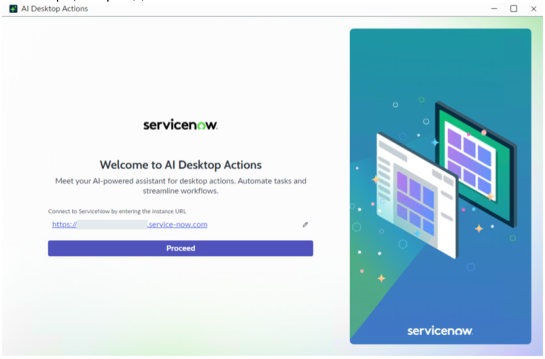

* **Bounding box:** x=82.0, y=405.5, width=432.0 pt, height=282.2 pt.
* **What is shown:** This embedded source image appears near `2. On the login page, in the Add ServiceNow URL field, enter the ServiceNow instance URL. / Example`. It is a product screenshot, form, UI panel, dialog, wizard, table-like screen, or instructional figure supporting the same-page task. Visible objects may include windows, tabs, form fields, buttons, record lists, panes, menus, highlighted controls, and explanatory labels. Its business purpose is to reduce ambiguity for a reader following the ServiceNow AI Desktop Actions procedure. Its technical purpose is to identify the exact interface element, screen state, or control referenced by the surrounding instructions.
* **Relationships / arrows / flow / labels:** The relationships are UI relationships visible inside the screenshot: fields belong to forms, buttons trigger actions, rows belong to lists/tables, and highlighted regions identify the target. No separate network topology, architecture boundary, or security zone is labeled unless it appears explicitly in the crop.
* **Visible text captured from image:**

```text
s 0 -
servicenow .
Welcome to Al Desktop Actions 5 h
Re
servicenow
```

### Source page 1342 — Image 2


* **Bounding box:** x=82.0, y=39.0, width=300.0 pt, height=304.5 pt.
* **What is shown:** This embedded source image appears near `No nearby heading text was detected.`. It is a product screenshot, form, UI panel, dialog, wizard, table-like screen, or instructional figure supporting the same-page task. Visible objects may include windows, tabs, form fields, buttons, record lists, panes, menus, highlighted controls, and explanatory labels. Its business purpose is to reduce ambiguity for a reader following the ServiceNow AI Desktop Actions procedure. Its technical purpose is to identify the exact interface element, screen state, or control referenced by the surrounding instructions.
* **Relationships / arrows / flow / labels:** The relationships are UI relationships visible inside the screenshot: fields belong to forms, buttons trigger actions, rows belong to lists/tables, and highlighted regions identify the target. No separate network topology, architecture boundary, or security zone is labeled unless it appears explicitly in the crop.
* **Visible text captured from image:**

```text
| servceow x
servicenow
0
```

### Source page 1342 — Image 3


* **Bounding box:** x=82.0, y=370.0, width=432.0 pt, height=289.4 pt.
* **What is shown:** This embedded source image appears near `5. Optional: On the onboarding journey modal, complete the onboarding and select Get started.`. It is a product screenshot, form, UI panel, dialog, wizard, table-like screen, or instructional figure supporting the same-page task. Visible objects may include windows, tabs, form fields, buttons, record lists, panes, menus, highlighted controls, and explanatory labels. Its business purpose is to reduce ambiguity for a reader following the ServiceNow AI Desktop Actions procedure. Its technical purpose is to identify the exact interface element, screen state, or control referenced by the surrounding instructions.
* **Relationships / arrows / flow / labels:** The relationships are UI relationships visible inside the screenshot: fields belong to forms, buttons trigger actions, rows belong to lists/tables, and highlighted regions identify the target. No separate network topology, architecture boundary, or security zone is labeled unless it appears explicitly in the crop.
* **Visible text captured from image:**

```text
Step 4
Activate the desktop action
After activating, your desktop action is ready in Al Agent Studio as a
tool for Al agent. All set and ready to go!
° Es
v
a =
```

### Source page 1343 — Image 4


* **Bounding box:** x=82.0, y=39.0, width=432.0 pt, height=281.7 pt.
* **What is shown:** This embedded source image appears near `No nearby heading text was detected.`. It is a product screenshot, form, UI panel, dialog, wizard, table-like screen, or instructional figure supporting the same-page task. Visible objects may include windows, tabs, form fields, buttons, record lists, panes, menus, highlighted controls, and explanatory labels. Its business purpose is to reduce ambiguity for a reader following the ServiceNow AI Desktop Actions procedure. Its technical purpose is to identify the exact interface element, screen state, or control referenced by the surrounding instructions.
* **Relationships / arrows / flow / labels:** The relationships are UI relationships visible inside the screenshot: fields belong to forms, buttons trigger actions, rows belong to lists/tables, and highlighted regions identify the target. No separate network topology, architecture boundary, or security zone is labeled unless it appears explicitly in the crop.
* **Visible text captured from image:**

```text
Let's build something powerful together
Scanian liga,
° —
cece
o —
```

### Source page 1343 — Image 5

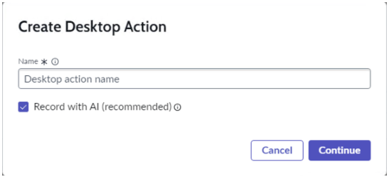

* **Bounding box:** x=92.0, y=370.4, width=432.0 pt, height=194.4 pt.
* **What is shown:** This embedded source image appears near `7. In the Create Desktop Action dialog, do one of the following. / ◦If you want to record with AI, keep the Record with AI (recommended) check box selected.`. It is a product screenshot, form, UI panel, dialog, wizard, table-like screen, or instructional figure supporting the same-page task. Visible objects may include windows, tabs, form fields, buttons, record lists, panes, menus, highlighted controls, and explanatory labels. Its business purpose is to reduce ambiguity for a reader following the ServiceNow AI Desktop Actions procedure. Its technical purpose is to identify the exact interface element, screen state, or control referenced by the surrounding instructions.
* **Relationships / arrows / flow / labels:** The relationships are UI relationships visible inside the screenshot: fields belong to forms, buttons trigger actions, rows belong to lists/tables, and highlighted regions identify the target. No separate network topology, architecture boundary, or security zone is labeled unless it appears explicitly in the crop.
* **Visible text captured from image:**

```text
Create Desktop Action
Name ©
@ Record with Al (recommended) ©
L ]
```

### Source page 1344 — Image 6

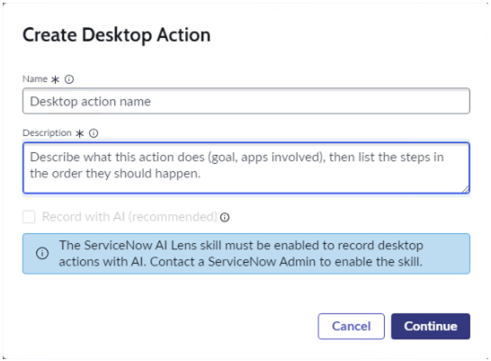

* **Bounding box:** x=92.0, y=67.2, width=432.0 pt, height=316.0 pt.
* **What is shown:** This embedded source image appears near `◦If you want to use manual recorder, clear the Record with AI (recommended) check box.`. It is a product screenshot, form, UI panel, dialog, wizard, table-like screen, or instructional figure supporting the same-page task. Visible objects may include windows, tabs, form fields, buttons, record lists, panes, menus, highlighted controls, and explanatory labels. Its business purpose is to reduce ambiguity for a reader following the ServiceNow AI Desktop Actions procedure. Its technical purpose is to identify the exact interface element, screen state, or control referenced by the surrounding instructions.
* **Relationships / arrows / flow / labels:** The relationships are UI relationships visible inside the screenshot: fields belong to forms, buttons trigger actions, rows belong to lists/tables, and highlighted regions identify the target. No separate network topology, architecture boundary, or security zone is labeled unless it appears explicitly in the crop.
* **Visible text captured from image:**

```text
Create Desktop Action
Name *« ©
Desktop action name
Description « ©
Describe what this action does (goal, apps involved), then list the steps in
the order they should happen
co)
```

### Source page 1345 — Image 7

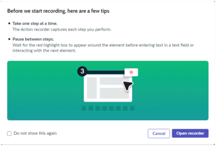

* **Bounding box:** x=82.0, y=39.0, width=432.0 pt, height=288.7 pt.
* **What is shown:** This embedded source image appears near `No nearby heading text was detected.`. It is a product screenshot, form, UI panel, dialog, wizard, table-like screen, or instructional figure supporting the same-page task. Visible objects may include windows, tabs, form fields, buttons, record lists, panes, menus, highlighted controls, and explanatory labels. Its business purpose is to reduce ambiguity for a reader following the ServiceNow AI Desktop Actions procedure. Its technical purpose is to identify the exact interface element, screen state, or control referenced by the surrounding instructions.
* **Relationships / arrows / flow / labels:** The relationships are UI relationships visible inside the screenshot: fields belong to forms, buttons trigger actions, rows belong to lists/tables, and highlighted regions identify the target. No separate network topology, architecture boundary, or security zone is labeled unless it appears explicitly in the crop.
* **Visible text captured from image:**

```text
Before we start recording, here are a few tips
```

### Source page 1345 — Image 8

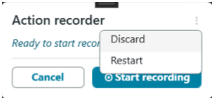

* **Bounding box:** x=82.0, y=371.0, width=210.0 pt, height=94.5 pt.
* **What is shown:** This embedded source image appears near `The AI Desktop Actions window is minimized and the Action recorder panel is launched. You / can freely drag and reposition the Action recorder panel anywhere on your desktop screen.`. It is a product screenshot, form, UI panel, dialog, wizard, table-like screen, or instructional figure supporting the same-page task. Visible objects may include windows, tabs, form fields, buttons, record lists, panes, menus, highlighted controls, and explanatory labels. Its business purpose is to reduce ambiguity for a reader following the ServiceNow AI Desktop Actions procedure. Its technical purpose is to identify the exact interface element, screen state, or control referenced by the surrounding instructions.
* **Relationships / arrows / flow / labels:** The relationships are UI relationships visible inside the screenshot: fields belong to forms, buttons trigger actions, rows belong to lists/tables, and highlighted regions identify the target. No separate network topology, architecture boundary, or security zone is labeled unless it appears explicitly in the crop.
* **Visible text captured from image:**

```text
Action recorder
Ready to start reco Discard
Restart
Comet)
```

### Source page 1346 — Image 9

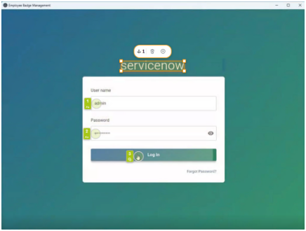

* **Bounding box:** x=112.0, y=324.8, width=432.0 pt, height=324.9 pt.
* **What is shown:** This embedded source image appears near `c. Generating screen contexts / Screen1`. It is a product screenshot, form, UI panel, dialog, wizard, table-like screen, or instructional figure supporting the same-page task. Visible objects may include windows, tabs, form fields, buttons, record lists, panes, menus, highlighted controls, and explanatory labels. Its business purpose is to reduce ambiguity for a reader following the ServiceNow AI Desktop Actions procedure. Its technical purpose is to identify the exact interface element, screen state, or control referenced by the surrounding instructions.
* **Relationships / arrows / flow / labels:** The relationships are UI relationships visible inside the screenshot: fields belong to forms, buttons trigger actions, rows belong to lists/tables, and highlighted regions identify the target. No separate network topology, architecture boundary, or security zone is labeled unless it appears explicitly in the crop.
* **Visible text captured from image:**

```text
SS =o x
```

### Source page 1347 — Image 10

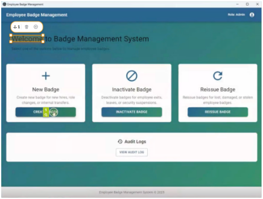

* **Bounding box:** x=112.0, y=52.0, width=432.0 pt, height=325.5 pt.
* **What is shown:** This embedded source image appears near `Screen2`. It is a product screenshot, form, UI panel, dialog, wizard, table-like screen, or instructional figure supporting the same-page task. Visible objects may include windows, tabs, form fields, buttons, record lists, panes, menus, highlighted controls, and explanatory labels. Its business purpose is to reduce ambiguity for a reader following the ServiceNow AI Desktop Actions procedure. Its technical purpose is to identify the exact interface element, screen state, or control referenced by the surrounding instructions.
* **Relationships / arrows / flow / labels:** The relationships are UI relationships visible inside the screenshot: fields belong to forms, buttons trigger actions, rows belong to lists/tables, and highlighted regions identify the target. No separate network topology, architecture boundary, or security zone is labeled unless it appears explicitly in the crop.
* **Visible text captured from image:**

```text
ess a5
EE @ ce
```

### Source page 1347 — Image 11

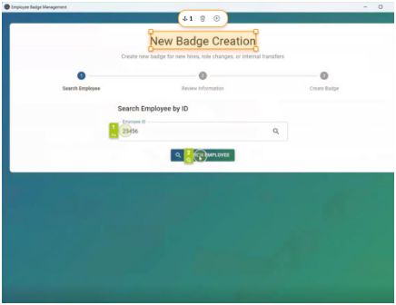

* **Bounding box:** x=112.0, y=403.7, width=432.0 pt, height=330.6 pt.
* **What is shown:** This embedded source image appears near `Screen2 / Screen3`. It is a product screenshot, form, UI panel, dialog, wizard, table-like screen, or instructional figure supporting the same-page task. Visible objects may include windows, tabs, form fields, buttons, record lists, panes, menus, highlighted controls, and explanatory labels. Its business purpose is to reduce ambiguity for a reader following the ServiceNow AI Desktop Actions procedure. Its technical purpose is to identify the exact interface element, screen state, or control referenced by the surrounding instructions.
* **Relationships / arrows / flow / labels:** The relationships are UI relationships visible inside the screenshot: fields belong to forms, buttons trigger actions, rows belong to lists/tables, and highlighted regions identify the target. No separate network topology, architecture boundary, or security zone is labeled unless it appears explicitly in the crop.
* **Visible text captured from image:**

```text
[No reliable OCR text detected; source image asset retained for visual verification.]
```

### Source page 1348 — Image 12

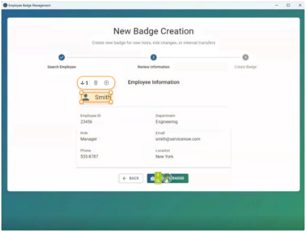

* **Bounding box:** x=112.0, y=52.0, width=432.0 pt, height=325.3 pt.
* **What is shown:** This embedded source image appears near `Screen4`. It is a product screenshot, form, UI panel, dialog, wizard, table-like screen, or instructional figure supporting the same-page task. Visible objects may include windows, tabs, form fields, buttons, record lists, panes, menus, highlighted controls, and explanatory labels. Its business purpose is to reduce ambiguity for a reader following the ServiceNow AI Desktop Actions procedure. Its technical purpose is to identify the exact interface element, screen state, or control referenced by the surrounding instructions.
* **Relationships / arrows / flow / labels:** The relationships are UI relationships visible inside the screenshot: fields belong to forms, buttons trigger actions, rows belong to lists/tables, and highlighted regions identify the target. No separate network topology, architecture boundary, or security zone is labeled unless it appears explicitly in the crop.
* **Visible text captured from image:**

```text
= ae
New Badge Creation
° ° °
a
```

### Source page 1348 — Image 13

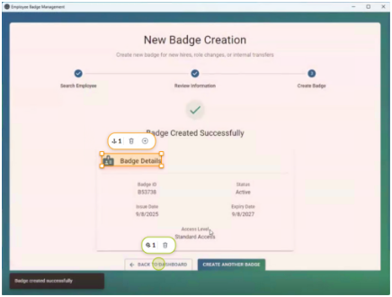

* **Bounding box:** x=112.0, y=403.5, width=432.0 pt, height=324.5 pt.
* **What is shown:** This embedded source image appears near `Screen4 / Screen5`. It is a product screenshot, form, UI panel, dialog, wizard, table-like screen, or instructional figure supporting the same-page task. Visible objects may include windows, tabs, form fields, buttons, record lists, panes, menus, highlighted controls, and explanatory labels. Its business purpose is to reduce ambiguity for a reader following the ServiceNow AI Desktop Actions procedure. Its technical purpose is to identify the exact interface element, screen state, or control referenced by the surrounding instructions.
* **Relationships / arrows / flow / labels:** The relationships are UI relationships visible inside the screenshot: fields belong to forms, buttons trigger actions, rows belong to lists/tables, and highlighted regions identify the target. No separate network topology, architecture boundary, or security zone is labeled unless it appears explicitly in the crop.
* **Visible text captured from image:**

```text
SS
New Badge Creation
° ° °
v
amp
```

### Source page 1350 — Image 14

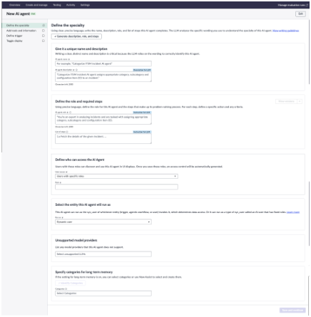

* **Bounding box:** x=82.0, y=147.0, width=432.0 pt, height=440.6 pt.
* **What is shown:** This embedded source image appears near `2. From the Add drop-down, select Chat. / 3. On the New AI Agent page, in the Define the specialty step, define your AI agent and provide`. It is a product screenshot, form, UI panel, dialog, wizard, table-like screen, or instructional figure supporting the same-page task. Visible objects may include windows, tabs, form fields, buttons, record lists, panes, menus, highlighted controls, and explanatory labels. Its business purpose is to reduce ambiguity for a reader following the ServiceNow AI Desktop Actions procedure. Its technical purpose is to identify the exact interface element, screen state, or control referenced by the surrounding instructions.
* **Relationships / arrows / flow / labels:** The relationships are UI relationships visible inside the screenshot: fields belong to forms, buttons trigger actions, rows belong to lists/tables, and highlighted regions identify the target. No separate network topology, architecture boundary, or security zone is labeled unless it appears explicitly in the crop.
* **Visible text captured from image:**

```text
[No reliable OCR text detected; source image asset retained for visual verification.]
```

### Source page 1354 — Image 15


* **Bounding box:** x=82.0, y=365.9, width=432.0 pt, height=282.2 pt.
* **What is shown:** This embedded source image appears near `2. On the login page, in the Add ServiceNow URL field, enter the ServiceNow instance URL. / Example`. It is a product screenshot, form, UI panel, dialog, wizard, table-like screen, or instructional figure supporting the same-page task. Visible objects may include windows, tabs, form fields, buttons, record lists, panes, menus, highlighted controls, and explanatory labels. Its business purpose is to reduce ambiguity for a reader following the ServiceNow AI Desktop Actions procedure. Its technical purpose is to identify the exact interface element, screen state, or control referenced by the surrounding instructions.
* **Relationships / arrows / flow / labels:** The relationships are UI relationships visible inside the screenshot: fields belong to forms, buttons trigger actions, rows belong to lists/tables, and highlighted regions identify the target. No separate network topology, architecture boundary, or security zone is labeled unless it appears explicitly in the crop.
* **Visible text captured from image:**

```text
BA Dextp,
es 7
```

### Source page 1355 — Image 16

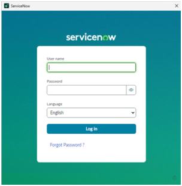

* **Bounding box:** x=82.0, y=39.0, width=300.0 pt, height=304.5 pt.
* **What is shown:** This embedded source image appears near `No nearby heading text was detected.`. It is a product screenshot, form, UI panel, dialog, wizard, table-like screen, or instructional figure supporting the same-page task. Visible objects may include windows, tabs, form fields, buttons, record lists, panes, menus, highlighted controls, and explanatory labels. Its business purpose is to reduce ambiguity for a reader following the ServiceNow AI Desktop Actions procedure. Its technical purpose is to identify the exact interface element, screen state, or control referenced by the surrounding instructions.
* **Relationships / arrows / flow / labels:** The relationships are UI relationships visible inside the screenshot: fields belong to forms, buttons trigger actions, rows belong to lists/tables, and highlighted regions identify the target. No separate network topology, architecture boundary, or security zone is labeled unless it appears explicitly in the crop.
* **Visible text captured from image:**

```text
DB evevow x
servicenow
```

### Source page 1355 — Image 17

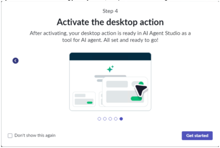

* **Bounding box:** x=82.0, y=370.0, width=432.0 pt, height=289.4 pt.
* **What is shown:** This embedded source image appears near `5. Optional: On the onboarding journey modal, complete the onboarding and select Get started.`. It is a product screenshot, form, UI panel, dialog, wizard, table-like screen, or instructional figure supporting the same-page task. Visible objects may include windows, tabs, form fields, buttons, record lists, panes, menus, highlighted controls, and explanatory labels. Its business purpose is to reduce ambiguity for a reader following the ServiceNow AI Desktop Actions procedure. Its technical purpose is to identify the exact interface element, screen state, or control referenced by the surrounding instructions.
* **Relationships / arrows / flow / labels:** The relationships are UI relationships visible inside the screenshot: fields belong to forms, buttons trigger actions, rows belong to lists/tables, and highlighted regions identify the target. No separate network topology, architecture boundary, or security zone is labeled unless it appears explicitly in the crop.
* **Visible text captured from image:**

```text
step 4
Activate the desktop action
Toolfor Al agent Al stand vey to Be!
De
_); om
‘Don't show this agai =a
```

### Source page 1356 — Image 18

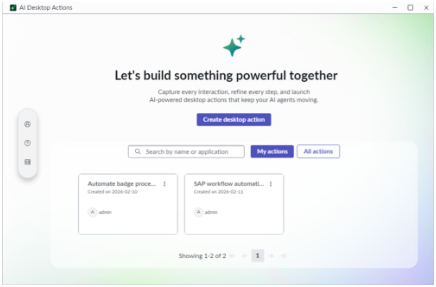

* **Bounding box:** x=82.0, y=39.0, width=432.0 pt, height=281.7 pt.
* **What is shown:** This embedded source image appears near `No nearby heading text was detected.`. It is a product screenshot, form, UI panel, dialog, wizard, table-like screen, or instructional figure supporting the same-page task. Visible objects may include windows, tabs, form fields, buttons, record lists, panes, menus, highlighted controls, and explanatory labels. Its business purpose is to reduce ambiguity for a reader following the ServiceNow AI Desktop Actions procedure. Its technical purpose is to identify the exact interface element, screen state, or control referenced by the surrounding instructions.
* **Relationships / arrows / flow / labels:** The relationships are UI relationships visible inside the screenshot: fields belong to forms, buttons trigger actions, rows belong to lists/tables, and highlighted regions identify the target. No separate network topology, architecture boundary, or security zone is labeled unless it appears explicitly in the crop.
* **Visible text captured from image:**

```text
i L_____J = Ox
Let's build something powerful together
. errr od
```

### Source page 1356 — Image 19

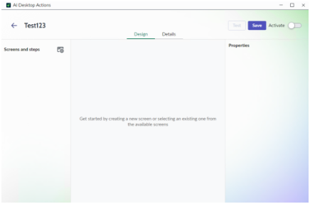

* **Bounding box:** x=82.0, y=351.4, width=432.0 pt, height=281.7 pt.
* **What is shown:** This embedded source image appears near `The Design workspace is displayed.`. It is a product screenshot, form, UI panel, dialog, wizard, table-like screen, or instructional figure supporting the same-page task. Visible objects may include windows, tabs, form fields, buttons, record lists, panes, menus, highlighted controls, and explanatory labels. Its business purpose is to reduce ambiguity for a reader following the ServiceNow AI Desktop Actions procedure. Its technical purpose is to identify the exact interface element, screen state, or control referenced by the surrounding instructions.
* **Relationships / arrows / flow / labels:** The relationships are UI relationships visible inside the screenshot: fields belong to forms, buttons trigger actions, rows belong to lists/tables, and highlighted regions identify the target. No separate network topology, architecture boundary, or security zone is labeled unless it appears explicitly in the crop.
* **Visible text captured from image:**

```text
i ___—__] a
eo
Somme OB. c=
diver remeniceeingmnten
```

### Source page 1357 — Image 20

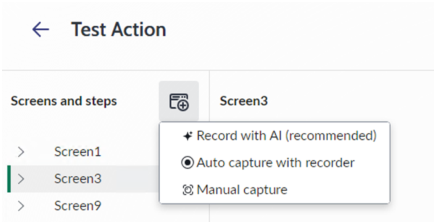

* **Bounding box:** x=92.0, y=39.0, width=432.0 pt, height=218.5 pt.
* **What is shown:** This embedded source image appears near `No nearby heading text was detected.`. It is a product screenshot, form, UI panel, dialog, wizard, table-like screen, or instructional figure supporting the same-page task. Visible objects may include windows, tabs, form fields, buttons, record lists, panes, menus, highlighted controls, and explanatory labels. Its business purpose is to reduce ambiguity for a reader following the ServiceNow AI Desktop Actions procedure. Its technical purpose is to identify the exact interface element, screen state, or control referenced by the surrounding instructions.
* **Relationships / arrows / flow / labels:** The relationships are UI relationships visible inside the screenshot: fields belong to forms, buttons trigger actions, rows belong to lists/tables, and highlighted regions identify the target. No separate network topology, architecture boundary, or security zone is labeled unless it appears explicitly in the crop.
* **Visible text captured from image:**

```text
€_ Test Action
Screens and steps FB Screen3.
+ Record with Al (recommended)
> Screent
@Auto capture with recorder
[> screens
@ Manual capture
> Screen? La
```

### Source page 1357 — Image 21

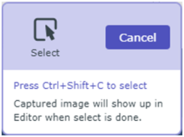

* **Bounding box:** x=92.0, y=348.2, width=225.0 pt, height=166.5 pt.
* **What is shown:** This embedded source image appears near `You can also extend the desktop action logic using the Record with AI (Recommended) or / Auto capture with recorder options. For more information, see Automate repetitive tasks`. It is a product screenshot, form, UI panel, dialog, wizard, table-like screen, or instructional figure supporting the same-page task. Visible objects may include windows, tabs, form fields, buttons, record lists, panes, menus, highlighted controls, and explanatory labels. Its business purpose is to reduce ambiguity for a reader following the ServiceNow AI Desktop Actions procedure. Its technical purpose is to identify the exact interface element, screen state, or control referenced by the surrounding instructions.
* **Relationships / arrows / flow / labels:** The relationships are UI relationships visible inside the screenshot: fields belong to forms, buttons trigger actions, rows belong to lists/tables, and highlighted regions identify the target. No separate network topology, architecture boundary, or security zone is labeled unless it appears explicitly in the crop.
* **Visible text captured from image:**

```text
a
Select
Captured image will show up in
Editor when select is done.
```

### Source page 1358 — Image 22

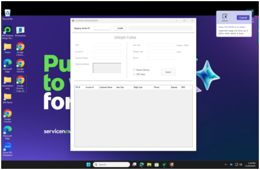

* **Bounding box:** x=92.0, y=39.0, width=432.0 pt, height=280.8 pt.
* **What is shown:** This embedded source image appears near `No nearby heading text was detected.`. It is a product screenshot, form, UI panel, dialog, wizard, table-like screen, or instructional figure supporting the same-page task. Visible objects may include windows, tabs, form fields, buttons, record lists, panes, menus, highlighted controls, and explanatory labels. Its business purpose is to reduce ambiguity for a reader following the ServiceNow AI Desktop Actions procedure. Its technical purpose is to identify the exact interface element, screen state, or control referenced by the surrounding instructions.
* **Relationships / arrows / flow / labels:** The relationships are UI relationships visible inside the screenshot: fields belong to forms, buttons trigger actions, rows belong to lists/tables, and highlighted regions identify the target. No separate network topology, architecture boundary, or security zone is labeled unless it appears explicitly in the crop.
* **Visible text captured from image:**

```text
oe =a
=o
ea X
Le) y
a)
9
= GD tor
```

### Source page 1359 — Image 23

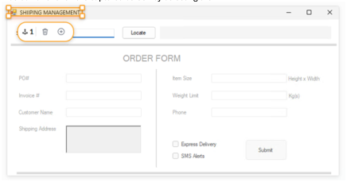

* **Bounding box:** x=92.0, y=60.8, width=432.0 pt, height=223.2 pt.
* **What is shown:** This embedded source image appears near `a. Insert an anchor on the captured screen by selecting the Add anchor icon`. It is a product screenshot, form, UI panel, dialog, wizard, table-like screen, or instructional figure supporting the same-page task. Visible objects may include windows, tabs, form fields, buttons, record lists, panes, menus, highlighted controls, and explanatory labels. Its business purpose is to reduce ambiguity for a reader following the ServiceNow AI Desktop Actions procedure. Its technical purpose is to identify the exact interface element, screen state, or control referenced by the surrounding instructions.
* **Relationships / arrows / flow / labels:** The relationships are UI relationships visible inside the screenshot: fields belong to forms, buttons trigger actions, rows belong to lists/tables, and highlighted regions identify the target. No separate network topology, architecture boundary, or security zone is labeled unless it appears explicitly in the crop.
* **Visible text captured from image:**

```text
st
7 - _
_ 7
```

### Source page 1360 — Image 24

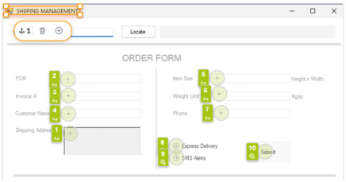

* **Bounding box:** x=92.0, y=39.0, width=432.0 pt, height=223.6 pt.
* **What is shown:** This embedded source image appears near `No nearby heading text was detected.`. It is a product screenshot, form, UI panel, dialog, wizard, table-like screen, or instructional figure supporting the same-page task. Visible objects may include windows, tabs, form fields, buttons, record lists, panes, menus, highlighted controls, and explanatory labels. Its business purpose is to reduce ambiguity for a reader following the ServiceNow AI Desktop Actions procedure. Its technical purpose is to identify the exact interface element, screen state, or control referenced by the surrounding instructions.
* **Relationships / arrows / flow / labels:** The relationships are UI relationships visible inside the screenshot: fields belong to forms, buttons trigger actions, rows belong to lists/tables, and highlighted regions identify the target. No separate network topology, architecture boundary, or security zone is labeled unless it appears explicitly in the crop.
* **Visible text captured from image:**

```text
ORDER FORM
= fe -- F@ —
— BO vt a
on ‘a Prone
fea
```

### Source page 1362 — Image 25


* **Bounding box:** x=82.0, y=39.0, width=432.0 pt, height=440.6 pt.
* **What is shown:** This embedded source image appears near `No nearby heading text was detected.`. It is a product screenshot, form, UI panel, dialog, wizard, table-like screen, or instructional figure supporting the same-page task. Visible objects may include windows, tabs, form fields, buttons, record lists, panes, menus, highlighted controls, and explanatory labels. Its business purpose is to reduce ambiguity for a reader following the ServiceNow AI Desktop Actions procedure. Its technical purpose is to identify the exact interface element, screen state, or control referenced by the surrounding instructions.
* **Relationships / arrows / flow / labels:** The relationships are UI relationships visible inside the screenshot: fields belong to forms, buttons trigger actions, rows belong to lists/tables, and highlighted regions identify the target. No separate network topology, architecture boundary, or security zone is labeled unless it appears explicitly in the crop.
* **Visible text captured from image:**

```text
[No reliable OCR text detected; source image asset retained for visual verification.]
```


---

## TABLES

### Source page 1349 — Table 1

**Nearby source context:** 16. Configure the following properties for the captured steps.

| Screen > Step | Property | Value |
| --- | --- | --- |
| Screen1 > SetText1 | Value | admin |
| Screen1 > SetText2 | Value | Enter your password |
| Screen1 > Click1 | Delay after | 5 |
| Screen2 > Click2 | Delay after | 5 |
| Screen3 > Click2 | Delay after | 10 |

### Source page 1350 — Table 2

**Nearby source context:** a. Describe your AI Agent by giving it a unique name and description. / Give it a unique name and description

| Field | Description |
| --- | --- |
| AI agent name | Badge Management Agent |

### Source page 1351 — Table 3

| Field | Description |
| --- | --- |
|  | application and perform various tasks—<br>create badges, deactivate badges, replace<br>lost badges, and Reissue the badges. The<br>agent executes the appropriate desktop<br>actions automatically. This reduces manual<br>effort, ensures process consistency, and<br>speeds up the overall employee lifecycle<br>experience. |

### Source page 1351 — Table 4

**Nearby source context:** Note: The AI agent uses this information as guidance to tailor its responses and / Define the role and required steps

| Field | Description |
| --- | --- |
| AI agent role | Automates the intake of badge-related<br>requests and performs accurate, end-to-<br>end execution of badge actions—such<br>as issuance, replacement, temporary<br>provisioning, and deactivation—across the<br>HR and security systems. |

### Source page 1352 — Table 5

| Field | Description |
| --- | --- |
|  | i. Deactivate a badge in Employee Badge<br>Management application by invoking<br>Deactivate badge desktop action.<br>ii.If badge deactivation failed, create<br>an incident with the issue details.<br>Otherwise, continue with other steps.<br>▪Reissue Badge<br>i. Reissue a badge in Employee Badge<br>Management application by invoking<br>Reissue badge desktop action.<br>ii.If badge deactivation failed, create<br>an incident with the issue details.<br>Otherwise, continue with other steps.<br>▪Issue a temporary badge<br>i. Issue a temporary badge in Employee<br>Badge Management application by<br>invoking Issue temporary badge<br>desktop action.<br>ii.If badge reissue failed, create an<br>incident with the issue details.<br>Otherwise, continue with other steps.<br>Log out of the Employee Badge<br>Management application by invoking the<br>Badge application logout desktop action. |

### Source page 1360 — Table 6

| Number | Field | Step |
| --- | --- | --- |
| 1 | PO | Set Text |
| 2 | Invoice | Set Text |
| 3 | Customer Name | Set Text |
| 4 | Shipping Address | Set Text |
| 5 | Item size | Set Text |
| 6 | Weight limit | Set Text |
| 7 | Phone | Set Text |
| 8 | Express Delivery | Click |
| 9 | SMS Alerts | Click |
| 10 | Submit | Click |

### Source page 1362 — Table 7

**Nearby source context:** a. Describe your AI Agent by giving it a unique name and description. / Give it a unique name and description

| Field | Description |
| --- | --- |
| AI agent name | Shipping Management Agent |
| AI agent Description | The Shipping Management Agent<br>automates end-to-end handling of shipping<br>orders across multiple platforms. It retrieves<br>order data from an Excel sheet and<br>seamlessly uploads the information into the<br>shipping management tool. This reduces<br>manual effort, ensures data consistency,<br>and accelerates the overall invoice life cycle. |

### Source page 1363 — Table 8

**Nearby source context:** Note: The AI agent uses this information as guidance to tailor its responses and / Define the role and required steps

| Field | Description |
| --- | --- |
| AI agent role | Automates the retrieval of shipping orders<br>from Excel and performs seamless data<br>entry into the shipping management<br>application. |
| List of steps<br>v | Note: If your automation requires<br>manual inputs, such as entering an<br>OTP or CAPTCHA, you must provide<br>instructions to the AI Agent to wait<br>for the user input during execution.<br>Otherwise, the automation can't<br>proceed.<br>i. Launch and log in to the Shipping<br>Management application.<br>ii.Open the Excel file from the user-<br>specified folder.<br>iii. Navigate to the designated worksheet<br>within the Excel file.<br>iv.Read the required columns for each order<br>from the Excel sheet.<br>v. Enter the extracted data into the<br>corresponding fields in the shipping<br>management application.<br>vi. Select Submit to register the order.<br>ii.Repeat steps 4–6 until all pending orders<br>in the Excel sheet have been processed. |


---

## FIGURES

| Figure / visual | Source page | Asset or location | Analysis |
|---|---:|---|---|
| Embedded screenshot or instructional image 1 | 1341 | `_assets/p1341_image01.png` | Detailed image analysis and OCR text are provided in IMAGE DESCRIPTIONS. |
| Embedded screenshot or instructional image 2 | 1342 | `_assets/p1342_image01.png` | Detailed image analysis and OCR text are provided in IMAGE DESCRIPTIONS. |
| Embedded screenshot or instructional image 3 | 1342 | `_assets/p1342_image02.png` | Detailed image analysis and OCR text are provided in IMAGE DESCRIPTIONS. |
| Embedded screenshot or instructional image 4 | 1343 | `_assets/p1343_image01.png` | Detailed image analysis and OCR text are provided in IMAGE DESCRIPTIONS. |
| Embedded screenshot or instructional image 5 | 1343 | `_assets/p1343_image02.png` | Detailed image analysis and OCR text are provided in IMAGE DESCRIPTIONS. |
| Embedded screenshot or instructional image 6 | 1344 | `_assets/p1344_image01.png` | Detailed image analysis and OCR text are provided in IMAGE DESCRIPTIONS. |
| Embedded screenshot or instructional image 7 | 1345 | `_assets/p1345_image01.png` | Detailed image analysis and OCR text are provided in IMAGE DESCRIPTIONS. |
| Embedded screenshot or instructional image 8 | 1345 | `_assets/p1345_image02.png` | Detailed image analysis and OCR text are provided in IMAGE DESCRIPTIONS. |
| Embedded screenshot or instructional image 9 | 1346 | `_assets/p1346_image01.png` | Detailed image analysis and OCR text are provided in IMAGE DESCRIPTIONS. |
| Embedded screenshot or instructional image 10 | 1347 | `_assets/p1347_image01.png` | Detailed image analysis and OCR text are provided in IMAGE DESCRIPTIONS. |
| Embedded screenshot or instructional image 11 | 1347 | `_assets/p1347_image02.png` | Detailed image analysis and OCR text are provided in IMAGE DESCRIPTIONS. |
| Embedded screenshot or instructional image 12 | 1348 | `_assets/p1348_image01.png` | Detailed image analysis and OCR text are provided in IMAGE DESCRIPTIONS. |
| Embedded screenshot or instructional image 13 | 1348 | `_assets/p1348_image02.png` | Detailed image analysis and OCR text are provided in IMAGE DESCRIPTIONS. |
| Embedded screenshot or instructional image 14 | 1350 | `_assets/p1350_image01.png` | Detailed image analysis and OCR text are provided in IMAGE DESCRIPTIONS. |
| Embedded screenshot or instructional image 15 | 1354 | `_assets/p1354_image01.png` | Detailed image analysis and OCR text are provided in IMAGE DESCRIPTIONS. |
| Embedded screenshot or instructional image 16 | 1355 | `_assets/p1355_image01.png` | Detailed image analysis and OCR text are provided in IMAGE DESCRIPTIONS. |
| Embedded screenshot or instructional image 17 | 1355 | `_assets/p1355_image02.png` | Detailed image analysis and OCR text are provided in IMAGE DESCRIPTIONS. |
| Embedded screenshot or instructional image 18 | 1356 | `_assets/p1356_image01.png` | Detailed image analysis and OCR text are provided in IMAGE DESCRIPTIONS. |
| Embedded screenshot or instructional image 19 | 1356 | `_assets/p1356_image02.png` | Detailed image analysis and OCR text are provided in IMAGE DESCRIPTIONS. |
| Embedded screenshot or instructional image 20 | 1357 | `_assets/p1357_image01.png` | Detailed image analysis and OCR text are provided in IMAGE DESCRIPTIONS. |
| Embedded screenshot or instructional image 21 | 1357 | `_assets/p1357_image02.png` | Detailed image analysis and OCR text are provided in IMAGE DESCRIPTIONS. |
| Embedded screenshot or instructional image 22 | 1358 | `_assets/p1358_image01.png` | Detailed image analysis and OCR text are provided in IMAGE DESCRIPTIONS. |
| Embedded screenshot or instructional image 23 | 1359 | `_assets/p1359_image01.png` | Detailed image analysis and OCR text are provided in IMAGE DESCRIPTIONS. |
| Embedded screenshot or instructional image 24 | 1360 | `_assets/p1360_image01.png` | Detailed image analysis and OCR text are provided in IMAGE DESCRIPTIONS. |
| Embedded screenshot or instructional image 25 | 1362 | `_assets/p1362_image01.png` | Detailed image analysis and OCR text are provided in IMAGE DESCRIPTIONS. |
| Markdown-converted table/grid 1 | 1349 | TABLES section | Source table/grid region converted into Markdown; nearby context: 16. Configure the following properties for the captured steps. |
| Markdown-converted table/grid 2 | 1350 | TABLES section | Source table/grid region converted into Markdown; nearby context: a. Describe your AI Agent by giving it a unique name and description. / Give it a unique name and description |
| Markdown-converted table/grid 3 | 1351 | TABLES section | Source table/grid region converted into Markdown; nearby context:  |
| Markdown-converted table/grid 4 | 1351 | TABLES section | Source table/grid region converted into Markdown; nearby context: Note: The AI agent uses this information as guidance to tailor its responses and / Define the role and required steps |
| Markdown-converted table/grid 5 | 1352 | TABLES section | Source table/grid region converted into Markdown; nearby context:  |
| Markdown-converted table/grid 6 | 1360 | TABLES section | Source table/grid region converted into Markdown; nearby context:  |
| Markdown-converted table/grid 7 | 1362 | TABLES section | Source table/grid region converted into Markdown; nearby context: a. Describe your AI Agent by giving it a unique name and description. / Give it a unique name and description |
| Markdown-converted table/grid 8 | 1363 | TABLES section | Source table/grid region converted into Markdown; nearby context: Note: The AI agent uses this information as guidance to tailor its responses and / Define the role and required steps |


---

## QUALITY ASSURANCE NOTES

* PAGES REVIEWED: 1340, 1341, 1342, 1343, 1344, 1345, 1346, 1347, 1348, 1349, 1350, 1351, 1352, 1353, 1354, 1355, 1356, 1357, 1358, 1359, 1360, 1361, 1362, 1363, 1364, 1365. Source page range: 1340-1365 (shared boundary pages split at source headings).
* IMAGES REVIEWED: 54 image blocks assigned/reviewed: 25 recurring header logo block(s), 4 small icon/pictogram block(s), and 25 large screenshot/diagram crop(s).
* TABLES REVIEWED: 8 table/grid region(s) converted to Markdown. Table pages: 1349, 1350, 1351, 1352, 1360, 1362, 1363.
* FIGURES REVIEWED: 25 large screenshot/diagram figure(s) plus 8 table/grid visual(s).
* OCR ISSUES FOUND: No unresolved OCR issues were identified in the main text layer after cleanup.
* OCR ISSUES CORRECTED: Removed recurring footer/page-number noise from the main content stream, normalized nonbreaking spaces and soft-hyphen/control artifacts, preserved bullets/numbering/property names, converted detected tables to Markdown, and OCR-processed large non-logo embedded images.
* SECTION MAPPING NOTES: Folder name is exactly `AI Desktop Actions`. File name and subsection name are exactly `Desktop action examples` from the TOC. Shared source pages were split at heading coordinates from the PDF text layer.
* PAGE FOOTERS REVIEWED: Reviewed recurring ServiceNow copyright/trademark footer and logical page numbers. Footer text reviewed: `© 2026 ServiceNow, Inc. All rights reserved. ServiceNow, the ServiceNow logo, Now, and other ServiceNow marks are trademarks and/or registered trademarks of ServiceNow, Inc., in the United States and/or other countries. Other company names, product names, and logos may be trademarks of the respective companies with which they are associated.`
* RECHECK PASSES COMPLETED: 12/12: page completeness, text extraction, table extraction, image extraction, diagram interpretation, section mapping, subsection mapping, file names, folder names, Markdown formatting, missed-content review, and OCR/text-layer cleanup.
* VERIFICATION ARTIFACTS: Large image crops and `image_inventory.csv` are stored in the `_assets` folder inside this section folder.
