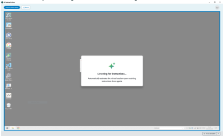
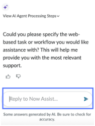
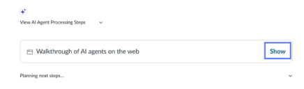
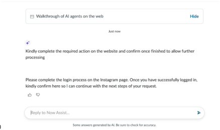
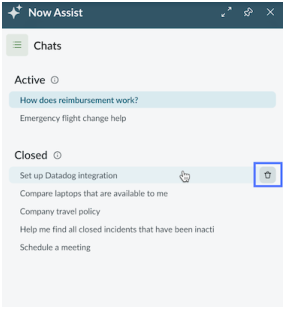
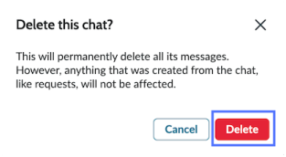

# Execute desktop actions

## SOURCE INFORMATION

* SECTION NAME: AI Desktop Actions
* SUBSECTION NAME: Execute desktop actions
* SOURCE FILE NAME: AI Desktop Actions.pdf
* PAGE RANGE: 1365-1375 (shared boundary pages split at source headings)
* EXTRACTION DATE: 2026-06-17

---

# CONTENT

> Source page: 1365

### Examples of executing desktop actions using AI agents

These examples explain how to trigger AI Agents that execute automations you designed using
desktop actions. The following topics walk you through the end-to-end execution flow so you
understand how AI-driven execution works in your desktop environment.

#### Example: Use AI agents to process badge-related requests automatically

As an HR representative, automatically process various badge requests by triggering AI agents
that use desktop action tools from the Now Assist panel.
Before you begin
To access the AI Desktop Actions functionality, perform the following steps:
• Enable AI Desktop Actions on your ServiceNow instance. For more information, see Configure
AI Desktop Actions.
• Download the AI Desktop Actions installer to automate repetitive tasks across applications and
systems. For more information, see Download AI Desktop Actions installer.
Confirm that the following system requirements are met:
• Windows 11 operating system is used.
• A .NET 9.0 runtime v9.0.10 and .NET 9 Desktop Runtime v9.0.10 is installed.
• No extended monitors are connected.
• Remote Desktop must be enabled on your machine and your account must be granted
Remote Desktop access permissions before you start using the AI Desktop Actions Execution
workspace.
• Theme must match between the systems used for recording and execution.
• Confirm that your firewall allows bidirectional traffic between the AI Desktop Actions
application and your ServiceNow instance on the port 80 for HTTP and port 443 for HTTPs.
If your organization uses non-standard ports for HTTP or HTTPS, confirm the correct ports with
your IT administrator before proceeding.
You must have full permissions to create and use system I/O communication pipes.
• If applicable, confirm that the snada:// custom URI protocol is registered to launch the AI
Desktop Actions application in the browser.

#### Note: Screen resolution and scaling must be the same between the systems used for

recording and execution of desktop actions that are created before AI Desktop Actions
v1.0.1.

> Source page: 1366

Familiarize yourself with the AI Desktop Actions Execution workspace. For more information, see
AI Desktop Actions Execution workspace.
Role required: now_assist_panel_user
About this task
AI agents use desktop actions that are designed in the AI Desktop Actions Design workspace
as tools. When an AI agent is triggered from the Now Assist panel, it determines which desktop
actions it can use to perform the automation. Once triggered, the automation is executed in the
desktop-in-desktop mode within the AI Desktop Actions Execution workspace.
Execution workspace waiting for instruction from AI Agent Studio

#### Note:

To avoid conflicts, do not run the AI Desktop Actions Execution workspace and RPA
Attended Desktop mode at the same time.
Procedure
1. Navigate to All > Requests > Assigned to you and select all the pending requests that you
would like to resolve.
2. Open the Now Assist panel by using the Now Assist
icon.
3. On the Now Assist panel, enter Use the badge management tool and process
the selected requests.
4. Monitor the automation execution.
Automation execution process on Now Assist panel and AI Desktop Actions
On Now Assist panel
On AI Desktop Actions Execution workspace
The AI agent is triggered and starts preparing
The Execution workspace launches. The AI
a plan.
agent logs in.

> Source page: 1367

On Now Assist panel
On AI Desktop Actions Execution workspace
If this is the first time you launch the
Execution workspace using AI agents, enter
your Windows Security credentials when
prompted.
The agent shows which desktop actions it
The Execution workspace waits for
uses for the execution.
instructions from AI Agent Studio.
The AI agent shows each step as it executes
The AI agent performs the tasks in the
them.
Execution workspace that shows the
execution status. For more information, see
Execution statuses.
The outcome of the execution is shown in the
The Execution workspace returns to the
Now Assist panel.
ready state.

#### Note: If a pop-up window blocks the automation, select Step in to clear it, then select

Step out to return control to the agent.
During execution, the agent uses the values configured for each input. Values can come from
two sources: static values set during design time, or mapped parameter records. If you also
specify values for inputs configured for parameters in the agent instructions or in the Now
Assist panel, the mapped parameter values override them.
5. Optional: Interact with the automation when your inputs are required.
  ◦Step in: take control whenever human inputs are required
  ◦Step out: give the control back to the AI agent.

#### Note: If your automation requires manual inputs, such as entering an OTP or CAPTCHA,

you must provide instructions to the AI Agent to wait for the user input during execution.
Otherwise, the automation can't proceed.
6. Optional: Use the smart sizing options to enable your desktop executions automatically adapt
to your display.
Option
Description
Scales the execution screen to fit within the
display area of the Execution workspace. The
entire screen is visible without scrolling.
Fit to window
(Optional) Shortcut: ctrl+shift+w
Displays the execution screen at its original
resolution. Scroll bars appear if the screen is
larger than the display area of the Execution
Original resolution
workspace.
(Optional) Shortcut: ctrl+shift+d
Trouble?
If the desktop session isn't sized correctly and mouse actions aren't working as expected after
you enter the session, use the following keyboard shortcuts to resize the session:

> Source page: 1368

Ctrl + Shift + W: Resize to window view.
Ctrl + Shift + D: Resize to actual desktop view.

#### Example: Use AI agents to automatically enter data into the shipping

#### management app

As a shipping coordinator, enter shipping details automatically from Excel to the Shipping
Management app by triggering AI agents that use desktop action tools from the Now Assist
panel.
Before you begin
To access the AI Desktop Actions functionality, perform the following steps:
• Enable AI Desktop Actions on your ServiceNow instance. For more information, see Configure
AI Desktop Actions.
• Download the AI Desktop Actions installer to automate repetitive tasks across applications and
systems. For more information, see Download AI Desktop Actions installer.
Confirm that the following system requirements are met:
• Windows 11 operating system is used.
• A .NET 9.0 runtime v9.0.10 and .NET 9 Desktop Runtime v9.0.10 is installed.
• No extended monitors are connected.
• Remote Desktop must be enabled on your machine and your account must be granted
Remote Desktop access permissions before you start using the AI Desktop Actions Execution
workspace.
• Theme must match between the systems used for recording and execution.
• Confirm that your firewall allows bidirectional traffic between the AI Desktop Actions
application and your ServiceNow instance on the port 80 for HTTP and port 443 for HTTPs.
If your organization uses non-standard ports for HTTP or HTTPS, confirm the correct ports with
your IT administrator before proceeding.
You must have full permissions to create and use system I/O communication pipes.
• If applicable, confirm that the snada:// custom URI protocol is registered to launch the AI
Desktop Actions application in the browser.

#### Note: Screen resolution and scaling must be the same between the systems used for

recording and execution of desktop actions that are created prior to AI Desktop Actions
v1.0.1.
Familiarize yourself with the AI Desktop Actions Execution workspace. For more information, see
AI Desktop Actions Execution workspace.
Role required: now_assist_panel_user
About this task
AI agents use desktop actions that are designed in the AI Desktop Actions Design workspace
as tools. When an AI agent is triggered from the Now Assist panel, it determines which desktop
actions it can use to perform the automation. Once triggered, the automation is executed in the
desktop-in-desktop mode within the AI Desktop Actions Execution workspace.

> Source page: 1369

Execution workspace waiting for instruction from AI Agent Studio

#### Note:

To avoid conflicts, do not run the AI Desktop Actions Execution workspace and RPA
Attended Desktop mode at the same time.
Procedure
1. Navigate to All > Incidents > Assigned to you and open an incident that you would like to
resolve.
When you open an incident, the Now Assist application checks if a plan is available by using
AI agents and displays the Now Assist has a plan for solving INCXXXXXXX.
Open Now Assist Panel to view the plan. message in a banner.

#### Note: You can select the banner and directly go to the conversation on the Now Assist

panel to complete the task.
2. Open the Now Assist panel by using the Now Assist
icon.
Now Assist provides the resolution steps for the incident.
3. On the Now Assist panel, enter Read the shipping order details from the
Excel spreadsheet located at: "C:\temp\Shipping orders.xlsx\".
First, launch the Shipping Management application and login.
Then, iterate through each order row in the spreadsheet and
enter the data into the Shipping Management application. .
4. Monitor the automation execution.
Automation execution process on Now Assist panel and AI Desktop Actions
On Now Assist panel
On AI Desktop Actions Execution workspace
The AI agent is triggered and starts preparing
The Execution workspace launches. The AI
a plan.
agent logs in.

> Source page: 1370

On Now Assist panel
On AI Desktop Actions Execution workspace
If this is the first time you launch the
Execution workspace using AI agents, enter
your Windows Security credentials when
prompted.
The agent shows which desktop actions it
The Execution workspace waits for
uses for the execution.
instructions from AI Agent Studio.
The AI agent shows each step as it executes
The AI agent performs the tasks in the
them.
Execution workspace that shows the
execution status. For more information, see
Execution statuses.
The outcome of the execution is shown in the
The Execution workspace returns to the
Now Assist panel.
ready state.

#### Note: If a pop-up window blocks the automation, select Step in to clear it, then select

Step out to return control to the agent.
During execution, the agent uses the values configured for each input. Values can come from
two sources: static values set during design time, or mapped parameter records. If you also
specify values for inputs configured for parameters in the agent instructions or in the Now
Assist panel, the mapped parameter values override them.
5. Optional: Interact with the automation when your inputs are required.
  ◦Step in: take control whenever human inputs are required
  ◦Step out: give the control back to the AI agent.

#### Note: If your automation requires manual inputs, such as entering an OTP or CAPTCHA,

you must provide instructions to the AI Agent to wait for the user input during execution.
Otherwise, the automation can't proceed.
6. Optional: Use the smart sizing options to enable your desktop executions automatically adapt
to your display.
Option
Description
Scales the execution screen to fit within the
display area of the Execution workspace. The
entire screen is visible without scrolling.
Fit to window
(Optional) Shortcut: ctrl+shift+w
Displays the execution screen at its original
resolution. Scroll bars appear if the screen is
larger than the display area of the Execution
Original resolution
workspace.
(Optional) Shortcut: ctrl+shift+d
Trouble?
If the desktop session isn't sized correctly and mouse actions aren't working as expected after
you enter the session, use the following keyboard shortcuts to resize the session:

> Source page: 1371

Ctrl + Shift + W: Resize to window view.
Ctrl + Shift + D: Resize to actual desktop view.

#### Trigger an AI agent to execute adaptive path desktop actions

Trigger an AI agent that uses adaptive desktop actions from the Now Assist panel. These desktop
actions perform tasks on an external website or web application.
Before you begin
• Confirm that the ServiceNow Web Automation Google Chrome extension is installed
and connected to your ServiceNow® instance. For more information, see Install the Google
Chrome extension for adaptive desktop actions.
• Confirm that you're logged in to your ServiceNow instance and it is in the active state in the
browser window.
• Verify that enhanced chat is available in Now Assist panel. The Web view pane is available only
when enhanced chat is enabled. For more information see Enhanced chat.
Role required: now_assist_panel_user
About this task
AI agents using adaptive desktop actions perform tasks for you on a website or web application.
The AI agent opens the website in a separate browser tab in the background, and reports its
actions to you in the Now Assist panel. During the process, the website may require credentials
for a login or acceptance of terms. In such cases, the AI agent prompts you to provide credentials
in the chat or switch to the website's browser window temporarily so you can enter the required
information.
Here are tips for writing successful requests for the LLM:
• Be sure to provide the URL to your target website, using the format https://
www.example.com or example.com.
• Make your request clear and specify your goal.
• List steps to achieve the goal, if possible.
Procedure
1. On your ServiceNow instance, open the Now Assist panel by using the Now Assist
icon.
Use the same instance that the ServiceNow Web Automation extension is connected to
and has at least one AI agent that uses adaptive desktop actions.
2. Type your request.
Now Assist panel asks for details about your request.

> Source page: 1372

3. Enter details about the task you want the AI agent to execute for you.
Example
Examples of tasks you can request:
  ◦Can you find the best coffeemaker on amazon.com?
  ◦Can you find the latest invoice from invoiceninja.com?
  ◦Navigate to https://www.accuweather.com/. In the Search field, enter "zip code 95054" and
search. In the search results, open the first page. Find the current temperature in degrees
Fahrenheit and tell me the temperature.
  ◦Navigate to en.wikipedia.org. On the main page of wikipedia.org, in the Search field, search
for "Santa Clara, California". In the search results, open the first page listed, and read its
contents. Summarize the contents of the page in 2 or 3 sentences.
In your conversations with AI agents, the actual wording of the questions and answers may
be different from the given examples. For more information about Now Assist panel, see Now
Assist panel.
4. Review the execution plan proposed by the AI agent and confirm your approval.
  ◦If you're satisfied that the AI agent understood your request, then enter proceed or
approve
  ◦If you're not satisfied with the AI agent's plan, try to rephrase your request.
After you indicate approval, the AI agent begins to execute its plan. It provides updates on its
process in the Now Assist panel.

#### Note: The system may display an error about a setup configuration if the ServiceNow

Web Automation Google Chrome extension is disconnected. Verify that the browser
extension displays Connected by refreshing the browser windows that has the
ServiceNow instance open.
5. Monitor the AI agent's updates in Now Assist panel.
You can see the following:

> Source page: 1373

  ◦AI agent opens a concurrent browser tab to your target website, labeled "Opened for
you".
  ◦The Web view tab displays periodic screenshots of how AI agent navigates to the website
and perform requested steps.
You can switch to the Web view by selecting the Web view tab or by selecting the
Walkthrough of AI agents on the web card in Now Assist panel.
6. Optional: If the AI agent prompts you that the website requires a login or terms agreement,
respond in the chat or switch to the Opened for you browser tab to enter the information
directly.
(Optional)
Return to the Now Assist panel in your instance when you have finished the login. Confirm that
you're ready to continue.
7. When the AI agent returns satisfactory results in the Now Assist panel chat, enter a closing
such as Thank you to signal to the AI agent that the task is finished.
If the AI agent doesn't take the expected steps, you can take over and complete them
manually.

> Source page: 1374

Result
The browser tabs opened during goal execution in adaptive desktop actions stay open after the
goal completes. Use the keep_tab_open system property to turn this behavior on or off. The
property is turned on by default.
What to do next
You can delete the chat log in Now Assist panel if any sensitive information was captured. For
detailed instructions, see Delete an AI agent chat log.
Delete an AI agent chat log
After you close an AI agent session, you can delete its chat if any sensitive information was
captured. Deleting your chat log permanently erases the chat history of that session, including
screenshots.
Before you begin
• Close at least one interaction with an AI agent. Active chats can't be deleted.
• Only the user who opened the AI agent session can delete the session's chat.
Role required: now_assist_panel_user
About this task
As you're interacting with an AI agent, the text of your conversation with the AI agent is recorded
in a chat log. The screenshots taken during the session are also recorded in the chat.
While interacting with an AI agent in the Now Assist panel, the Web view tab displays the
following notice from the title's information icon
:
Screenshots are being captured by the system. You can delete the chat log if any sensitive
information was captured.
After your chat session is closed, its title is listed in your Now Assist panel under the Closed
section.
Review your chat log by selecting its title. Use the following procedure if you decide to
permanently delete your chat log from chat history.
Procedure
1. In the Now Assist panel, select the context menu icon
and navigate to Chats > Closed.
2. Locate the title of your AI agent session, and hover your cursor over it.

#### Note: The title of your chat may default to the name of the task used with the AI agent.

The chat title was displayed as a banner while the session was running.
3. Select the delete icon
that appears when you hover your cursor over the chat title.

> Source page: 1375

A dialog box appears with the question Delete this chat?
4. Select Delete to permanently delete the chat.
Result
The chat history and its screenshots are deleted from the system.


---

## IMAGE DESCRIPTIONS

### Repeated ServiceNow page header/logo

The ServiceNow-branded wordmark appears in the upper-left corner of reviewed source pages for this subsection. It is a recurring branding image, not a technical diagram. It contains the visible brand text `servicenow`, with green accenting in the `now` portion. Reviewed pages: 1365, 1366, 1367, 1368, 1369, 1370, 1371, 1372, 1373, 1374, 1375.

### Small UI icons and inline pictograms

6 small non-logo icon/pictogram image blocks were reviewed on source pages 1366, 1369, 1371, 1374. These include information icons, external-link indicators, refresh/retry glyphs, action/menu icons, or small UI control images. They support the surrounding text but do not contain standalone table data. Coordinates and classification are retained in `_assets/image_inventory.csv`.

### Source page 1366 — Image 1



* **Bounding box:** x=102.0, y=183.0, width=432.0 pt, height=261.1 pt.
* **What is shown:** This embedded source image appears near `About this task / Execution workspace waiting for instruction from AI Agent Studio`. It is a product screenshot, form, UI panel, dialog, wizard, table-like screen, or instructional figure supporting the same-page task. Visible objects may include windows, tabs, form fields, buttons, record lists, panes, menus, highlighted controls, and explanatory labels. Its business purpose is to reduce ambiguity for a reader following the ServiceNow AI Desktop Actions procedure. Its technical purpose is to identify the exact interface element, screen state, or control referenced by the surrounding instructions.
* **Relationships / arrows / flow / labels:** The relationships are UI relationships visible inside the screenshot: fields belong to forms, buttons trigger actions, rows belong to lists/tables, and highlighted regions identify the target. No separate network topology, architecture boundary, or security zone is labeled unless it appears explicitly in the crop.
* **Visible text captured from image:**

```text
2
e
2
& os
s
2
| ae SSS FET
```

### Source page 1369 — Image 2


* **Bounding box:** x=102.0, y=52.0, width=432.0 pt, height=261.1 pt.
* **What is shown:** This embedded source image appears near `Execution workspace waiting for instruction from AI Agent Studio`. It is a product screenshot, form, UI panel, dialog, wizard, table-like screen, or instructional figure supporting the same-page task. Visible objects may include windows, tabs, form fields, buttons, record lists, panes, menus, highlighted controls, and explanatory labels. Its business purpose is to reduce ambiguity for a reader following the ServiceNow AI Desktop Actions procedure. Its technical purpose is to identify the exact interface element, screen state, or control referenced by the surrounding instructions.
* **Relationships / arrows / flow / labels:** The relationships are UI relationships visible inside the screenshot: fields belong to forms, buttons trigger actions, rows belong to lists/tables, and highlighted regions identify the target. No separate network topology, architecture boundary, or security zone is labeled unless it appears explicitly in the crop.
* **Visible text captured from image:**

```text
2
e
2
& os
s
2
| ae SSS FET
```

### Source page 1372 — Image 3



* **Bounding box:** x=82.0, y=39.0, width=184.5 pt, height=243.8 pt.
* **What is shown:** This embedded source image appears near `No nearby heading text was detected.`. It is a product screenshot, form, UI panel, dialog, wizard, table-like screen, or instructional figure supporting the same-page task. Visible objects may include windows, tabs, form fields, buttons, record lists, panes, menus, highlighted controls, and explanatory labels. Its business purpose is to reduce ambiguity for a reader following the ServiceNow AI Desktop Actions procedure. Its technical purpose is to identify the exact interface element, screen state, or control referenced by the surrounding instructions.
* **Relationships / arrows / flow / labels:** The relationships are UI relationships visible inside the screenshot: fields belong to forms, buttons trigger actions, rows belong to lists/tables, and highlighted regions identify the target. No separate network topology, architecture boundary, or security zone is labeled unless it appears explicitly in the crop.
* **Visible text captured from image:**

```text
ee get rc ear
Could you please specify the web-
based task oF workflow you would tke
assistance with? This will help me
provide you with the most relevant
support.
oe
Sere anes parsley AL Be ze heck
```

### Source page 1373 — Image 4


* **Bounding box:** x=114.1, y=57.2, width=291.8 pt, height=28.5 pt.
* **What is shown:** This embedded source image appears near `◦AI agent opens a concurrent browser tab to your target website, labeled "Opened for`. It is a product screenshot, form, UI panel, dialog, wizard, table-like screen, or instructional figure supporting the same-page task. Visible objects may include windows, tabs, form fields, buttons, record lists, panes, menus, highlighted controls, and explanatory labels. Its business purpose is to reduce ambiguity for a reader following the ServiceNow AI Desktop Actions procedure. Its technical purpose is to identify the exact interface element, screen state, or control referenced by the surrounding instructions.
* **Relationships / arrows / flow / labels:** The relationships are UI relationships visible inside the screenshot: fields belong to forms, buttons trigger actions, rows belong to lists/tables, and highlighted regions identify the target. No separate network topology, architecture boundary, or security zone is labeled unless it appears explicitly in the crop.
* **Visible text captured from image:**

```text
xe
```

### Source page 1373 — Image 5



* **Bounding box:** x=92.0, y=159.8, width=432.0 pt, height=123.3 pt.
* **What is shown:** This embedded source image appears near `You can switch to the Web view by selecting the Web view tab or by selecting the / Walkthrough of AI agents on the web card in Now Assist panel.`. It is a product screenshot, form, UI panel, dialog, wizard, table-like screen, or instructional figure supporting the same-page task. Visible objects may include windows, tabs, form fields, buttons, record lists, panes, menus, highlighted controls, and explanatory labels. Its business purpose is to reduce ambiguity for a reader following the ServiceNow AI Desktop Actions procedure. Its technical purpose is to identify the exact interface element, screen state, or control referenced by the surrounding instructions.
* **Relationships / arrows / flow / labels:** The relationships are UI relationships visible inside the screenshot: fields belong to forms, buttons trigger actions, rows belong to lists/tables, and highlighted regions identify the target. No separate network topology, architecture boundary, or security zone is labeled unless it appears explicitly in the crop.
* **Visible text captured from image:**

```text
ooeananion
ihe testo
ee ;
```

### Source page 1373 — Image 6



* **Bounding box:** x=129.0, y=339.6, width=432.0 pt, height=253.6 pt.
* **What is shown:** This embedded source image appears near `6. Optional: If the AI agent prompts you that the website requires a login or terms agreement, / respond in the chat or switch to the Opened for you browser tab to enter the information`. It is a product screenshot, form, UI panel, dialog, wizard, table-like screen, or instructional figure supporting the same-page task. Visible objects may include windows, tabs, form fields, buttons, record lists, panes, menus, highlighted controls, and explanatory labels. Its business purpose is to reduce ambiguity for a reader following the ServiceNow AI Desktop Actions procedure. Its technical purpose is to identify the exact interface element, screen state, or control referenced by the surrounding instructions.
* **Relationships / arrows / flow / labels:** The relationships are UI relationships visible inside the screenshot: fields belong to forms, buttons trigger actions, rows belong to lists/tables, and highlighted regions identify the target. No separate network topology, architecture boundary, or security zone is labeled unless it appears explicitly in the crop.
* **Visible text captured from image:**

```text
1 Watt ot Al apets onthe web Hide
‘iy compete the require action onthe website ndcntem once fished to alow further
wocesing
Plae complete the lop proces onthe Instagram page Once youhave sues login
‘incon hr 0 can core with the not steps f your reer
esr to Now Ast. >
foncacen pool bones troomen
```

### Source page 1375 — Image 7



* **Bounding box:** x=82.0, y=39.0, width=280.5 pt, height=303.8 pt.
* **What is shown:** This embedded source image appears near `No nearby heading text was detected.`. It is a product screenshot, form, UI panel, dialog, wizard, table-like screen, or instructional figure supporting the same-page task. Visible objects may include windows, tabs, form fields, buttons, record lists, panes, menus, highlighted controls, and explanatory labels. Its business purpose is to reduce ambiguity for a reader following the ServiceNow AI Desktop Actions procedure. Its technical purpose is to identify the exact interface element, screen state, or control referenced by the surrounding instructions.
* **Relationships / arrows / flow / labels:** The relationships are UI relationships visible inside the screenshot: fields belong to forms, buttons trigger actions, rows belong to lists/tables, and highlighted regions identify the target. No separate network topology, architecture boundary, or security zone is labeled unless it appears explicitly in the crop.
* **Visible text captured from image:**

```text
[No reliable OCR text detected; source image asset retained for visual verification.]
```

### Source page 1375 — Image 8



* **Bounding box:** x=82.0, y=368.5, width=309.0 pt, height=167.2 pt.
* **What is shown:** This embedded source image appears near `A dialog box appears with the question Delete this chat?`. It is a product screenshot, form, UI panel, dialog, wizard, table-like screen, or instructional figure supporting the same-page task. Visible objects may include windows, tabs, form fields, buttons, record lists, panes, menus, highlighted controls, and explanatory labels. Its business purpose is to reduce ambiguity for a reader following the ServiceNow AI Desktop Actions procedure. Its technical purpose is to identify the exact interface element, screen state, or control referenced by the surrounding instructions.
* **Relationships / arrows / flow / labels:** The relationships are UI relationships visible inside the screenshot: fields belong to forms, buttons trigger actions, rows belong to lists/tables, and highlighted regions identify the target. No separate network topology, architecture boundary, or security zone is labeled unless it appears explicitly in the crop.
* **Visible text captured from image:**

```text
Delete this chat? x
This will permanently delete all ts messages.
However, anything that was created from the chat,
like requests, will not be affected
(covet
```


---

## TABLES

### Source page 1366 — Table 1

**Nearby source context:** 2. Open the Now Assist panel by using the Now Assist / 3. On the Now Assist panel, enter Use the badge management tool and process

| Column 1 | Use the badge management tool and process |
| --- | --- |
| the selected requests. |  |

### Source page 1366 — Table 2

**Nearby source context:** 4. Monitor the automation execution. / Automation execution process on Now Assist panel and AI Desktop Actions

| On Now Assist panel | On AI Desktop Actions Execution workspace |
| --- | --- |

### Source page 1367 — Table 3

| On Now Assist panel | On AI Desktop Actions Execution workspace |
| --- | --- |
|  | If this is the first time you launch the<br>Execution workspace using AI agents, enter<br>your Windows Security credentials when<br>prompted. |
| The agent shows which desktop actions it<br>uses for the execution. | The Execution workspace waits for<br>instructions from AI Agent Studio. |
| The AI agent shows each step as it executes<br>them. | The AI agent performs the tasks in the<br>Execution workspace that shows the<br>execution status. For more information, see<br>Execution statuses. |
| The outcome of the execution is shown in the<br>Now Assist panel. | The Execution workspace returns to the<br>ready state. |

### Source page 1367 — Table 4

**Nearby source context:** Note: If your automation requires manual inputs, such as entering an OTP or CAPTCHA, / 6. Optional: Use the smart sizing options to enable your desktop executions automatically adapt

| Option | Description |
| --- | --- |

### Source page 1369 — Table 5

**Nearby source context:** 2. Open the Now Assist panel by using the Now Assist / 3. On the Now Assist panel, enter Read the shipping order details from the

| Excel spreadsheet located at: "C:\temp\Shipping orders.xlsx\". |
| --- |
| First, launch the Shipping Management application and login. |
| Then, iterate through each order row in the spreadsheet and |
| enter the data into the Shipping Management application. |

### Source page 1369 — Table 6

**Nearby source context:** 4. Monitor the automation execution. / Automation execution process on Now Assist panel and AI Desktop Actions

| On Now Assist panel | On AI Desktop Actions Execution workspace |
| --- | --- |

### Source page 1370 — Table 7

| On Now Assist panel | On AI Desktop Actions Execution workspace |
| --- | --- |
|  | If this is the first time you launch the<br>Execution workspace using AI agents, enter<br>your Windows Security credentials when<br>prompted. |
| The agent shows which desktop actions it<br>uses for the execution. | The Execution workspace waits for<br>instructions from AI Agent Studio. |
| The AI agent shows each step as it executes<br>them. | The AI agent performs the tasks in the<br>Execution workspace that shows the<br>execution status. For more information, see<br>Execution statuses. |
| The outcome of the execution is shown in the<br>Now Assist panel. | The Execution workspace returns to the<br>ready state. |

### Source page 1370 — Table 8

**Nearby source context:** Note: If your automation requires manual inputs, such as entering an OTP or CAPTCHA, / 6. Optional: Use the smart sizing options to enable your desktop executions automatically adapt

| Option | Description |
| --- | --- |


---

## FIGURES

| Figure / visual | Source page | Asset or location | Analysis |
|---|---:|---|---|
| Embedded screenshot or instructional image 1 | 1366 | `_assets/p1366_image01.png` | Detailed image analysis and OCR text are provided in IMAGE DESCRIPTIONS. |
| Embedded screenshot or instructional image 2 | 1369 | `_assets/p1369_image01.png` | Detailed image analysis and OCR text are provided in IMAGE DESCRIPTIONS. |
| Embedded screenshot or instructional image 3 | 1372 | `_assets/p1372_image01.png` | Detailed image analysis and OCR text are provided in IMAGE DESCRIPTIONS. |
| Embedded screenshot or instructional image 4 | 1373 | `_assets/p1373_image01.png` | Detailed image analysis and OCR text are provided in IMAGE DESCRIPTIONS. |
| Embedded screenshot or instructional image 5 | 1373 | `_assets/p1373_image02.png` | Detailed image analysis and OCR text are provided in IMAGE DESCRIPTIONS. |
| Embedded screenshot or instructional image 6 | 1373 | `_assets/p1373_image03.png` | Detailed image analysis and OCR text are provided in IMAGE DESCRIPTIONS. |
| Embedded screenshot or instructional image 7 | 1375 | `_assets/p1375_image01.png` | Detailed image analysis and OCR text are provided in IMAGE DESCRIPTIONS. |
| Embedded screenshot or instructional image 8 | 1375 | `_assets/p1375_image02.png` | Detailed image analysis and OCR text are provided in IMAGE DESCRIPTIONS. |
| Markdown-converted table/grid 1 | 1366 | TABLES section | Source table/grid region converted into Markdown; nearby context: 2. Open the Now Assist panel by using the Now Assist / 3. On the Now Assist panel, enter Use the badge management tool and process |
| Markdown-converted table/grid 2 | 1366 | TABLES section | Source table/grid region converted into Markdown; nearby context: 4. Monitor the automation execution. / Automation execution process on Now Assist panel and AI Desktop Actions |
| Markdown-converted table/grid 3 | 1367 | TABLES section | Source table/grid region converted into Markdown; nearby context:  |
| Markdown-converted table/grid 4 | 1367 | TABLES section | Source table/grid region converted into Markdown; nearby context: Note: If your automation requires manual inputs, such as entering an OTP or CAPTCHA, / 6. Optional: Use the smart sizing options to enable your desktop executions automatically adapt |
| Markdown-converted table/grid 5 | 1369 | TABLES section | Source table/grid region converted into Markdown; nearby context: 2. Open the Now Assist panel by using the Now Assist / 3. On the Now Assist panel, enter Read the shipping order details from the |
| Markdown-converted table/grid 6 | 1369 | TABLES section | Source table/grid region converted into Markdown; nearby context: 4. Monitor the automation execution. / Automation execution process on Now Assist panel and AI Desktop Actions |
| Markdown-converted table/grid 7 | 1370 | TABLES section | Source table/grid region converted into Markdown; nearby context:  |
| Markdown-converted table/grid 8 | 1370 | TABLES section | Source table/grid region converted into Markdown; nearby context: Note: If your automation requires manual inputs, such as entering an OTP or CAPTCHA, / 6. Optional: Use the smart sizing options to enable your desktop executions automatically adapt |


---

## QUALITY ASSURANCE NOTES

* PAGES REVIEWED: 1365, 1366, 1367, 1368, 1369, 1370, 1371, 1372, 1373, 1374, 1375. Source page range: 1365-1375 (shared boundary pages split at source headings).
* IMAGES REVIEWED: 24 image blocks assigned/reviewed: 10 recurring header logo block(s), 6 small icon/pictogram block(s), and 8 large screenshot/diagram crop(s).
* TABLES REVIEWED: 8 table/grid region(s) converted to Markdown. Table pages: 1366, 1367, 1369, 1370.
* FIGURES REVIEWED: 8 large screenshot/diagram figure(s) plus 8 table/grid visual(s).
* OCR ISSUES FOUND: No unresolved OCR issues were identified in the main text layer after cleanup.
* OCR ISSUES CORRECTED: Removed recurring footer/page-number noise from the main content stream, normalized nonbreaking spaces and soft-hyphen/control artifacts, preserved bullets/numbering/property names, converted detected tables to Markdown, and OCR-processed large non-logo embedded images.
* SECTION MAPPING NOTES: Folder name is exactly `AI Desktop Actions`. File name and subsection name are exactly `Execute desktop actions` from the TOC. Shared source pages were split at heading coordinates from the PDF text layer.
* PAGE FOOTERS REVIEWED: Reviewed recurring ServiceNow copyright/trademark footer and logical page numbers. Footer text reviewed: `© 2026 ServiceNow, Inc. All rights reserved. ServiceNow, the ServiceNow logo, Now, and other ServiceNow marks are trademarks and/or registered trademarks of ServiceNow, Inc., in the United States and/or other countries. Other company names, product names, and logos may be trademarks of the respective companies with which they are associated.`
* RECHECK PASSES COMPLETED: 12/12: page completeness, text extraction, table extraction, image extraction, diagram interpretation, section mapping, subsection mapping, file names, folder names, Markdown formatting, missed-content review, and OCR/text-layer cleanup.
* VERIFICATION ARTIFACTS: Large image crops and `image_inventory.csv` are stored in the `_assets` folder inside this section folder.
