# Explore

## SOURCE INFORMATION

* SECTION NAME: AI Desktop Actions
* SUBSECTION NAME: Explore
* SOURCE FILE NAME: AI Desktop Actions.pdf
* PAGE RANGE: 1245-1267 (includes AI Desktop Actions section overview pages 1245-1247; TOC Explore heading begins on 1248; page 1267 is split before Configure)
* EXTRACTION DATE: 2026-06-17

---

# CONTENT

> **Mapping note:** The TOC subsection title is `Explore`. This file also captures the AI Desktop Actions section-level introduction that appears before the first TOC subsection heading.

## Boundary content appearing before the AI Desktop Actions section heading

The following content appears on source page 1245 before the `AI Desktop Actions` heading. It is captured for page completeness and is not treated as an AI Desktop Actions subsection.

> Source page: 1245

Property
Description
glide.service_portal.ais_nlq_enabled
• True: Enables NLQ in global search
• False: NLQ is not available in global search

#### Natural Language Query roles

Natural Language Query (NLQ) is installed with these roles.
To learn more about managing per-user subscriptions, see Managing per-user subscriptions in
Subscription Management
and contact your account representative.
NLQ Admin [nlq_admin]
The administrator for Natural Language Query.

#### Module Access

Has full access to the following modules:
• NLQ Cmdb Implicit Relationships. For more information see Intelligent Search for CMDB
.
• NLQ Query Logs
• NLQ Semantic Shortcuts.
• NLQ Synonyms.
Has read-only access to the following module:
NLQ Table Guesser Query Logs.

#### Contains Roles

List of roles contained within the role.
None.

#### Groups

List of groups this role is assigned to by default.
None.

#### Special considerations

To avoid granting an admin role, use the pa_analyst role for NLQ Cmdb Implicit Relationships,
NLQ Semantic Shortcuts, and NLQ Synonyms.

> Source page: 1245

## AI Desktop Actions

ServiceNow® AI Desktop Actions enables you to design, configure, and manage desktop
actions that automate repetitive tasks in your desktop and web environment. AI agents can
autonomously and semi-autonomously process instructions, generate execution plans, and run
desktop actions across legacy systems, thick client applications, and web applications without
APIs.

> Source page: 1246

• Automating multi-step desktop or web tasks that involve conditional logic, so agents can focus
on work that needs a human touch.
• Adapting to changes in application state and UI in real-time, reducing the need to maintain
rigid scripts.
• Helping detect and recover from errors by evaluating context and trying alternative
approaches when something doesn't go as expected.

#### Types of desktop actions

There are two types of desktop actions: defined path and adaptive path. Both enable AI agents
to automate tasks on behalf of users, but they differ in how steps are designed and executed,
what applications they support, and how they handle variation in the user interface.
Defined desktop actions for desktop and web-based tasks (deterministic)
With defined path desktop actions, you record with AI or capture a fixed sequence
of steps in the AI Desktop Actions Windows application. The AI agent executes
these predefined steps in order without deviation.
Best for: Repeatable tasks with consistent steps and predictable UI interactions.
Adaptive desktop actions for web-based tasks (probabilistic)
With adaptive path desktop actions, you describe what task you want to accomplish
at a high level in the tool configuration for web-based tasks. The web-based tasks
include performing tasks on web applications or websites. The AI agent processes
the request, generates an execution plan, and dynamically determines the specific
steps needed to complete the task.
Best for: Tasks that require flexibility, decision-making, or adaptation to changing UI
elements.
For more information, see When to use adaptive vs. defined path desktop actions.

#### Get started

Explore
Configure
Design
Learn about AI
Set up AI Desktop Actions
Design automations
Desktop Actions
to automate desktop tasks
for legacy applications
concepts and features
that do not have APIs

> Source page: 1247

Use
Create an AI agent
Reference
Create your own
Use the AI Desktop
Get details about the AI
custom AI agents with
Actions application to
Desktop Actions properties
advanced multi-agent
execute automations
and components
reasoning frameworks
using AI agents.

#### Important:

• Not all model providers are available for customers with in-country SKUs, and some Now
Assist products/features are currently unavailable for in-country customers. For more
information, see the KB1584492
article in the Now Support Knowledge Base. Be sure to
check for model provider availability updates in future releases.
• Some Now Assist products/features are currently unavailable for customers in the
FedRAMP, NSC DOD IL5, or Australia IRAP-Protected data centers, self-hosted
customers, or in other restricted environments. For more information, see the
KB0743854
article in the Now Support Knowledge Base . Be sure to check for availability
updates in future releases.
• Some Now Assist products/features are currently available only for customers in some
regions. Be sure to check for availability updates in future releases.
• Some AI products and skills are not available in Regulated Markets. For more information,
see KB2593939: Regulated Markets AI Products/Skills Not Available
. Be sure to check
for availability updates in future releases.

#### Helpful resources

• Workflow Automation product on the ServiceNow Community
• Search the Known Error Portal for known error articles
• Contact Customer Service and Support
AI limitations
This application uses artificial intelligence (AI) and machine learning, which are rapidly evolving fields of study that generate predictions based on patterns
in data. As a result, this application may not always produce accurate, complete, or appropriate information. Furthermore, there is no guarantee that this
application has been fully trained or tested for your use case. To mitigate these issues, it is your responsibility to test and evaluate your use of this application for
accuracy, harm, and appropriateness for your use case, employ human oversight of output, and refrain from relying solely on AI-generated outputs for decision-
making purposes. This is especially important if you choose to deploy this application in areas with consequential impacts such as healthcare, finance, legal,
employment, security, or infrastructure. You agree to abide by ServiceNow’s AI Acceptable Use Policy
, which may be updated by ServiceNow.
Data processing
This application requires data to be transferred from ServiceNow customers' individual instances to a centralized ServiceNow environment, which may be located
in a different data center region from the one where your instance is, and potentially to a third-party cloud provider, such as Microsoft Azure. This data is handled
per ServiceNow's internal policies and procedures, including our policies available through our CORE Compliance Portal
.
Data collection
ServiceNow collects and uses the inputs, outputs, and edits to outputs of this application to develop and improve ServiceNow technologies including ServiceNow
models and AI products. In addition, this application will collect information about scripts (and associated script records) in which Now Assist for code generation

> Source page: 1248

For more information, see the Now Assist documentation.

### Exploring AI Desktop Actions

Create desktop actions with AI Desktop Actions to automate repetitive tasks on your desktop and
web environment using AI agents and agentic workflows.

#### AI Desktop Actions overview

AI Desktop Actions is a no-code solution that helps you automate repetitive tasks in legacy
desktop and web-based applications lacking APIs or backend integrations. AI Desktop Actions
leverages AI agents created in the ServiceNow AI Platform to interact with desktop and web
applications, perform UI-based tasks, and automate end-to-end workflows.
Desktop actions are tools used by AI agents—they are not AI agents themselves. Think of it this
way:
• AI Agent: The orchestrator that receives user requests and coordinates task execution
• Desktop Action Tool: The capability the AI agent uses to interact with desktop or web
applications

#### Defined path desktop actions for desktop and web-based tasks

You can use AI Desktop Actions to execute predefined automation sequences on your desktop.
Defined path actions provide consistent, repeatable workflows for common desktop tasks.
AI Desktop Actions is a client application that is installed on the Windows operating system.
The app offers two workspaces, the Design workspace, where you create and configure
desktop automations, and the Execution workspace, where those automations run. The Design
workspace enables you to automate multi-step processes by recording with AI or manually
capturing a fixed sequence of steps. Execution workspace enables AI agents to execute desktop
actions in an isolated desktop session.
The Design workspace lets you build multi-step desktop actions by recording or manually
capturing steps. The Execution workspace runs desktop actions in an isolated desktop session
and is launched automatically when you test a desktop action or trigger an automation from the
Now Assist panel. You don't open the Execution workspace manually. For more information, see
Defined path desktop actions for desktop and web-based tasks.

#### Adaptive path desktop actions for web-based tasks

You can automate web-based tasks that involve adaptive steps using desktop actions. You
create desktop actions in AI Agent Studio as part of a tool configuration for an AI agent. When
a user triggers an AI agent from the Now Assist panel, the AI agent uses the desktop action tool
to open a separate browser tab and performs the task. Screenshots of each step appear in the
Web view tab of the Now Assist panel enhanced chat so you can monitor progress. For example,
opening the application, selecting fields, and completing a workflow. The AI agent checks the
state of the page and adjusts the sequence based on the user's goal. Because the steps are
adjusted dynamically, results may vary. Review the output for accuracy before accepting it. For
more information, see Adaptive path desktop actions for web-based tasks.

#### How it fits into ServiceNow workflows

AI Desktop Actions integrates with AI Agent Studio, enabling you to publish, manage, and
incorporate desktop actions into your broader ServiceNow workflows. This integration lets you
automate both cloud and desktop applications, giving your AI agents broader capabilities within
ServiceNow.

> Source page: 1249

#### Impersonating users

You can trigger AI agents from the Now Assist panel while impersonating another user, provided
the impersonated user has the required roles. The sn_aia.admin role is required to use AI Agent
Studio, and the now_assist_panel_user role is required to trigger AI agents that execute desktop
actions in the Execution workspace. For more information, see Impersonating users
.

#### What to explore next

To learn more about configuring and using AI Desktop Actions, see:
• Configure AI Desktop Actions
• Defined path desktop actions in AI Desktop Actions
• Creating AI agents for AI Desktop Actions
• Examples of creating desktop actions
• Examples of executing desktop actions using AI agents
• Components installed with AI Desktop Actions
• System requirements and limitations in AI Desktop Actions

#### Defined desktop actions for desktop and web-based tasks

Automate desktop and web-based tasks that involve fixed steps using AI Desktop Actions.
AI Desktop Actions is a client application that is installed on the Windows operating system.
The app offers two workspaces, the Design workspace, where you create and configure desktop
automations, and the Execution workspace, where those automations run. Design workspace
enables you to automate multi-step processes by recording with AI or manually capturing steps.
Execution workspace enables AI agents to execute desktop actions in an isolated desktop
session.
Defined desktop actions are categorized into two categories.
• On-screen task: These desktop actions help you simulate humans interacting with UI
elements on your thick client applications, legacy systems, or SaaS applications without
APIs. These actions include clicking buttons, typing into text boxes, selecting from dropdown
menus, and more.
• Background task: These desktop actions include prebuilt connectors that enable your AI
agents to interact with various applications and system components in the background.

#### Key interfaces related to AI Desktop Actions

Design workspace
Create, manage, and test desktop actions that define how automations interact with
desktop and web applications. You can create desktop actions by recording with AI
or manually capturing steps.
Execution workspace
Automatically runs desktop actions in an isolated desktop session during testing or
execution. You don't open this workspace directly.
AI Agent Studio
Create, manage, and test AI agents that run desktop actions.
Now Assist panel
Trigger desktop actions from within ServiceNow.

> Source page: 1250

These components work together to separate design, execution, and monitoring, ensuring
secure and reliable desktop automation.

#### AI Desktop Actions users

User
Description
Administrators
Set up and deploy the AI Desktop Actions application.
Developers
Design, manage, and deploy automation solutions within their
organization.
Business users
Automate repetitive desktop tasks without extensive technical
knowledge.
Process owners
Optimize business processes by automating manual desktop
interactions.

> Source page: 1251

#### How AI Desktop Actions works end-to-end

Workflow for automating fixed steps using desktop actions
This workflow shows how AI Desktop Actions works end to end from designing
desktop actions to running them during execution. As you move through the
workflow, note which steps you perform manually and which steps are handled
automatically by the system.

#### Important: Access to the Design workspace and Execution workspace

depends on the user’s role.
• When users with the AI Agent Admin (sn_aia.admin) role sign in from their
desktop, they can access the Home page and Design workspace to create
desktop actions. When they test a desktop action, the Execution workspace
launches automatically.
• When users with the Now Assist panel user (now_assist_panel_user) role
trigger an automation from the Now Assist panel, the Execution workspace
launches automatically to run the desktop action.
You don’t open the Execution workspace directly. It launches automatically
when you test or run a desktop action.
• With the AI Agent Admin role, use the no-code Design workspace to create
reusable desktop actions that AI agents can execute. You can visually create and
simulate application interactions, such as clicks, text entry, and extraction that
mimic human behavior using screen and UI element recognition.
• When you test a desktop action, the system automatically launches the Execution
workspace in an isolated desktop session. You do not open or manage the
Execution workspace directly.
• Activate your desktop actions from the Design workspace so that AI agents can
use them as tools in AI Agent Studio.

> Source page: 1252

For more information, see Defined path desktop actions in AI Desktop Actions and Creating AI
agents for AI Desktop Actions.

#### AI Desktop Actions capabilities

Design desktop actions
• Create, configure, and manage reusable desktop actions with application
metadata.
• With the Recorder feature, automatically record and capture user interactions and
contextual information while you perform actions on desktop applications. You
can record with AI for accurate anchor insertion and generating screen context.
• Additionally, manually capture screens, define UI interactions, and structure steps
in a no-code Design workspace.
Run in the background
Enable silent and non-intrusive execution of agent tasks, supporting uninterrupted
user workflows.
Support for diverse applications on Windows
Automate tasks across a wide variety of environments and UI types, including
legacy systems, thick client applications, and web applications on Windows
operating system.
Core desktop capabilities
Support common desktop actions such as form filling, application clicks, and OS file
handling.
Performance
Supports automations with native integration to AI Agent Studio.
Seamless integration
Publish configured desktop actions directly to AI Agent Studio for easy access and
deployment.
Related topics
Configure AI Desktop Actions
Examples of creating desktop actions
Examples of executing desktop actions using AI agents
AI Desktop Actions reference
AI Desktop Actions Design workspace
The Design workspace is an interactive environment within AI Desktop Actions that enables
you to create desktop actions by recording and configuring user interactions with desktop
applications. The workspace provides a visual canvas where you can design multi-screen
automation workflows that capture business processes across different applications.

> Source page: 1253

#### Important: Access to the Design workspace and Execution workspace depends on the

user’s role.
• When users with the AI Agent Admin (sn_aia.admin) role sign in from their desktop, they
can access the Home page and Design workspace to create desktop actions. When they
test a desktop action, the Execution workspace launches automatically.
• When users with the Now Assist panel user (now_assist_panel_user) role trigger an
automation from the Now Assist panel, the Execution workspace launches automatically
to run the desktop action.
You don’t open the Execution workspace directly. It launches automatically when you test or
run a desktop action.

#### AI Desktop Actions home page

The home page provides an intuitive interface to help you quickly create, track, and manage your
desktop actions. You can easily find and manage your existing desktop actions and monitor their
status.

> Source page: 1254

AI Desktop Actions home page
When you log in to AI Desktop Actions, the home page is the first screen you see.
The home page lets you interact with various functionalities.
Create desktop action
You can create desktop actions by manually capturing steps or auto-
capture steps through recording.
Search and manage actions
You can search for specific actions and manage them directly from the
home page.
My Actions and All Actions
My Actions tab shows only the actions published by the logged in
user. All Actions tab shows list of all actions available on the instance
the logged in user is connected to.
Desktop action cards
Configured desktop actions with details, such as created date, user
who created, applications added, and activation status.
Edit desktop actions
You can modify a desktop action by selecting the Edit option for each
card. Any changes you make are saved and reflected on the home
page.
First-time user onboarding
When you open AI Desktop Actions for the first time, an onboarding
wizard guides you through steps to create and activate a desktop
action.
Select Skip intro to bypass the onboarding wizard and go to the home
page. Select the Don't show this again option to prevent the wizard
from appearing the next time you open the app. After completing the

> Source page: 1255

#### What AI generates after recording

When you use record with AI option, AI badge, AI analysis retry option, and screen context are
shows in the properties panel for each screen. If you aren't satisfied with the results, you can
regenerate anchors and screen context by selecting Retry
.
AI badge for screens in the properties panel
An AI badge appears for each anchor generated using AI.
AI badge for anchors in the properties panel

#### AI Desktop Actions Design tab

The Design workspace provides a no-code environment for creating, managing, and testing your
desktop actions. You can either auto-capture or manually record a series of steps you perform on
your computer, such as clicking buttons, entering text, selecting from drop-down, or interacting
with different applications. You can then save this sequence as a reusable desktop action.

> Source page: 1256

Design tab
No.
Element
Description
Design tab
1
Enables you to design your desktop actions by
adding screens, anchors, and steps.
Details tab
2
Enables you to add details to your desktop
actions, such as name, description, and
applications that this desktop action interacts
with. You can also review the inputs and
outputs of this desktop action.
Screens and
3
Shows all the captured screens and added
Steps panel
anchors and steps in a sequence the desktop
action must perform them. You can drag and
move these items to change the order. You can
also run a screen-level test by selecting the Run
screen test icon
.
Properties panel
4
Enables you to configure the properties for
screens, anchors, and steps.
Capture options
5
Provides two options for capturing interactions
with applications that you want to automate.
• Auto-capture steps: Automatically records
the steps that you perform for the task that
you want to automate.
• Manual capture screens: Enables you to
capture the screens manually, insert anchors,
and add steps that you want to automate.
6
Captured screen
The application screen that you captured.
You can delete any screen by selecting the
Delete icon
from the Screens and steps
panel.

> Source page: 1257

Related topics
Defined path desktop actions in AI Desktop Actions
Automate repetitive tasks by auto-capturing steps in AI Desktop Actions
Extend a desktop action by manually capturing steps in AI Desktop Actions
Example: Automate badge request management using AI Desktop Actions
Example: Automate shipping management tasks using AI Desktop Actions
Screen, anchor, and step properties in AI Desktop Actions
Action recorder in AI Desktop Actions
With Action recorder, you can capture steps to automate repetitive tasks in AI Desktop Actions.
You can save the steps that you perform on application elements as a reusable desktop action.
Action recorder helps you record your interactions with desktop applications to create
automated workflows. By recording steps, you can automate tasks that replicate your
interactions. The recorded actions are displayed as screenshots in the Design workspace with
anchors and steps automatically added.
The recorder captures the following items:
• Visual snapshots of your screen at key interaction points.
• Steps in the form of the buttons, fields, and other interface components you interact with.

#### Record with AI

Record with AI is the recommended way to create desktop actions. Record with AI generates
more accurate anchor positions automatically, reducing the time you spend on manual anchor
adjustments.
When you record with AI, after you finish recording, AI analyzes the recording, validates anchor
positions, and corrects inaccuracies before you save or activate the action. AI also generates a
screen context for each captured screen and description for the desktop action. Screen context
is a description of what the screen does and what it contains, which helps reviewers and AI
agents understand the screen's intent.
After AI processing completes, a confirmation banner appears: AI analysis
complete. Verify AI generated anchors and screen contexts before
continuing. Review and refine the AI-generated anchors and screen contexts before
activating the action.

#### Important: Record with AI feature requires the ServiceNow AI Lens skill to be active on

your instance and you must have the sn_desktop_core.desktop_action_user role. If these
conditions aren't met, the Record with AI option is unavailable. Contact your ServiceNow
administrator for help.

#### Capture modes

You can select a capture mode from the Capture options menu in the Screens and Steps panel.

> Source page: 1258

Record with AI (recommended)
Records your interactions by capturing screens and adding steps and uses AI to
automatically validate anchor positions and generate screen contexts at design
time, reducing the risk of automation failures at runtime.
Auto capture with recorder
Records your interactions automatically and adds anchors and steps without AI
processing.
Manual capture
Captures screens without automated recording, giving you full control over what is
captured.

#### Recorder controls

You can select any of the following options from the More options menu on the Action recorder
panel:
• Start recording: Start recording the steps
• Pause: Skip recording steps
• Restart: Restart recording the steps
• Discard: Discard the recording if it doesn't meet your needs
• Stop recording: Stop recording steps
Each step that you perform is captured sequentially and the type of UI action is displayed for
each step. For example, Capturing Mouse Left Click event.

#### Limitations

Scrolls performed using a laptop touchpad aren't captured.

#### Tips for accurate recording

Follow these tips to improve the accuracy of your recordings.

> Source page: 1259

• Before performing any action, ensure the highlighter is visible on the target control. Recording
too quickly may prevent the recorder from capturing the action sequence correctly.
• Avoid performing steps too quickly. When the message in the Action recorder panel appears in
red, wait for the recorder to finish processing the current step before continuing.
Proceed with the next step when the red highlight box appears around the element you
interact with and the message in the Action recorder panel changes to blue.
• Temporarily hovering components, such as drop-downs, multi-select fields, reference fields,
and date pickers may not always be captured during recording, or may generate inaccurate
anchors. Review the recording after completion and recapture any affected steps as needed.
• When selecting check boxes or radio buttons, click as close to the center of the control as
possible to avoid activating areas outside the intended element.
• Scrolling the page or hovering over a field may result in inaccurate anchors. Avoid both while
recording.
• Perform scrolls in small increments, one scroll at a time, so the recorder captures each scroll
action accurately.
• On the desktop home screen, the system may select the Windows icon instead of the Chrome
icon as the anchor due to differences in the desktop layout between the main and inset user
sessions. Verify that the correct icon is selected after recording.
• In rare instances, latency between capturing a screenshot and retrieving control details may
cause an anchor to reflect an element from a subsequent screen rather than the intended one.
If this occurs, recapture the affected screen.

#### How screens are captured

During recording, the steps that you perform are captured as screens. Related steps are
captured in the same screen, for example, the steps related to filling in the text fields in the same
window. A new screen is captured in the following conditions:

> Source page: 1260

1. Window is changed
2. Button is clicked or option is selected that might change the layout
3. Page is scrolled
4. Special keyboard keys are used, such as Enter or Tab
This helps maintain the correct screen context and reliable automation replay.
You can capture a maximum of 50 steps using the recorder in a recording session. While auto-
capturing steps, a counter displays the remaining number of steps you can capture (for example,
"35 of 50 max"). Recording stops automatically after you capture 50 steps. If you need to capture
additional steps, start a new recording session. The new recording adds screens and steps to
those captured in the previous recording.
Related topics
AI Desktop Actions Design workspace
Automate repetitive tasks by recording steps with AI in AI Desktop Actions
Automate repetitive tasks by auto-capturing steps in AI Desktop Actions
Create badge desktop action in AI Desktop Actions
AI Desktop Actions Execution workspace
Execution workspace enables you to test, run, and monitor your desktop actions. It enables
you to observe how your automations interact with desktop applications, including handling
situations where human input is needed.

#### Important: Access to the Design workspace and Execution workspace depends on the

user’s role.
• When users with the AI Agent Admin (sn_aia.admin) role sign in from their desktop, they
can access the Home page and Design workspace to create desktop actions. When they
test a desktop action, the Execution workspace launches automatically.
• When users with the Now Assist panel user (now_assist_panel_user) role trigger an
automation from the Now Assist panel, the Execution workspace launches automatically
to run the desktop action.
You don’t open the Execution workspace directly. It launches automatically when you test or
run a desktop action.
This session acts as a virtual environment where the automations run in isolation. While desktop
actions run in the Execution workspace, you can continue working on other desktop tasks.

#### Note:

To avoid conflicts, do not run the AI Desktop Actions Execution workspace and RPA
Attended Desktop mode at the same time.

> Source page: 1261

Execution workspace before executing automation
Execution workspace running the automation

#### Execution workspace features

Execution workspace offers the following features:
Desktop-in-Desktop (DiD) mode
A virtual environment where your automation executes. You can monitor the
execution of your desktop actions and how they interact with desktop applications.
Step in/Step out
You can manually take control to provide an input by selecting Step in. Once done,
you can leave the control by selecting Step out.

> Source page: 1262

#### Note: If your automation requires manual inputs, such as entering an OTP

or CAPTCHA, you must provide instructions the AI Agent to wait for user input
during execution. Otherwise, the automation cannot proceed.
Single execution
The system supports one automation execution at a time within the workspace.
Smart sizing
Smart Sizing enables your desktop sessions automatically adapt to your display.
This ensures each captured desktop session is fully visible, readable, and usable,
regardless of the device resolution and scaling.
Fit to window: Automatically scales the desktop session to fit within the Execution
workspace while keeping it fully visible and readable.
Original resolution: Displays the desktop session at its original resolution. Scroll
bars appear if the desktop session is larger than the Execution workspace.

#### Execution statuses

Execution workspace shows the following statuses throughout the execution process.
Execution status
Description
Ready
Automation execution is ready to be initiated. The workspace is
waiting for instructions from AI Agent Studio.
Initiated
Automation execution is initiated. The workspace has received the
execution plan from AI Agent Studio.

#### Note: When you launch Execution workspace for the first

time, it takes longer to move to the Running state because it is
setting things up for you.
Running
Automation execution is running. The workspace executes the steps
defined in the desktop actions.
Success
Automation execution is completed successfully. The workspace
executed the steps defined in the desktop actions and the outcome
is shown on the Now Assist panel, such as the automation execution
completed successfully and incident created successfully.
Failed
Automation execution is failed. The workspace couldn't execute the
automation due to an error.
Canceled
Automation execution is canceled. The user canceled the execution
manually.
Related topics
Example: Use AI agents to process badge-related requests automatically
Example: Use AI agents to automatically enter data into the shipping management app

#### Adaptive desktop actions for web-based tasks

Adaptive desktop actions enables AI agents to automate repetitive tasks across web
applications through a browser extension. The agent interacts directly with the browser by
clicking, typing, and scrolling, without preconfigured APIs, scripts, or back-end logic.

> Source page: 1263

#### Adaptive desktop actions overview

Desktop actions are tools that AI agents use to interact with web applications through a browser
extension.
When you configure an AI agent and select Desktop action as a tool, you choose how it operates:
Desktop action operating modes
Mode
How it works
Use when
Defined path
Follows fixed steps preconfigured
The workflow is stable and steps
in AI Desktop Actions.
are known in advance.
Adaptive path
Works from a high-level goal.
The workflow varies or steps
Dynamically plans and executes
cannot be fully defined in advance.
steps based on your instructions.
Specify a high-level goal — such as updating user roles or scheduling maintenance — and the
agent plans and executes the steps to complete it. You can take manual control at any point.

#### How adaptive desktop actions work

#### LLM provider

Adaptive desktop actions use AWS Anthropic Sonnet model provider.

#### Users

Adaptive desktop actions are available to all users who perform tasks across enterprise
applications and automate repetitive work.
Users and descriptions
Users
Description
Administrators
Manage permissions, roles, and agentic
workflows
Developers
Build and configure AI agents with desktop
action tools

> Source page: 1264

Users and descriptions (continued)
Users
Description
Fulfillers
Automate routine fulfillment tasks across
multiple systems
Requestors
Manage browser extensions and submit
requests that trigger AI agents to automate
web workflows

#### Operating desktop actions

You access desktop actions through the Now Assist panel that has enhanced chat enabled. The
AI agent provides updates on its progress in the chat interface. As the agent works, you receive:
• Real-time status updates in the chat
• Periodic screenshots of the web pages the agent navigates
• Notifications when external websites require login credentials
When an external website requires login, you're prompted in the chat. Switch to the external
website tab, provide your credentials, then switch back to the Now Assist panel. The agent
continues after authentication is complete.

#### Note: When you close the chat, you have the option to delete the chat log, including all

screenshots containing sensitive information. For more information, see Delete an AI agent
chat log.

#### Limitation

Desktop actions operate as browser extensions with the following limitations:
• Can only access content within the browser
• Cannot interact with desktop applications or local files (except for downloading files)
• Cannot upload data from the local file system
For tasks requiring local file access, consider using defined desktop actions. For more
information, see Defined path desktop actions for desktop and web-based tasks.
Third-party website access
When you use ServiceNow desktop actions to visit, access, log in to, or otherwise interact with (collectively, “Access”) websites, applications, or other digital
properties owned or operated by a third party (“Third Party Services”), that Access is a direct interaction between you and the Third Party Services. You're
responsible for adhering to any applicable terms and conditions, including all policies or statements governing the use of personal data, of the third party.

#### Important:

ServiceNow AI Desktop Actions rely on “computer use,” a beta technology provided by Anthropic. As a result, AI Desktop Actions users are subject to
unique risks, including as described in Anthropic's documentation. Notwithstanding anything to the contrary in any customer agreement, or any other
agreement governing a customer's use of ServiceNow offerings, ServiceNow AI Desktop Actions are provided “as is” and without representations or
warranties of any kind, including any warranty that AI Desktop Actions will be uninterrupted, error free, or free of harmful components, or that any data,
including customer data, will be secure or not otherwise lost or damaged.

> Source page: 1265

Related topics
Configure AI Desktop Actions
Creating AI agents for AI Desktop Actions
Examples of executing desktop actions using AI agents

#### When to use adaptive vs. defined path desktop actions

Use this guide to determine which type of desktop action best fits your automation scenario
before you begin configuration.
There are two types of desktop actions: defined path and adaptive path. Both enable AI agents
to automate tasks on behalf of users, but they differ in how steps are executed, what applications
they support, and how they handle variation in the user interface.

#### Key differences

Area
Defined path
Adaptive path
How steps are determined
You record a fixed sequence
The AI agent generates and
of steps in the AI Desktop
adjusts steps dynamically
Actions Windows application
based on a high-level goal you
describe
Supported applications
Desktop applications, thick
Web-based applications and
client applications, and web-
websites only
based applications
Environment
Runs on the Windows desktop Requires Google Chrome
and the ServiceNow Web
Automation browser extension
Handles UI changes
Steps may fail if the
Adjusts to changes in UI state
application UI changes
at runtime
Handles conditional logic
Requires a separate desktop
Evaluates conditions at
action for each conditional
runtime and determines the
path
appropriate path
Result consistency
Consistent and repeatable
Results may vary between
— steps execute in the same
runs due to the non-
order every time
deterministic nature of AI
Configuration location
AI Desktop Actions Windows
AI Agent Studio
application and AI Agent
Studio

#### Note: Background task

desktop actions can't be
configured in AI Desktop
Actions, but you can add
them in AI Agent Studio
as tools.

#### Choose defined path when

Use defined path desktop actions for scenarios where the steps are known, fixed, and don't
change between executions:

> Source page: 1266

• The task involves a legacy desktop application or thick client that does not have an API or
web interface. For example, automatically processing badge-related requests in a facilities
management desktop application.
• The task follows the same sequence of steps every time, regardless of the data involved. For
example, entering shipping data into a shipping management application using a fixed form
structure.
• Your organization requires predictable, auditable automation where every execution follows an
identical sequence.
• The application runs on Windows and does not require a browser.

#### Choose adaptive path when

Use adaptive path desktop actions for scenarios where the steps can't be fully predicted in
advance, or where the application UI may change between executions:
• The task is web-based and involves conditional logic. For example, the next steps depend
on the outcome of a previous action, such as reviewing an incident record and routing it
differently based on its current state.
• The web application updates its UI frequently.
• You want the AI agent to determine the most efficient path to complete a goal, rather than
following a prescribed sequence.
• The task requires navigating multiple web pages or making decisions based on page content.
For example, finding the latest invoice from a vendor portal and returning a summary.

#### When you aren't sure which to use

If your task is web-based and you're uncertain whether the steps always be the same, start with
adaptive path. Adaptive path actions require less upfront design work and can handle variation
that would cause a defined path action to fail. If you find that results are inconsistent and the task
is always performed the same way, consider switching to defined path.
If your task involves a non-browser desktop application, defined path is your only option.
Adaptive path requires Google Chrome and can't interact with applications outside the browser.

#### Note:

Defined path desktop actions can automate both desktop applications and web-based
tasks. Adaptive path desktop actions support web-based tasks only and require Google
Chrome with the ServiceNow Web Automation browser extension installed.

#### Supporting information for AI Desktop Actions

Get a quick overview of the important information that is related to the AI Desktop Actions
application.

#### Supported versions

Support for adaptive desktop actions is added from Australia Patch 2.

#### Supported user interfaces

To design and run AI-powered desktop actions using Now Assist AI agents, install the AI Desktop
Actions application. For more information, see Configure AI Desktop Actions.

> Source page: 1267

#### Licensing requirements

The AI Desktop Actions application requires a ServiceNow Pro Plus or Enterprise Plus license.

#### Application information

This app has the following dependencies:
• AI Desktop Actions Core (sn_desktop_core)
• Now Assist AI web agents (sn_naa)
• Now Assist AI agents


---

## IMAGE DESCRIPTIONS

### Repeated ServiceNow page header/logo

The ServiceNow-branded wordmark appears in the upper-left corner of reviewed source pages for this subsection. It is a recurring branding image, not a technical diagram. It contains the visible brand text `servicenow`, with green accenting in the `now` portion. Reviewed pages: 1245, 1246, 1247, 1248, 1249, 1250, 1251, 1252, 1253, 1254, 1255, 1256, 1257, 1258, 1259, 1260, 1261, 1262, 1263, 1264, 1265, 1266, 1267.

### Small UI icons and inline pictograms

4 small non-logo icon/pictogram image blocks were reviewed on source pages 1247, 1255, 1256. These include information icons, external-link indicators, refresh/retry glyphs, action/menu icons, or small UI control images. They support the surrounding text but do not contain standalone table data. Coordinates and classification are retained in `_assets/image_inventory.csv`.

### Source page 1251 — Image 1

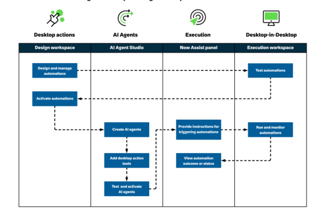

* **Bounding box:** x=102.0, y=77.2, width=432.0 pt, height=290.1 pt.
* **What is shown:** This is the workflow/swimlane diagram for automating fixed steps using desktop actions. It has four vertical lanes: `Design workspace`, `AI Agent Studio`, `Now Assist panel`, and `Execution workspace`, grouped under Desktop actions, AI Agents, Execution, and Desktop-in-Desktop. Blue process boxes show design and management, activation, AI agent creation, adding desktop action tools, testing and activation, providing trigger instructions, viewing outcome/status, testing automations, and running/monitoring automations. Dashed arrows connect design to execution testing, testing back to activation, activation to AI-agent creation, Now Assist triggering to execution, and execution back to outcome/status. No network zones or security-zone boundaries are labeled.
* **Relationships / arrows / flow / labels:** Dashed arrows show design -> testing, testing -> activation, activation -> AI-agent creation, AI-agent setup -> Now Assist triggering, triggering -> execution, and execution -> outcome/status feedback.
* **Visible text captured from image:**

```text
a ¢ 2 &
```

### Source page 1254 — Image 2

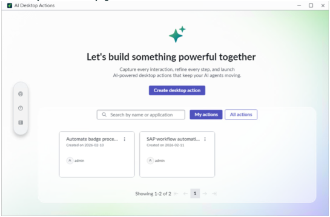

* **Bounding box:** x=102.0, y=52.0, width=432.0 pt, height=281.7 pt.
* **What is shown:** This embedded source image appears near `AI Desktop Actions home page`. It is a product screenshot, form, UI panel, dialog, wizard, table-like screen, or instructional figure supporting the same-page task. Visible objects may include windows, tabs, form fields, buttons, record lists, panes, menus, highlighted controls, and explanatory labels. Its business purpose is to reduce ambiguity for a reader following the ServiceNow AI Desktop Actions procedure. Its technical purpose is to identify the exact interface element, screen state, or control referenced by the surrounding instructions.
* **Relationships / arrows / flow / labels:** The relationships are UI relationships visible inside the screenshot: fields belong to forms, buttons trigger actions, rows belong to lists/tables, and highlighted regions identify the target. No separate network topology, architecture boundary, or security zone is labeled unless it appears explicitly in the crop.
* **Visible text captured from image:**

```text
AI Desktop Actions: a - Oo x
+ 7
Let's build something powerful together
ea ent lemme
ae,
| @
: (Cimcirenecrnco —) SEI Caan
```

### Source page 1255 — Image 3

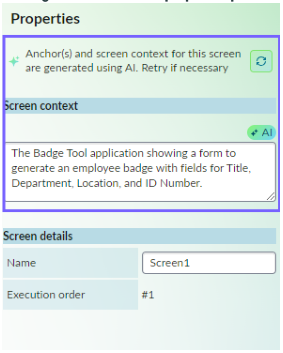

* **Bounding box:** x=102.0, y=130.5, width=222.0 pt, height=277.5 pt.
* **What is shown:** This embedded source image appears near `regenerate anchors and screen context by selecting Retry / AI badge for screens in the properties panel`. It is a product screenshot, form, UI panel, dialog, wizard, table-like screen, or instructional figure supporting the same-page task. Visible objects may include windows, tabs, form fields, buttons, record lists, panes, menus, highlighted controls, and explanatory labels. Its business purpose is to reduce ambiguity for a reader following the ServiceNow AI Desktop Actions procedure. Its technical purpose is to identify the exact interface element, screen state, or control referenced by the surrounding instructions.
* **Relationships / arrows / flow / labels:** The relationships are UI relationships visible inside the screenshot: fields belong to forms, buttons trigger actions, rows belong to lists/tables, and highlighted regions identify the target. No separate network topology, architecture boundary, or security zone is labeled unless it appears explicitly in the crop.
* **Visible text captured from image:**

```text
Properties j
in
ae
all
The Badge Tool application showing a form to
generate an employee badge with fields for Title,
Seema ii
ve
=a
```

### Source page 1255 — Image 4

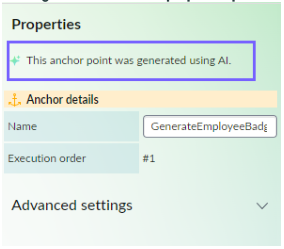

* **Bounding box:** x=102.0, y=456.7, width=222.8 pt, height=194.2 pt.
* **What is shown:** This embedded source image appears near `AI badge for screens in the properties panel / AI badge for anchors in the properties panel`. It is a product screenshot, form, UI panel, dialog, wizard, table-like screen, or instructional figure supporting the same-page task. Visible objects may include windows, tabs, form fields, buttons, record lists, panes, menus, highlighted controls, and explanatory labels. Its business purpose is to reduce ambiguity for a reader following the ServiceNow AI Desktop Actions procedure. Its technical purpose is to identify the exact interface element, screen state, or control referenced by the surrounding instructions.
* **Relationships / arrows / flow / labels:** The relationships are UI relationships visible inside the screenshot: fields belong to forms, buttons trigger actions, rows belong to lists/tables, and highlighted regions identify the target. No separate network topology, architecture boundary, or security zone is labeled unless it appears explicitly in the crop.
* **Visible text captured from image:**

```text
Properties
-f, Anchor details
von
=e
Advanced settings v
```

### Source page 1256 — Image 5

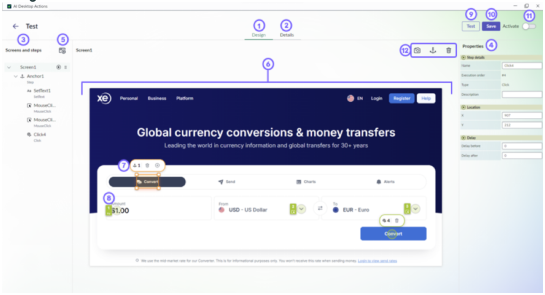

* **Bounding box:** x=102.0, y=52.0, width=432.0 pt, height=231.6 pt.
* **What is shown:** This embedded source image appears near `Design tab`. It is a product screenshot, form, UI panel, dialog, wizard, table-like screen, or instructional figure supporting the same-page task. Visible objects may include windows, tabs, form fields, buttons, record lists, panes, menus, highlighted controls, and explanatory labels. Its business purpose is to reduce ambiguity for a reader following the ServiceNow AI Desktop Actions procedure. Its technical purpose is to identify the exact interface element, screen state, or control referenced by the surrounding instructions.
* **Relationships / arrows / flow / labels:** The relationships are UI relationships visible inside the screenshot: fields belong to forms, buttons trigger actions, rows belong to lists/tables, and highlighted regions identify the target. No separate network topology, architecture boundary, or security zone is labeled unless it appears explicitly in the crop.
* **Visible text captured from image:**

```text
= ao oe-98
10}
EVE —_—
Biss z |
```

### Source page 1258 — Image 6

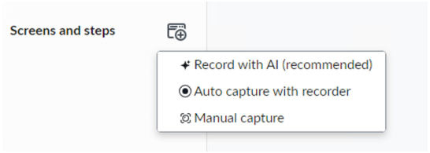

* **Bounding box:** x=72.0, y=39.0, width=432.0 pt, height=151.6 pt.
* **What is shown:** This embedded source image appears near `No nearby heading text was detected.`. It is a product screenshot, form, UI panel, dialog, wizard, table-like screen, or instructional figure supporting the same-page task. Visible objects may include windows, tabs, form fields, buttons, record lists, panes, menus, highlighted controls, and explanatory labels. Its business purpose is to reduce ambiguity for a reader following the ServiceNow AI Desktop Actions procedure. Its technical purpose is to identify the exact interface element, screen state, or control referenced by the surrounding instructions.
* **Relationships / arrows / flow / labels:** The relationships are UI relationships visible inside the screenshot: fields belong to forms, buttons trigger actions, rows belong to lists/tables, and highlighted regions identify the target. No separate network topology, architecture boundary, or security zone is labeled unless it appears explicitly in the crop.
* **Visible text captured from image:**

```text
Screens and steps &
+ Record with Al (recommended)
@Auto capture with recorder
© Manual capture
```

### Source page 1258 — Image 7

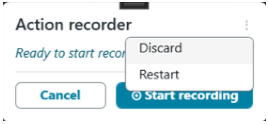

* **Bounding box:** x=72.0, y=415.7, width=210.0 pt, height=94.5 pt.
* **What is shown:** This embedded source image appears near `Recorder controls / You can select any of the following options from the More options menu on the Action recorder`. It is a product screenshot, form, UI panel, dialog, wizard, table-like screen, or instructional figure supporting the same-page task. Visible objects may include windows, tabs, form fields, buttons, record lists, panes, menus, highlighted controls, and explanatory labels. Its business purpose is to reduce ambiguity for a reader following the ServiceNow AI Desktop Actions procedure. Its technical purpose is to identify the exact interface element, screen state, or control referenced by the surrounding instructions.
* **Relationships / arrows / flow / labels:** The relationships are UI relationships visible inside the screenshot: fields belong to forms, buttons trigger actions, rows belong to lists/tables, and highlighted regions identify the target. No separate network topology, architecture boundary, or security zone is labeled unless it appears explicitly in the crop.
* **Visible text captured from image:**

```text
f = 7
Action recorder
Ready to start reco, Discard
Restart
Cancel O seart recording
```

### Source page 1259 — Image 8

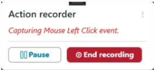

* **Bounding box:** x=82.0, y=110.5, width=208.5 pt, height=93.8 pt.
* **What is shown:** This embedded source image appears near `• Before performing any action, ensure the highlighter is visible on the target control. Recording / • Avoid performing steps too quickly. When the message in the Action recorder panel appears in`. It is a product screenshot, form, UI panel, dialog, wizard, table-like screen, or instructional figure supporting the same-page task. Visible objects may include windows, tabs, form fields, buttons, record lists, panes, menus, highlighted controls, and explanatory labels. Its business purpose is to reduce ambiguity for a reader following the ServiceNow AI Desktop Actions procedure. Its technical purpose is to identify the exact interface element, screen state, or control referenced by the surrounding instructions.
* **Relationships / arrows / flow / labels:** The relationships are UI relationships visible inside the screenshot: fields belong to forms, buttons trigger actions, rows belong to lists/tables, and highlighted regions identify the target. No separate network topology, architecture boundary, or security zone is labeled unless it appears explicitly in the crop.
* **Visible text captured from image:**

```text
f _— 7
Action recorder
Capturing Mouse Left Click event.
```

### Source page 1259 — Image 9

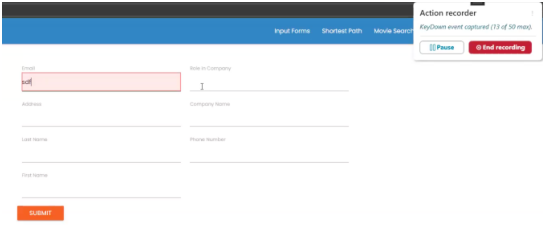

* **Bounding box:** x=82.0, y=252.5, width=432.0 pt, height=186.3 pt.
* **What is shown:** This embedded source image appears near `• Before performing any action, ensure the highlighter is visible on the target control. Recording / • Avoid performing steps too quickly. When the message in the Action recorder panel appears in`. It is a product screenshot, form, UI panel, dialog, wizard, table-like screen, or instructional figure supporting the same-page task. Visible objects may include windows, tabs, form fields, buttons, record lists, panes, menus, highlighted controls, and explanatory labels. Its business purpose is to reduce ambiguity for a reader following the ServiceNow AI Desktop Actions procedure. Its technical purpose is to identify the exact interface element, screen state, or control referenced by the surrounding instructions.
* **Relationships / arrows / flow / labels:** The relationships are UI relationships visible inside the screenshot: fields belong to forms, buttons trigger actions, rows belong to lists/tables, and highlighted regions identify the target. No separate network topology, architecture boundary, or security zone is labeled unless it appears explicitly in the crop.
* **Visible text captured from image:**

```text
No reliable OCR text was detected in this crop. The image asset is retained for visual verification.
```

### Source page 1261 — Image 10

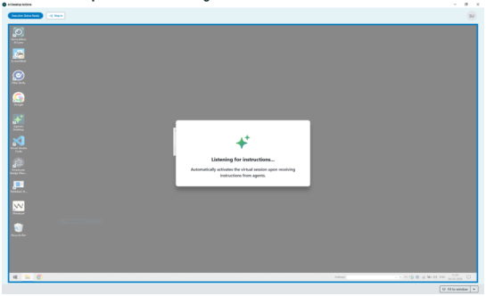

* **Bounding box:** x=102.0, y=52.0, width=432.0 pt, height=261.1 pt.
* **What is shown:** This embedded source image appears near `Execution workspace before executing automation`. It is a product screenshot, form, UI panel, dialog, wizard, table-like screen, or instructional figure supporting the same-page task. Visible objects may include windows, tabs, form fields, buttons, record lists, panes, menus, highlighted controls, and explanatory labels. Its business purpose is to reduce ambiguity for a reader following the ServiceNow AI Desktop Actions procedure. Its technical purpose is to identify the exact interface element, screen state, or control referenced by the surrounding instructions.
* **Relationships / arrows / flow / labels:** The relationships are UI relationships visible inside the screenshot: fields belong to forms, buttons trigger actions, rows belong to lists/tables, and highlighted regions identify the target. No separate network topology, architecture boundary, or security zone is labeled unless it appears explicitly in the crop.
* **Visible text captured from image:**

```text
L-
2
s
```

### Source page 1261 — Image 11

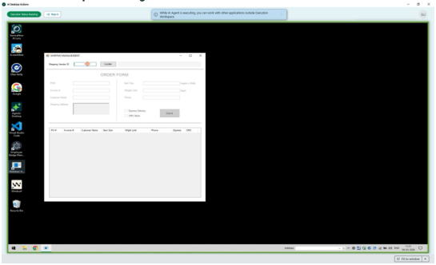

* **Bounding box:** x=102.0, y=339.4, width=432.0 pt, height=260.6 pt.
* **What is shown:** This embedded source image appears near `Execution workspace before executing automation / Execution workspace running the automation`. It is a product screenshot, form, UI panel, dialog, wizard, table-like screen, or instructional figure supporting the same-page task. Visible objects may include windows, tabs, form fields, buttons, record lists, panes, menus, highlighted controls, and explanatory labels. Its business purpose is to reduce ambiguity for a reader following the ServiceNow AI Desktop Actions procedure. Its technical purpose is to identify the exact interface element, screen state, or control referenced by the surrounding instructions.
* **Relationships / arrows / flow / labels:** The relationships are UI relationships visible inside the screenshot: fields belong to forms, buttons trigger actions, rows belong to lists/tables, and highlighted regions identify the target. No separate network topology, architecture boundary, or security zone is labeled unless it appears explicitly in the crop.
* **Visible text captured from image:**

```text
2
5
2
co
s
2
ECT PE
```

### Source page 1263 — Image 12

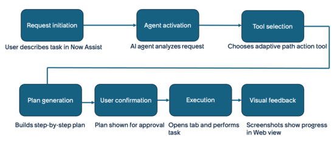

* **Bounding box:** x=72.0, y=313.3, width=432.0 pt, height=185.1 pt.
* **What is shown:** This embedded source image appears near `Use when / How adaptive desktop actions work`. It is a product screenshot, form, UI panel, dialog, wizard, table-like screen, or instructional figure supporting the same-page task. Visible objects may include windows, tabs, form fields, buttons, record lists, panes, menus, highlighted controls, and explanatory labels. Its business purpose is to reduce ambiguity for a reader following the ServiceNow AI Desktop Actions procedure. Its technical purpose is to identify the exact interface element, screen state, or control referenced by the surrounding instructions.
* **Relationships / arrows / flow / labels:** The relationships are UI relationships visible inside the screenshot: fields belong to forms, buttons trigger actions, rows belong to lists/tables, and highlighted regions identify the target. No separate network topology, architecture boundary, or security zone is labeled unless it appears explicitly in the crop.
* **Visible text captured from image:**

```text
Request initiation ‘Agent activation ‘oo! selection
User describes task in Now Assist Alagentanalyzesrequest Chooses adaptive path action tool
Pian generation User confirmation Execution Visual feedback
Builds step-by-step plan Plan shown for approval Opens tab and performs. Screenshots show progress
task in Web view
```


---

## TABLES

### Source page 1245 — Table 1

**Boundary note:** This table appears before the `AI Desktop Actions` heading on source page 1245 and is captured for page completeness, not as an AI Desktop Actions subsection table.

| Property | Description |
| --- | --- |
| glide.service_portal.ais_nlq_enabled | •True: Enables NLQ in global search<br>•False: NLQ is not available in global search |

### Source page 1246 — Table 2

**Nearby source context:** Adaptive desktop actions for web-based tasks (probabilistic) / Get started

| Explore<br>Learn about AI<br>Desktop Actions<br>concepts and features | Configure<br>Set up AI Desktop Actions<br>to automate desktop tasks | Design<br>Design automations<br>for legacy applications<br>that do not have APIs |
| --- | --- | --- |

### Source page 1247 — Table 3

| Create an AI agent<br>Create your own<br>custom AI agents with<br>advanced multi-agent<br>reasoning frameworks | Use<br>Use the AI Desktop<br>Actions application to<br>execute automations<br>using AI agents. | Reference<br>Get details about the AI<br>Desktop Actions properties<br>and components |
| --- | --- | --- |

### Source page 1250 — Table 4

**Nearby source context:** AI Desktop Actions users

| User | Description |
| --- | --- |
| Administrators | Set up and deploy the AI Desktop Actions application. |
| Developers | Design, manage, and deploy automation solutions within their<br>organization. |
| Business users | Automate repetitive desktop tasks without extensive technical<br>knowledge. |
| Process owners | Optimize business processes by automating manual desktop<br>interactions. |

### Source page 1256 — Table 5

**Nearby source context:** Design tab

| No. | Element | Description |
| --- | --- | --- |
| 1 | Design tab | Enables you to design your desktop actions by<br>adding screens, anchors, and steps. |
| 2 | Details tab | Enables you to add details to your desktop<br>actions, such as name, description, and<br>applications that this desktop action interacts<br>with. You can also review the inputs and<br>outputs of this desktop action. |
| 3 | Screens and<br>Steps panel | Shows all the captured screens and added<br>anchors and steps in a sequence the desktop<br>action must perform them. You can drag and<br>move these items to change the order. You can<br>also run a screen-level test by selecting the Run<br>screen test icon . |
| 4 | Properties panel | Enables you to configure the properties for<br>screens, anchors, and steps. |
| 5 | Capture options | Provides two options for capturing interactions<br>with applications that you want to automate.<br>•Auto-capture steps: Automatically records<br>the steps that you perform for the task that<br>you want to automate.<br>•Manual capture screens: Enables you to<br>capture the screens manually, insert anchors,<br>and add steps that you want to automate. |
| 6 | Captured screen | The application screen that you captured.<br>You can delete any screen by selecting the<br>Delete icon from the Screens and steps<br>panel. |
| . All rights reserved.<br>N7ow logo, Now, and oth<br>product names, and log | erA SenrvcicheNoorw marks are tradema<br>os may be trademarks of the resp | rkAs ann da/onr crehgisoterre ids t raad ermeafreksr oef nSecrveic epNoowi,n Intc .o, inn th teh Uenit esdc Srtaetees nan d/or o<br>ective companies with which they are associated.<br>that helps the automation identify and interact<br>with a nearby UI elements. During execution,<br>the system uses computer vision to locate the<br>anchor and then identifies the UI elements at<br>a related distance from the anchor. Anchors<br>improve the stability and accuracy of steps<br>when the target element’s location may shift or<br>when the UI layout varies across sessions.<br>You can delete any anchor by selecting the<br>Delete icon . |
| 8 | Step | A step in your automation. The following types<br>of steps are supported:<br>Inputs<br>•Set Text<br>•Click<br>•Mouse Click<br>•Send Keys<br>Outputs<br>•Get Text<br>•Get Table<br>•OCR Read Text<br>You can add a step by selecting the Add step<br>icon from the Step control menu. You can<br>delete any step by selecting the Delete icon . |
| 9 | Test | Enables you to test the desktop action in<br>Execution workspace before you activate it.<br>You can also test individual screens to quickly<br>identify and troubleshoot issues. Run the test<br>by entering the required inputs manually. |
| 10 | Save | Enables you to save the desktop action after<br>you have configured the required fields. |
| 11 | Activate | Option to activate the desktop action so that it<br>can be published to AI Agent Studio. You can<br>add the activated desktop action as a tool to AI<br>agents.<br>Note: After activation, save the desktop<br>action to make it available as a tool in AI<br>Agent Studio. |
| 12 | Screen capture<br>options | •Re-capture screen - Re-capture new screen<br>to replace the existing screen.<br>•Add anchor - Add anchor on the captured<br>screen.<br>•Delete screen - Delete the captured screen.<br>All the associated anchor and steps are<br>deleted. |

### Source page 1262 — Table 6

**Nearby source context:** Original resolution: Displays the desktop session at its original resolution. Scroll / Execution statuses

| Execution status | Description |
| --- | --- |
| Ready | Automation execution is ready to be initiated. The workspace is<br>waiting for instructions from AI Agent Studio. |
| Initiated | Automation execution is initiated. The workspace has received the<br>execution plan from AI Agent Studio.<br>Note: When you launch Execution workspace for the first<br>time, it takes longer to move to the Running state because it is<br>setting things up for you. |
| Running | Automation execution is running. The workspace executes the steps<br>defined in the desktop actions. |
| Success | Automation execution is completed successfully. The workspace<br>executed the steps defined in the desktop actions and the outcome<br>is shown on the Now Assist panel, such as the automation execution<br>completed successfully and incident created successfully. |
| Failed | Automation execution is failed. The workspace couldn't execute the<br>automation due to an error. |
| Canceled | Automation execution is canceled. The user canceled the execution<br>manually. |

### Source page 1263 — Table 7

**Nearby source context:** Adaptive desktop actions overview / Desktop action operating modes

| Mode | How it works | Use when |
| --- | --- | --- |
| Defined path | Follows fixed steps preconfigured<br>in AI Desktop Actions. | The workflow is stable and steps<br>are known in advance. |
| Adaptive path | Works from a high-level goal.<br>Dynamically plans and executes<br>steps based on your instructions. | The workflow varies or steps<br>cannot be fully defined in advance. |

### Source page 1263 — Table 8

**Nearby source context:** Users / Users and descriptions

| Users | Description |
| --- | --- |
| Administrators | Manage permissions, roles, and agentic<br>workflows |
| Developers | Build and configure AI agents with desktop<br>action tools |

### Source page 1264 — Table 9

**Nearby source context:** Users and descriptions (continued)

| Users | Description |
| --- | --- |
| Fulfillers | Automate routine fulfillment tasks across<br>multiple systems |
| Requestors | Manage browser extensions and submit<br>requests that trigger AI agents to automate<br>web workflows |

### Source page 1265 — Table 10

**Nearby source context:** When to use adaptive vs. defined path desktop actions / Key differences

| Area | Defined path | Adaptive path |
| --- | --- | --- |
| How steps are determined | You record a fixed sequence<br>of steps in the AI Desktop<br>Actions Windows application | The AI agent generates and<br>adjusts steps dynamically<br>based on a high-level goal you<br>describe |
| Supported applications | Desktop applications, thick<br>client applications, and web-<br>based applications | Web-based applications and<br>websites only |
| Environment | Runs on the Windows desktop | Requires Google Chrome<br>and the ServiceNow Web<br>Automation browser extension |
| Handles UI changes | Steps may fail if the<br>application UI changes | Adjusts to changes in UI state<br>at runtime |
| Handles conditional logic | Requires a separate desktop<br>action for each conditional<br>path | Evaluates conditions at<br>runtime and determines the<br>appropriate path |
| Result consistency | Consistent and repeatable<br>— steps execute in the same<br>order every time | Results may vary between<br>runs due to the non-<br>deterministic nature of AI |
| Configuration location | AI Desktop Actions Windows<br>application and AI Agent<br>Studio<br>Note: Background task<br>desktop actions can't be<br>configured in AI Desktop<br>Actions, but you can add<br>them in AI Agent Studio<br>as tools. | AI Agent Studio |


---

## FIGURES

| Figure / visual | Source page | Asset or location | Analysis |
|---|---:|---|---|
| Workflow diagram 1 | 1251 | `_assets/p1251_image01.png` | Swimlane workflow with lanes for Design workspace, AI Agent Studio, Now Assist panel, and Execution workspace; dashed arrows show process handoffs. |
| Embedded screenshot or instructional image 2 | 1254 | `_assets/p1254_image01.png` | Detailed image analysis and OCR text are provided in IMAGE DESCRIPTIONS. |
| Embedded screenshot or instructional image 3 | 1255 | `_assets/p1255_image01.png` | Detailed image analysis and OCR text are provided in IMAGE DESCRIPTIONS. |
| Embedded screenshot or instructional image 4 | 1255 | `_assets/p1255_image02.png` | Detailed image analysis and OCR text are provided in IMAGE DESCRIPTIONS. |
| Embedded screenshot or instructional image 5 | 1256 | `_assets/p1256_image01.png` | Detailed image analysis and OCR text are provided in IMAGE DESCRIPTIONS. |
| Embedded screenshot or instructional image 6 | 1258 | `_assets/p1258_image01.png` | Detailed image analysis and OCR text are provided in IMAGE DESCRIPTIONS. |
| Embedded screenshot or instructional image 7 | 1258 | `_assets/p1258_image02.png` | Detailed image analysis and OCR text are provided in IMAGE DESCRIPTIONS. |
| Embedded screenshot or instructional image 8 | 1259 | `_assets/p1259_image01.png` | Detailed image analysis and OCR text are provided in IMAGE DESCRIPTIONS. |
| Embedded screenshot or instructional image 9 | 1259 | `_assets/p1259_image02.png` | Detailed image analysis and OCR text are provided in IMAGE DESCRIPTIONS. |
| Embedded screenshot or instructional image 10 | 1261 | `_assets/p1261_image01.png` | Detailed image analysis and OCR text are provided in IMAGE DESCRIPTIONS. |
| Embedded screenshot or instructional image 11 | 1261 | `_assets/p1261_image02.png` | Detailed image analysis and OCR text are provided in IMAGE DESCRIPTIONS. |
| Embedded screenshot or instructional image 12 | 1263 | `_assets/p1263_image01.png` | Detailed image analysis and OCR text are provided in IMAGE DESCRIPTIONS. |
| Markdown-converted table/grid 1 | 1245 | TABLES section | Source table/grid region converted into Markdown; nearby context:  |
| Markdown-converted table/grid 2 | 1246 | TABLES section | Source table/grid region converted into Markdown; nearby context: Adaptive desktop actions for web-based tasks (probabilistic) / Get started |
| Markdown-converted table/grid 3 | 1247 | TABLES section | Source table/grid region converted into Markdown; nearby context:  |
| Markdown-converted table/grid 4 | 1250 | TABLES section | Source table/grid region converted into Markdown; nearby context: AI Desktop Actions users |
| Markdown-converted table/grid 5 | 1256 | TABLES section | Source table/grid region converted into Markdown; nearby context: Design tab |
| Markdown-converted table/grid 6 | 1262 | TABLES section | Source table/grid region converted into Markdown; nearby context: Original resolution: Displays the desktop session at its original resolution. Scroll / Execution statuses |
| Markdown-converted table/grid 7 | 1263 | TABLES section | Source table/grid region converted into Markdown; nearby context: Adaptive desktop actions overview / Desktop action operating modes |
| Markdown-converted table/grid 8 | 1263 | TABLES section | Source table/grid region converted into Markdown; nearby context: Users / Users and descriptions |
| Markdown-converted table/grid 9 | 1264 | TABLES section | Source table/grid region converted into Markdown; nearby context: Users and descriptions (continued) |
| Markdown-converted table/grid 10 | 1265 | TABLES section | Source table/grid region converted into Markdown; nearby context: When to use adaptive vs. defined path desktop actions / Key differences |


---

## QUALITY ASSURANCE NOTES

* PAGES REVIEWED: 1245, 1246, 1247, 1248, 1249, 1250, 1251, 1252, 1253, 1254, 1255, 1256, 1257, 1258, 1259, 1260, 1261, 1262, 1263, 1264, 1265, 1266, 1267. Source page range: 1245-1267 (includes AI Desktop Actions section overview pages 1245-1247; TOC Explore heading begins on 1248; page 1267 is split before Configure).
* IMAGES REVIEWED: 39 image blocks assigned/reviewed: 23 recurring header logo block(s), 4 small icon/pictogram block(s), and 12 large screenshot/diagram crop(s).
* TABLES REVIEWED: 10 table/grid region(s) converted to Markdown. Table pages: 1245, 1246, 1247, 1250, 1256, 1262, 1263, 1264, 1265.
* FIGURES REVIEWED: 12 large screenshot/diagram figure(s) plus 10 table/grid visual(s).
* OCR ISSUES FOUND: No unresolved OCR issues were identified in the main text layer after cleanup. 1 large image crop(s) produced no reliable image OCR text; original crop assets are retained for direct visual verification.
* OCR ISSUES CORRECTED: Removed recurring footer/page-number noise from the main content stream, normalized nonbreaking spaces and soft-hyphen/control artifacts, preserved bullets/numbering/property names, converted detected tables to Markdown, and OCR-processed large non-logo embedded images.
* SECTION MAPPING NOTES: Folder name is exactly `AI Desktop Actions`. File name and subsection name are exactly `Explore` from the TOC. Shared source pages were split at heading coordinates from the PDF text layer.
* BOUNDARY NOTE: Source page 1245 contains Natural Language Query carryover content before the `AI Desktop Actions` heading; it is captured as boundary content.
* PAGE FOOTERS REVIEWED: Reviewed recurring ServiceNow copyright/trademark footer and logical page numbers. Footer text reviewed: `© 2026 ServiceNow, Inc. All rights reserved. ServiceNow, the ServiceNow logo, Now, and other ServiceNow marks are trademarks and/or registered trademarks of ServiceNow, Inc., in the United States and/or other countries. Other company names, product names, and logos may be trademarks of the respective companies with which they are associated.`
* RECHECK PASSES COMPLETED: 12/12: page completeness, text extraction, table extraction, image extraction, diagram interpretation, section mapping, subsection mapping, file names, folder names, Markdown formatting, missed-content review, and OCR/text-layer cleanup.
* VERIFICATION ARTIFACTS: Large image crops and `image_inventory.csv` are stored in the `_assets` folder inside this section folder.
