# Configure Predictive Intelligence

## SOURCE INFORMATION

* SECTION NAME: Predictive Intelligence
* SUBSECTION NAME: Configure Predictive Intelligence
* SOURCE FILE NAME: Predictive Intelligence.pdf
* PAGE RANGE: 1389-1425 (shared boundary pages split at source headings)
* EXTRACTION DATE: 2026-06-17

---

# CONTENT

> Source page: 1389

### Configure Predictive Intelligence

Configure solution definitions for Predictive Intelligence to train, test, and monitor solution
definitions

#### Configuration

Use the following links to guide you as you set up your solution definition.
• Configuration tips for Predictive Intelligence
• Create a custom stopwords list
• Create a word corpus
• Quick start tests for Predictive Intelligence
• Activate a solution version
• Export trained solutions to production
• Configuring advanced settings for your ML solutions

#### Database View support for Predictive Intelligence

Use database views to join two or more tables as input for your Machine Learning (ML) solution.

> Source page: 1390

#### Using database views in an ML solution

Database views help expand the amount of fields your solution can use for training. By using
more than one table in your ML solution definition form, you can access more input data to help
enrich the solution outcome.
Database views enable you to join two or more tables into one consolidated view. For this to work
in an ML solution you must first create the database view. See Database views
.
Database views are supported in all four of the Predictive Intelligence capability frameworks:
classification, similarity, clustering, and regression.

#### A database view example for Predictive Intelligence

In the following example scenario, you've created a database view for use in an ML similarity
solution. The image below shows the database view record you've created, including its Name
and Label.
When you click the record Name, its content appears, as shown in the image below. Within the
database view content, the five Knowledge Base tables you've joined to the view are listed. Most
of these tables contain different Knowledge article template types, such as an FAQ or a How To
article.
When a database view is used as input to a similarity solution, each of the tables that constitute
the view must have at least the required number of records set in the configuration of your
ServiceNow instance. The default minimum number required is 10,000. For example, the
Knowledge View database view has five tables and each table must have 10,000 records. If
a table doesn't have 10,000 records, you may not see the results from that table. If you must
change that value, contact Customer Support.

> Source page: 1391

In the image below you can see the similarity solution definition record you've already created,
which you plan to associate to your database view. When you click the Label for your similarity
record, its Similarity Definition form appears.
Similarity Definition forms compare your existing table records based on their similarity by using
a table in the Table field and another table in the Test Table field.
To use a database view in your similarity solution, instead of selecting a table in the Table field,
you select the database view you created, which in this example scenario is the Knowledge
View database view. This configuration increases the number of records your solution uses in
training because the system compares and processes five tables of data instead of one.

> Source page: 1392

#### Configuration tips for Predictive Intelligence

If you encounter issues during your solution training and solution prediction, follow these
suggested resolutions.

#### Input Data

It is recommended to have at least 30,000 records to train your models with, but the accuracy of
the model is determined by the input data.
There are three primary factors that determine the quality of the input data used to train
solutions:
• Cleanliness: Sanitized data reduces noise, making the model more accurate.
• Quality: The input and output should be valid and correct to train the model to make accurate
predictions.
• Distribution: Data that represents the entire dataset as a whole will result in a model that can
make more generalized predictions.
Most raw data sets contain dirty and unusable data. Reviewing your input sets before training is
essential to keeping accurate predictive models.
It is recommended to use approximately 80% of your input data to train your model and about
20% of the data to evaluate whether the model is accurate. You can compare the model's
predicted results against the real values for the 20% of remaining data.

#### Solution training

#### Issue

#### Resolution or suggested action

The solution training remains in Waiting for
Ensure the glide.servlet.uri property
Training status for too long, as the scheduler
in the Glide instance is set to the correct
job is using an incorrect Glide callback
instance URL. This issue can occur when:
instance URL.

> Source page: 1393

#### Issue

#### Resolution or suggested action

• An instance is cloned from production, yet
it still refers to the production URL for the
glide.servlet.uri property.
• The Glide instance is provisioned and runs
the training for the first time.
New categories have been added and aren't
This is expected behavior, as the new
yet having an impact on training.
categories may not yet have sufficient data
until the solution is retrained.
The solution training fails.

#### When the training fails, click the Show

#### Training Progress related link on the solution

screen to determine where the potential
problem resides.

#### Navigate to System Security> Users and

The solution training fails due to user
authentication.
ensure the sharedservice.worker user is set to
Active.
The model training returns saying the model
This issue can occur when the data quantity
cannot be created. The training fails and
or the distribution of field values isn't sufficient
shows the “Error while training solution”
for a model to build successfully. Follow these
message. The training progress window shows
steps to troubleshoot:
this message: “Solution training failed as
1. Ensure the distribution of the output field
either the data used isn't sufficient or the input
isn't skewed.
field isn't predictive of the output field."
2. Retrain the model by changing the date
filters to use a larger amount of data.
3. If the input fields are not fully populated, add
a filter to remove null records.
The solution has data in multiple languages
Use the following options to help improve your
but the coverage and precision results are
metrics.
poor.
Option 1: Update the processing language
of the solution to the most prominent non-
English language.

#### Note: English is applied by default for

all datasets.
Option 2: If there's sufficient data for each
language/region:
1. Add a filter criteria for a specific language/
region where the primary language can be
identified (Dutch, English, French, German,
Japanese, or Spanish).
2. Generate a solution for each language/
region and apply the proper processing
language to each solution.

> Source page: 1394

#### Solution prediction

#### Issue

#### Resolution or suggested action

The prediction fails and returns a Java
1. Search for the exception in the Predictive
exception where the cause is unknown.
Intelligence Glide logs.
2. Submit an Incident record for Predictive
Intelligence including all relevant details,
such as the exception, the impacted
instance, the solution name, and the input
string.
There is no prediction applied to the incident/
This can occur when the confidence of the
case record but the prediction returns a value
prediction is less than the threshold required
when tested in the Rest API Explorer.
to make a prediction. After your solution is
trained, use the following steps to confirm if
your solution settings need adjusting.
1. Navigate to System Web Services >

#### REST > REST API Explorer to find the

confidence level for the prediction. See Test
a classification solution prediction.
2. On your ML Solution Definition record,
check the threshold set for your outcome
class that was returned in the prediction by

#### clicking on the name of the class. The Class

page appears.
3. Check the Estimated Precision and

#### Estimated Coverage values. If the

corresponding threshold is more than the
prediction confidence of the outcome, this
is the root cause for why you did not see any
prediction.
4. Adjust the class precision and coverage
values to increase coverage or precision.
See Tune a trained classification solution.

#### Instance cloning

#### Issue

#### Resolution or suggested action

After an instance is cloned, predictions for
The ML solution artifacts in the [ml_artifacts]
your existing solutions fail.
table are stored in the [sys_attachment table].
If the [ml_artifacts] table isn't included in the
clone when you run it, the predictions fail.
Ensure your clone includes the machine-
learning artifacts, as these are critical
components of your Predictive Intelligence
solution.
After an instance is cloned, the solution
As the cloning run proceeds, it is possible that
training fails.
the sharedservice.worker user has either been

> Source page: 1395

#### Issue

#### Resolution or suggested action

inactivated, locked out, or the user ID isn't set.
Resolve these problems so that the solution
training succeeds.

#### Create a custom stopwords list

Exclude common words you want the system to ignore during training and prediction.

#### Before you begin

Role required: admin or ml_admin

#### About this task

Stopwords lists enable the system to exclude extraneous words that can impede search and the
overall natural language processing of your data.
Predictive Intelligence provides you with default stopwords lists for each language the system
supports. Examples of stopwords include words such as in, the, and the names of people and
companies. You can also define your own stopwords list that's comprised of words specific to
your organization and industry.
The custom list you provide works alongside those that the system already uses by default. For
example, if incident records are used in a classification solution, and a company name is used
in those records, consider adding that name to your list, as it's unlikely to provide any relevant
information for the solution you're building.
In this example scenario, you create a custom stopwords list for the Brazilian Portugese
language.

#### Procedure

1. Navigate to All > Predictive Intelligence > Stopwords.
2. On the Stopwords list, click New.
3. In the Stopwords form, configure these fields.

> Source page: 1396

#### Field

#### Value

Name
Enter a unique name for the list, such
as the name of your company and the
processing language. For example, Blitzo
Brazilian Portuguese Stopwords.

#### Select Brazilian Portuguese

Stopwords Language
Stopwords List
Manually enter the stopwords using a
comma-separated format. For more examples
of stopwords, see the image in Step 2 of this
procedure.
4. Click Submit.
Your custom stopwords list appears in the Stopwords list view.
5. Optional: If you need to update your stopwords list, just click its Name, add or remove words
from the list, and click Update.

> Source page: 1397

#### What to do next

Assign a custom or default stopwords list to a classification, similarity, clustering, or regression
solution definition.

#### Create a word corpus

Build a collection of words and phrases that functions as the vocabulary the system uses to
compare your instance records based on their textual similarity. You can think of the word corpus
as a dictionary that you want your machine-learning system to understand.

#### Before you begin

Role required: admin or ml_admin

#### Important: In the Zurich release, models in the classification, clustering, and similarity

frameworks use Workflow solutions. These are pre-trained, so a word corpus isn't needed
for your new solutions.
After upgrading, your existing solutions with a word corpus become Workflow solutions the
next time they are re-trained. Also the Word Corpus field is removed from the form.
The following information is provided for legacy context.

#### About this task

The primary purpose for a word corpus is to infer textual data for training your NLU model. If using
a word corpus in a solution, you must specify it for training in the solution definition phase of a
solution. A trained word corpus can be reused across solutions and capabilities.
You can use a word corpus to help compare similar record text in a table or across multiple
tables. A word corpus can also be helpful in other scenarios, such as clustering, where you group
similar records together for data analysis, reuse, or review. The items you add to your corpus
should be specific to your company and your industry so you can reuse it in other similarity or
clustering solutions and apply it to various use cases.
In this example procedure, you're working on incident records and you want to locate relevant
knowledge base (KB) articles that could provide resolutions to those incident cases. Your goal
here is to create a word corpus that you can apply to a new similarity solution that compares
active incidents to published KB articles.

#### Procedure

1. Navigate to All > Predictive Intelligence > Word Corpus.
2. In the Word Corpus form, click New.
3. Configure these fields according to the following guidance.

#### Field

#### Description

Name
A unique title that references the contents of your corpus.
For example, in this use case you could enter a name such
as Active Incidents and Published KBs, as the
name indicates the tables that your corpus will mine to help
create your solution.
Active
Select this check box if you're creating more than one
word corpus at a time and you plan to configure their detail
components later. Otherwise, leave it blank because you
can select it in a later step.

> Source page: 1398

4. Select Submit.
5. In the Word Corpus list view, locate your new word corpus and click its Name value to open the
record.
6. In the Word Corpus Contents section, Click New.
7. In the Word Corpus Content form, configure these fields per the following guidance to define a
content component for your word corpus.

#### Field

#### Description

Name
Enter a title that references the data you want to add to
your corpus, such as Incidents closed in last 6
months.
Table
Select the table that contains the data you want to include

#### in your word corpus. For this use case, select Incident

[incident].

#### Note: The number of records per table for Word

Corpus creation used in Similarity and Clustering
solutions is limited to 300,000.

#### Select the following filter condition values: [Closed] [is not

Filter
empty] and [Created in last 6 Months].

#### For this use case, select Short description, Description, and

Field List
Resolution notes.
Domain
The system automatically displays the user group for your
corpus. For example, in this use case it shows the global user
group. You can select other user groups as well.
8. Select Submit.
9. In the Word Corpus Details section, select New.
10. Configure these fields according to the following guidance to define a second content
component for your word corpus.

#### Field

#### Description

Name
Enter a title that references the data you want to compare
to your first content component, such as Published KB
Articles.
Table
Select the table that contains the data you want to compare
to your first content component. For this use case, select
Knowledge [kb_knowledge].

#### Note: The number of records per table for word

corpus creation used in Similarity and Clustering
solutions is limited to 300,000 records per table.

#### Select the following Filter Condition values: [Workflow] [is]

Filter
[Published].
Select Short description and Article body.
Field List

> Source page: 1399

11. Select Submit.
Your two word corpus content components appear on the word corpus form.
12. Select Update.

#### Result

The completed word corpus you created appears on the word corpus form and is available for
use in your similarity and clustering solution definition forms.

#### What to do next

Create a solution in the appropriate framework. For more information, see the links in the Related
Content panel on this page.

#### Related topics

Create and train a classification solution
Create and train a similarity solution
Create and train a clustering solution

#### Quick start tests for Predictive Intelligence

Validate that Predictive Intelligence still works after you make any configuration change such as
applying an upgrade or developing an application. Copy and customize these quick start tests to
pass when using your instance-specific data.
Predictive Intelligence quick start tests require activating the Predictive Intelligence
[com.glide.platform_ml] plugin. In order to execute critical upgrade tests on existing machine
learning solutions, you need to create a basic authorization profile named ml_atf in the Basic
Auth Configurations table (sys_auth_profile_basic.list). To run the tests successfully, the user
attached to the ml_atf authorization profile must have the ml_admin role.

> Source page: 1400

#### Predictive Intelligence: ATF Test Suite

#### Test

#### Description

PI: Presence of ML model artifacts persisted in
Verify all the trained ML model artifacts are
glide
persisted in glide (sys_attachments table) after
model training/instance cloning so that ML
prediction calls are successful.
PI: Valid setup of ML user
Validate if the ML user in glide
(sharedservice.worker) in glide
(sharedservice.worker) is active and
not logged out so that model training is
successful.
PI: Glide upgrade test for Classification
Validate that the classification model
solution
prediction on existing active models is
producing the same class membership and
confidence value results after a glide upgrade.
PI: Glide upgrade test for Similarity solution
Validate that the similarity model prediction
API calls on active models are successful after
a glide upgrade.

#### Related topics

Quick start tests

#### Activate a solution version

Predictive Intelligence activates the most recent version of the solution when it completes
training a solution. However, you can activate any previously trained solution version. Only
one solution version can be active at a time, and only the active version is used when making
predictions.

#### Before you begin

• Manually train a solution multiple times or set a training schedule.
• Role required: admin or ml_admin

#### About this task

The system creates a solution version each time you train a solution definition. Typically, you
manually create a solution version only when you change the solution definition filter and want to
test it. Otherwise, most solution versions are created during scheduled solution training.

#### Procedure

1. Navigate to All > Predictive Intelligence > Classification > Solutions or Predictive Intelligence
> Similarity > Solutions or Predictive Intelligence > Clustering > Solutions or Predictive
Intelligence > Regression > Solutions .
2. In the list view of the ML Solutions table, find the row that you want to activate, then select the
value in the first column to open the individual record.
You can also open the individual record by selecting the row's reference lookup icon
, then
selecting Open Record.
3. In the solution record, select Activate.
The system activates this solution version and deactivates any other solution version.

> Source page: 1401

#### What to do next

For classification solutions, review the trained solution precision and coverage statistics. For
similarity solutions, review the similarity examples.

#### Export trained solutions to production

Refine and test your ML solutions iteratively on a non-production instance, and then use update
sets to export the changes to your production instance. This practice mitigates the risk of
retraining solutions on your live production instance.

#### Before you begin

Prior to testing on a test instance, ensure that the instance hosts recently-cloned data from your
production instance so that the solutions you train on the test instance remain valid when you
export them to production.
Role required: admin or ml_admin

#### About this task

Plan your changes carefully, and remember that update sets match records based on the system
ID [sys-id] and not the version number. Note that moving solutions to instances can sometimes
deliver unpredictable results. If you run into such an issue, retrain the solution again, which takes
5 minutes per solution. For more information on update sets, see System update sets
.

#### Procedure

1. Navigate to All > Predictive Intelligence > Classification > Solution Definitions or Predictive
Intelligence > Similarity > Solution Definitions.
2. Click the name of your trained ML Solution Definition record to open it.
3. In the Related Links section, click Add solutions to the current update set.
4. Click Update.

#### Result

Your trained ML solution artifacts, such as solution definitions, template records, and predictive
model statistics, are added to the current update set.

#### What to do next

Depending on where you are in your solution testing, schedule your update set for export to
another non-production instance for further testing, or on to production.

#### Note: After you export a similarity solution, click Refresh similarity window (Required

after Solution Import) in the Related Links section of the corresponding ML Solution
Definition form.

#### Configuring advanced settings for your ML solutions

Learn about advanced settings for your Predictive Intelligence machine learning (ML) solutions.
Apply optional technology and algorithms for classification, clustering, similarity, and regression
capabilities.
Using advanced settings in your ML solutions is optional. If you choose to implement any of
these settings, make sure you're well informed regarding the technology you're enabling in the
solution, and that your use case benefits from what the technology offers. For more information
about several of these parameters, see the Dive deeper with Clustering Advanced Parameters
article on ServiceNow Community.
Most of the advanced settings are limited to only one capability because their functionality is
targeted to specific use cases.

> Source page: 1402

#### Classification, clustering, similarity, and regression advanced settings

Using the admin or ml_admin role, you apply these technologies by configuring a parameter in
the Advanced Solution Settings tab on your ML solution definition form.
To update or remove an existing setting: on the solution definition form, select the Advanced
Solution Settings tab, then select the name of the solution parameter. For details, see the
following procedures.
• Configure class recall for a classification solution
• Configure TF-IDF for solutions
• Configure DBSCAN for a clustering solution
• Configure HDBSCAN for a clustering solution
• Configure XGBoost for classification or regression solutions
• Configure Connect Component algorithm and Levenshtein Distance method for a clustering
solution
• Apply purity on a clustering solution
• Analyze a cluster with Cluster Insight

#### Advanced Solution Settings for Classification

From the Zurich release, classification solutions offer the following advanced solution settings.
• Config parameters for model config in classification
• Configure include only top N labels
• Minimum records needed for label to include it
• Remove others label
• Use LightGBM algo for classification model training

#### Configure class recall for a classification solution

Create and apply a class recall parameter to an ML solution prior to training its data. For example,
you set and apply this solution parameter to 90% recall for all records in the Email class.

#### Before you begin

#### Note: Using advanced settings in your ML solutions is optional. If you choose to

implement any of these settings, make sure you're well informed regarding the technology
you're enabling in the solution, and that you have a use case that benefits from what the
technology offers.
• Create and save a classification solution definition or use an existing one.
• Role required: admin or ml_admin

#### About this task

The class recall solution parameter enables you to steer a solution's training to bias a specific
class. For example, classifying an incoming email as a Phish or not can be an important use case
in a security-related machine learning solution. In this situation, it's very important to identify
every Phish, and it may be acceptable to report a non-Phish as a Phish occasionally. However, no
actual Phish should be classified as a non-Phish. In such situations, the recall metric must have
a high value to minimize false negatives. High recall values might lead to lower percentages for
precision and coverage.

> Source page: 1403

You can apply a recall value to one class per solution definition.

#### Procedure

1. Navigate to All > Predictive Intelligence > Classification > Solution Definitions.
2. Open a saved classification solution definition form.
In this example scenario, you use an Incident Categorization solution definition form that you
haven't trained yet.
3. On the Advanced Solution Settings tab in the Related Links section of the form, select New.
4. Create a parameter record.
a. In the Solution Parameters field, select the search icon.
b. In the ML Solution Parameters screen, select Add class recall value while training.
The Advanced Solution Setting [ml_advanced_solution_settings] record appears.

> Source page: 1404

5. Add your values to the User inputs field, in the format ClassName:RecallValue.
a. Enter the name of the class for which you want to specify a recall value.
In this scenario, you enter Phish for the ClassName.
b. Enter a colon character (:), then the Recall value.
Enter 95 for the RecallValue in the example scenario.
In other words you're specifying Phish as the target class, and 95 is the Recall percentage
you're requesting the system to deliver during solution training (Phish:95).
6. Select Submit.
Result: Class recall is configured for your classification solution. Its solution parameter
appears on the Advanced Solution Settings tab of your classification solution definition form.

#### What to do next

Train your saved classification solution so that your updates are incorporated.

#### Related topics

Create and train a classification solution
Configuring target metrics for a trained classification solution
Configure TF-IDF for solutions

> Source page: 1405

#### Configure TF-IDF for solutions

Apply Term Frequency–Inverse Document Frequency (TF-IDF) encoding to classification,
clustering, or similarity solutions for Predictive Intelligence.

#### Before you begin

#### Note: Configuring advanced settings on your ML solutions is optional. If you choose to

configure any of these settings, make sure you're well informed regarding the technology
you're enabling in the solution, and that you have a use case that benefits from what the
technology offers. For more information, see https://www.servicenow.com/community/
intelligence-ml-articles/dive-deeper-with-clustering-advanced-parameters/ta-p/2695847
.
• Create a classification, clustering, or similarity solution definition or use an existing one.
• Role required: admin or ml_admin

#### About this task

Predictive Intelligence uses paragraph vector word embedding by default in its classification
and similarity frameworks, which is highly effective for processing data comprised of primarily
human-readable content. However, TF-IDF might return better prediction results for records
that have machine-generated content, such as alerts and error messages for log files. Choose
advanced settings that are appropriate for the kind of data your solution is processing.

#### Note: The steps for configuring TF-IDF are the same for all model frameworks, but TF-

IDF support for clustering solution definitions is applicable only if you have a Professional
subscription.

#### Procedure

1. Navigate to a Solution Definition, such as All > Predictive Intelligence > Similarity > Solution
Definitions.
2. Open a solution definition form.
In this example scenario, you use a CMDB similarity definition form.
3. On the Advanced Solution Settings tab in the Related Links section of the form, click New.
4. Create a parameter record.
a. In the Solution Parameters field, click the search icon.

> Source page: 1406

5. Click Submit.
The Advanced Solution Setting record screen refreshes.
6. Click Submit.

> Source page: 1407

Result: TF-IDF is configured for your similarity solution. Its solution parameter appears on the
Advanced Solution Settings tab of your similarity definition form.

#### Related topics

Create and train a classification solution
Create and train a similarity solution
Create and train a regression solution
Create and train a clustering solution

#### Configure XGBoost for classification or regression solutions

Apply XGBoost encoding to optimize the training for your classification or regression solutions.

#### Before you begin

• Create a classification solution definition or use an existing one.
• Create a regression solution definition or use an existing one.
• Role required: admin or ml_admin

> Source page: 1408

#### About this task

XGBoost is an optional gradient boosting framework that uses multiple decision trees and
supports both Paragraph Vector-based text and TF-IDF distance-based text. LogR is the default
distance-based model algorithm.
Configuring advanced settings on your ML solutions is optional. If you choose to configure any
of these settings, make sure you're well informed regarding the technology you're enabling in the
solution, and that you have a use case that benefits from what the technology offers.
In this example scenario, you apply XGBoost to both a classification solution and a regression
solution.

#### Note: The regression framework is deprecated in the Zurich release. You can continue to

use existing regression solutions but you can't create new ones.

#### Procedure

1. Navigate to All > Predictive Intelligence > Classification > Solution Definitions.
2. Open a classification solution definition form.
3. On the Advanced Solution Settings tab in the Related Links section of the form, select New.
4. Create a parameter record.
a. In the Solution Parameters field, select the search icon.
b. In the ML Solution Parameters screen, select Use XGBoost algo for classification model
training.
5. Select Submit.
The Advanced Solution Setting record screen refreshes.

> Source page: 1409

6. Select Submit.
Result: XGBoost is configured for your classification solution. Its solution parameter appears
on the Advanced Solution Settings tab of your classification definition form.

#### Note: Follow the steps below if you want to configure XGBoost on a regression solution.

7. Navigate to Predictive Intelligence > Regression > Solution Definitions (available only if you
had created a regression solution before the regression framework was deprecated).
8. In this second scenario, you open a regression solution definition form.
9. Repeat the steps from the previous classification solution example, except this time you're
using a regression solution.
10. Select Submit.

#### Result:

XGBoost is configured for your regression solution. Its solution parameter appears on the
Advanced Solution Settings tab of your regression solution definition form.

#### Related topics

Create and train a classification solution
Create and train a regression solution

#### Configure DBSCAN for a clustering solution

Consider applying the Density Based Spatial Clustering of Applications with Noise (DBSCAN)
algorithm to your clustering solution. DBSCAN is available as an alternative to the default
clustering algorithm, k-means.

> Source page: 1410

#### Before you begin

#### Note: Configuring advanced settings on your ML solutions is optional. If you choose to

configure any of these settings, make sure you're well informed regarding the technology
you're enabling in the solution, and that your use case benefits from what the technology
offers. For more information, see the Dive deeper with Clustering Advanced Parameters
article on ServiceNow Community.
• Create a clustering solution definition or use an existing one.
• Role required: admin or ml_admin

#### About this task

Predictive Intelligence uses the k-means algorithm by default in its clustering framework.
DBSCAN is another clustering algorithm that's also used in data mining and machine learning.
Some users prefer DBSCAN as it doesn't require you to specify the number of clusters in the data
before clustering. For a summary of the pros and cons for each algorithm, see this conversation
and this article
.
In this example scenario, you apply DBSCAN to a clustering solution.

#### Procedure

1. Navigate to All > Predictive Intelligence > Clustering > Solution Definitions.
2. Open a clustering solution definition form.
In this example scenario, you use an Incidents clustering solution definition form.
3. On the Advanced Solution Settings tab in the Related Links section of the form, select Solution
Parameters from the picker, then click New.
4. Create a parameter record.

> Source page: 1411

a. In the Solution Parameters field, select the search icon.
b. In the ML Solution Parameters screen, select Use DBSCAN algo for clustering.
5. Select Submit.
The Advanced Solution Setting record appears. The field User Inputs is grayed out because it
does not apply to this algorithm.
6. Select Submit.

> Source page: 1412

Result: DBSCAN is configured for your clustering solution. Its solution parameter appears on
the Advanced Solution Settings tab of your clustering solution definition form.

#### Related topics

Create and train a clustering solution

#### Configure HDBSCAN for a clustering solution

Consider applying the Hierarchical Density Based Spatial Clustering of Applications with Noise
(HDBSCAN) algorithm to your clustering solution. HDBSCAN is available as an alternative to the
default clustering algorithm, k-means.

#### Before you begin

#### Note: Configuring advanced settings on your ML solutions is optional. If you choose to

configure any of these settings, make sure you're well informed regarding the technology
you're enabling in the solution, and that your use case benefits from what the technology
offers. For more information, see the Dive deeper with Clustering Advanced Parameters
article on ServiceNow Community.
• Create a clustering solution definition or use an existing one.
• Role required: admin or ml_admin

> Source page: 1413

#### About this task

You can apply the HDBSCAN algorithm to help the system identify data samples that aren't
assigned to any cluster. For example, you can apply HDBSCAN to support Topic Discovery.
Predictive Intelligence implements the k-means algorithm by default in its clustering framework.
HDBSCAN is similar to the DBSCAN clustering algorithm except that it works with minimum-
sized clusters and can help deliver more stable and persistent clusters. For a summary of how
HDBSCAN works, see this article
. For a comparison between DBSCAN and HDBSCAN, see this
article
and this article
.

#### Note: Clustering solutions trained with HDBSCAN do not support cluster

updates. Updates on these solutions fail and the solutions are not logged in the
ml_cluster_detail_table. Use DBSCAN or k-means training methods if you want to enable
cluster updates.

#### Procedure

1. Navigate to All > Predictive Intelligence > Clustering > Solution Definitions.
2. Select New.
3. Create a new clustering solution definition form or use an existing one.
In this example scenario, you create the hdbscan-sf clustering definition form as in the image
below. Configure the fields as follows:
  ◦Label: hdbscan-sf
  ◦Word Corpus: incident_wc, or any other word corpus that has incident record data (from
the Washington DC release, a word corpus is not needed, so this field does not appear).
  ◦Table: Incident [incident]
  ◦Fields: Short description
  ◦Update Frequency: Do not update
  ◦Stopwords: Default English Stopwords
  ◦Training Frequency: Every 30 days
  ◦Processing Language: English

> Source page: 1414

4. Select Submit & Train.
5. On the Advanced Solution Settings tab in the Related Links section of the trained form, select
Solution Parameters from the picker, then select New.
6. Create a parameter record.

> Source page: 1415

a. In the Solution Parameters field, click the search icon.
b. In the ML Solution Parameters screen, select Use HDBSCAN algo for clustering.
7. Select Submit.
The Advanced Solution Setting record appears with the HDBSCAN algorithm applied to the
record. The field User Inputs is grayed out because it does not apply to this algorithm.
8. Select Submit.

> Source page: 1416

Result: HDBSCAN is configured for your clustering solution. Its solution parameter appears on
the Advanced Solution Settings tab of your clustering solution definition form.

#### Related topics

Create and train a clustering solution
Configure Connect Component algorithm and Levenshtein Distance method for a clustering

#### solution

Apply Configure Connect Component and Levenshtein Distance method encoding to optimize
the training for your clustering solutions.

#### Before you begin

Role required: admin or ml_admin

#### Note: Configuring advanced settings on your ML solutions is optional. If you choose to

configure any of these settings, make sure you're well informed regarding the technology
you're enabling in the solution, and that your use case benefits from what the technology
offers. For more information, see the Dive deeper with Clustering Advanced Parameters
article on ServiceNow Community.
• Create and train a clustering solution definition or use an existing one.
• Role required: admin or ml_admin

#### About this task

When training clustering solutions, you have the following three options.
• Use the default k-means algorithm.
• Use the optional DBSCAN solution parameter with the Euclidean distance method as a metric.
• Use the optional DBSCAN, Minimum Neighbors, and Levenshtein Distance solution
parameters. Connect Component is enabled by DBSCAN and Minimum Neighbors, and
supports both Paragraph Vector-based text and Levenshtein Distance-based text. If you train
your solution using the Levenshtein Distance method, you don't need to use a word corpus in
your clustering solution.

> Source page: 1417

In this example scenario, you train your solution definition by using the third option referenced
above.

#### Procedure

1. Navigate to All > Predictive Intelligence > Clustering > Solution Definitions.
2. Open a trained clustering solution definition form.
3. On the Advanced Solution Settings tab in the Related Links section of the form, select New.
4. Create a parameter record.
a. In the Solution Parameters field, select the search icon.
b. In the ML Solution Parameters screen, select Levenshtein Distance.
5. Select Submit.
The Advanced Solution Setting record screen refreshes.
6. Select Submit.

> Source page: 1418

Result: Levenshtein Distance is configured for your clustering solution. Its solution parameter
appears on the Advanced Solution Settings tab of your clustering definition form.
7. Repeat steps 1-6 from the previous Levenshtein Distance example, except this time you're
creating the Minimum Neighbors and DBSCAN solution parameters, which together enable
the Connect Component feature.
When you select, configure, and submit the Minimum Neighbors solution parameter, be sure
to set the User Inputs field with a value of 1. Only some parameters have a User Inputs field.

#### Result:

> Source page: 1419

Connect Component is configured for your clustering solution. Its two solution parameters
appear on the Advanced Solution Settings tab of your clustering definition form, alongside the
Levenshtein Distance parameter you configured in steps 1-6 of this procedure.

#### Related topics

Create and train a clustering solution

#### Config parameters for model config in classification

Customize the training behavior of your classification solution by passing in a dictionary of
parameters in JSON format.

#### Before you begin

Role required: ml_admin or admin

#### About this task

You can fine-tune model performance by passing in a dictionary of parameters to adjust training
behavior.
Understand the machine learning hyperparameters relevant to your model objective. This option
is advanced and should be modified with care.
You can add these parameters in the solution definition form by using the following procedure.
Alternatively, you can use a script to add these parameters. For the format to use when scripting,
see the What to do next section of this page.

#### Procedure

1. Navigate to All > Predictive Intelligence > Classification > Solution Definitions.
2. Open an existing classification solution or create a new one.
3. Select the Advanced Solution Settings tab in the Related Links section of the form.
4. Select New to open the Advanced Solution Setting (ml_advanced_solution_settings) form.
5. In the Solution Parameters field, search for Config parameters for model config
in classification.
6. In the User Inputs field, enter the following key-value pairs, after editing the values per your
requirements.

#### Note: When pasting the parameters into the solution definition form, don't include

JSON's enclosing label, braces, or parentheses. Enter the key-value pairs in the format
shown here, after editing the values according to your requirements.

> Source page: 1420

'max_depth': 10,'learning_rate': 0.1,'objective':
'multi:softprob','num_class': 11,'random_state':
10,'eval_metric': 'mlogloss','booster':
'gbtree','n_estimators': 150,'verbosity':
1,'use_label_encoder': false,'tree_method':
'hist','num_parallel_tree': 1,'gamma': 0.25,'subsample':
0.8,'max_delta_step': 5,'reg_alpha': 0,'reg_lambda':
1,'colsample_bytree': 0.8,'colsample_bylevel':
1,'colsample_bynode': 1,'min_child_weight': 1.25,'n_jobs':
11,'validate_parameters': true
7. Select Submit to update the solution definition.

#### Result

The setting appears as a row on the Advanced Solution Setting tab on your solution's form.

#### What to do next

Retrain your solution.
You can also pass in this dictionary with a script. Be sure to use the enclosing label, braces, and
parentheses when scripting.
Script example:
config.setModelParams({
'max_depth': 10,
'learning_rate': 0.1,
'objective': 'multi:softprob',
'num_class': 11,
'random_state': 10,
'eval_metric': 'mlogloss',
'booster': 'gbtree',
'n_estimators': 150,
'verbosity': 1,
'use_label_encoder': false,
'tree_method': 'hist',
'num_parallel_tree': 1,
'gamma': 0.25,
'subsample': 0.8,
'max_delta_step': 5,
'reg_alpha': 0,
'reg_lambda': 1,
'colsample_bytree': 0.8,

> Source page: 1421

'colsample_bylevel': 1,
'colsample_bynode': 1,
'min_child_weight': 1.25,
'n_jobs': 11,
'validate_parameters': true
});
JSON example:
{
"classification_model_params": {
'max_depth': 10,
'learning_rate': 0.1,
'objective': 'multi:softprob',
'num_class': 11,
'random_state': 10,
'eval_metric': 'mlogloss',
'booster': 'gbtree',
'n_estimators': 150,
'verbosity': 1,
'use_label_encoder': false,
'tree_method': 'hist',
'num_parallel_tree': 1,
'gamma': 0.25,
'subsample': 0.8,
'max_delta_step': 5,
'reg_alpha': 0,
'reg_lambda': 1,
'colsample_bytree': 0.8,
'colsample_bylevel': 1,
'colsample_bynode': 1,
'min_child_weight': 1.25,
'n_jobs': 11,
'validate_parameters': true
}
}

#### Related topics

Using Machine Learning APIs
Create and train a classification solution

#### Use LightGBM algo for classification model training

Enable the LightGBM (Light Gradient-Boosting Machine) algorithm as an advanced option for
training classification models.

#### Before you begin

Role required: ml_admin or admin

#### About this task

The LightGBM algorithm offers performance and efficiency for large datasets. For detailed
information about this algorithm see https://lightgbm.readthedocs.io
.
Use the following procedure to add this option in the solution definition form. Alternatively, you
can use a script to add this algorithm.

> Source page: 1422

var config = new MLPredictorConfig('ml_solution_ID');
config.useLightGBM();
config.updateConfig();
In JSON format:
{
"use_lightgbm": true
}

#### Procedure

1. Navigate to All > Predictive Intelligence > Classification > Solution Definitions.
2. Open an existing classification solution or create a new one.
3. Select the Advanced Solution Settings tab in the Related Links section of the form.
4. Select New to open the Advanced Solution Setting (ml_advanced_solution_settings) form.
5. In the Solution Parameters field, search for Use LightGBM algo for
classification model training.
6. Leave the User Inputs field blank, and select Submit.

#### Result

The setting appears as a row on the Advanced Solution Setting tab on your solution's form.

#### What to do next

Retrain your solution.

#### Related topics

Using Machine Learning APIs
Create and train a classification solution

#### Minimum records needed for label to include it

Set a threshold for the minimum number of records a label must have in your dataset to be
included in model training.

#### Before you begin

Verify that your dataset includes label values suitable for classification.
Role required: ml_admin or admin

#### About this task

This advanced option helps to eliminate labels that occur infrequently. Setting this minimum
threshold can reduce overfitting and unreliable predictions.
To configure, you provide a number for a minimum count of records. Any class value with fewer
records than the minimum is dropped from the training set. Class values that are dropped before

> Source page: 1423

To add this option using a script:
config.setMinLabelCount(50);
In JSON format:
{
"min_label_count": 50
}

#### Procedure

1. To add this option in the solution definition form, navigate to All > Predictive
Intelligence > Classification > Solution Definitions.
2. Open an existing classification solution or create a new one.
3. Select the Advanced Solution Settings tab in the Related Links section of the form.
4. Select New to open the Advanced Solution Setting (ml_advanced_solution_settings) form.
5. In the Solution Parameters field, search for minimum records needed for label
to include it.
6. In the User Inputs field, enter the number of records you want as the minimum, then select
Submit.

#### Result

The setting appears as a row on the Advanced Solution Setting tab on your solution's form.

#### What to do next

Retrain your solution.

#### Related topics

Using Machine Learning APIs
Create and train a classification solution

#### Configure include only top N labels

Limit your classification model to use only the most common classes when training. You can
specify the number of classes to use.

#### Before you begin

Role required: ml_admin or admin

#### About this task

Restricting the model to a fixed number of the most frequent labels improves focus and
performance, especially with large datasets.
You can add this option in the solution definition form by using the following procedure.
Alternatively, you can use a script to add this option.
To add this option using a script:
config.setTopNLabels(100);

> Source page: 1424

In JSON format:
{
"include_top_n_labels": 100
}

#### Procedure

1. To add this option in the solution definition form, navigate to All > Predictive
Intelligence > Classification > Solution Definitions.
2. Open an existing classification solution or create a new one.
3. Select the Advanced Solution Settings tab in the Related Links section of the form.
4. Select New to open the Advanced Solution Setting (ml_advanced_solution_settings) form.
5. In the Solution Parameters field, search for include only top n labels.
6. In the User Inputs field, enter the number of classes you want as the limit, then select Submit.

#### Result

The setting appears as a row on the Advanced Solution Setting tab on your solution's form.

#### What to do next

Retrain your solution.

#### Related topics

Using Machine Learning APIs
Create and train a classification solution

#### Remove others label

Reduce noise in your classification model and enhance predictive accuracy by removing records
with the label "others" from training data. These are records with a distribution frequency of
under one percent.

#### Before you begin

Role required: ml_admin or admin

#### About this task

When this option is set to true, records under 1% of total data distribution are excluded from
training. These records are labeled "others" in the interface. The 1% threshold can't be modified.
You can add this option in the solution definition form by using the following procedure.
Alternatively, you can use a script to add this option.
To add this option using a script:
config.removeOthersLabel(true);
In JSON format:

> Source page: 1425

{
"remove_others_label": true
}

#### Procedure

1. To add this option in the solution definition form, navigate to All > Predictive
Intelligence > Classification > Solution Definitions.
2. Open an existing classification solution or create a new one.
3. Select the Advanced Solution Settings tab in the Related Links section of the form.
4. Select New to open the Advanced Solution Setting (ml_advanced_solution_settings) form.
5. In the Solution Parameters field, search for Remove others label, then select Submit to
save your update.

#### Result

The setting appears as a row on the Advanced Solution Setting tab on your solution's form.

#### What to do next

Retrain your solution.

#### Related topics

Using Machine Learning APIs
Create and train a classification solution

### Creating and training solutions


---

## IMAGE DESCRIPTIONS

### Repeated ServiceNow page header/logo

The ServiceNow-branded wordmark appears in the upper-left corner of reviewed source pages for this subsection. It is a recurring branding image, not a technical diagram. It contains the visible brand text `servicenow`, with green accenting in the `now` portion. Reviewed pages: 1389, 1390, 1391, 1392, 1393, 1394, 1395, 1396, 1397, 1398, 1399, 1400, 1401, 1402, 1403, 1404, 1405, 1406, 1407, 1408, 1409, 1410, 1411, 1412, 1413, 1414, 1415, 1416, 1417, 1418, 1419, 1420, 1421, 1422, 1423, 1424, 1425.

### Small UI icons and inline pictograms

1 small non-logo icon/pictogram image blocks were reviewed on source pages 1400. These include information icons, external-link indicators, UI symbols, or small inline graphics. They support the surrounding text but do not contain standalone table data. Coordinates and classification are retained in `_assets/image_inventory.csv`.

### Source page 1390 — Image 1

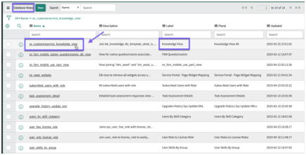

* **Bounding box:** x=72.0, y=256.7, width=432.0 pt, height=215.3 pt.
* **Nearby source context:** A database view example for Predictive Intelligence / solution. The image below shows the database view record you've created, including its Name / and Label.
* **What is shown:** This embedded source image appears near the source context `A database view example for Predictive Intelligence / solution. The image below shows the database view record you've created, including its Name / and Label.`. It is a ServiceNow product screenshot, UI form, list view, report/dashboard visual, setup screen, dialog, or instructional figure supporting the surrounding procedure. Objects may include application headers, navigation breadcrumbs, form fields, related links, buttons, tabs, lists, result rows, charts, and highlighted controls. Its business purpose is to make the Predictive Intelligence setup, training, testing, monitoring, or reference procedure easier to follow. Its technical purpose is to identify the exact ServiceNow screen state, field, UI region, or configuration control referenced by the same-page instructions.
* **Objects/components present:** ServiceNow interface elements, icons, labels, fields, controls, lists, charts, or instructional blocks visible in the crop as applicable. The exact crop is preserved in `_assets/p1390_image01.png` for long-term verification.
* **Relationships / arrows / flow / labels:** The relationships are UI relationships visible inside the screenshot: fields belong to a form, buttons and links trigger actions, rows belong to lists/tables, charts summarize records, tabs separate panels, and highlighted areas identify the intended target. No separate network topology, architecture component boundary, or security zone is labeled unless visible in the asset.
* **Business purpose:** Supports the reader in performing or understanding the Predictive Intelligence operation described by the surrounding source page.
* **Technical purpose:** Preserves the UI state or conceptual visual needed to reproduce, verify, or interpret the procedure.
* **Visible text captured from image:**

```text
[No separate OCR text recorded for this crop; source asset is retained for visual verification.]
```

### Source page 1391 — Image 2

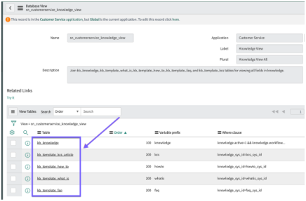

* **Bounding box:** x=72.0, y=39.0, width=432.0 pt, height=281.1 pt.
* **Nearby source context:** No nearby heading text was detected.
* **What is shown:** This embedded source image appears near the source context `No nearby heading text was detected.`. It is a ServiceNow product screenshot, UI form, list view, report/dashboard visual, setup screen, dialog, or instructional figure supporting the surrounding procedure. Objects may include application headers, navigation breadcrumbs, form fields, related links, buttons, tabs, lists, result rows, charts, and highlighted controls. Its business purpose is to make the Predictive Intelligence setup, training, testing, monitoring, or reference procedure easier to follow. Its technical purpose is to identify the exact ServiceNow screen state, field, UI region, or configuration control referenced by the same-page instructions.
* **Objects/components present:** ServiceNow interface elements, icons, labels, fields, controls, lists, charts, or instructional blocks visible in the crop as applicable. The exact crop is preserved in `_assets/p1391_image01.png` for long-term verification.
* **Relationships / arrows / flow / labels:** The relationships are UI relationships visible inside the screenshot: fields belong to a form, buttons and links trigger actions, rows belong to lists/tables, charts summarize records, tabs separate panels, and highlighted areas identify the intended target. No separate network topology, architecture component boundary, or security zone is labeled unless visible in the asset.
* **Business purpose:** Supports the reader in performing or understanding the Predictive Intelligence operation described by the surrounding source page.
* **Technical purpose:** Preserves the UI state or conceptual visual needed to reproduce, verify, or interpret the procedure.
* **Visible text captured from image:**

```text
[No separate OCR text recorded for this crop; source asset is retained for visual verification.]
```

### Source page 1391 — Image 3

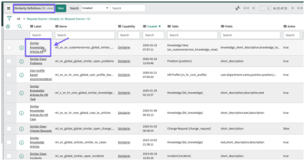

* **Bounding box:** x=72.0, y=380.9, width=432.0 pt, height=225.3 pt.
* **Nearby source context:** which you plan to associate to your database view. When you click the Label for your similarity
* **What is shown:** This embedded source image appears near the source context `which you plan to associate to your database view. When you click the Label for your similarity`. It is a ServiceNow product screenshot, UI form, list view, report/dashboard visual, setup screen, dialog, or instructional figure supporting the surrounding procedure. Objects may include application headers, navigation breadcrumbs, form fields, related links, buttons, tabs, lists, result rows, charts, and highlighted controls. Its business purpose is to make the Predictive Intelligence setup, training, testing, monitoring, or reference procedure easier to follow. Its technical purpose is to identify the exact ServiceNow screen state, field, UI region, or configuration control referenced by the same-page instructions.
* **Objects/components present:** ServiceNow interface elements, icons, labels, fields, controls, lists, charts, or instructional blocks visible in the crop as applicable. The exact crop is preserved in `_assets/p1391_image02.png` for long-term verification.
* **Relationships / arrows / flow / labels:** The relationships are UI relationships visible inside the screenshot: fields belong to a form, buttons and links trigger actions, rows belong to lists/tables, charts summarize records, tabs separate panels, and highlighted areas identify the intended target. No separate network topology, architecture component boundary, or security zone is labeled unless visible in the asset.
* **Business purpose:** Supports the reader in performing or understanding the Predictive Intelligence operation described by the surrounding source page.
* **Technical purpose:** Preserves the UI state or conceptual visual needed to reproduce, verify, or interpret the procedure.
* **Visible text captured from image:**

```text
[No separate OCR text recorded for this crop; source asset is retained for visual verification.]
```

### Source page 1392 — Image 4

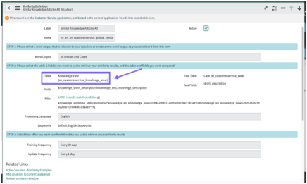

* **Bounding box:** x=72.0, y=39.0, width=432.0 pt, height=256.0 pt.
* **Nearby source context:** No nearby heading text was detected.
* **What is shown:** This embedded source image appears near the source context `No nearby heading text was detected.`. It is a ServiceNow product screenshot, UI form, list view, report/dashboard visual, setup screen, dialog, or instructional figure supporting the surrounding procedure. Objects may include application headers, navigation breadcrumbs, form fields, related links, buttons, tabs, lists, result rows, charts, and highlighted controls. Its business purpose is to make the Predictive Intelligence setup, training, testing, monitoring, or reference procedure easier to follow. Its technical purpose is to identify the exact ServiceNow screen state, field, UI region, or configuration control referenced by the same-page instructions.
* **Objects/components present:** ServiceNow interface elements, icons, labels, fields, controls, lists, charts, or instructional blocks visible in the crop as applicable. The exact crop is preserved in `_assets/p1392_image01.png` for long-term verification.
* **Relationships / arrows / flow / labels:** The relationships are UI relationships visible inside the screenshot: fields belong to a form, buttons and links trigger actions, rows belong to lists/tables, charts summarize records, tabs separate panels, and highlighted areas identify the intended target. No separate network topology, architecture component boundary, or security zone is labeled unless visible in the asset.
* **Business purpose:** Supports the reader in performing or understanding the Predictive Intelligence operation described by the surrounding source page.
* **Technical purpose:** Preserves the UI state or conceptual visual needed to reproduce, verify, or interpret the procedure.
* **Visible text captured from image:**

```text
[No separate OCR text recorded for this crop; source asset is retained for visual verification.]
```

### Source page 1395 — Image 5

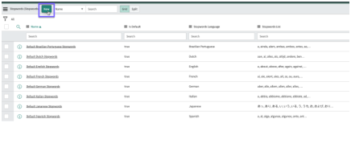

* **Bounding box:** x=112.0, y=460.4, width=432.0 pt, height=194.0 pt.
* **Nearby source context:** Procedure / 1. Navigate to All > Predictive Intelligence > Stopwords. / 2. On the Stopwords list, click New.
* **What is shown:** This embedded source image appears near the source context `Procedure / 1. Navigate to All > Predictive Intelligence > Stopwords. / 2. On the Stopwords list, click New.`. It is a ServiceNow product screenshot, UI form, list view, report/dashboard visual, setup screen, dialog, or instructional figure supporting the surrounding procedure. Objects may include application headers, navigation breadcrumbs, form fields, related links, buttons, tabs, lists, result rows, charts, and highlighted controls. Its business purpose is to make the Predictive Intelligence setup, training, testing, monitoring, or reference procedure easier to follow. Its technical purpose is to identify the exact ServiceNow screen state, field, UI region, or configuration control referenced by the same-page instructions.
* **Objects/components present:** ServiceNow interface elements, icons, labels, fields, controls, lists, charts, or instructional blocks visible in the crop as applicable. The exact crop is preserved in `_assets/p1395_image01.png` for long-term verification.
* **Relationships / arrows / flow / labels:** The relationships are UI relationships visible inside the screenshot: fields belong to a form, buttons and links trigger actions, rows belong to lists/tables, charts summarize records, tabs separate panels, and highlighted areas identify the intended target. No separate network topology, architecture component boundary, or security zone is labeled unless visible in the asset.
* **Business purpose:** Supports the reader in performing or understanding the Predictive Intelligence operation described by the surrounding source page.
* **Technical purpose:** Preserves the UI state or conceptual visual needed to reproduce, verify, or interpret the procedure.
* **Visible text captured from image:**

```text
[No separate OCR text recorded for this crop; source asset is retained for visual verification.]
```

### Source page 1396 — Image 6

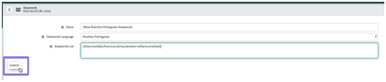

* **Bounding box:** x=112.0, y=212.7, width=432.0 pt, height=87.5 pt.
* **Nearby source context:** Field / Value / Select Brazilian Portuguese
* **What is shown:** This embedded source image appears near the source context `Field / Value / Select Brazilian Portuguese`. It is a ServiceNow product screenshot, UI form, list view, report/dashboard visual, setup screen, dialog, or instructional figure supporting the surrounding procedure. Objects may include application headers, navigation breadcrumbs, form fields, related links, buttons, tabs, lists, result rows, charts, and highlighted controls. Its business purpose is to make the Predictive Intelligence setup, training, testing, monitoring, or reference procedure easier to follow. Its technical purpose is to identify the exact ServiceNow screen state, field, UI region, or configuration control referenced by the same-page instructions.
* **Objects/components present:** ServiceNow interface elements, icons, labels, fields, controls, lists, charts, or instructional blocks visible in the crop as applicable. The exact crop is preserved in `_assets/p1396_image01.png` for long-term verification.
* **Relationships / arrows / flow / labels:** The relationships are UI relationships visible inside the screenshot: fields belong to a form, buttons and links trigger actions, rows belong to lists/tables, charts summarize records, tabs separate panels, and highlighted areas identify the intended target. No separate network topology, architecture component boundary, or security zone is labeled unless visible in the asset.
* **Business purpose:** Supports the reader in performing or understanding the Predictive Intelligence operation described by the surrounding source page.
* **Technical purpose:** Preserves the UI state or conceptual visual needed to reproduce, verify, or interpret the procedure.
* **Visible text captured from image:**

```text
[No separate OCR text recorded for this crop; source asset is retained for visual verification.]
```

### Source page 1396 — Image 7

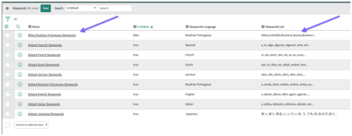

* **Bounding box:** x=112.0, y=354.2, width=432.0 pt, height=163.6 pt.
* **Nearby source context:** Value / Select Brazilian Portuguese / 4. Click Submit.
* **What is shown:** This embedded source image appears near the source context `Value / Select Brazilian Portuguese / 4. Click Submit.`. It is a ServiceNow product screenshot, UI form, list view, report/dashboard visual, setup screen, dialog, or instructional figure supporting the surrounding procedure. Objects may include application headers, navigation breadcrumbs, form fields, related links, buttons, tabs, lists, result rows, charts, and highlighted controls. Its business purpose is to make the Predictive Intelligence setup, training, testing, monitoring, or reference procedure easier to follow. Its technical purpose is to identify the exact ServiceNow screen state, field, UI region, or configuration control referenced by the same-page instructions.
* **Objects/components present:** ServiceNow interface elements, icons, labels, fields, controls, lists, charts, or instructional blocks visible in the crop as applicable. The exact crop is preserved in `_assets/p1396_image02.png` for long-term verification.
* **Relationships / arrows / flow / labels:** The relationships are UI relationships visible inside the screenshot: fields belong to a form, buttons and links trigger actions, rows belong to lists/tables, charts summarize records, tabs separate panels, and highlighted areas identify the intended target. No separate network topology, architecture component boundary, or security zone is labeled unless visible in the asset.
* **Business purpose:** Supports the reader in performing or understanding the Predictive Intelligence operation described by the surrounding source page.
* **Technical purpose:** Preserves the UI state or conceptual visual needed to reproduce, verify, or interpret the procedure.
* **Visible text captured from image:**

```text
[No separate OCR text recorded for this crop; source asset is retained for visual verification.]
```

### Source page 1396 — Image 8

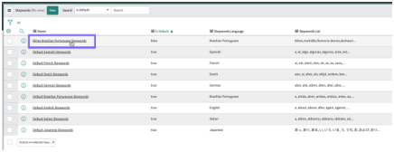

* **Bounding box:** x=112.0, y=571.8, width=432.0 pt, height=162.3 pt.
* **Nearby source context:** 4. Click Submit. / 5. Optional: If you need to update your stopwords list, just click its Name, add or remove words / from the list, and click Update.
* **What is shown:** This embedded source image appears near the source context `4. Click Submit. / 5. Optional: If you need to update your stopwords list, just click its Name, add or remove words / from the list, and click Update.`. It is a ServiceNow product screenshot, UI form, list view, report/dashboard visual, setup screen, dialog, or instructional figure supporting the surrounding procedure. Objects may include application headers, navigation breadcrumbs, form fields, related links, buttons, tabs, lists, result rows, charts, and highlighted controls. Its business purpose is to make the Predictive Intelligence setup, training, testing, monitoring, or reference procedure easier to follow. Its technical purpose is to identify the exact ServiceNow screen state, field, UI region, or configuration control referenced by the same-page instructions.
* **Objects/components present:** ServiceNow interface elements, icons, labels, fields, controls, lists, charts, or instructional blocks visible in the crop as applicable. The exact crop is preserved in `_assets/p1396_image03.png` for long-term verification.
* **Relationships / arrows / flow / labels:** The relationships are UI relationships visible inside the screenshot: fields belong to a form, buttons and links trigger actions, rows belong to lists/tables, charts summarize records, tabs separate panels, and highlighted areas identify the intended target. No separate network topology, architecture component boundary, or security zone is labeled unless visible in the asset.
* **Business purpose:** Supports the reader in performing or understanding the Predictive Intelligence operation described by the surrounding source page.
* **Technical purpose:** Preserves the UI state or conceptual visual needed to reproduce, verify, or interpret the procedure.
* **Visible text captured from image:**

```text
[No separate OCR text recorded for this crop; source asset is retained for visual verification.]
```

### Source page 1399 — Image 9

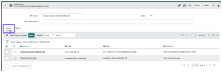

* **Bounding box:** x=112.0, y=89.7, width=432.0 pt, height=136.8 pt.
* **Nearby source context:** 11. Select Submit.
* **What is shown:** This embedded source image appears near the source context `11. Select Submit.`. It is a ServiceNow product screenshot, UI form, list view, report/dashboard visual, setup screen, dialog, or instructional figure supporting the surrounding procedure. Objects may include application headers, navigation breadcrumbs, form fields, related links, buttons, tabs, lists, result rows, charts, and highlighted controls. Its business purpose is to make the Predictive Intelligence setup, training, testing, monitoring, or reference procedure easier to follow. Its technical purpose is to identify the exact ServiceNow screen state, field, UI region, or configuration control referenced by the same-page instructions.
* **Objects/components present:** ServiceNow interface elements, icons, labels, fields, controls, lists, charts, or instructional blocks visible in the crop as applicable. The exact crop is preserved in `_assets/p1399_image01.png` for long-term verification.
* **Relationships / arrows / flow / labels:** The relationships are UI relationships visible inside the screenshot: fields belong to a form, buttons and links trigger actions, rows belong to lists/tables, charts summarize records, tabs separate panels, and highlighted areas identify the intended target. No separate network topology, architecture component boundary, or security zone is labeled unless visible in the asset.
* **Business purpose:** Supports the reader in performing or understanding the Predictive Intelligence operation described by the surrounding source page.
* **Technical purpose:** Preserves the UI state or conceptual visual needed to reproduce, verify, or interpret the procedure.
* **Visible text captured from image:**

```text
[No separate OCR text recorded for this crop; source asset is retained for visual verification.]
```

### Source page 1399 — Image 10

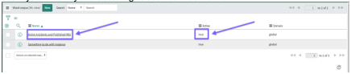

* **Bounding box:** x=72.0, y=308.9, width=432.0 pt, height=86.8 pt.
* **Nearby source context:** 11. Select Submit. / 12. Select Update. / Result
* **What is shown:** This embedded source image appears near the source context `11. Select Submit. / 12. Select Update. / Result`. It is a ServiceNow product screenshot, UI form, list view, report/dashboard visual, setup screen, dialog, or instructional figure supporting the surrounding procedure. Objects may include application headers, navigation breadcrumbs, form fields, related links, buttons, tabs, lists, result rows, charts, and highlighted controls. Its business purpose is to make the Predictive Intelligence setup, training, testing, monitoring, or reference procedure easier to follow. Its technical purpose is to identify the exact ServiceNow screen state, field, UI region, or configuration control referenced by the same-page instructions.
* **Objects/components present:** ServiceNow interface elements, icons, labels, fields, controls, lists, charts, or instructional blocks visible in the crop as applicable. The exact crop is preserved in `_assets/p1399_image02.png` for long-term verification.
* **Relationships / arrows / flow / labels:** The relationships are UI relationships visible inside the screenshot: fields belong to a form, buttons and links trigger actions, rows belong to lists/tables, charts summarize records, tabs separate panels, and highlighted areas identify the intended target. No separate network topology, architecture component boundary, or security zone is labeled unless visible in the asset.
* **Business purpose:** Supports the reader in performing or understanding the Predictive Intelligence operation described by the surrounding source page.
* **Technical purpose:** Preserves the UI state or conceptual visual needed to reproduce, verify, or interpret the procedure.
* **Visible text captured from image:**

```text
[No separate OCR text recorded for this crop; source asset is retained for visual verification.]
```

### Source page 1403 — Image 11

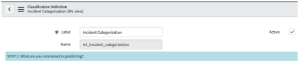

* **Bounding box:** x=112.0, y=152.3, width=432.0 pt, height=87.8 pt.
* **Nearby source context:** Procedure / 1. Navigate to All > Predictive Intelligence > Classification > Solution Definitions. / 2. Open a saved classification solution definition form.
* **What is shown:** This embedded source image appears near the source context `Procedure / 1. Navigate to All > Predictive Intelligence > Classification > Solution Definitions. / 2. Open a saved classification solution definition form.`. It is a ServiceNow product screenshot, UI form, list view, report/dashboard visual, setup screen, dialog, or instructional figure supporting the surrounding procedure. Objects may include application headers, navigation breadcrumbs, form fields, related links, buttons, tabs, lists, result rows, charts, and highlighted controls. Its business purpose is to make the Predictive Intelligence setup, training, testing, monitoring, or reference procedure easier to follow. Its technical purpose is to identify the exact ServiceNow screen state, field, UI region, or configuration control referenced by the same-page instructions.
* **Objects/components present:** ServiceNow interface elements, icons, labels, fields, controls, lists, charts, or instructional blocks visible in the crop as applicable. The exact crop is preserved in `_assets/p1403_image01.png` for long-term verification.
* **Relationships / arrows / flow / labels:** The relationships are UI relationships visible inside the screenshot: fields belong to a form, buttons and links trigger actions, rows belong to lists/tables, charts summarize records, tabs separate panels, and highlighted areas identify the intended target. No separate network topology, architecture component boundary, or security zone is labeled unless visible in the asset.
* **Business purpose:** Supports the reader in performing or understanding the Predictive Intelligence operation described by the surrounding source page.
* **Technical purpose:** Preserves the UI state or conceptual visual needed to reproduce, verify, or interpret the procedure.
* **Visible text captured from image:**

```text
[No separate OCR text recorded for this crop; source asset is retained for visual verification.]
```

### Source page 1403 — Image 12

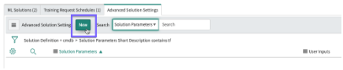

* **Bounding box:** x=112.0, y=281.5, width=432.0 pt, height=84.6 pt.
* **Nearby source context:** 1. Navigate to All > Predictive Intelligence > Classification > Solution Definitions. / 2. Open a saved classification solution definition form. / 3. On the Advanced Solution Settings tab in the Related Links section of the form, select New.
* **What is shown:** This embedded source image appears near the source context `1. Navigate to All > Predictive Intelligence > Classification > Solution Definitions. / 2. Open a saved classification solution definition form. / 3. On the Advanced Solution Settings tab in the Related Links section of the form, select New.`. It is a ServiceNow product screenshot, UI form, list view, report/dashboard visual, setup screen, dialog, or instructional figure supporting the surrounding procedure. Objects may include application headers, navigation breadcrumbs, form fields, related links, buttons, tabs, lists, result rows, charts, and highlighted controls. Its business purpose is to make the Predictive Intelligence setup, training, testing, monitoring, or reference procedure easier to follow. Its technical purpose is to identify the exact ServiceNow screen state, field, UI region, or configuration control referenced by the same-page instructions.
* **Objects/components present:** ServiceNow interface elements, icons, labels, fields, controls, lists, charts, or instructional blocks visible in the crop as applicable. The exact crop is preserved in `_assets/p1403_image02.png` for long-term verification.
* **Relationships / arrows / flow / labels:** The relationships are UI relationships visible inside the screenshot: fields belong to a form, buttons and links trigger actions, rows belong to lists/tables, charts summarize records, tabs separate panels, and highlighted areas identify the intended target. No separate network topology, architecture component boundary, or security zone is labeled unless visible in the asset.
* **Business purpose:** Supports the reader in performing or understanding the Predictive Intelligence operation described by the surrounding source page.
* **Technical purpose:** Preserves the UI state or conceptual visual needed to reproduce, verify, or interpret the procedure.
* **Visible text captured from image:**

```text
[No separate OCR text recorded for this crop; source asset is retained for visual verification.]
```

### Source page 1403 — Image 13

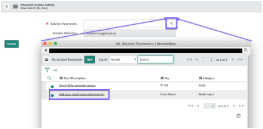

* **Bounding box:** x=122.0, y=464.2, width=432.0 pt, height=209.7 pt.
* **Nearby source context:** 4. Create a parameter record. / a. In the Solution Parameters field, select the search icon. / b. In the ML Solution Parameters screen, select Add class recall value while training.
* **What is shown:** This embedded source image appears near the source context `4. Create a parameter record. / a. In the Solution Parameters field, select the search icon. / b. In the ML Solution Parameters screen, select Add class recall value while training.`. It is a ServiceNow product screenshot, UI form, list view, report/dashboard visual, setup screen, dialog, or instructional figure supporting the surrounding procedure. Objects may include application headers, navigation breadcrumbs, form fields, related links, buttons, tabs, lists, result rows, charts, and highlighted controls. Its business purpose is to make the Predictive Intelligence setup, training, testing, monitoring, or reference procedure easier to follow. Its technical purpose is to identify the exact ServiceNow screen state, field, UI region, or configuration control referenced by the same-page instructions.
* **Objects/components present:** ServiceNow interface elements, icons, labels, fields, controls, lists, charts, or instructional blocks visible in the crop as applicable. The exact crop is preserved in `_assets/p1403_image03.png` for long-term verification.
* **Relationships / arrows / flow / labels:** The relationships are UI relationships visible inside the screenshot: fields belong to a form, buttons and links trigger actions, rows belong to lists/tables, charts summarize records, tabs separate panels, and highlighted areas identify the intended target. No separate network topology, architecture component boundary, or security zone is labeled unless visible in the asset.
* **Business purpose:** Supports the reader in performing or understanding the Predictive Intelligence operation described by the surrounding source page.
* **Technical purpose:** Preserves the UI state or conceptual visual needed to reproduce, verify, or interpret the procedure.
* **Visible text captured from image:**

```text
[No separate OCR text recorded for this crop; source asset is retained for visual verification.]
```

### Source page 1404 — Image 14

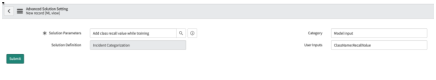

* **Bounding box:** x=112.0, y=39.0, width=432.0 pt, height=74.3 pt.
* **Nearby source context:** No nearby heading text was detected.
* **What is shown:** This embedded source image appears near the source context `No nearby heading text was detected.`. It is a ServiceNow product screenshot, UI form, list view, report/dashboard visual, setup screen, dialog, or instructional figure supporting the surrounding procedure. Objects may include application headers, navigation breadcrumbs, form fields, related links, buttons, tabs, lists, result rows, charts, and highlighted controls. Its business purpose is to make the Predictive Intelligence setup, training, testing, monitoring, or reference procedure easier to follow. Its technical purpose is to identify the exact ServiceNow screen state, field, UI region, or configuration control referenced by the same-page instructions.
* **Objects/components present:** ServiceNow interface elements, icons, labels, fields, controls, lists, charts, or instructional blocks visible in the crop as applicable. The exact crop is preserved in `_assets/p1404_image01.png` for long-term verification.
* **Relationships / arrows / flow / labels:** The relationships are UI relationships visible inside the screenshot: fields belong to a form, buttons and links trigger actions, rows belong to lists/tables, charts summarize records, tabs separate panels, and highlighted areas identify the intended target. No separate network topology, architecture component boundary, or security zone is labeled unless visible in the asset.
* **Business purpose:** Supports the reader in performing or understanding the Predictive Intelligence operation described by the surrounding source page.
* **Technical purpose:** Preserves the UI state or conceptual visual needed to reproduce, verify, or interpret the procedure.
* **Visible text captured from image:**

```text
[No separate OCR text recorded for this crop; source asset is retained for visual verification.]
```

### Source page 1404 — Image 15

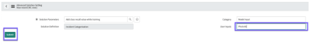

* **Bounding box:** x=112.0, y=271.3, width=432.0 pt, height=60.3 pt.
* **Nearby source context:** In this scenario, you enter Phish for the ClassName. / b. Enter a colon character (:), then the Recall value. / Enter 95 for the RecallValue in the example scenario.
* **What is shown:** This embedded source image appears near the source context `In this scenario, you enter Phish for the ClassName. / b. Enter a colon character (:), then the Recall value. / Enter 95 for the RecallValue in the example scenario.`. It is a ServiceNow product screenshot, UI form, list view, report/dashboard visual, setup screen, dialog, or instructional figure supporting the surrounding procedure. Objects may include application headers, navigation breadcrumbs, form fields, related links, buttons, tabs, lists, result rows, charts, and highlighted controls. Its business purpose is to make the Predictive Intelligence setup, training, testing, monitoring, or reference procedure easier to follow. Its technical purpose is to identify the exact ServiceNow screen state, field, UI region, or configuration control referenced by the same-page instructions.
* **Objects/components present:** ServiceNow interface elements, icons, labels, fields, controls, lists, charts, or instructional blocks visible in the crop as applicable. The exact crop is preserved in `_assets/p1404_image02.png` for long-term verification.
* **Relationships / arrows / flow / labels:** The relationships are UI relationships visible inside the screenshot: fields belong to a form, buttons and links trigger actions, rows belong to lists/tables, charts summarize records, tabs separate panels, and highlighted areas identify the intended target. No separate network topology, architecture component boundary, or security zone is labeled unless visible in the asset.
* **Business purpose:** Supports the reader in performing or understanding the Predictive Intelligence operation described by the surrounding source page.
* **Technical purpose:** Preserves the UI state or conceptual visual needed to reproduce, verify, or interpret the procedure.
* **Visible text captured from image:**

```text
[No separate OCR text recorded for this crop; source asset is retained for visual verification.]
```

### Source page 1404 — Image 16

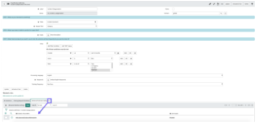

* **Bounding box:** x=112.0, y=408.2, width=432.0 pt, height=206.1 pt.
* **Nearby source context:** Enter 95 for the RecallValue in the example scenario. / 6. Select Submit. / Result: Class recall is configured for your classification solution. Its solution parameter
* **What is shown:** This embedded source image appears near the source context `Enter 95 for the RecallValue in the example scenario. / 6. Select Submit. / Result: Class recall is configured for your classification solution. Its solution parameter`. It is a ServiceNow product screenshot, UI form, list view, report/dashboard visual, setup screen, dialog, or instructional figure supporting the surrounding procedure. Objects may include application headers, navigation breadcrumbs, form fields, related links, buttons, tabs, lists, result rows, charts, and highlighted controls. Its business purpose is to make the Predictive Intelligence setup, training, testing, monitoring, or reference procedure easier to follow. Its technical purpose is to identify the exact ServiceNow screen state, field, UI region, or configuration control referenced by the same-page instructions.
* **Objects/components present:** ServiceNow interface elements, icons, labels, fields, controls, lists, charts, or instructional blocks visible in the crop as applicable. The exact crop is preserved in `_assets/p1404_image03.png` for long-term verification.
* **Relationships / arrows / flow / labels:** The relationships are UI relationships visible inside the screenshot: fields belong to a form, buttons and links trigger actions, rows belong to lists/tables, charts summarize records, tabs separate panels, and highlighted areas identify the intended target. No separate network topology, architecture component boundary, or security zone is labeled unless visible in the asset.
* **Business purpose:** Supports the reader in performing or understanding the Predictive Intelligence operation described by the surrounding source page.
* **Technical purpose:** Preserves the UI state or conceptual visual needed to reproduce, verify, or interpret the procedure.
* **Visible text captured from image:**

```text
[No separate OCR text recorded for this crop; source asset is retained for visual verification.]
```

### Source page 1405 — Image 17


* **Bounding box:** x=112.0, y=466.2, width=432.0 pt, height=92.2 pt.
* **Nearby source context:** 1. Navigate to a Solution Definition, such as All > Predictive Intelligence > Similarity > Solution / Definitions. / 2. Open a solution definition form.
* **What is shown:** This embedded source image appears near the source context `1. Navigate to a Solution Definition, such as All > Predictive Intelligence > Similarity > Solution / Definitions. / 2. Open a solution definition form.`. It is a ServiceNow product screenshot, UI form, list view, report/dashboard visual, setup screen, dialog, or instructional figure supporting the surrounding procedure. Objects may include application headers, navigation breadcrumbs, form fields, related links, buttons, tabs, lists, result rows, charts, and highlighted controls. Its business purpose is to make the Predictive Intelligence setup, training, testing, monitoring, or reference procedure easier to follow. Its technical purpose is to identify the exact ServiceNow screen state, field, UI region, or configuration control referenced by the same-page instructions.
* **Objects/components present:** ServiceNow interface elements, icons, labels, fields, controls, lists, charts, or instructional blocks visible in the crop as applicable. The exact crop is preserved in `_assets/p1405_image01.png` for long-term verification.
* **Relationships / arrows / flow / labels:** The relationships are UI relationships visible inside the screenshot: fields belong to a form, buttons and links trigger actions, rows belong to lists/tables, charts summarize records, tabs separate panels, and highlighted areas identify the intended target. No separate network topology, architecture component boundary, or security zone is labeled unless visible in the asset.
* **Business purpose:** Supports the reader in performing or understanding the Predictive Intelligence operation described by the surrounding source page.
* **Technical purpose:** Preserves the UI state or conceptual visual needed to reproduce, verify, or interpret the procedure.
* **Visible text captured from image:**

```text
[No separate OCR text recorded for this crop; source asset is retained for visual verification.]
```

### Source page 1405 — Image 18


* **Bounding box:** x=112.0, y=599.9, width=432.0 pt, height=84.6 pt.
* **Nearby source context:** Definitions. / 2. Open a solution definition form. / 3. On the Advanced Solution Settings tab in the Related Links section of the form, click New.
* **What is shown:** This embedded source image appears near the source context `Definitions. / 2. Open a solution definition form. / 3. On the Advanced Solution Settings tab in the Related Links section of the form, click New.`. It is a ServiceNow product screenshot, UI form, list view, report/dashboard visual, setup screen, dialog, or instructional figure supporting the surrounding procedure. Objects may include application headers, navigation breadcrumbs, form fields, related links, buttons, tabs, lists, result rows, charts, and highlighted controls. Its business purpose is to make the Predictive Intelligence setup, training, testing, monitoring, or reference procedure easier to follow. Its technical purpose is to identify the exact ServiceNow screen state, field, UI region, or configuration control referenced by the same-page instructions.
* **Objects/components present:** ServiceNow interface elements, icons, labels, fields, controls, lists, charts, or instructional blocks visible in the crop as applicable. The exact crop is preserved in `_assets/p1405_image02.png` for long-term verification.
* **Relationships / arrows / flow / labels:** The relationships are UI relationships visible inside the screenshot: fields belong to a form, buttons and links trigger actions, rows belong to lists/tables, charts summarize records, tabs separate panels, and highlighted areas identify the intended target. No separate network topology, architecture component boundary, or security zone is labeled unless visible in the asset.
* **Business purpose:** Supports the reader in performing or understanding the Predictive Intelligence operation described by the surrounding source page.
* **Technical purpose:** Preserves the UI state or conceptual visual needed to reproduce, verify, or interpret the procedure.
* **Visible text captured from image:**

```text
[No separate OCR text recorded for this crop; source asset is retained for visual verification.]
```

### Source page 1406 — Image 19


* **Bounding box:** x=112.0, y=39.0, width=432.0 pt, height=209.7 pt.
* **Nearby source context:** No nearby heading text was detected.
* **What is shown:** This embedded source image appears near the source context `No nearby heading text was detected.`. It is a ServiceNow product screenshot, UI form, list view, report/dashboard visual, setup screen, dialog, or instructional figure supporting the surrounding procedure. Objects may include application headers, navigation breadcrumbs, form fields, related links, buttons, tabs, lists, result rows, charts, and highlighted controls. Its business purpose is to make the Predictive Intelligence setup, training, testing, monitoring, or reference procedure easier to follow. Its technical purpose is to identify the exact ServiceNow screen state, field, UI region, or configuration control referenced by the same-page instructions.
* **Objects/components present:** ServiceNow interface elements, icons, labels, fields, controls, lists, charts, or instructional blocks visible in the crop as applicable. The exact crop is preserved in `_assets/p1406_image01.png` for long-term verification.
* **Relationships / arrows / flow / labels:** The relationships are UI relationships visible inside the screenshot: fields belong to a form, buttons and links trigger actions, rows belong to lists/tables, charts summarize records, tabs separate panels, and highlighted areas identify the intended target. No separate network topology, architecture component boundary, or security zone is labeled unless visible in the asset.
* **Business purpose:** Supports the reader in performing or understanding the Predictive Intelligence operation described by the surrounding source page.
* **Technical purpose:** Preserves the UI state or conceptual visual needed to reproduce, verify, or interpret the procedure.
* **Visible text captured from image:**

```text
[No separate OCR text recorded for this crop; source asset is retained for visual verification.]
```

### Source page 1406 — Image 20


* **Bounding box:** x=112.0, y=312.7, width=432.0 pt, height=88.7 pt.
* **Nearby source context:** 5. Click Submit.
* **What is shown:** This embedded source image appears near the source context `5. Click Submit.`. It is a ServiceNow product screenshot, UI form, list view, report/dashboard visual, setup screen, dialog, or instructional figure supporting the surrounding procedure. Objects may include application headers, navigation breadcrumbs, form fields, related links, buttons, tabs, lists, result rows, charts, and highlighted controls. Its business purpose is to make the Predictive Intelligence setup, training, testing, monitoring, or reference procedure easier to follow. Its technical purpose is to identify the exact ServiceNow screen state, field, UI region, or configuration control referenced by the same-page instructions.
* **Objects/components present:** ServiceNow interface elements, icons, labels, fields, controls, lists, charts, or instructional blocks visible in the crop as applicable. The exact crop is preserved in `_assets/p1406_image02.png` for long-term verification.
* **Relationships / arrows / flow / labels:** The relationships are UI relationships visible inside the screenshot: fields belong to a form, buttons and links trigger actions, rows belong to lists/tables, charts summarize records, tabs separate panels, and highlighted areas identify the intended target. No separate network topology, architecture component boundary, or security zone is labeled unless visible in the asset.
* **Business purpose:** Supports the reader in performing or understanding the Predictive Intelligence operation described by the surrounding source page.
* **Technical purpose:** Preserves the UI state or conceptual visual needed to reproduce, verify, or interpret the procedure.
* **Visible text captured from image:**

```text
[No separate OCR text recorded for this crop; source asset is retained for visual verification.]
```

### Source page 1407 — Image 21


* **Bounding box:** x=112.0, y=74.0, width=432.0 pt, height=395.9 pt.
* **Nearby source context:** Result: TF-IDF is configured for your similarity solution. Its solution parameter appears on the
* **What is shown:** This embedded source image appears near the source context `Result: TF-IDF is configured for your similarity solution. Its solution parameter appears on the`. It is a ServiceNow product screenshot, UI form, list view, report/dashboard visual, setup screen, dialog, or instructional figure supporting the surrounding procedure. Objects may include application headers, navigation breadcrumbs, form fields, related links, buttons, tabs, lists, result rows, charts, and highlighted controls. Its business purpose is to make the Predictive Intelligence setup, training, testing, monitoring, or reference procedure easier to follow. Its technical purpose is to identify the exact ServiceNow screen state, field, UI region, or configuration control referenced by the same-page instructions.
* **Objects/components present:** ServiceNow interface elements, icons, labels, fields, controls, lists, charts, or instructional blocks visible in the crop as applicable. The exact crop is preserved in `_assets/p1407_image01.png` for long-term verification.
* **Relationships / arrows / flow / labels:** The relationships are UI relationships visible inside the screenshot: fields belong to a form, buttons and links trigger actions, rows belong to lists/tables, charts summarize records, tabs separate panels, and highlighted areas identify the intended target. No separate network topology, architecture component boundary, or security zone is labeled unless visible in the asset.
* **Business purpose:** Supports the reader in performing or understanding the Predictive Intelligence operation described by the surrounding source page.
* **Technical purpose:** Preserves the UI state or conceptual visual needed to reproduce, verify, or interpret the procedure.
* **Visible text captured from image:**

```text
[No separate OCR text recorded for this crop; source asset is retained for visual verification.]
```

### Source page 1408 — Image 22


* **Bounding box:** x=112.0, y=302.8, width=432.0 pt, height=84.6 pt.
* **Nearby source context:** 1. Navigate to All > Predictive Intelligence > Classification > Solution Definitions. / 2. Open a classification solution definition form. / 3. On the Advanced Solution Settings tab in the Related Links section of the form, select New.
* **What is shown:** This embedded source image appears near the source context `1. Navigate to All > Predictive Intelligence > Classification > Solution Definitions. / 2. Open a classification solution definition form. / 3. On the Advanced Solution Settings tab in the Related Links section of the form, select New.`. It is a ServiceNow product screenshot, UI form, list view, report/dashboard visual, setup screen, dialog, or instructional figure supporting the surrounding procedure. Objects may include application headers, navigation breadcrumbs, form fields, related links, buttons, tabs, lists, result rows, charts, and highlighted controls. Its business purpose is to make the Predictive Intelligence setup, training, testing, monitoring, or reference procedure easier to follow. Its technical purpose is to identify the exact ServiceNow screen state, field, UI region, or configuration control referenced by the same-page instructions.
* **Objects/components present:** ServiceNow interface elements, icons, labels, fields, controls, lists, charts, or instructional blocks visible in the crop as applicable. The exact crop is preserved in `_assets/p1408_image01.png` for long-term verification.
* **Relationships / arrows / flow / labels:** The relationships are UI relationships visible inside the screenshot: fields belong to a form, buttons and links trigger actions, rows belong to lists/tables, charts summarize records, tabs separate panels, and highlighted areas identify the intended target. No separate network topology, architecture component boundary, or security zone is labeled unless visible in the asset.
* **Business purpose:** Supports the reader in performing or understanding the Predictive Intelligence operation described by the surrounding source page.
* **Technical purpose:** Preserves the UI state or conceptual visual needed to reproduce, verify, or interpret the procedure.
* **Visible text captured from image:**

```text
[No separate OCR text recorded for this crop; source asset is retained for visual verification.]
```

### Source page 1408 — Image 23


* **Bounding box:** x=112.0, y=477.9, width=432.0 pt, height=200.3 pt.
* **Nearby source context:** a. In the Solution Parameters field, select the search icon. / b. In the ML Solution Parameters screen, select Use XGBoost algo for classification model / training.
* **What is shown:** This embedded source image appears near the source context `a. In the Solution Parameters field, select the search icon. / b. In the ML Solution Parameters screen, select Use XGBoost algo for classification model / training.`. It is a ServiceNow product screenshot, UI form, list view, report/dashboard visual, setup screen, dialog, or instructional figure supporting the surrounding procedure. Objects may include application headers, navigation breadcrumbs, form fields, related links, buttons, tabs, lists, result rows, charts, and highlighted controls. Its business purpose is to make the Predictive Intelligence setup, training, testing, monitoring, or reference procedure easier to follow. Its technical purpose is to identify the exact ServiceNow screen state, field, UI region, or configuration control referenced by the same-page instructions.
* **Objects/components present:** ServiceNow interface elements, icons, labels, fields, controls, lists, charts, or instructional blocks visible in the crop as applicable. The exact crop is preserved in `_assets/p1408_image02.png` for long-term verification.
* **Relationships / arrows / flow / labels:** The relationships are UI relationships visible inside the screenshot: fields belong to a form, buttons and links trigger actions, rows belong to lists/tables, charts summarize records, tabs separate panels, and highlighted areas identify the intended target. No separate network topology, architecture component boundary, or security zone is labeled unless visible in the asset.
* **Business purpose:** Supports the reader in performing or understanding the Predictive Intelligence operation described by the surrounding source page.
* **Technical purpose:** Preserves the UI state or conceptual visual needed to reproduce, verify, or interpret the procedure.
* **Visible text captured from image:**

```text
[No separate OCR text recorded for this crop; source asset is retained for visual verification.]
```

### Source page 1409 — Image 24


* **Bounding box:** x=112.0, y=39.0, width=432.0 pt, height=81.1 pt.
* **Nearby source context:** No nearby heading text was detected.
* **What is shown:** This embedded source image appears near the source context `No nearby heading text was detected.`. It is a ServiceNow product screenshot, UI form, list view, report/dashboard visual, setup screen, dialog, or instructional figure supporting the surrounding procedure. Objects may include application headers, navigation breadcrumbs, form fields, related links, buttons, tabs, lists, result rows, charts, and highlighted controls. Its business purpose is to make the Predictive Intelligence setup, training, testing, monitoring, or reference procedure easier to follow. Its technical purpose is to identify the exact ServiceNow screen state, field, UI region, or configuration control referenced by the same-page instructions.
* **Objects/components present:** ServiceNow interface elements, icons, labels, fields, controls, lists, charts, or instructional blocks visible in the crop as applicable. The exact crop is preserved in `_assets/p1409_image01.png` for long-term verification.
* **Relationships / arrows / flow / labels:** The relationships are UI relationships visible inside the screenshot: fields belong to a form, buttons and links trigger actions, rows belong to lists/tables, charts summarize records, tabs separate panels, and highlighted areas identify the intended target. No separate network topology, architecture component boundary, or security zone is labeled unless visible in the asset.
* **Business purpose:** Supports the reader in performing or understanding the Predictive Intelligence operation described by the surrounding source page.
* **Technical purpose:** Preserves the UI state or conceptual visual needed to reproduce, verify, or interpret the procedure.
* **Visible text captured from image:**

```text
[No separate OCR text recorded for this crop; source asset is retained for visual verification.]
```

### Source page 1409 — Image 25


* **Bounding box:** x=112.0, y=196.6, width=432.0 pt, height=205.9 pt.
* **Nearby source context:** 6. Select Submit. / Result: XGBoost is configured for your classification solution. Its solution parameter appears
* **What is shown:** This embedded source image appears near the source context `6. Select Submit. / Result: XGBoost is configured for your classification solution. Its solution parameter appears`. It is a ServiceNow product screenshot, UI form, list view, report/dashboard visual, setup screen, dialog, or instructional figure supporting the surrounding procedure. Objects may include application headers, navigation breadcrumbs, form fields, related links, buttons, tabs, lists, result rows, charts, and highlighted controls. Its business purpose is to make the Predictive Intelligence setup, training, testing, monitoring, or reference procedure easier to follow. Its technical purpose is to identify the exact ServiceNow screen state, field, UI region, or configuration control referenced by the same-page instructions.
* **Objects/components present:** ServiceNow interface elements, icons, labels, fields, controls, lists, charts, or instructional blocks visible in the crop as applicable. The exact crop is preserved in `_assets/p1409_image02.png` for long-term verification.
* **Relationships / arrows / flow / labels:** The relationships are UI relationships visible inside the screenshot: fields belong to a form, buttons and links trigger actions, rows belong to lists/tables, charts summarize records, tabs separate panels, and highlighted areas identify the intended target. No separate network topology, architecture component boundary, or security zone is labeled unless visible in the asset.
* **Business purpose:** Supports the reader in performing or understanding the Predictive Intelligence operation described by the surrounding source page.
* **Technical purpose:** Preserves the UI state or conceptual visual needed to reproduce, verify, or interpret the procedure.
* **Visible text captured from image:**

```text
[No separate OCR text recorded for this crop; source asset is retained for visual verification.]
```

### Source page 1410 — Image 26


* **Bounding box:** x=112.0, y=373.6, width=432.0 pt, height=74.8 pt.
* **Nearby source context:** Procedure / 1. Navigate to All > Predictive Intelligence > Clustering > Solution Definitions. / 2. Open a clustering solution definition form.
* **What is shown:** This embedded source image appears near the source context `Procedure / 1. Navigate to All > Predictive Intelligence > Clustering > Solution Definitions. / 2. Open a clustering solution definition form.`. It is a ServiceNow product screenshot, UI form, list view, report/dashboard visual, setup screen, dialog, or instructional figure supporting the surrounding procedure. Objects may include application headers, navigation breadcrumbs, form fields, related links, buttons, tabs, lists, result rows, charts, and highlighted controls. Its business purpose is to make the Predictive Intelligence setup, training, testing, monitoring, or reference procedure easier to follow. Its technical purpose is to identify the exact ServiceNow screen state, field, UI region, or configuration control referenced by the same-page instructions.
* **Objects/components present:** ServiceNow interface elements, icons, labels, fields, controls, lists, charts, or instructional blocks visible in the crop as applicable. The exact crop is preserved in `_assets/p1410_image01.png` for long-term verification.
* **Relationships / arrows / flow / labels:** The relationships are UI relationships visible inside the screenshot: fields belong to a form, buttons and links trigger actions, rows belong to lists/tables, charts summarize records, tabs separate panels, and highlighted areas identify the intended target. No separate network topology, architecture component boundary, or security zone is labeled unless visible in the asset.
* **Business purpose:** Supports the reader in performing or understanding the Predictive Intelligence operation described by the surrounding source page.
* **Technical purpose:** Preserves the UI state or conceptual visual needed to reproduce, verify, or interpret the procedure.
* **Visible text captured from image:**

```text
[No separate OCR text recorded for this crop; source asset is retained for visual verification.]
```

### Source page 1410 — Image 27


* **Bounding box:** x=112.0, y=502.4, width=432.0 pt, height=84.6 pt.
* **Nearby source context:** 2. Open a clustering solution definition form. / 3. On the Advanced Solution Settings tab in the Related Links section of the form, select Solution / Parameters from the picker, then click New.
* **What is shown:** This embedded source image appears near the source context `2. Open a clustering solution definition form. / 3. On the Advanced Solution Settings tab in the Related Links section of the form, select Solution / Parameters from the picker, then click New.`. It is a ServiceNow product screenshot, UI form, list view, report/dashboard visual, setup screen, dialog, or instructional figure supporting the surrounding procedure. Objects may include application headers, navigation breadcrumbs, form fields, related links, buttons, tabs, lists, result rows, charts, and highlighted controls. Its business purpose is to make the Predictive Intelligence setup, training, testing, monitoring, or reference procedure easier to follow. Its technical purpose is to identify the exact ServiceNow screen state, field, UI region, or configuration control referenced by the same-page instructions.
* **Objects/components present:** ServiceNow interface elements, icons, labels, fields, controls, lists, charts, or instructional blocks visible in the crop as applicable. The exact crop is preserved in `_assets/p1410_image02.png` for long-term verification.
* **Relationships / arrows / flow / labels:** The relationships are UI relationships visible inside the screenshot: fields belong to a form, buttons and links trigger actions, rows belong to lists/tables, charts summarize records, tabs separate panels, and highlighted areas identify the intended target. No separate network topology, architecture component boundary, or security zone is labeled unless visible in the asset.
* **Business purpose:** Supports the reader in performing or understanding the Predictive Intelligence operation described by the surrounding source page.
* **Technical purpose:** Preserves the UI state or conceptual visual needed to reproduce, verify, or interpret the procedure.
* **Visible text captured from image:**

```text
[No separate OCR text recorded for this crop; source asset is retained for visual verification.]
```

### Source page 1411 — Image 28


* **Bounding box:** x=122.0, y=95.5, width=432.0 pt, height=168.3 pt.
* **Nearby source context:** a. In the Solution Parameters field, select the search icon. / b. In the ML Solution Parameters screen, select Use DBSCAN algo for clustering.
* **What is shown:** This embedded source image appears near the source context `a. In the Solution Parameters field, select the search icon. / b. In the ML Solution Parameters screen, select Use DBSCAN algo for clustering.`. It is a ServiceNow product screenshot, UI form, list view, report/dashboard visual, setup screen, dialog, or instructional figure supporting the surrounding procedure. Objects may include application headers, navigation breadcrumbs, form fields, related links, buttons, tabs, lists, result rows, charts, and highlighted controls. Its business purpose is to make the Predictive Intelligence setup, training, testing, monitoring, or reference procedure easier to follow. Its technical purpose is to identify the exact ServiceNow screen state, field, UI region, or configuration control referenced by the same-page instructions.
* **Objects/components present:** ServiceNow interface elements, icons, labels, fields, controls, lists, charts, or instructional blocks visible in the crop as applicable. The exact crop is preserved in `_assets/p1411_image01.png` for long-term verification.
* **Relationships / arrows / flow / labels:** The relationships are UI relationships visible inside the screenshot: fields belong to a form, buttons and links trigger actions, rows belong to lists/tables, charts summarize records, tabs separate panels, and highlighted areas identify the intended target. No separate network topology, architecture component boundary, or security zone is labeled unless visible in the asset.
* **Business purpose:** Supports the reader in performing or understanding the Predictive Intelligence operation described by the surrounding source page.
* **Technical purpose:** Preserves the UI state or conceptual visual needed to reproduce, verify, or interpret the procedure.
* **Visible text captured from image:**

```text
[No separate OCR text recorded for this crop; source asset is retained for visual verification.]
```

### Source page 1411 — Image 29


* **Bounding box:** x=112.0, y=330.3, width=432.0 pt, height=64.7 pt.
* **Nearby source context:** b. In the ML Solution Parameters screen, select Use DBSCAN algo for clustering. / 5. Select Submit. / The Advanced Solution Setting record appears. The field User Inputs is grayed out because it
* **What is shown:** This embedded source image appears near the source context `b. In the ML Solution Parameters screen, select Use DBSCAN algo for clustering. / 5. Select Submit. / The Advanced Solution Setting record appears. The field User Inputs is grayed out because it`. It is a ServiceNow product screenshot, UI form, list view, report/dashboard visual, setup screen, dialog, or instructional figure supporting the surrounding procedure. Objects may include application headers, navigation breadcrumbs, form fields, related links, buttons, tabs, lists, result rows, charts, and highlighted controls. Its business purpose is to make the Predictive Intelligence setup, training, testing, monitoring, or reference procedure easier to follow. Its technical purpose is to identify the exact ServiceNow screen state, field, UI region, or configuration control referenced by the same-page instructions.
* **Objects/components present:** ServiceNow interface elements, icons, labels, fields, controls, lists, charts, or instructional blocks visible in the crop as applicable. The exact crop is preserved in `_assets/p1411_image02.png` for long-term verification.
* **Relationships / arrows / flow / labels:** The relationships are UI relationships visible inside the screenshot: fields belong to a form, buttons and links trigger actions, rows belong to lists/tables, charts summarize records, tabs separate panels, and highlighted areas identify the intended target. No separate network topology, architecture component boundary, or security zone is labeled unless visible in the asset.
* **Business purpose:** Supports the reader in performing or understanding the Predictive Intelligence operation described by the surrounding source page.
* **Technical purpose:** Preserves the UI state or conceptual visual needed to reproduce, verify, or interpret the procedure.
* **Visible text captured from image:**

```text
[No separate OCR text recorded for this crop; source asset is retained for visual verification.]
```

### Source page 1412 — Image 30


* **Bounding box:** x=112.0, y=74.0, width=432.0 pt, height=394.3 pt.
* **Nearby source context:** Result: DBSCAN is configured for your clustering solution. Its solution parameter appears on
* **What is shown:** This embedded source image appears near the source context `Result: DBSCAN is configured for your clustering solution. Its solution parameter appears on`. It is a ServiceNow product screenshot, UI form, list view, report/dashboard visual, setup screen, dialog, or instructional figure supporting the surrounding procedure. Objects may include application headers, navigation breadcrumbs, form fields, related links, buttons, tabs, lists, result rows, charts, and highlighted controls. Its business purpose is to make the Predictive Intelligence setup, training, testing, monitoring, or reference procedure easier to follow. Its technical purpose is to identify the exact ServiceNow screen state, field, UI region, or configuration control referenced by the same-page instructions.
* **Objects/components present:** ServiceNow interface elements, icons, labels, fields, controls, lists, charts, or instructional blocks visible in the crop as applicable. The exact crop is preserved in `_assets/p1412_image01.png` for long-term verification.
* **Relationships / arrows / flow / labels:** The relationships are UI relationships visible inside the screenshot: fields belong to a form, buttons and links trigger actions, rows belong to lists/tables, charts summarize records, tabs separate panels, and highlighted areas identify the intended target. No separate network topology, architecture component boundary, or security zone is labeled unless visible in the asset.
* **Business purpose:** Supports the reader in performing or understanding the Predictive Intelligence operation described by the surrounding source page.
* **Technical purpose:** Preserves the UI state or conceptual visual needed to reproduce, verify, or interpret the procedure.
* **Visible text captured from image:**

```text
[No separate OCR text recorded for this crop; source asset is retained for visual verification.]
```

### Source page 1413 — Image 31


* **Bounding box:** x=112.0, y=269.9, width=432.0 pt, height=210.0 pt.
* **Nearby source context:** Note: Clustering solutions trained with HDBSCAN do not support cluster / Procedure / 1. Navigate to All > Predictive Intelligence > Clustering > Solution Definitions.
* **What is shown:** This embedded source image appears near the source context `Note: Clustering solutions trained with HDBSCAN do not support cluster / Procedure / 1. Navigate to All > Predictive Intelligence > Clustering > Solution Definitions.`. It is a ServiceNow product screenshot, UI form, list view, report/dashboard visual, setup screen, dialog, or instructional figure supporting the surrounding procedure. Objects may include application headers, navigation breadcrumbs, form fields, related links, buttons, tabs, lists, result rows, charts, and highlighted controls. Its business purpose is to make the Predictive Intelligence setup, training, testing, monitoring, or reference procedure easier to follow. Its technical purpose is to identify the exact ServiceNow screen state, field, UI region, or configuration control referenced by the same-page instructions.
* **Objects/components present:** ServiceNow interface elements, icons, labels, fields, controls, lists, charts, or instructional blocks visible in the crop as applicable. The exact crop is preserved in `_assets/p1413_image01.png` for long-term verification.
* **Relationships / arrows / flow / labels:** The relationships are UI relationships visible inside the screenshot: fields belong to a form, buttons and links trigger actions, rows belong to lists/tables, charts summarize records, tabs separate panels, and highlighted areas identify the intended target. No separate network topology, architecture component boundary, or security zone is labeled unless visible in the asset.
* **Business purpose:** Supports the reader in performing or understanding the Predictive Intelligence operation described by the surrounding source page.
* **Technical purpose:** Preserves the UI state or conceptual visual needed to reproduce, verify, or interpret the procedure.
* **Visible text captured from image:**

```text
[No separate OCR text recorded for this crop; source asset is retained for visual verification.]
```

### Source page 1414 — Image 32


* **Bounding box:** x=112.0, y=39.0, width=432.0 pt, height=247.8 pt.
* **Nearby source context:** No nearby heading text was detected.
* **What is shown:** This embedded source image appears near the source context `No nearby heading text was detected.`. It is a ServiceNow product screenshot, UI form, list view, report/dashboard visual, setup screen, dialog, or instructional figure supporting the surrounding procedure. Objects may include application headers, navigation breadcrumbs, form fields, related links, buttons, tabs, lists, result rows, charts, and highlighted controls. Its business purpose is to make the Predictive Intelligence setup, training, testing, monitoring, or reference procedure easier to follow. Its technical purpose is to identify the exact ServiceNow screen state, field, UI region, or configuration control referenced by the same-page instructions.
* **Objects/components present:** ServiceNow interface elements, icons, labels, fields, controls, lists, charts, or instructional blocks visible in the crop as applicable. The exact crop is preserved in `_assets/p1414_image01.png` for long-term verification.
* **Relationships / arrows / flow / labels:** The relationships are UI relationships visible inside the screenshot: fields belong to a form, buttons and links trigger actions, rows belong to lists/tables, charts summarize records, tabs separate panels, and highlighted areas identify the intended target. No separate network topology, architecture component boundary, or security zone is labeled unless visible in the asset.
* **Business purpose:** Supports the reader in performing or understanding the Predictive Intelligence operation described by the surrounding source page.
* **Technical purpose:** Preserves the UI state or conceptual visual needed to reproduce, verify, or interpret the procedure.
* **Visible text captured from image:**

```text
[No separate OCR text recorded for this crop; source asset is retained for visual verification.]
```

### Source page 1414 — Image 33


* **Bounding box:** x=112.0, y=359.1, width=432.0 pt, height=76.4 pt.
* **Nearby source context:** 4. Select Submit & Train. / 5. On the Advanced Solution Settings tab in the Related Links section of the trained form, select / Solution Parameters from the picker, then select New.
* **What is shown:** This embedded source image appears near the source context `4. Select Submit & Train. / 5. On the Advanced Solution Settings tab in the Related Links section of the trained form, select / Solution Parameters from the picker, then select New.`. It is a ServiceNow product screenshot, UI form, list view, report/dashboard visual, setup screen, dialog, or instructional figure supporting the surrounding procedure. Objects may include application headers, navigation breadcrumbs, form fields, related links, buttons, tabs, lists, result rows, charts, and highlighted controls. Its business purpose is to make the Predictive Intelligence setup, training, testing, monitoring, or reference procedure easier to follow. Its technical purpose is to identify the exact ServiceNow screen state, field, UI region, or configuration control referenced by the same-page instructions.
* **Objects/components present:** ServiceNow interface elements, icons, labels, fields, controls, lists, charts, or instructional blocks visible in the crop as applicable. The exact crop is preserved in `_assets/p1414_image02.png` for long-term verification.
* **Relationships / arrows / flow / labels:** The relationships are UI relationships visible inside the screenshot: fields belong to a form, buttons and links trigger actions, rows belong to lists/tables, charts summarize records, tabs separate panels, and highlighted areas identify the intended target. No separate network topology, architecture component boundary, or security zone is labeled unless visible in the asset.
* **Business purpose:** Supports the reader in performing or understanding the Predictive Intelligence operation described by the surrounding source page.
* **Technical purpose:** Preserves the UI state or conceptual visual needed to reproduce, verify, or interpret the procedure.
* **Visible text captured from image:**

```text
[No separate OCR text recorded for this crop; source asset is retained for visual verification.]
```

### Source page 1415 — Image 34


* **Bounding box:** x=122.0, y=95.5, width=432.0 pt, height=228.1 pt.
* **Nearby source context:** a. In the Solution Parameters field, click the search icon. / b. In the ML Solution Parameters screen, select Use HDBSCAN algo for clustering.
* **What is shown:** This embedded source image appears near the source context `a. In the Solution Parameters field, click the search icon. / b. In the ML Solution Parameters screen, select Use HDBSCAN algo for clustering.`. It is a ServiceNow product screenshot, UI form, list view, report/dashboard visual, setup screen, dialog, or instructional figure supporting the surrounding procedure. Objects may include application headers, navigation breadcrumbs, form fields, related links, buttons, tabs, lists, result rows, charts, and highlighted controls. Its business purpose is to make the Predictive Intelligence setup, training, testing, monitoring, or reference procedure easier to follow. Its technical purpose is to identify the exact ServiceNow screen state, field, UI region, or configuration control referenced by the same-page instructions.
* **Objects/components present:** ServiceNow interface elements, icons, labels, fields, controls, lists, charts, or instructional blocks visible in the crop as applicable. The exact crop is preserved in `_assets/p1415_image01.png` for long-term verification.
* **Relationships / arrows / flow / labels:** The relationships are UI relationships visible inside the screenshot: fields belong to a form, buttons and links trigger actions, rows belong to lists/tables, charts summarize records, tabs separate panels, and highlighted areas identify the intended target. No separate network topology, architecture component boundary, or security zone is labeled unless visible in the asset.
* **Business purpose:** Supports the reader in performing or understanding the Predictive Intelligence operation described by the surrounding source page.
* **Technical purpose:** Preserves the UI state or conceptual visual needed to reproduce, verify, or interpret the procedure.
* **Visible text captured from image:**

```text
[No separate OCR text recorded for this crop; source asset is retained for visual verification.]
```

### Source page 1415 — Image 35


* **Bounding box:** x=112.0, y=390.1, width=432.0 pt, height=75.2 pt.
* **Nearby source context:** b. In the ML Solution Parameters screen, select Use HDBSCAN algo for clustering. / 7. Select Submit. / record. The field User Inputs is grayed out because it does not apply to this algorithm.
* **What is shown:** This embedded source image appears near the source context `b. In the ML Solution Parameters screen, select Use HDBSCAN algo for clustering. / 7. Select Submit. / record. The field User Inputs is grayed out because it does not apply to this algorithm.`. It is a ServiceNow product screenshot, UI form, list view, report/dashboard visual, setup screen, dialog, or instructional figure supporting the surrounding procedure. Objects may include application headers, navigation breadcrumbs, form fields, related links, buttons, tabs, lists, result rows, charts, and highlighted controls. Its business purpose is to make the Predictive Intelligence setup, training, testing, monitoring, or reference procedure easier to follow. Its technical purpose is to identify the exact ServiceNow screen state, field, UI region, or configuration control referenced by the same-page instructions.
* **Objects/components present:** ServiceNow interface elements, icons, labels, fields, controls, lists, charts, or instructional blocks visible in the crop as applicable. The exact crop is preserved in `_assets/p1415_image02.png` for long-term verification.
* **Relationships / arrows / flow / labels:** The relationships are UI relationships visible inside the screenshot: fields belong to a form, buttons and links trigger actions, rows belong to lists/tables, charts summarize records, tabs separate panels, and highlighted areas identify the intended target. No separate network topology, architecture component boundary, or security zone is labeled unless visible in the asset.
* **Business purpose:** Supports the reader in performing or understanding the Predictive Intelligence operation described by the surrounding source page.
* **Technical purpose:** Preserves the UI state or conceptual visual needed to reproduce, verify, or interpret the procedure.
* **Visible text captured from image:**

```text
[No separate OCR text recorded for this crop; source asset is retained for visual verification.]
```

### Source page 1416 — Image 36


* **Bounding box:** x=112.0, y=74.0, width=432.0 pt, height=225.4 pt.
* **Nearby source context:** Result: HDBSCAN is configured for your clustering solution. Its solution parameter appears on
* **What is shown:** This embedded source image appears near the source context `Result: HDBSCAN is configured for your clustering solution. Its solution parameter appears on`. It is a ServiceNow product screenshot, UI form, list view, report/dashboard visual, setup screen, dialog, or instructional figure supporting the surrounding procedure. Objects may include application headers, navigation breadcrumbs, form fields, related links, buttons, tabs, lists, result rows, charts, and highlighted controls. Its business purpose is to make the Predictive Intelligence setup, training, testing, monitoring, or reference procedure easier to follow. Its technical purpose is to identify the exact ServiceNow screen state, field, UI region, or configuration control referenced by the same-page instructions.
* **Objects/components present:** ServiceNow interface elements, icons, labels, fields, controls, lists, charts, or instructional blocks visible in the crop as applicable. The exact crop is preserved in `_assets/p1416_image01.png` for long-term verification.
* **Relationships / arrows / flow / labels:** The relationships are UI relationships visible inside the screenshot: fields belong to a form, buttons and links trigger actions, rows belong to lists/tables, charts summarize records, tabs separate panels, and highlighted areas identify the intended target. No separate network topology, architecture component boundary, or security zone is labeled unless visible in the asset.
* **Business purpose:** Supports the reader in performing or understanding the Predictive Intelligence operation described by the surrounding source page.
* **Technical purpose:** Preserves the UI state or conceptual visual needed to reproduce, verify, or interpret the procedure.
* **Visible text captured from image:**

```text
[No separate OCR text recorded for this crop; source asset is retained for visual verification.]
```

### Source page 1417 — Image 37


* **Bounding box:** x=112.0, y=158.0, width=432.0 pt, height=84.6 pt.
* **Nearby source context:** 1. Navigate to All > Predictive Intelligence > Clustering > Solution Definitions. / 2. Open a trained clustering solution definition form. / 3. On the Advanced Solution Settings tab in the Related Links section of the form, select New.
* **What is shown:** This embedded source image appears near the source context `1. Navigate to All > Predictive Intelligence > Clustering > Solution Definitions. / 2. Open a trained clustering solution definition form. / 3. On the Advanced Solution Settings tab in the Related Links section of the form, select New.`. It is a ServiceNow product screenshot, UI form, list view, report/dashboard visual, setup screen, dialog, or instructional figure supporting the surrounding procedure. Objects may include application headers, navigation breadcrumbs, form fields, related links, buttons, tabs, lists, result rows, charts, and highlighted controls. Its business purpose is to make the Predictive Intelligence setup, training, testing, monitoring, or reference procedure easier to follow. Its technical purpose is to identify the exact ServiceNow screen state, field, UI region, or configuration control referenced by the same-page instructions.
* **Objects/components present:** ServiceNow interface elements, icons, labels, fields, controls, lists, charts, or instructional blocks visible in the crop as applicable. The exact crop is preserved in `_assets/p1417_image01.png` for long-term verification.
* **Relationships / arrows / flow / labels:** The relationships are UI relationships visible inside the screenshot: fields belong to a form, buttons and links trigger actions, rows belong to lists/tables, charts summarize records, tabs separate panels, and highlighted areas identify the intended target. No separate network topology, architecture component boundary, or security zone is labeled unless visible in the asset.
* **Business purpose:** Supports the reader in performing or understanding the Predictive Intelligence operation described by the surrounding source page.
* **Technical purpose:** Preserves the UI state or conceptual visual needed to reproduce, verify, or interpret the procedure.
* **Visible text captured from image:**

```text
[No separate OCR text recorded for this crop; source asset is retained for visual verification.]
```

### Source page 1417 — Image 38


* **Bounding box:** x=112.0, y=320.6, width=432.0 pt, height=237.4 pt.
* **Nearby source context:** 4. Create a parameter record. / a. In the Solution Parameters field, select the search icon. / b. In the ML Solution Parameters screen, select Levenshtein Distance.
* **What is shown:** This embedded source image appears near the source context `4. Create a parameter record. / a. In the Solution Parameters field, select the search icon. / b. In the ML Solution Parameters screen, select Levenshtein Distance.`. It is a ServiceNow product screenshot, UI form, list view, report/dashboard visual, setup screen, dialog, or instructional figure supporting the surrounding procedure. Objects may include application headers, navigation breadcrumbs, form fields, related links, buttons, tabs, lists, result rows, charts, and highlighted controls. Its business purpose is to make the Predictive Intelligence setup, training, testing, monitoring, or reference procedure easier to follow. Its technical purpose is to identify the exact ServiceNow screen state, field, UI region, or configuration control referenced by the same-page instructions.
* **Objects/components present:** ServiceNow interface elements, icons, labels, fields, controls, lists, charts, or instructional blocks visible in the crop as applicable. The exact crop is preserved in `_assets/p1417_image02.png` for long-term verification.
* **Relationships / arrows / flow / labels:** The relationships are UI relationships visible inside the screenshot: fields belong to a form, buttons and links trigger actions, rows belong to lists/tables, charts summarize records, tabs separate panels, and highlighted areas identify the intended target. No separate network topology, architecture component boundary, or security zone is labeled unless visible in the asset.
* **Business purpose:** Supports the reader in performing or understanding the Predictive Intelligence operation described by the surrounding source page.
* **Technical purpose:** Preserves the UI state or conceptual visual needed to reproduce, verify, or interpret the procedure.
* **Visible text captured from image:**

```text
[No separate OCR text recorded for this crop; source asset is retained for visual verification.]
```

### Source page 1417 — Image 39


* **Bounding box:** x=82.0, y=622.1, width=432.0 pt, height=81.6 pt.
* **Nearby source context:** a. In the Solution Parameters field, select the search icon. / b. In the ML Solution Parameters screen, select Levenshtein Distance. / 5. Select Submit.
* **What is shown:** This embedded source image appears near the source context `a. In the Solution Parameters field, select the search icon. / b. In the ML Solution Parameters screen, select Levenshtein Distance. / 5. Select Submit.`. It is a ServiceNow product screenshot, UI form, list view, report/dashboard visual, setup screen, dialog, or instructional figure supporting the surrounding procedure. Objects may include application headers, navigation breadcrumbs, form fields, related links, buttons, tabs, lists, result rows, charts, and highlighted controls. Its business purpose is to make the Predictive Intelligence setup, training, testing, monitoring, or reference procedure easier to follow. Its technical purpose is to identify the exact ServiceNow screen state, field, UI region, or configuration control referenced by the same-page instructions.
* **Objects/components present:** ServiceNow interface elements, icons, labels, fields, controls, lists, charts, or instructional blocks visible in the crop as applicable. The exact crop is preserved in `_assets/p1417_image03.png` for long-term verification.
* **Relationships / arrows / flow / labels:** The relationships are UI relationships visible inside the screenshot: fields belong to a form, buttons and links trigger actions, rows belong to lists/tables, charts summarize records, tabs separate panels, and highlighted areas identify the intended target. No separate network topology, architecture component boundary, or security zone is labeled unless visible in the asset.
* **Business purpose:** Supports the reader in performing or understanding the Predictive Intelligence operation described by the surrounding source page.
* **Technical purpose:** Preserves the UI state or conceptual visual needed to reproduce, verify, or interpret the procedure.
* **Visible text captured from image:**

```text
[No separate OCR text recorded for this crop; source asset is retained for visual verification.]
```

### Source page 1418 — Image 40


* **Bounding box:** x=112.0, y=74.0, width=432.0 pt, height=191.6 pt.
* **Nearby source context:** Result: Levenshtein Distance is configured for your clustering solution. Its solution parameter
* **What is shown:** This embedded source image appears near the source context `Result: Levenshtein Distance is configured for your clustering solution. Its solution parameter`. It is a ServiceNow product screenshot, UI form, list view, report/dashboard visual, setup screen, dialog, or instructional figure supporting the surrounding procedure. Objects may include application headers, navigation breadcrumbs, form fields, related links, buttons, tabs, lists, result rows, charts, and highlighted controls. Its business purpose is to make the Predictive Intelligence setup, training, testing, monitoring, or reference procedure easier to follow. Its technical purpose is to identify the exact ServiceNow screen state, field, UI region, or configuration control referenced by the same-page instructions.
* **Objects/components present:** ServiceNow interface elements, icons, labels, fields, controls, lists, charts, or instructional blocks visible in the crop as applicable. The exact crop is preserved in `_assets/p1418_image01.png` for long-term verification.
* **Relationships / arrows / flow / labels:** The relationships are UI relationships visible inside the screenshot: fields belong to a form, buttons and links trigger actions, rows belong to lists/tables, charts summarize records, tabs separate panels, and highlighted areas identify the intended target. No separate network topology, architecture component boundary, or security zone is labeled unless visible in the asset.
* **Business purpose:** Supports the reader in performing or understanding the Predictive Intelligence operation described by the surrounding source page.
* **Technical purpose:** Preserves the UI state or conceptual visual needed to reproduce, verify, or interpret the procedure.
* **Visible text captured from image:**

```text
[No separate OCR text recorded for this crop; source asset is retained for visual verification.]
```

### Source page 1418 — Image 41


* **Bounding box:** x=112.0, y=342.1, width=432.0 pt, height=207.1 pt.
* **Nearby source context:** Result: Levenshtein Distance is configured for your clustering solution. Its solution parameter / 7. Repeat steps 1-6 from the previous Levenshtein Distance example, except this time you're / creating the Minimum Neighbors and DBSCAN solution parameters, which together enable
* **What is shown:** This embedded source image appears near the source context `Result: Levenshtein Distance is configured for your clustering solution. Its solution parameter / 7. Repeat steps 1-6 from the previous Levenshtein Distance example, except this time you're / creating the Minimum Neighbors and DBSCAN solution parameters, which together enable`. It is a ServiceNow product screenshot, UI form, list view, report/dashboard visual, setup screen, dialog, or instructional figure supporting the surrounding procedure. Objects may include application headers, navigation breadcrumbs, form fields, related links, buttons, tabs, lists, result rows, charts, and highlighted controls. Its business purpose is to make the Predictive Intelligence setup, training, testing, monitoring, or reference procedure easier to follow. Its technical purpose is to identify the exact ServiceNow screen state, field, UI region, or configuration control referenced by the same-page instructions.
* **Objects/components present:** ServiceNow interface elements, icons, labels, fields, controls, lists, charts, or instructional blocks visible in the crop as applicable. The exact crop is preserved in `_assets/p1418_image02.png` for long-term verification.
* **Relationships / arrows / flow / labels:** The relationships are UI relationships visible inside the screenshot: fields belong to a form, buttons and links trigger actions, rows belong to lists/tables, charts summarize records, tabs separate panels, and highlighted areas identify the intended target. No separate network topology, architecture component boundary, or security zone is labeled unless visible in the asset.
* **Business purpose:** Supports the reader in performing or understanding the Predictive Intelligence operation described by the surrounding source page.
* **Technical purpose:** Preserves the UI state or conceptual visual needed to reproduce, verify, or interpret the procedure.
* **Visible text captured from image:**

```text
[No separate OCR text recorded for this crop; source asset is retained for visual verification.]
```

### Source page 1418 — Image 42


* **Bounding box:** x=112.0, y=597.5, width=432.0 pt, height=88.8 pt.
* **Nearby source context:** creating the Minimum Neighbors and DBSCAN solution parameters, which together enable / When you select, configure, and submit the Minimum Neighbors solution parameter, be sure / to set the User Inputs field with a value of 1. Only some parameters have a User Inputs field.
* **What is shown:** This embedded source image appears near the source context `creating the Minimum Neighbors and DBSCAN solution parameters, which together enable / When you select, configure, and submit the Minimum Neighbors solution parameter, be sure / to set the User Inputs field with a value of 1. Only some parameters have a User Inputs field.`. It is a ServiceNow product screenshot, UI form, list view, report/dashboard visual, setup screen, dialog, or instructional figure supporting the surrounding procedure. Objects may include application headers, navigation breadcrumbs, form fields, related links, buttons, tabs, lists, result rows, charts, and highlighted controls. Its business purpose is to make the Predictive Intelligence setup, training, testing, monitoring, or reference procedure easier to follow. Its technical purpose is to identify the exact ServiceNow screen state, field, UI region, or configuration control referenced by the same-page instructions.
* **Objects/components present:** ServiceNow interface elements, icons, labels, fields, controls, lists, charts, or instructional blocks visible in the crop as applicable. The exact crop is preserved in `_assets/p1418_image03.png` for long-term verification.
* **Relationships / arrows / flow / labels:** The relationships are UI relationships visible inside the screenshot: fields belong to a form, buttons and links trigger actions, rows belong to lists/tables, charts summarize records, tabs separate panels, and highlighted areas identify the intended target. No separate network topology, architecture component boundary, or security zone is labeled unless visible in the asset.
* **Business purpose:** Supports the reader in performing or understanding the Predictive Intelligence operation described by the surrounding source page.
* **Technical purpose:** Preserves the UI state or conceptual visual needed to reproduce, verify, or interpret the procedure.
* **Visible text captured from image:**

```text
[No separate OCR text recorded for this crop; source asset is retained for visual verification.]
```

### Source page 1419 — Image 43


* **Bounding box:** x=112.0, y=86.5, width=432.0 pt, height=142.2 pt.
* **Nearby source context:** Connect Component is configured for your clustering solution. Its two solution parameters / appear on the Advanced Solution Settings tab of your clustering definition form, alongside the / Levenshtein Distance parameter you configured in steps 1-6 of this procedure.
* **What is shown:** This embedded source image appears near the source context `Connect Component is configured for your clustering solution. Its two solution parameters / appear on the Advanced Solution Settings tab of your clustering definition form, alongside the / Levenshtein Distance parameter you configured in steps 1-6 of this procedure.`. It is a ServiceNow product screenshot, UI form, list view, report/dashboard visual, setup screen, dialog, or instructional figure supporting the surrounding procedure. Objects may include application headers, navigation breadcrumbs, form fields, related links, buttons, tabs, lists, result rows, charts, and highlighted controls. Its business purpose is to make the Predictive Intelligence setup, training, testing, monitoring, or reference procedure easier to follow. Its technical purpose is to identify the exact ServiceNow screen state, field, UI region, or configuration control referenced by the same-page instructions.
* **Objects/components present:** ServiceNow interface elements, icons, labels, fields, controls, lists, charts, or instructional blocks visible in the crop as applicable. The exact crop is preserved in `_assets/p1419_image01.png` for long-term verification.
* **Relationships / arrows / flow / labels:** The relationships are UI relationships visible inside the screenshot: fields belong to a form, buttons and links trigger actions, rows belong to lists/tables, charts summarize records, tabs separate panels, and highlighted areas identify the intended target. No separate network topology, architecture component boundary, or security zone is labeled unless visible in the asset.
* **Business purpose:** Supports the reader in performing or understanding the Predictive Intelligence operation described by the surrounding source page.
* **Technical purpose:** Preserves the UI state or conceptual visual needed to reproduce, verify, or interpret the procedure.
* **Visible text captured from image:**

```text
[No separate OCR text recorded for this crop; source asset is retained for visual verification.]
```

### Source page 1420 — Image 44


* **Bounding box:** x=72.0, y=235.0, width=432.0 pt, height=163.2 pt.
* **Nearby source context:** 7. Select Submit to update the solution definition. / Result / The setting appears as a row on the Advanced Solution Setting tab on your solution's form.
* **What is shown:** This embedded source image appears near the source context `7. Select Submit to update the solution definition. / Result / The setting appears as a row on the Advanced Solution Setting tab on your solution's form.`. It is a ServiceNow product screenshot, UI form, list view, report/dashboard visual, setup screen, dialog, or instructional figure supporting the surrounding procedure. Objects may include application headers, navigation breadcrumbs, form fields, related links, buttons, tabs, lists, result rows, charts, and highlighted controls. Its business purpose is to make the Predictive Intelligence setup, training, testing, monitoring, or reference procedure easier to follow. Its technical purpose is to identify the exact ServiceNow screen state, field, UI region, or configuration control referenced by the same-page instructions.
* **Objects/components present:** ServiceNow interface elements, icons, labels, fields, controls, lists, charts, or instructional blocks visible in the crop as applicable. The exact crop is preserved in `_assets/p1420_image01.png` for long-term verification.
* **Relationships / arrows / flow / labels:** The relationships are UI relationships visible inside the screenshot: fields belong to a form, buttons and links trigger actions, rows belong to lists/tables, charts summarize records, tabs separate panels, and highlighted areas identify the intended target. No separate network topology, architecture component boundary, or security zone is labeled unless visible in the asset.
* **Business purpose:** Supports the reader in performing or understanding the Predictive Intelligence operation described by the surrounding source page.
* **Technical purpose:** Preserves the UI state or conceptual visual needed to reproduce, verify, or interpret the procedure.
* **Visible text captured from image:**

```text
[No separate OCR text recorded for this crop; source asset is retained for visual verification.]
```

### Source page 1422 — Image 45


* **Bounding box:** x=112.0, y=316.8, width=432.0 pt, height=90.5 pt.
* **Nearby source context:** 4. Select New to open the Advanced Solution Setting (ml_advanced_solution_settings) form. / 5. In the Solution Parameters field, search for Use LightGBM algo for / 6. Leave the User Inputs field blank, and select Submit.
* **What is shown:** This embedded source image appears near the source context `4. Select New to open the Advanced Solution Setting (ml_advanced_solution_settings) form. / 5. In the Solution Parameters field, search for Use LightGBM algo for / 6. Leave the User Inputs field blank, and select Submit.`. It is a ServiceNow product screenshot, UI form, list view, report/dashboard visual, setup screen, dialog, or instructional figure supporting the surrounding procedure. Objects may include application headers, navigation breadcrumbs, form fields, related links, buttons, tabs, lists, result rows, charts, and highlighted controls. Its business purpose is to make the Predictive Intelligence setup, training, testing, monitoring, or reference procedure easier to follow. Its technical purpose is to identify the exact ServiceNow screen state, field, UI region, or configuration control referenced by the same-page instructions.
* **Objects/components present:** ServiceNow interface elements, icons, labels, fields, controls, lists, charts, or instructional blocks visible in the crop as applicable. The exact crop is preserved in `_assets/p1422_image01.png` for long-term verification.
* **Relationships / arrows / flow / labels:** The relationships are UI relationships visible inside the screenshot: fields belong to a form, buttons and links trigger actions, rows belong to lists/tables, charts summarize records, tabs separate panels, and highlighted areas identify the intended target. No separate network topology, architecture component boundary, or security zone is labeled unless visible in the asset.
* **Business purpose:** Supports the reader in performing or understanding the Predictive Intelligence operation described by the surrounding source page.
* **Technical purpose:** Preserves the UI state or conceptual visual needed to reproduce, verify, or interpret the procedure.
* **Visible text captured from image:**

```text
[No separate OCR text recorded for this crop; source asset is retained for visual verification.]
```

### Source page 1423 — Image 46


* **Bounding box:** x=112.0, y=339.3, width=432.0 pt, height=51.4 pt.
* **Nearby source context:** 5. In the Solution Parameters field, search for minimum records needed for label / 6. In the User Inputs field, enter the number of records you want as the minimum, then select / Submit.
* **What is shown:** This embedded source image appears near the source context `5. In the Solution Parameters field, search for minimum records needed for label / 6. In the User Inputs field, enter the number of records you want as the minimum, then select / Submit.`. It is a ServiceNow product screenshot, UI form, list view, report/dashboard visual, setup screen, dialog, or instructional figure supporting the surrounding procedure. Objects may include application headers, navigation breadcrumbs, form fields, related links, buttons, tabs, lists, result rows, charts, and highlighted controls. Its business purpose is to make the Predictive Intelligence setup, training, testing, monitoring, or reference procedure easier to follow. Its technical purpose is to identify the exact ServiceNow screen state, field, UI region, or configuration control referenced by the same-page instructions.
* **Objects/components present:** ServiceNow interface elements, icons, labels, fields, controls, lists, charts, or instructional blocks visible in the crop as applicable. The exact crop is preserved in `_assets/p1423_image01.png` for long-term verification.
* **Relationships / arrows / flow / labels:** The relationships are UI relationships visible inside the screenshot: fields belong to a form, buttons and links trigger actions, rows belong to lists/tables, charts summarize records, tabs separate panels, and highlighted areas identify the intended target. No separate network topology, architecture component boundary, or security zone is labeled unless visible in the asset.
* **Business purpose:** Supports the reader in performing or understanding the Predictive Intelligence operation described by the surrounding source page.
* **Technical purpose:** Preserves the UI state or conceptual visual needed to reproduce, verify, or interpret the procedure.
* **Visible text captured from image:**

```text
[No separate OCR text recorded for this crop; source asset is retained for visual verification.]
```

### Source page 1424 — Image 47


* **Bounding box:** x=112.0, y=264.8, width=432.0 pt, height=79.2 pt.
* **Nearby source context:** 4. Select New to open the Advanced Solution Setting (ml_advanced_solution_settings) form. / 5. In the Solution Parameters field, search for include only top n labels. / 6. In the User Inputs field, enter the number of classes you want as the limit, then select Submit.
* **What is shown:** This embedded source image appears near the source context `4. Select New to open the Advanced Solution Setting (ml_advanced_solution_settings) form. / 5. In the Solution Parameters field, search for include only top n labels. / 6. In the User Inputs field, enter the number of classes you want as the limit, then select Submit.`. It is a ServiceNow product screenshot, UI form, list view, report/dashboard visual, setup screen, dialog, or instructional figure supporting the surrounding procedure. Objects may include application headers, navigation breadcrumbs, form fields, related links, buttons, tabs, lists, result rows, charts, and highlighted controls. Its business purpose is to make the Predictive Intelligence setup, training, testing, monitoring, or reference procedure easier to follow. Its technical purpose is to identify the exact ServiceNow screen state, field, UI region, or configuration control referenced by the same-page instructions.
* **Objects/components present:** ServiceNow interface elements, icons, labels, fields, controls, lists, charts, or instructional blocks visible in the crop as applicable. The exact crop is preserved in `_assets/p1424_image01.png` for long-term verification.
* **Relationships / arrows / flow / labels:** The relationships are UI relationships visible inside the screenshot: fields belong to a form, buttons and links trigger actions, rows belong to lists/tables, charts summarize records, tabs separate panels, and highlighted areas identify the intended target. No separate network topology, architecture component boundary, or security zone is labeled unless visible in the asset.
* **Business purpose:** Supports the reader in performing or understanding the Predictive Intelligence operation described by the surrounding source page.
* **Technical purpose:** Preserves the UI state or conceptual visual needed to reproduce, verify, or interpret the procedure.
* **Visible text captured from image:**

```text
[No separate OCR text recorded for this crop; source asset is retained for visual verification.]
```

### Source page 1425 — Image 48


* **Bounding box:** x=112.0, y=236.5, width=432.0 pt, height=81.1 pt.
* **Nearby source context:** 3. Select the Advanced Solution Settings tab in the Related Links section of the form. / 4. Select New to open the Advanced Solution Setting (ml_advanced_solution_settings) form. / 5. In the Solution Parameters field, search for Remove others label, then select Submit to
* **What is shown:** This embedded source image appears near the source context `3. Select the Advanced Solution Settings tab in the Related Links section of the form. / 4. Select New to open the Advanced Solution Setting (ml_advanced_solution_settings) form. / 5. In the Solution Parameters field, search for Remove others label, then select Submit to`. It is a ServiceNow product screenshot, UI form, list view, report/dashboard visual, setup screen, dialog, or instructional figure supporting the surrounding procedure. Objects may include application headers, navigation breadcrumbs, form fields, related links, buttons, tabs, lists, result rows, charts, and highlighted controls. Its business purpose is to make the Predictive Intelligence setup, training, testing, monitoring, or reference procedure easier to follow. Its technical purpose is to identify the exact ServiceNow screen state, field, UI region, or configuration control referenced by the same-page instructions.
* **Objects/components present:** ServiceNow interface elements, icons, labels, fields, controls, lists, charts, or instructional blocks visible in the crop as applicable. The exact crop is preserved in `_assets/p1425_image01.png` for long-term verification.
* **Relationships / arrows / flow / labels:** The relationships are UI relationships visible inside the screenshot: fields belong to a form, buttons and links trigger actions, rows belong to lists/tables, charts summarize records, tabs separate panels, and highlighted areas identify the intended target. No separate network topology, architecture component boundary, or security zone is labeled unless visible in the asset.
* **Business purpose:** Supports the reader in performing or understanding the Predictive Intelligence operation described by the surrounding source page.
* **Technical purpose:** Preserves the UI state or conceptual visual needed to reproduce, verify, or interpret the procedure.
* **Visible text captured from image:**

```text
[No separate OCR text recorded for this crop; source asset is retained for visual verification.]
```


---

## TABLES

### Source page 1392 — Table 1

**Nearby source context:** • Quality: The input and output should be valid and correct to train the model to make accurate / • Distribution: Data that represents the entire dataset as a whole will result in a model that can / Solution training

| Issue | Resolution or suggested action |
| --- | --- |
| The solution training remains in Waiting for<br>Training status for too long, as the scheduler<br>job is using an incorrect Glide callback<br>instance URL. | Ensure the glide.servlet.uri property<br>in the Glide instance is set to the correct<br>instance URL. This issue can occur when: |

### Source page 1393 — Table 2

| Issue | Resolution or suggested action |
| --- | --- |
|  | • An instance is cloned from production, yet<br>it still refers to the production URL for the<br>glide.servlet.uri property.<br>• The Glide instance is provisioned and runs<br>the training for the first time. |
| New categories have been added and aren't<br>yet having an impact on training. | This is expected behavior, as the new<br>categories may not yet have sufficient data<br>until the solution is retrained. |
| The solution training fails. | When the training fails, click the Show<br>Training Progress related link on the solution<br>screen to determine where the potential<br>problem resides. |
| The solution training fails due to user<br>authentication. | Navigate to System Security> Users and<br>ensure the sharedservice.worker user is set to<br>Active. |
| The model training returns saying the model<br>cannot be created. The training fails and<br>shows the “Error while training solution”<br>message. The training progress window shows<br>this message: “Solution training failed as<br>either the data used isn't sufficient or the input<br>field isn't predictive of the output fei ld." | This issue can occur when the data quantity<br>or the distribution of field values isn't sufficient<br>for a model to build successfully. Follow these<br>steps to troubleshoot:<br>1. Ensure the distribution of the output field<br>isn't skewed.<br>2. Retrain the model by changing the date<br>filters to use a larger amount of data.<br>3. If the input fields are not fully populated, add<br>a filter to remove null records. |
| The solution has data in multiple languages<br>but the coverage and precision results are<br>poor. | Use the following options to help improve your<br>metrics.<br>Option 1: Update the processing language<br>of the solution to the most prominent non-<br>English language.<br>Note: English is applied by default for<br>all datasets.<br>Option 2: If there's sufficient data for each<br>language/region:<br>1. Add a filter criteria for a specific language/<br>region where the primary language can be<br>identified (Dutch, English, French, German,<br>Japanese, or Spanish).<br>2. Generate a solution for each language/<br>region and apply the proper processing<br>language to each solution. |

### Source page 1394 — Table 3

**Nearby source context:** Solution prediction

| Issue | Resolution or suggested action |
| --- | --- |
| The prediction fails and returns a Java<br>exception where the cause is unknown. | 1. Search for the exception in the Predictive<br>Intelligence Glide logs.<br>2. Submit an Incident record for Predictive<br>Intelligence including all relevant details,<br>such as the exception, the impacted<br>instance, the solution name, and the input<br>string. |
| There is no prediction applied to the incident/<br>case record but the prediction returns a value<br>when tested in the Rest API Explorer. | This can occur when the confidence of the<br>prediction is less than the threshold required<br>to make a prediction. After your solution is<br>trained, use the following steps to confirm if<br>your solution settings need adjusting.<br>1. Navigate to System Web Services ><br>REST > REST API Explorer to find the<br>confidence level for the prediction. See Test<br>a classification solution prediction.<br>2. On your ML Solution Definition record,<br>check the threshold set for your outcome<br>class that was returned in the prediction by<br>clicking on the name of the class. The Class<br>page appears.<br>3. Check the Estimated Precision and<br>Estimated Coverage values. If the<br>corresponding threshold is more than the<br>prediction confidence of the outcome, this<br>is the root cause for why you did not see any<br>prediction.<br>4. Adjust the class precision and coverage<br>values to increase coverage or precision.<br>See Tune a trained classification solution. |

### Source page 1394 — Table 4

**Nearby source context:** Estimated Coverage values. If the / 4. Adjust the class precision and coverage / Instance cloning

| Issue | Resolution or suggested action |
| --- | --- |
| After an instance is cloned, predictions for<br>your existing solutions fail. | The ML solution artifacts in the [ml artifacts]<br>_<br>table are stored in the [sys attachment table].<br>_<br>If the [ml artifacts] table isn't included in the<br>_<br>clone when you run it, the predictions fail.<br>Ensure your clone includes the machine-<br>learning artifacts, as these are critical<br>components of your Predictive Intelligence<br>solution. |
| After an instance is cloned, the solution<br>training fails. | As the cloning run proceeds, it is possible that<br>the sharedservice.worker user has either been |

### Source page 1395 — Table 5

| Issue | Resolution or suggested action |
| --- | --- |
|  | inactivated, locked out, or the user ID isn't set.<br>Resolve these problems so that the solution<br>training succeeds. |

### Source page 1396 — Table 6

| Field | Value |
| --- | --- |
| Name | Enter a unique name for the list, such<br>as the name of your company and the<br>processing language. For example, Blitzo<br>Brazilian Portuguese Stopwords. |
| Stopwords Language | Select Brazilian Portuguese |
| Stopwords List | Manually enter the stopwords using a<br>comma-separated format. For more examples<br>of stopwords, see the image in Step 2 of this<br>procedure. |

### Source page 1397 — Table 7

**Nearby source context:** 1. Navigate to All > Predictive Intelligence > Word Corpus. / 2. In the Word Corpus form, click New. / 3. Configure these fields according to the following guidance.

| Field | Description |
| --- | --- |
| Name | A unique title that references the contents of your corpus.<br>For example, in this use case you could enter a name such<br>as Active Incidents and Published KBs, as the<br>name indicates the tables that your corpus will mine to help<br>create your solution. |
| Active | Select this check box if you're creating more than one<br>word corpus at a time and you plan to configure their detail<br>components later. Otherwise, leave it blank because you<br>can select it in a later step. |

### Source page 1398 — Table 8

**Nearby source context:** 5. In the Word Corpus list view, locate your new word corpus and click its Name value to open the / 6. In the Word Corpus Contents section, Click New. / 7. In the Word Corpus Content form, configure these fields per the following guidance to define a

| Field | Description |
| --- | --- |
| Name | Enter a title that references the data you want to add to<br>your corpus, such as Incidents closed in last 6<br>months. |
| Table | Select the table that contains the data you want to include<br>in your word corpus. For this use case, select Incident<br>[incident].<br>Note: The number of records per table for Word<br>Corpus creation used in Similarity and Clustering<br>solutions is limited to 300,000. |
| Filter | Select the following filter condition values: [Closed] [is not<br>empty] and [Created in last 6 Months]. |
| Field List | For this use case, select Short description, Description, and<br>Resolution notes. |
| Domain | The system automatically displays the user group for your<br>corpus. For example, in this use case it shows the global user<br>group. You can select other user groups as well. |

### Source page 1398 — Table 9

**Nearby source context:** 8. Select Submit. / 9. In the Word Corpus Details section, select New. / 10. Configure these fields according to the following guidance to define a second content

| Field | Description |
| --- | --- |
| Name | Enter a title that references the data you want to compare<br>to your first content component, such as Published KB<br>Articles. |
| Table | Select the table that contains the data you want to compare<br>to your first content component. For this use case, select<br>Knowledge [kb_knowledge].<br>Note: The number of records per table for word<br>corpus creation used in Similarity and Clustering<br>solutions is limited to 300,000 records per table. |
| Filter | Select the following Filter Condition values: [Workfol w] [is]<br>[Published]. |
| Field List | Select Short description and Article body. |

### Source page 1400 — Table 10

**Nearby source context:** Predictive Intelligence: ATF Test Suite

| Test | Description |
| --- | --- |
| PI: Presence of ML model artifacts persisted in<br>glide | Verify all the trained ML model artifacts are<br>persisted in glide (sys attachments table) after<br>_<br>model training/instance cloning so that ML<br>prediction calls are successful. |
| PI: Valid setup of ML user<br>(sharedservice.worker) in glide | Validate if the ML user in glide<br>(sharedservice.worker) is active and<br>not logged out so that model training is<br>successful. |
| PI: Glide upgrade test for Classifci ation<br>solution | Validate that the classification model<br>prediction on existing active models is<br>producing the same class membership and<br>confidence value results after a glide upgrade. |
| PI: Glide upgrade test for Similarity solution | Validate that the similarity model prediction<br>API calls on active models are successful after<br>a glide upgrade. |


---

## FIGURES

| Figure / visual | Source page | Asset or location | Analysis |
|---|---:|---|---|
| Embedded screenshot or instructional image 1 | 1390 | `_assets/p1390_image01.png` | Detailed image analysis is provided in IMAGE DESCRIPTIONS; crop asset retained for visual verification. |
| Embedded screenshot or instructional image 2 | 1391 | `_assets/p1391_image01.png` | Detailed image analysis is provided in IMAGE DESCRIPTIONS; crop asset retained for visual verification. |
| Embedded screenshot or instructional image 3 | 1391 | `_assets/p1391_image02.png` | Detailed image analysis is provided in IMAGE DESCRIPTIONS; crop asset retained for visual verification. |
| Embedded screenshot or instructional image 4 | 1392 | `_assets/p1392_image01.png` | Detailed image analysis is provided in IMAGE DESCRIPTIONS; crop asset retained for visual verification. |
| Embedded screenshot or instructional image 5 | 1395 | `_assets/p1395_image01.png` | Detailed image analysis is provided in IMAGE DESCRIPTIONS; crop asset retained for visual verification. |
| Embedded screenshot or instructional image 6 | 1396 | `_assets/p1396_image01.png` | Detailed image analysis is provided in IMAGE DESCRIPTIONS; crop asset retained for visual verification. |
| Embedded screenshot or instructional image 7 | 1396 | `_assets/p1396_image02.png` | Detailed image analysis is provided in IMAGE DESCRIPTIONS; crop asset retained for visual verification. |
| Embedded screenshot or instructional image 8 | 1396 | `_assets/p1396_image03.png` | Detailed image analysis is provided in IMAGE DESCRIPTIONS; crop asset retained for visual verification. |
| Embedded screenshot or instructional image 9 | 1399 | `_assets/p1399_image01.png` | Detailed image analysis is provided in IMAGE DESCRIPTIONS; crop asset retained for visual verification. |
| Embedded screenshot or instructional image 10 | 1399 | `_assets/p1399_image02.png` | Detailed image analysis is provided in IMAGE DESCRIPTIONS; crop asset retained for visual verification. |
| Embedded screenshot or instructional image 11 | 1403 | `_assets/p1403_image01.png` | Detailed image analysis is provided in IMAGE DESCRIPTIONS; crop asset retained for visual verification. |
| Embedded screenshot or instructional image 12 | 1403 | `_assets/p1403_image02.png` | Detailed image analysis is provided in IMAGE DESCRIPTIONS; crop asset retained for visual verification. |
| Embedded screenshot or instructional image 13 | 1403 | `_assets/p1403_image03.png` | Detailed image analysis is provided in IMAGE DESCRIPTIONS; crop asset retained for visual verification. |
| Embedded screenshot or instructional image 14 | 1404 | `_assets/p1404_image01.png` | Detailed image analysis is provided in IMAGE DESCRIPTIONS; crop asset retained for visual verification. |
| Embedded screenshot or instructional image 15 | 1404 | `_assets/p1404_image02.png` | Detailed image analysis is provided in IMAGE DESCRIPTIONS; crop asset retained for visual verification. |
| Embedded screenshot or instructional image 16 | 1404 | `_assets/p1404_image03.png` | Detailed image analysis is provided in IMAGE DESCRIPTIONS; crop asset retained for visual verification. |
| Embedded screenshot or instructional image 17 | 1405 | `_assets/p1405_image01.png` | Detailed image analysis is provided in IMAGE DESCRIPTIONS; crop asset retained for visual verification. |
| Embedded screenshot or instructional image 18 | 1405 | `_assets/p1405_image02.png` | Detailed image analysis is provided in IMAGE DESCRIPTIONS; crop asset retained for visual verification. |
| Embedded screenshot or instructional image 19 | 1406 | `_assets/p1406_image01.png` | Detailed image analysis is provided in IMAGE DESCRIPTIONS; crop asset retained for visual verification. |
| Embedded screenshot or instructional image 20 | 1406 | `_assets/p1406_image02.png` | Detailed image analysis is provided in IMAGE DESCRIPTIONS; crop asset retained for visual verification. |
| Embedded screenshot or instructional image 21 | 1407 | `_assets/p1407_image01.png` | Detailed image analysis is provided in IMAGE DESCRIPTIONS; crop asset retained for visual verification. |
| Embedded screenshot or instructional image 22 | 1408 | `_assets/p1408_image01.png` | Detailed image analysis is provided in IMAGE DESCRIPTIONS; crop asset retained for visual verification. |
| Embedded screenshot or instructional image 23 | 1408 | `_assets/p1408_image02.png` | Detailed image analysis is provided in IMAGE DESCRIPTIONS; crop asset retained for visual verification. |
| Embedded screenshot or instructional image 24 | 1409 | `_assets/p1409_image01.png` | Detailed image analysis is provided in IMAGE DESCRIPTIONS; crop asset retained for visual verification. |
| Embedded screenshot or instructional image 25 | 1409 | `_assets/p1409_image02.png` | Detailed image analysis is provided in IMAGE DESCRIPTIONS; crop asset retained for visual verification. |
| Embedded screenshot or instructional image 26 | 1410 | `_assets/p1410_image01.png` | Detailed image analysis is provided in IMAGE DESCRIPTIONS; crop asset retained for visual verification. |
| Embedded screenshot or instructional image 27 | 1410 | `_assets/p1410_image02.png` | Detailed image analysis is provided in IMAGE DESCRIPTIONS; crop asset retained for visual verification. |
| Embedded screenshot or instructional image 28 | 1411 | `_assets/p1411_image01.png` | Detailed image analysis is provided in IMAGE DESCRIPTIONS; crop asset retained for visual verification. |
| Embedded screenshot or instructional image 29 | 1411 | `_assets/p1411_image02.png` | Detailed image analysis is provided in IMAGE DESCRIPTIONS; crop asset retained for visual verification. |
| Embedded screenshot or instructional image 30 | 1412 | `_assets/p1412_image01.png` | Detailed image analysis is provided in IMAGE DESCRIPTIONS; crop asset retained for visual verification. |
| Embedded screenshot or instructional image 31 | 1413 | `_assets/p1413_image01.png` | Detailed image analysis is provided in IMAGE DESCRIPTIONS; crop asset retained for visual verification. |
| Embedded screenshot or instructional image 32 | 1414 | `_assets/p1414_image01.png` | Detailed image analysis is provided in IMAGE DESCRIPTIONS; crop asset retained for visual verification. |
| Embedded screenshot or instructional image 33 | 1414 | `_assets/p1414_image02.png` | Detailed image analysis is provided in IMAGE DESCRIPTIONS; crop asset retained for visual verification. |
| Embedded screenshot or instructional image 34 | 1415 | `_assets/p1415_image01.png` | Detailed image analysis is provided in IMAGE DESCRIPTIONS; crop asset retained for visual verification. |
| Embedded screenshot or instructional image 35 | 1415 | `_assets/p1415_image02.png` | Detailed image analysis is provided in IMAGE DESCRIPTIONS; crop asset retained for visual verification. |
| Embedded screenshot or instructional image 36 | 1416 | `_assets/p1416_image01.png` | Detailed image analysis is provided in IMAGE DESCRIPTIONS; crop asset retained for visual verification. |
| Embedded screenshot or instructional image 37 | 1417 | `_assets/p1417_image01.png` | Detailed image analysis is provided in IMAGE DESCRIPTIONS; crop asset retained for visual verification. |
| Embedded screenshot or instructional image 38 | 1417 | `_assets/p1417_image02.png` | Detailed image analysis is provided in IMAGE DESCRIPTIONS; crop asset retained for visual verification. |
| Embedded screenshot or instructional image 39 | 1417 | `_assets/p1417_image03.png` | Detailed image analysis is provided in IMAGE DESCRIPTIONS; crop asset retained for visual verification. |
| Embedded screenshot or instructional image 40 | 1418 | `_assets/p1418_image01.png` | Detailed image analysis is provided in IMAGE DESCRIPTIONS; crop asset retained for visual verification. |
| Embedded screenshot or instructional image 41 | 1418 | `_assets/p1418_image02.png` | Detailed image analysis is provided in IMAGE DESCRIPTIONS; crop asset retained for visual verification. |
| Embedded screenshot or instructional image 42 | 1418 | `_assets/p1418_image03.png` | Detailed image analysis is provided in IMAGE DESCRIPTIONS; crop asset retained for visual verification. |
| Embedded screenshot or instructional image 43 | 1419 | `_assets/p1419_image01.png` | Detailed image analysis is provided in IMAGE DESCRIPTIONS; crop asset retained for visual verification. |
| Embedded screenshot or instructional image 44 | 1420 | `_assets/p1420_image01.png` | Detailed image analysis is provided in IMAGE DESCRIPTIONS; crop asset retained for visual verification. |
| Embedded screenshot or instructional image 45 | 1422 | `_assets/p1422_image01.png` | Detailed image analysis is provided in IMAGE DESCRIPTIONS; crop asset retained for visual verification. |
| Embedded screenshot or instructional image 46 | 1423 | `_assets/p1423_image01.png` | Detailed image analysis is provided in IMAGE DESCRIPTIONS; crop asset retained for visual verification. |
| Embedded screenshot or instructional image 47 | 1424 | `_assets/p1424_image01.png` | Detailed image analysis is provided in IMAGE DESCRIPTIONS; crop asset retained for visual verification. |
| Embedded screenshot or instructional image 48 | 1425 | `_assets/p1425_image01.png` | Detailed image analysis is provided in IMAGE DESCRIPTIONS; crop asset retained for visual verification. |
| Markdown-converted table/grid 1 | 1392 | TABLES section | Source table/grid region converted into Markdown; nearby context: • Quality: The input and output should be valid and correct to train the model to make accurate / • Distribution: Data that represents the entire dataset as a whole will result in a model that can / Solution training |
| Markdown-converted table/grid 2 | 1393 | TABLES section | Source table/grid region converted into Markdown; nearby context:  |
| Markdown-converted table/grid 3 | 1394 | TABLES section | Source table/grid region converted into Markdown; nearby context: Solution prediction |
| Markdown-converted table/grid 4 | 1394 | TABLES section | Source table/grid region converted into Markdown; nearby context: Estimated Coverage values. If the / 4. Adjust the class precision and coverage / Instance cloning |
| Markdown-converted table/grid 5 | 1395 | TABLES section | Source table/grid region converted into Markdown; nearby context:  |
| Markdown-converted table/grid 6 | 1396 | TABLES section | Source table/grid region converted into Markdown; nearby context:  |
| Markdown-converted table/grid 7 | 1397 | TABLES section | Source table/grid region converted into Markdown; nearby context: 1. Navigate to All > Predictive Intelligence > Word Corpus. / 2. In the Word Corpus form, click New. / 3. Configure these fields according to the following guidance. |
| Markdown-converted table/grid 8 | 1398 | TABLES section | Source table/grid region converted into Markdown; nearby context: 5. In the Word Corpus list view, locate your new word corpus and click its Name value to open the / 6. In the Word Corpus Contents section, Click New. / 7. In the Word Corpus Content form, configure these fields per the following guidance to define a |
| Markdown-converted table/grid 9 | 1398 | TABLES section | Source table/grid region converted into Markdown; nearby context: 8. Select Submit. / 9. In the Word Corpus Details section, select New. / 10. Configure these fields according to the following guidance to define a second content |
| Markdown-converted table/grid 10 | 1400 | TABLES section | Source table/grid region converted into Markdown; nearby context: Predictive Intelligence: ATF Test Suite |


---

## QUALITY ASSURANCE NOTES

* PAGES REVIEWED: 1389, 1390, 1391, 1392, 1393, 1394, 1395, 1396, 1397, 1398, 1399, 1400, 1401, 1402, 1403, 1404, 1405, 1406, 1407, 1408, 1409, 1410, 1411, 1412, 1413, 1414, 1415, 1416, 1417, 1418, 1419, 1420, 1421, 1422, 1423, 1424, 1425. Source page range: 1389-1425 (shared boundary pages split at source headings).
* IMAGES REVIEWED: 85 image blocks assigned/reviewed: 36 recurring header logo block(s), 1 small icon/pictogram block(s), and 48 large screenshot/diagram crop(s).
* TABLES REVIEWED: 10 table/grid region(s) converted to Markdown. Table pages: 1392, 1393, 1394, 1395, 1396, 1397, 1398, 1400.
* FIGURES REVIEWED: 48 large screenshot/diagram figure(s) plus 10 table/grid visual(s).
* OCR ISSUES FOUND: No unresolved OCR issues were identified in the main PDF text layer after cleanup. Embedded screenshot crops are preserved as source assets; automated image OCR was not applied in this pass to avoid inserting low-confidence text, and this is explicitly marked in each image record.
* OCR ISSUES CORRECTED: Removed recurring footer/page-number noise from the main content stream, normalized nonbreaking spaces and soft-hyphen/control artifacts, preserved bullets/numbering/property names, and converted detected tables to Markdown.
* SECTION MAPPING NOTES: Folder name is exactly `Predictive Intelligence`. File name and subsection name are exactly `Configure Predictive Intelligence` from the TOC. Shared source pages were split at heading coordinates from the PDF text layer.
* PAGE FOOTERS REVIEWED: Reviewed recurring ServiceNow copyright/trademark footer and logical page numbers. Footer text reviewed: `© 2026 ServiceNow, Inc. All rights reserved. ServiceNow, the ServiceNow logo, Now, and other ServiceNow marks are trademarks and/or registered trademarks of ServiceNow, Inc., in the United States and/or other countries. Other company names, product names, and logos may be trademarks of the respective companies with which they are associated.`
* RECHECK PASSES COMPLETED: 12/12: page completeness, text extraction, table extraction, image extraction, diagram interpretation, section mapping, subsection mapping, file names, folder names, Markdown formatting, missed-content review, and OCR/text-layer cleanup.
* VERIFICATION ARTIFACTS: Large image crops and `image_inventory.csv` are stored in the `_assets` folder inside this section folder.
