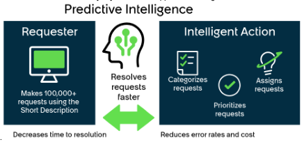

# Explore Predictive Intelligence

## SOURCE INFORMATION

* SECTION NAME: Predictive Intelligence
* SUBSECTION NAME: Explore Predictive Intelligence
* SOURCE FILE NAME: Predictive Intelligence.pdf
* PAGE RANGE: 1383-1388 (page 1383 split at the Predictive Intelligence section heading; TOC Explore heading begins on 1384; page 1388 is split before Install Predictive Intelligence)
* EXTRACTION DATE: 2026-06-17

---

# CONTENT

> **Mapping note:** The TOC subsection title is `Explore Predictive Intelligence`. This file also captures the Predictive Intelligence section-level introduction and Get started content that appears before the first TOC subsection heading.

## Boundary content appearing before the Predictive Intelligence section heading

The following content appears on source page 1383 before the `Predictive Intelligence` heading. It is captured for page completeness and is not treated as Predictive Intelligence subsection content.

> Source page: 1383

#### S

Glossary terms are grouped alphabetically.

#### Screen

Captured image of an application window within a desktop action. Screens represent
the application states that the automation moves through during execution. Each screen
contains one or more anchors and associated steps.

#### Smart sizing

Display feature in the Execution workspace that automatically adapts the desktop session
to the display. Includes two options:
• Fit to window: Scales the session to fit within the Execution workspace.
• Original resolution: Displays the session at its native resolution with scroll bars if
necessary.

#### Step

Individual interaction within a desktop action, such as clicking a button, entering text, or
extracting data. Steps are positioned relative to an anchor.
• Input step types include Set Text, Click, Mouse Click, and Send Keys.
• Output step types include Get Text, Get Table, and OCR Read Text.

#### Step in / Step out

Manual control options in the Execution workspace. Step in transfers control to the user for
manual input such as entering an OTP or CAPTCHA. Step out returns control to the AI agent
to continue the automation.

#### T

Glossary terms are grouped alphabetically.

#### Tool

Desktop action that has been activated and added to an AI agent in AI Agent Studio. Tools
provide AI agents with the capabilities to complete specific tasks during execution. An AI
agent selects a tool based on its name and description.

> Source page: 1383

## Predictive Intelligence

Predictive Intelligence is a powerful interface to train machine learning models. With Predictive
Intelligence, you can improve performance, efficiency, and flexibility to your systems across
multiple business units.

#### Get started with Predictive Intelligence

Administrators can harness the power of machine learning to improve productivity and efficiency
for their agents and fulfillers. Predictive Intelligence uses artificial intelligence to improve
processes across the platform. Predictive Intelligence enables you to do things such as the
following:
• Automatically populate fields during case creation.
• Categorize and route work based on how records have been handled in the past.
• Recommend resolutions to cases that are similar to previous ones.
• Identify major outages based on incoming incidents.

> Source page: 1384

#### Explore

#### Install

#### Configure

Learn about Predictive
Install Predictive
Configure Predictive
Intelligence and
Intelligence and its
Intelligence on
machine learning
associated apps
the platform

#### Train

#### Use

#### Reference

Create and train machine
Use Predictive Intelligence
Get details about
learning solutions.
for machine learning.
Predictive Intelligence
components such
as properties and
language support.

### Explore Predictive Intelligence

ServiceNow® Predictive Intelligence is a platform function that provides a layer of artificial
intelligence that empowers features and capabilities across ServiceNow® applications to
provide better work experiences.

#### Overview of Predictive Intelligence

Predictive Intelligence is a powerful set of tools applying artificial intelligence
and machine learning to make predictions. You can create and train models
in three different frameworks: classification, clustering, and similarity. A
trained solution can be invoked by any ServiceNow application through an
API.

> Source page: 1385

To learn more about ways to use existing models, see Using Predictive Intelligence.

#### Predictive Intelligence for on-premise customers

Predictive Intelligence is also available for on-premise customers. If you're interested in
deploying this product on-premise, contact your account manager. For on-premise installation
and configuration instructions, see the complete instructions for Machine Learning Engine
installation and configuration for self-hosted customers [KB0782052]
in the Now Support Self-
Hosted Knowledge Base.

#### Note: Only on-premise accounts can access the Now Support Self-Hosted Knowledge

Base.

#### Terminology

#### Artificial intelligence

Systems designed to do work that needs a level of human intelligence to
accomplish.

#### Machine learning

Ability for models to improve over time with more experience.

#### Models

Collections of algorithms, math, and statistics that make predictions and decisions
based on input-output data.

#### Training

Adding or changing data that the model is based on to affect future predictions.

#### Supervised Training

Providing input-out pairs so that the model can generate rules that connect the two.

#### Unsupervised Training

Providing raw data so that the model can identify structures in the data set.

#### Training frequency

How often models are retrained to incorporate new data into an existing model.

#### Word corpus

Vocabulary that a model can use to look for textual similarity.

#### Predictive model components

A predictive model includes these components, some of which you must provide.

#### Solution definition

A data record you create and configure that specifies these values for training a
predictive model.
• The records used to train the model. For example, only train on incidents that are
resolved or closed within the last six months.
• The input fields that the model uses to make predictions. For example, use the
incident short description to make a prediction.
• The output field whose value the model predicts. For example, set the incident
category based on the short description.
• The frequency to retrain the model. For example, retrain the model every 30 days.

> Source page: 1386

#### Solution

The solution is the result of a solution definition that you've trained in a ServiceNow
datacenter. Predictive Intelligence uses the solution to predict a target field value
given one or more input field values. All solutions specify these values.
• The solution precision is the aggregate percentage of correct predictions. For
example, a precision of 50 means that out of 100 predictions, half of them should
have the correct value.
• The solution coverage is the aggregate percentage of records that receive a
prediction. For example, a coverage of 50 means half of all eligible records
actually receive a prediction.
• The solution classes are the output field values for which the model can make
predictions. Each class is an output field value with a list of possible precision,
coverage, and distribution metrics to choose from. For example, the Incident
Categorization solution has a class for each category such as software, inquiry,
and database.
• The class distribution is the percentage of records from the entire table that have
this particular output field value. For example, a distribution of 50 for the inquiry
class means that half of incidents have the inquiry category.

#### Predictive Intelligence frameworks

Predictive Intelligence provides three different model frameworks in the Zurich release:
classification, similarity, and clustering. Each framework specializes in different types of
predictions.

#### Predictive Intelligence classification framework

The Predictive Intelligence classification framework enables you to use machine-learning
algorithms to set categorical field values during record creation. For example, you can use the
model to set the incident category based on the short description. You can train predictive
models so they act as an agent to categorize and route work automatically based on your past
record-handling experience.
Enable Predictive Intelligence to handle volumes of incoming requests at lower costs. Automate
the categorization and assignment of requests to reduce:
• Task resolution times.
• The number of interactions required to resolve tasks.
• The error rates of categorizing and assigning work.
For more information, see Create and train a classification solution.

#### Predictive Intelligence similarity framework

The Predictive Intelligence similarity framework identifies existing records that have similar
values to a new record. For example, you can train a subset of your incident records to
recommend a resolution based on the information of a similar incident record. By borrowing from
similar closed incidents that have a proven resolution, you can help agents and fulfillers quickly
provide the best resolution for an incoming incident.
The similarity framework doesn't need an exact match of keywords for its text comparisons
because its algorithms identify similar words and synonyms based on similar contexts. For
example, the phrases printer not working and printer broken are both recognized as similar. The
framework also collects, learns, and applies your industry-specific context. For example, the

> Source page: 1387

phrase unable to join network has a different context in a computer networking company than it
does in a healthcare insurance company.
The similarity framework uses a workflow similarity solution. For more information, see Create
and train a similarity solution.

#### Predictive Intelligence clustering framework

Clustering divides data into groups that can then be used to identify patterns. You can then
address records collectively or find gaps in existing data. For example, you can group similar new
incidents to identify a major outage.
The clustering framework uses a workflow clustering solution. For more information, see Create
and train a clustering solution.

#### Deprecated in the Washington DC release: Predictive Intelligence regression

#### framework

#### Important: Support for creating new regression solutions was removed in the

Washington DC release. You can train and edit existing solutions, but you can't create new
ones. This information is provided for legacy context.
Regression is a machine-learning framework that uses historic data to predict numeric outputs,
such as a temperature or a stock price.
For more information, see Create and train a regression solution.

#### ServiceNow® apps and features that use Predictive Intelligence

Learn about ServiceNow applications and features that leverage Predictive Intelligence.
Solutions that you can adapt are available for various business units and industries.
ServiceNow teams work together to offer models that apply the artificial intelligence and machine
learning capabilities provided by Predictive Intelligence. For example, Customer Service
Management (CSM) partners with Predictive Intelligence to deliver BU-specific solutions to
ServiceNow CSM customers.
Following is a listing of some ServiceNow products that use Predictive Intelligence functionality.
• Machine learning solutions for Customer Service Management
• Machine learning solutions for Event Management
• Issue assignment using the Governance, Risk, and Compliance Predictive Intelligence plugin
• Machine learning solutions for HR Service Delivery
• Predictive Intelligence for Innovation Management
• Machine learning solutions for IT Service Management
• Machine learning solutions for Knowledge Management
• Machine learning solutions for Search administration
• Machine Learning solutions for Vulnerability Response
• Work order insights powered by Predictive Intelligence
• Machine Learning solutions for Flow Designer


---

## IMAGE DESCRIPTIONS

### Repeated ServiceNow page header/logo

The ServiceNow-branded wordmark appears in the upper-left corner of reviewed source pages for this subsection. It is a recurring branding image, not a technical diagram. It contains the visible brand text `servicenow`, with green accenting in the `now` portion. Reviewed pages: 1383, 1384, 1385, 1386, 1387.

### Small UI icons and inline pictograms

5 small non-logo icon/pictogram image blocks were reviewed on source pages 1384. These include information icons, external-link indicators, UI symbols, or small inline graphics. They support the surrounding text but do not contain standalone table data. Coordinates and classification are retained in `_assets/image_inventory.csv`.

### Source page 1384 — Image 1



* **Bounding box:** x=90.5, y=547.2, width=432.0 pt, height=199.2 pt.
* **Nearby source context:** Reference / Explore Predictive Intelligence / Overview of Predictive Intelligence
* **What is shown:** This figure is part of the Predictive Intelligence overview. The lower figure shows a conceptual Predictive Intelligence diagram: a requester submits many requests using a short description, Predictive Intelligence resolves requests faster, and intelligent actions categorize, prioritize, and assign requests. The visual uses dark teal panels, green accent blocks/check marks/arrows, and simple line icons to show requester input, model-driven resolution, and automated actions.
* **Objects/components present:** ServiceNow interface elements, icons, labels, fields, controls, lists, charts, or instructional blocks visible in the crop as applicable. The exact crop is preserved in `_assets/p1384_image01.png` for long-term verification.
* **Relationships / arrows / flow / labels:** The flow relationship is requester input -> Predictive Intelligence -> intelligent action. The green double-headed arrow emphasizes reduced time to resolution and a feedback-style relationship between request handling and intelligent action. No security zone or network boundary is shown.
* **Business purpose:** Supports the reader in performing or understanding the Predictive Intelligence operation described by the surrounding source page.
* **Technical purpose:** Preserves the UI state or conceptual visual needed to reproduce, verify, or interpret the procedure.
* **Visible text captured from image:**

```text
[No separate OCR text recorded for this crop; source asset is retained for visual verification.]
```


---

## TABLES

### Source page 1384 — Table 1

| Explore<br>Learn about Predictive<br>Intelligence and<br>machine learning | Install<br>Install Predictive<br>Intelligence and its<br>associated apps | Configure<br>Configure Predictive<br>Intelligence on<br>the platform |
| --- | --- | --- |
| Train<br>Create and train machine<br>learning solutions. | Use<br>Use Predictive Intelligence<br>for machine learning. | Reference<br>Get details about<br>Predictive Intelligence<br>components such<br>as properties and<br>language support. |


---

## FIGURES

| Figure / visual | Source page | Asset or location | Analysis |
|---|---:|---|---|
| Conceptual overview diagram 1 | 1384 | `_assets/p1384_image01.png` | Detailed image analysis is provided in IMAGE DESCRIPTIONS; crop asset retained for visual verification. |
| Markdown-converted table/grid 1 | 1384 | TABLES section | Source table/grid region converted into Markdown; nearby context:  |


---

## QUALITY ASSURANCE NOTES

* PAGES REVIEWED: 1383, 1384, 1385, 1386, 1387. Source page range: 1383-1388 (page 1383 split at the Predictive Intelligence section heading; TOC Explore heading begins on 1384; page 1388 is split before Install Predictive Intelligence).
* IMAGES REVIEWED: 12 image blocks assigned/reviewed: 6 recurring header logo block(s), 5 small icon/pictogram block(s), and 1 large screenshot/diagram crop(s).
* TABLES REVIEWED: 1 table/grid region(s) converted to Markdown. Table pages: 1384.
* FIGURES REVIEWED: 1 large screenshot/diagram figure(s) plus 1 table/grid visual(s).
* OCR ISSUES FOUND: No unresolved OCR issues were identified in the main PDF text layer after cleanup. Embedded screenshot crops are preserved as source assets; automated image OCR was not applied in this pass to avoid inserting low-confidence text, and this is explicitly marked in each image record.
* OCR ISSUES CORRECTED: Removed recurring footer/page-number noise from the main content stream, normalized nonbreaking spaces and soft-hyphen/control artifacts, preserved bullets/numbering/property names, and converted detected tables to Markdown.
* SECTION MAPPING NOTES: Folder name is exactly `Predictive Intelligence`. File name and subsection name are exactly `Explore Predictive Intelligence` from the TOC. Shared source pages were split at heading coordinates from the PDF text layer.
* BOUNDARY NOTE: Source page 1383 contains AI Desktop Actions carryover content before the `Predictive Intelligence` heading; it is captured as boundary content for page completeness.
* PAGE FOOTERS REVIEWED: Reviewed recurring ServiceNow copyright/trademark footer and logical page numbers. Footer text reviewed: `© 2026 ServiceNow, Inc. All rights reserved. ServiceNow, the ServiceNow logo, Now, and other ServiceNow marks are trademarks and/or registered trademarks of ServiceNow, Inc., in the United States and/or other countries. Other company names, product names, and logos may be trademarks of the respective companies with which they are associated.`
* RECHECK PASSES COMPLETED: 12/12: page completeness, text extraction, table extraction, image extraction, diagram interpretation, section mapping, subsection mapping, file names, folder names, Markdown formatting, missed-content review, and OCR/text-layer cleanup.
* VERIFICATION ARTIFACTS: Large image crops and `image_inventory.csv` are stored in the `_assets` folder inside this section folder.
